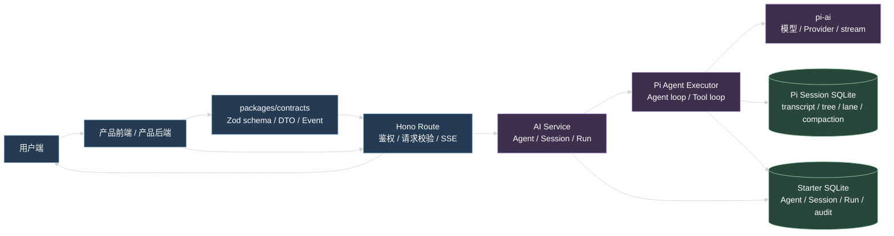
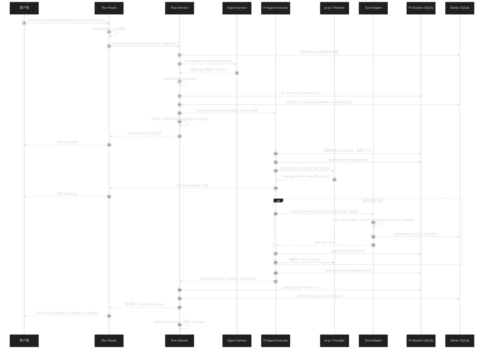
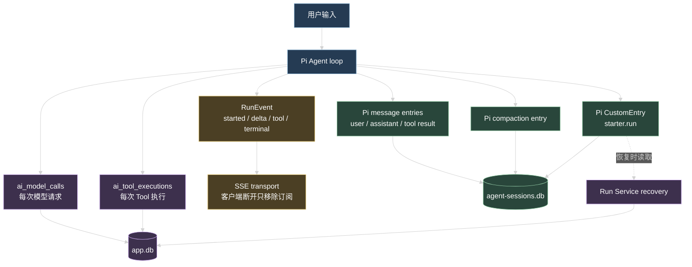
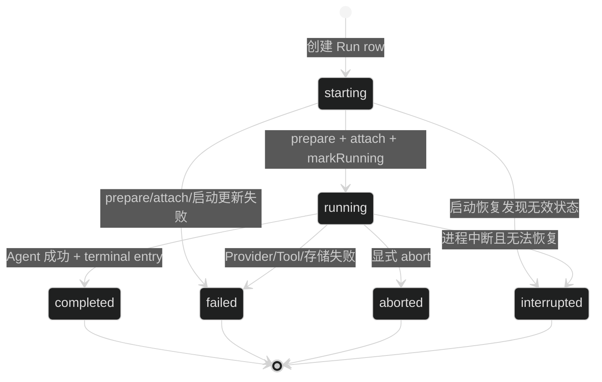
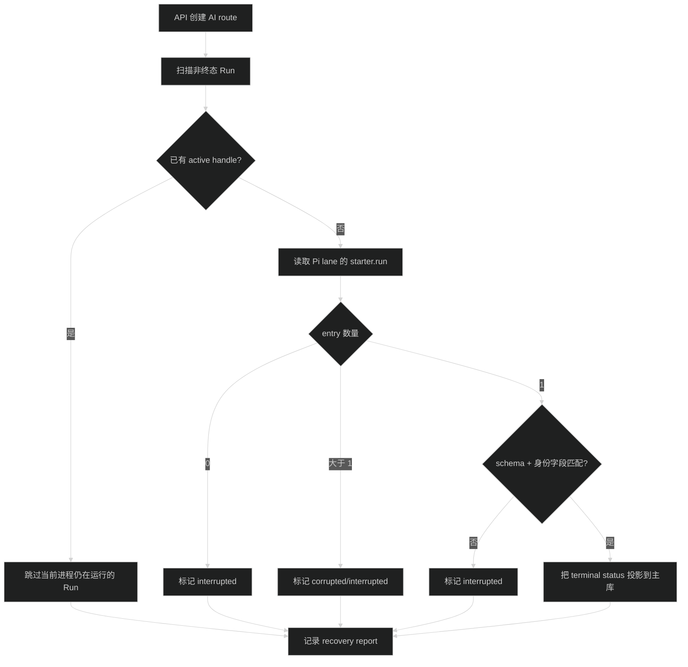

# AI 系统设计总览

这份文档描述当前 `apps/api` 的 Pi Agent Harness 设计。维护 AI 功能时，先看本文件确认数据流和状态归属，再按具体改动读取 Provider、Agent、Session、Run 和 Pi Executor 规范。

## 1. 系统承诺

当前 AI 系统提供三类调用：

- `POST /api/ai/test`：管理员或用户执行一次模型测试。它使用 Provider、模型白名单和统一 Gateway，但不创建 Agent Session、Agent Run 或 Pi transcript。
- `POST /api/ai/completions`：一次性无状态模型调用。调用方直接指定白名单内模型（可带 systemPrompt）加一段输入，单轮拿结果；不传工具，不创建 Agent Session、Agent Run 或 Pi transcript，审计 `scenario='completion'`。
- `POST /api/ai/sessions/{sessionId}/runs`：在用户自己的持久 Session 和指定 lane 中运行一个 Agent。它使用 Pi `Agent`、Pi Session、Tool adapter、SSE 和 Run 恢复记录。

本文件重点说明第三类 Agent Run，因为它包含输入、模型循环、工具调用、流式事件、持久历史、主库索引、用量审计和恢复。

## 2. 先看一张总图



阅读这张图时记住三个边界：

1. `packages/contracts` 只定义跨端协议，不读取数据库、不导入 Pi 类型。
2. `apps/api/src/infra/agent/` 才能直接接触 Pi 类型、Pi SQLite backend 和原生模型流。
3. 前端只调用 API 和消费 RunEvent，不直接读取 Pi SQLite、Starter SQLite 或进程内 active Run。`apps/admin` 只做管理控制面（Provider、模型、Prompt、Skill、Agent、Tool、应用凭据、用量），不提供 Agent 聊天或 Run 消费页面。

## 3. 模块职责

### 3.1 AgentDefinition

代码位置：`apps/api/src/modules/ai/agent/`。

`AgentDefinition` 是可复用的执行配置，保存：

- 模型引用：`providerId` + `modelId`。
- System Prompt 引用。
- Skill 引用。
- Tool 名称 allowlist。
- `thinkingLevel` 和 `maxTurns`。
- `revision` 和启用状态。

它只保存引用和执行参数，不保存 Provider secret、Prompt 正文、Skill 正文、Tool schema 或 handler。Run 开始时解析当前可用配置，并把无 secret 的配置快照写入 `ai_agent_runs.snapshot_json`。

### 3.2 AgentSession

代码位置：`apps/api/src/modules/ai/session/` 和 `apps/api/src/infra/agent/pi-session-store.ts`。

`AgentSession` 是用户拥有的持久上下文。Starter 主库保存业务索引和归属；Pi Session SQLite 保存完整历史。Session 不绑定单个 Agent，Run 可以在同一个 Session 中使用不同 Agent。

Session 的 `id` 同时作为：

- `ai_agent_sessions.id`。
- Pi Session id。
- Run 的 `sessionId` 外键值。

Session 归档只更新主库 `archived_at`，不删除 Pi 历史。默认列表排除已归档 Session；归档 Session 不能启动新的 Run。

### 3.3 AgentRun

代码位置：`apps/api/src/modules/ai/run/`。

`AgentRun` 表示一个 Agent 在某个 Session/lane 上的一次执行。Run Service 是以下状态的唯一写入入口：

- `ai_agent_runs` 主库行。
- `ActiveRunRegistry` 的 reserve、attach、release。
- `RunEventPublisher` 和对外 RunEvent。
- Pi `starter.run` terminal entry。
- Run 的终态更新。

同一 `sessionId + lane` 同时只能有一个 active Run。这个限制是进程内 registry 的运行时保护；主库 Run 行负责持久索引和启动恢复，不等同于 active registry。

### 3.4 AgentExecutor

代码位置：`apps/api/src/infra/agent/agent-executor.ts`、`pi-event-mapper.ts` 和 Tool adapter。

Executor 负责：

- 打开 Pi Session，读取当前 lane branch。
- 创建 Pi `Agent`，交给 Pi 处理 prompt、Tool loop、steer、follow-up 和 abort。
- 把 Pi AgentEvent 转成内部 RunEventDraft。
- 把 assistant、user、tool result 和 compaction 写入 Pi Session。
- 调用 Provider 模型流和 Tool adapter。
- 创建模型调用与 Tool execution 审计。
- 返回 executor 终态给 Run Service。

Executor 不创建或更新 `ai_agent_runs`，不注册 HTTP route，也不发布 Run terminal event。

## 4. 一次输入如何变成最终输出

下面的时序图以一次正常文本 Run 为例。工具调用会在模型循环中多走一轮或多轮，但外部入口和终态写入顺序不变。



### 4.1 输入阶段

请求输入由 `startAgentRunSchema` 校验：

```ts
{
  agentId?: string
  lane?: string
  input: string
}
```

`input` 去除首尾空白后必须是 1 到 100000 个字符。没有传 `agentId` 时使用 Session 的 `defaultAgentId`；两者都没有时返回 `COMMON.INVALID_REQUEST`。

Run Service 接着按以下顺序执行：

1. 校验当前用户拥有该 Session，且 Session 没有归档。
2. 解析 Agent 当前配置和 revision。
3. 对 `sessionId + lane` 做 registry reserve。冲突在创建 Run 行之前返回 `AI.SESSION_BUSY`。
4. 为非 `main` lane 创建 Pi lane。
5. 在主库创建 `starting` Run 行，并保存无 secret snapshot。
6. 准备 Executor、attach active handle、更新为 `running`。
7. 正常启动时发送 sequence 1 的 `run.started`。

`prepare`、`attach` 或 `markRunning` 失败时，Run Service 会创建失败终态事件并释放原始 lane lease，不能只按尚未创建的 runId handle 释放。

### 4.2 Agent loop 阶段

Pi Agent 读取当前 lane branch，使用当前 Agent 配置构造上下文。完整历史来自 Pi Session；本轮运行上下文是从当前 branch 派生出来的，不单独写入 Starter 主库。

Executor 通过原生 `pi-ai` stream 调 Provider：

- Provider、模型、认证和 AbortSignal 由 infra 负责。
- SDK partial message、Provider payload 和原始错误不会进入公开协议。
- 模型的思考内容是例外：`thinking_start` / `thinking_delta` / `thinking_end` 映射成 `thinking.*` 事件对外发布，正文也进入 transcript 的 assistant `blocks`。它是排查模型行为的主要依据，`thinkingLevel` 为 `off` 时不产生这类事件。
- `PiEventMapper` 是 Pi AgentEvent 到内部 RunEventDraft 的唯一转换位置。
- `RunEventPublisher` 在事件持久化成功后分配递增 sequence。

assistant message 的写入和 `message.completed` 事件使用同一个 message entry id。user、assistant 和 tool result message 会附加 `runId`，Session transcript projector 依靠它把 message 归属到 Run。

Agent loop 的轮次边界和上下文压缩都是可观测的：

- 每一轮发布 `turn.started` 和 `turn.completed`，带当前轮次和 `maxTurns`；轮次计数由 `PiEventMapper` 维护。收尾轮的 `turn` 会比 `maxTurns` 大 1，契约不做 clamp。
- compaction 写入 Pi entry 成功后发布 `context.compacted`，带 `entryId`、`tokensBefore` 和 summary。发布失败不影响 compaction 结果，也不改变 Run 终态。
- `message.completed` 携带该次 assistant message 的 token 用量；读不到用量时省略该字段，不补 0 值。

### 4.3 Tool 阶段

模型请求 Tool 时，Pi Agent 触发 Tool adapter。Tool adapter 在执行 handler 前再次执行：

1. Tool 名称检查。
2. Zod 参数校验。
3. 权限检查。
4. timeout 和 AbortSignal 处理。
5. 脱敏的 Tool audit begin/finalize。

Tool handler 只得到已校验输入、用户 ID、request ID 和 AbortSignal。arguments、原始 result 和 Provider payload 不写入 SQLite；公开事件最多携带 `safeSummary`。

Tool 失败会生成安全的 tool result，让 Pi Agent 决定下一轮，包括工具自身超时——超时的 `modelText` 带上实际 timeout 毫秒数，模型才能判断重试还是换参数。只有用户取消和 Run 总时长耗尽会终止当前 Run。每个已 begin 的 Tool audit 都必须 finalize，不能留下未解释的 running 记录。

## 5. 输出、事件和记录的关系

一次 Run 同时产生三种不同用途的结果，不能混为一谈：

| 结果 | 用途 | 保存位置 | 是否作为公开 API 输出 |
| --- | --- | --- | --- |
| `RunEvent` | 实时展示和持久恢复 | `ai_run_events` 与进程内有界队列 | 是，通过 SSE、Timeline 和 Events API |
| Run 活跃快照 | 断线重连后恢复进行中的视图 | 进程内，按 runId 存放 | 是，通过 `GET /runs/{runId}` 的 `live` 字段 |
| Pi transcript entry | 保存完整 Session 历史和 Run 终态事实 | 独立 Pi Session SQLite | 通过 transcript 投影间接读取 |
| Starter 主库记录 | 查询、权限、状态和审计 | Starter SQLite | 通过 Run/usage API 返回白名单字段 |



### 5.1 RunEvent

事件 envelope 固定包含：

- `eventId`、`sequence`、`occurredAt`。
- `runId`、`sessionId`、`lane`。
- `turnIndex`、`stepId`、`modelCallId`、`messageId`、`toolCallId`、`toolExecutionId`。
- `type` 和对应的安全 `data`。

主要事件类型：

```text
run.started
turn.started
message.started
message.delta
thinking.started
thinking.delta
thinking.completed
message.completed
tool.started
tool.progress
tool.completed
context.compacted
turn.completed
run.completed
run.failed
run.aborted
```

`thinking.*` 的 data 带 `messageId` 和 `blockIndex`（`blockIndex` 直接用 pi-ai 的 `contentIndex`），一条 assistant message 内可能有多个思考块。`message.completed.content` 仍然只拼 text block，思考正文只走这三个事件和 transcript `blocks`。

`run.completed.data.reason` 是必填字段：`model_finished` 表示模型自己结束，`max_turns` 表示撞上轮次上限后的收尾回答，`structured_output` 表示终止型结构化输出 Tool 完成。它只在事件和活跃快照里，不落主库、不进 transcript，所以刷新页面后看不到这个标记。

`turn.started` / `turn.completed` 标记 Agent loop 的轮次边界，envelope 携带 `turnIndex`，事件 data 分别携带 `stepLimit` 和 Step/Tool 计数及 outcome，由 `PiEventMapper` 映射 Pi 的 `turn_start` / `turn_end`。

`context.compacted` 在 compaction entry 写入成功后发布，携带 `entryId`、`tokensBefore` 和 `summary`。compaction 发生在 `transformContext` 回调里、不在 Pi AgentEvent 流上，所以由 `PiEventMapper.contextCompactedEvent()` 提供显式出口，复用同一个 RunEventPublisher 保证 sequence 单调。发事件失败不影响已写入的 compaction 结果。

`tool.progress` 的生产者是工具自身：`AiToolExecutionContext.reportProgress(safeSummary)` 经 `pi-tool-adapter.ts` 接到 Pi 的 `onUpdate`，再由 `PiEventMapper` 把 `tool_execution_update` 映射成事件。上报内容只能是已脱敏摘要（最多 1000 字符），不把中间结果喂给模型，也不产生额外审计记录。

`message.completed` 的 `data.usage` 是可选字段，来自 Pi `AssistantMessage.usage`；读不到时省略，不编造 0 值。

### 5.1.1 活跃 Run 快照

`GET /api/ai/sessions/{sessionId}/runs/{runId}` 的响应带一个可选 `live` 字段，它是活跃 Run 的进程内运行时视图，不是持久事实：

- 由 Run Service 在事件进入对外队列的同一处累积（`run.service.ts` 的 `publish`），折叠规则以 `run.live-snapshot.ts` 为准；产品前端自己折叠时按同一规则实现。
- 判据是 Run row 状态，不是 registry handle。`finalizeRun` 先更新主库终态、后 release registry，按 handle 判断会在这个窗口返回「终态 + 非空快照」的非法组合。
- Run 进入终态或进程重启后为 `null`，客户端此时回落到 transcript。
- 内容是一条 `timeline`，元素按 `kind` 分 message、tool 和 compaction；message 元素内含有序 `blocks`（text 与 thinking）。timeline 上限 128 条、单条 message 的 blocks 上限 64，超限丢最旧的，避免长 Run 的内存无界增长。
- `message.completed` 到达时的折叠规则：消息里只有一个 text 块就用事件的 `content` 覆盖它，一个 text 块都没有且 `content` 非空就追加一个，有多个 text 块则保留 delta 累积出来的原始顺序。不能把 thinking 块重排到前面或把多个 text 块折叠成一个，否则 interleaved thinking 的消息在 Run 进终态时顺序会跳变。

它解决的是「刷新页面后正在生成的内容消失」：assistant message 要等 `message_end` 才写入 Pi DB，在此之前持久时间线里可能只有合并后的 delta，transcript 里也没有完整消息。快照不持久化，也不改变 RunEvent 的持久化约束。

SSE 的 `id` 是 `eventId`，`event` 是 RunEvent.type，`data` 是完整事件 JSON。heartbeat 是 SSE comment，不创建 RunEvent。

SSE 断开不会 abort Run。Route 只停止向当前连接写数据；Agent 继续运行、写 Pi transcript、写主库终态。

客户端遇到流提前结束（包括事件队列超限关闭 transport、读流中途断开）时不能报错也不能清空已有视图，Run 还在后台跑。正确做法是转成轮询 `GET /runs/{runId}` 的 `live`，到终态后再用 transcript 替换临时流式视图。只有一个事件都没收到就断的启动失败才报错。

### 5.2 Pi Session SQLite

Pi DB 的事实记录包括：

- Session metadata。
- lane tree 和 branch。
- user message。
- assistant message。
- tool result message。
- compaction entry。
- `starter.run` custom entry。

Pi DB 不保存：

- Starter 用户归属。
- Provider secret。
- AgentDefinition 业务配置。
- Admin 权限关系。
- 主库 Run 索引。

读取 transcript 时必须从指定 lane 的 leaf 读取 branch，不能把整棵 Session tree 当作当前 lane transcript。API 读取 `limit + 1` 条，只有确实存在下一条 raw entry 时才返回 `nextCursor`。

分页默认从最新一页开始：`direction: 'backward'` 用 Pi 的 `newestFirst` 读取，服务端反转成时间正序后返回，`nextCursor` 指向更早一页；`direction: 'forward'` 是旧语义，取比 cursor 更新的。`newestFirst` 方向下 Pi 的 `cursor.afterSeq` 判据是 `entry.seq < afterSeq`（取更早的），`oldestFirst` 会先遍历整条 branch 再反转，长会话更慢。

### 5.3 Starter SQLite

Starter 主库保存：

| 表 | 保存内容 | 不保存内容 |
| --- | --- | --- |
| `ai_agent_definitions` | Agent 名称、状态、revision、无 secret config 引用 | Provider secret、Prompt/Skill 正文、Tool handler |
| `ai_agent_sessions` | Session id、owner、title、defaultAgentId、归档时间 | transcript、lane tree、Tool result |
| `ai_agent_runs` | Run id、Session、Agent revision、lane、状态、snapshot、终态字段 | message 正文、事件流 |
| `ai_model_calls` | Provider/model、scenario、runId、耗时、token、cost、结果和错误码 | prompt、response、secret、原始错误 |
| `ai_tool_executions` | Tool 名称、时间、耗时、状态、timeout、错误码 | arguments、result、safeSummary |

`ai_model_calls` 的 `scenario` 当前为 `model_test`、`agent_run`、`completion` 或 `legacy`。新 Agent Run 的模型请求使用 `scenario='agent_run'` 和 nullable `run_id`；模型测试和无状态调用没有 Run 关联。

## 6. Run 状态和唯一终态



终态写入顺序固定：

1. 等待 Executor result。
2. 写入 Pi `starter.run`。
3. 条件更新 `ai_agent_runs`，只允许从非终态更新。
4. 主库更新成功后发布唯一 terminal RunEvent。
5. 结束事件队列并释放 run handle 和原始 lane lease。

如果 Pi terminal entry 写入失败，Run 进入 `failed` 和 `AI.SESSION_STORAGE_FAILED`。如果 Pi entry 已写入但主库终态更新失败，不发布 terminal event；下一次启动恢复扫描负责处理。

## 7. 启动恢复

API 创建 AI route 时会调用 `recoverInterrupted()`：



唯一合法的 terminal entry 必须同时匹配：

- `runId`。
- `sessionId`。
- `lane`。
- `agentId`。
- `agentRevision`。

结构合法但身份字段不匹配的 entry 也视为损坏，不能只按 `runId` 接受。没有 entry、重复 entry、schema 解析失败和身份不匹配都标记 `AI.RUN_INTERRUPTED`。

## 8. 权限和 secret 边界

### 运行面身份

运行面有两种 Principal，`principal.guard.ts` 按有没有 `Authorization: Bearer` 头分叉，结果统一成 `RuntimeAccessContext`（`principal` + `scope`）：

| Principal | 来源 | tenantId / projectId | externalUserId | subject |
| --- | --- | --- | --- | --- |
| `starter_user` | Better Auth Cookie（`auth.guard.ts`） | 都是 `starter` | Starter 用户 id | 都是 `null` |
| `product_app` | 应用凭据 `Authorization: Bearer <secret>` | 来自 `ai_app_credentials` | `X-AI-External-User-Id` | `X-AI-Subject-Type` / `X-AI-Subject-Id`，要么都给要么都不给 |

`session.repository.ts` 的 `accessWhere` 是可见范围的唯一判据：Starter 用户按 `principalKind + ownerId + tenantId + projectId`；应用凭据按 `principalKind + appId + tenantId + projectId + externalUserId + subjectType + subjectId` 全等匹配。Run 查询挂在 Session 上，跟同一套条件。新增运行面查询必须走 `accessWhere`，不要自己拼 owner 条件。

应用凭据只存 sha256 哈希和前 12 位前缀（`application.crypto.ts`），认证时按前缀取候选再做 `timingSafeEqual`。`AI_CONFIG_MANAGE` 权限的管理员负责创建、rotate 和 revoke。

Tool 的权限检查由 adapter 按 principal kind 分流：只有 `starter_user` 用 `principal.principalId` 查 Starter 授权表；`product_app` 对带 `requiredPermission` 的 Tool 直接 `AI.TOOL_FORBIDDEN`，伪造与 Starter 用户相同的 `X-AI-External-User-Id` 也不会查 `user_roles`；权限查询异常同样按拒绝处理。Adapter 只收 Run 启动时已解析的 `RegisteredAiTool[]`，handler 不接收裸 userId、Hono Context、Better Auth session 或数据库 client。

`GET /api/ai/agents` 和 `GET /api/ai/agents/{agentId}` 当前用的是 `requireAuth`，应用凭据调不通；运行面 OpenAPI 的 `security` 也只声明了 `cookieAuth`。改这两处前先确认调用方是否依赖现状。

### 用户侧

普通已登录用户可以：

- 读取自己未归档的 Session。
- 创建、更新、归档自己的 Session。
- 读取自己 Session 的 transcript。归档后 transcript 也读不到，`requireActiveSession` 直接拒。
- 使用已启用且当前可解析的 Agent 启动 Run。
- 对自己仍 active 的 Run 执行 abort、steer、follow-up。

所有 Session 和 Run 查询都带 scope 条件；资源不存在、归属他人和已归档统一返回 `COMMON.NOT_FOUND`，不暴露资源是否存在。

### 管理侧

具备对应权限的管理员可以管理：

- Provider 配置和认证状态。
- 模型目录和白名单。
- AgentDefinition。
- Prompt、Skill、Tool Registry。
- 用量审计查询。

Provider secret 只能由 AI infra 的 credential store 读取和解密。以下位置禁止出现 secret：

- AgentDefinition config。
- Run snapshot。
- Session metadata 或 transcript DTO。
- RunEvent 和 SSE。
- 主库审计记录。
- 日志和错误响应。

## 9. 失败边界

| 失败位置 | 主流程结果 | 记录位置 | 重试或恢复方式 |
| --- | --- | --- | --- |
| 请求 schema 无效 | 不创建 Run | request error/log context | 客户端修正后重新请求 |
| Session 不存在、他人或已归档 | 返回 404 | 不写 Run | 使用正确 Session |
| Agent 配置无效 | 不启动 Agent | 安全错误和 requestId | 修正 AgentDefinition 或选择其他 Agent |
| lane 已占用 | 返回 409 `AI.SESSION_BUSY` | 不创建第二个 Run | 等待当前 Run 终态 |
| Pi Session 读写失败 | Run failed | 主库 Run 终态 + 日志 | 修复存储后重新启动 Run |
| Provider 失败或超时 | Run failed | Pi assistant 终态、模型 audit、Run terminal entry | 按 retryable 字段决定是否重试 |
| Tool 参数、权限或执行失败（含工具超时） | 继续 Agent loop | Tool audit + safe tool result | Agent 根据安全结果决定下一轮 |
| 撞到 `maxTurns` 且当轮还在调工具 | 追加一轮无工具收尾，Run completed | 多一条 `ai_model_calls` | 终态事件 `reason=max_turns` |
| Run abort | Run aborted | Tool audit + Run terminal entry | 用户显式发起新的 Run |
| Run 总时长耗尽 | Run failed + `AI.UPSTREAM_TIMEOUT` | 主库 Run 终态 + Pi terminal entry | 上限是 Executor 的 `maxRunMs`，默认 120000 ms，`ai.route.ts` 当前不传也不读环境变量；工具超时取 `min(工具 timeoutMs, Run 剩余时长)` |
| SSE 连接断开 | Run 不变，继续执行 | Pi transcript + 主库终态 | 客户端重新读取 Run/transcript |
| 进程在终态前退出 | Run 暂存非终态 | Pi terminal entry 或无 entry | API 启动时 recovery scan |
| 主库终态更新失败 | 不发布 terminal event | Pi terminal entry + 日志 | 下一次启动恢复 |

## 10. 设计约束

不要在以下位置增加第二套实现：

- 不在业务 Service 里复制 Pi Agent loop、Tool loop、compaction 或 Session reducer。
- 不在 Route 里遍历 Executor 事件或直接访问 Pi Session。
- 不在产品前端的 reducer 里把流式状态当作最终业务状态。
- 不在 Starter 主库复制完整 transcript。
- 不把 RunEvent 当作唯一的历史来源；持久时间线以 `ai_run_events` 为恢复事实，Pi transcript、terminal entry 和主库索引仍分别保存各自事实。
- 不把 `ai_model_calls` 当作 Run 状态来源；Run 状态以 `ai_agent_runs` 为准，模型调用只是审计记录。
- 不使用 fallback、localStorage 或前端缓存恢复业务状态。
- 不提前加入分布式队列、跨节点 active registry 或 Web 聊天产品层。当前 active registry 是单进程的，`tenantId` / `projectId` 只是 scope 查询维度，不要在此之上再造一层租户模型。

## 11. OpenAPI 面分类

AI 路由的 OpenAPI tag 是公共边界的一部分，不能统一标成 `AI`：

- `AI Control`：Provider、管理员模型目录、Prompt、Skill、Agent Definition、Tool summary、Usage audit 和模型连通性测试。
- `AI Runtime`：产品调用方可消费的 Agent Definition summary、Session、Run、Transcript、RunEvent SSE 和一次性无状态调用 `POST /api/ai/completions`。
- `AI Compatibility`：Starter 用户模型列表和用户模型偏好；这些接口依赖 Better Auth 和 Starter 用户模型，不是跨产品运行凭据协议。

运行面 SSE 使用 `text/event-stream`：

```text
id: <RunEvent.eventId>
event: <RunEvent.type>
data: <完整 RunEvent JSON>
```

`sequence` 在单个 Run 内递增；SSE 连接断开不触发 abort。POST `/api/ai/sessions/{sessionId}/runs` 只创建 Run 并打开实时流；已有 Run 的断线恢复使用 GET `/api/ai/sessions/{sessionId}/runs/{runId}/events/stream`，支持 `afterSequence` 或 `Last-Event-ID`，不会创建第二个 Run。刷新页面后客户端手上没有 runId，先用 GET `/api/ai/sessions/{sessionId}/active-run` 按 session 找回仍在跑的 Run，再用它恢复事件流。客户端在进程内流结束时可查询 Run 的 live snapshot，Run 进入终态后读取 Timeline 和 Transcript。live 只表示当前进程内的 starting/running 视图，`ai_run_events`、主库 Run 状态、Pi terminal entry 和 Transcript 分别保存持久事实。

`packages/contracts/src/ai.ts` 是 Runtime DTO、Transcript、Run snapshot 和 RunEvent 的唯一公共 schema 来源。Admin/Web 不得本地复制事件联合或把 Provider secret、`ownerId`、Pi 类型和 UI reducer 字段加入运行协议。

## 12. 改代码时的顺序

### 修改跨端协议

```text
packages/contracts/src/ai.ts
  -> apps/api/src/modules/ai/* schema / route / presenter
  -> apps/api/src/modules/ai/* service / repository
  -> 消费端 API 封装（控制面看 `apps/admin/src/api/ai/`，运行面看产品自己的封装）
  -> 消费端页面和测试
```

先更新 Zod schema、DTO、事件或错误码，再更新生产者和消费者。不要让某一端私自扩展事件字段。

### 修改 Session 存储

```text
apps/api/src/infra/agent/pi-session-store.ts
  -> apps/api/src/modules/ai/session/session.service.ts
  -> apps/api/src/modules/ai/session/session.presenter.ts
  -> transcript tests
```

确认 Pi DB 仍独立于 Starter 主库，并补充创建补偿、lane branch、cursor 和关闭流程测试。

### 修改 Run 生命周期

```text
apps/api/src/infra/agent/agent-executor.ts / pi-event-mapper.ts
  -> apps/api/src/modules/ai/run/run.service.ts
  -> run.route.ts / OpenAPI
  -> packages/contracts/src/ai.ts
  -> 产品前端的事件归并和页面
```

Run Service 仍是 Run row、registry、sequence、terminal entry 和终态事件的唯一所有者。完成后检查 prepare/attach 失败清理、SSE 断开、abort、重复 terminal entry 和启动恢复。

### 修改 Provider 或审计

```text
apps/api/src/infra/ai/
  -> apps/api/src/modules/ai/configuration/
  -> apps/api/src/modules/ai/usage-audit/
  -> contracts / Admin usage page
```

检查 secret 脱敏、timeout、AbortSignal、模型白名单和审计 begin/finalize。不要把 Provider 类型或原始错误带到 contracts。

## 13. 验收命令

AI 系统修改后依次运行：

```bash
pnpm check-types
pnpm lint
pnpm format:check
pnpm test
pnpm build
pnpm --filter @starter/api db:check
git diff --check
```

按改动范围补充：

```bash
pnpm --filter @starter/api exec vitest run src/test/pi-session-store.test.ts --config vitest.config.ts
pnpm --filter @starter/api exec vitest run src/test/ai-agent-sessions.test.ts --config vitest.config.ts
pnpm --filter @starter/api exec vitest run src/test/ai-agent-runs.test.ts --config vitest.config.ts
pnpm --filter @starter/api exec vitest run src/test/ai-destructive-migration.test.ts --config vitest.config.ts
```

重点验收点：

- 输入只能经过当前 AgentDefinition、模型状态和权限检查后进入 Pi Agent。
- 每个公开事件符合 `runEventSchema`，sequence 单调递增，terminal event 只发布一次。
- 流式视图和 transcript 视图同构：`run.live-snapshot.ts` 折叠出的 kind 序列、顺序和 blocks 序列必须与 `test-fixtures/run-event-timeline-isomorphism.json` 里的期望快照一致；产品前端自己折叠事件时用同一份 fixture 校验。
- Pi DB 有完整 message、Tool result、compaction 和 `starter.run`；Starter 主库只有业务索引和审计元数据。
- `ai_model_calls` 与 `ai_tool_executions` 不含 prompt、response、arguments、result 和 secret。
- SSE 断开不会 abort，重新读取可以得到已持久化结果。
- 主库 Run 终态、Pi terminal entry 和恢复逻辑的字段一致。

## 14. 相关规范

人读的系统介绍、维护手册和第三方接入协议在 `docs/ai/`（`index.md`、`design.md`、`maintenance.md`、`integration.md`）；本文件只管实现约束，改协议或接口时两边一起更新。

- `agent-run-guidelines.md`：Run API、并发、SSE、终态和启动恢复。
- `agent-session-guidelines.md`：Session 归属、双库创建补偿、transcript 投影和 cursor。
- `pi-agent-execution-guidelines.md`：Pi Agent、原生 stream、Tool adapter、compaction 和执行审计。
- `ai-integration-guidelines.md`：Provider、模型目录、凭据、Gateway、模型测试和用量审计。
- `../../../../tasks/archive/2026-08/08-17-pi-agent-harness-foundation/research/harness-contracts.md`：S1-S7 共享字段、事件和错误码基准；修改前先确认该归档文件仍是当前协议来源。
