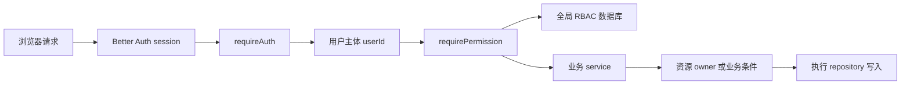
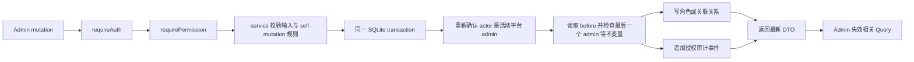

# 权限与角色进阶设计

## 结论

当前脚手架不需要扩大权限语法，也不需要立刻加入 Organization、ABAC 或 FGA。现有全局 User -> Role -> Permission RBAC 已经能够保护 API、路由和操作，下一阶段应先解决谁能扩大权限、变更如何追查、角色如何安全创建和停用。

默认路线分两步：

1. 先实现平台管理员边界和授权变更审计。
2. 再实现自定义角色生命周期和权限影响分析。

完成这两步后，通用单租户脚手架的默认权限能力可以停止扩展。资源范围、多租户、机器身份和关系授权只在出现对应业务场景后单独实现。

下一项建议单独创建的实现任务是“授权治理基础”，范围只包括 HTTP 授权写入的平台管理员边界、运行时授权审计及其查询，不同时加入角色 CRUD。

## 1. 设计范围

本设计适用于：

- `apps/api` 的 Better Auth session、Hono 授权中间件、Drizzle 授权表和业务资源检查。
- `apps/admin` 的权限查询、路由与操作控制、角色和用户管理页面。
- `packages/contracts` 的 permission key、请求 schema、响应 DTO 和错误码。

本设计不要求本任务修改产品代码。所有实现项必须另建 Trellis 任务，并一次只处理一个可独立验证的阶段。

## 2. 当前基线

| 部分       | 当前行为                                                | 后续保留的约束                                   |
| ---------- | ------------------------------------------------------- | ------------------------------------------------ |
| 身份认证   | Better Auth cookie session，Hono 写入`currentUserId`  | session 只证明用户身份，不保存业务权限事实       |
| 全局授权   | 四张 RBAC 表，权限取活动角色的权限并集                  | API 每次从服务端数据库判断，不信任浏览器权限集合 |
| 平台管理员 | `admin` 自动拥有全部已注册且未归档权限                | 保留`admin` key，明确为平台级根角色            |
| 内置角色   | `operator`、`viewer` 是系统角色，权限可编辑         | key 和生命周期受保护，权限继续允许平台管理员调整 |
| 权限目录   | `PermissionKeys` 定义精确 key，数据库保存目录投影     | 不在管理页创建任意 permission，不支持通配符      |
| 资源范围   | 文件操作通过 permission 后继续检查 owner                | RBAC 不替代业务资源归属判断                      |
| 前端状态   | `/api/me/permissions` + React Query                   | 前端只控制界面，401 与 403 保持不同语义          |
| 授权变更   | 关系替换使用事务，只有当前`assignedAt`/`assignedBy` | 后续增加追加式审计，不把关联表当历史记录         |
| 服务端缓存 | 每次受保护请求查询 SQLite                               | 没有性能证据前不加 Redis 或进程内权限缓存        |

## 3. 目标边界

### 3.1 请求授权路径



这条路径回答三个不同问题：

1. Better Auth 回答“请求来自谁”。
2. authorization 模块回答“这个用户能否执行这类动作”。
3. 业务模块回答“这个用户能否操作这个具体资源”。

任何阶段都不能让前端权限、session 扩展字段或客户端传入的 role 替代第二、第三步。

### 3.2 授权管理写入路径



平台管理员身份、最后一个管理员保护、授权关系变更和审计事件必须在同一个 transaction 中重新读取并提交。route 的 `authorization:manage` 和 transaction 外的 service 检查只负责尽早拒绝，不能作为高风险写入的最终依据。关系变更失败时不能单独留下成功审计；审计写入失败时也不能提交关系变更。

### 3.3 状态归属

| 问题                   | 唯一事实来源                                                     | 不作为事实来源的内容                             |
| ---------------------- | ---------------------------------------------------------------- | ------------------------------------------------ |
| 当前用户是谁           | Better Auth user/session                                         | Admin localStorage、请求 body                    |
| 全局业务权限           | `roles`、`permissions`、`user_roles`、`role_permissions` | Better Auth`user.role`、前端 permissions query |
| 平台管理员身份         | 活动`admin` 角色                                               | 可编辑的普通角色名、静态用户 ID 列表             |
| 资源是否可操作         | 对应业务模块的资源字段和 service 规则                            | 菜单、按钮、permission 名称推断                  |
| 授权变更历史           | 新增的 authorization 审计事件表                                  | `assignedAt`、`assignedBy` 当前关系字段      |
| 可选组织成员和组织角色 | 启用后的 Better Auth Organization plugin                         | 给当前全局`roles` 增加可空 `organizationId`  |
| 可选机器身份           | 独立 API key 或 OAuth client grant                               | 虚构 Better Auth 用户并写入`user_roles`        |

## 4. 默认 RBAC 规则

### 4.1 Permission 目录

- permission 继续使用精确、可枚举的 key，例如 `file:read`。
- `PermissionKeys` 是代码中的唯一目录，数据库是可查询的持久化投影。
- 新增 permission 必须同时修改 contracts、migration、角色默认值、API guard 和测试。
- permission key 发布后不改名。需要替换时先增加新 key、迁移角色关系，再归档旧 key。
- 管理页只能查看和分配已注册 permission，不能创建任意字符串。
- 不支持通配符、显式 deny 或 permission 继承。所有权限采用加法式并集。

### 4.2 三类角色

| 类型         | 当前 key                 | 权限规则                                        | 生命周期规则                                           |
| ------------ | ------------------------ | ----------------------------------------------- | ------------------------------------------------------ |
| 平台根角色   | `admin`                | 自动拥有全部活动且已注册 permission             | key、权限、归档和删除都不可编辑                        |
| 内置模板角色 | `operator`、`viewer` | 从`role_permissions` 读取，允许平台管理员调整 | key 不改名，不归档，不删除                             |
| 自定义角色   | 后续创建                 | 从`role_permissions` 读取                     | key 创建后不可改名；名称、描述和权限可改；可归档和恢复 |

保留 `admin` key 可以避免迁移现有 bootstrap、role assignment 和 Admin 判断。这里的 `admin` 是当前应用自己的平台根角色，不是 Auth0 Dashboard tenant member role；外部 IAM 控制面角色不能同步进本地 `roles` 表。界面和文档应把本地 `admin` 解释为平台管理员，未来 Organization 内的管理员使用不同名称，例如 `org-admin`，不能复用全局 `admin` 的含义。

自定义角色默认不物理删除。归档前必须重新检查是否仍有活动用户分配；存在分配时返回 409，并提供受影响用户数量。恢复只恢复角色本身，不自动重建已经移除的用户关系。

### 4.3 用户角色

- 用户有效权限继续取全部活动角色的 permission 并集。
- 不加入用户直授权限。临时例外会形成第二条授权路径，难以解释和回收。
- 保留“用户至少有一个活动角色”的当前约束，默认角色仍是 `operator`；角色命名调整属于单独的兼容任务。
- 普通管理操作不能修改调用者自己的用户角色，现有 self-mutation 继续返回 403。
- 任何授予或撤销 `admin` 的操作都属于平台根角色变更，必须经过平台管理员检查并记录审计。
- 当前阶段的“活动平台管理员”只表示：现存用户通过 `user_roles` 关联到未归档的 `admin` 角色。当前 user schema 没有封禁或停用字段，不能把这条数据库关系进一步描述成“可登录”。
- transaction 提交后必须至少保留一个活动平台管理员。现有 API 的 self-mutation 403 会先挡住唯一管理员撤销自己的请求；repository 仍要直接测试最后一个管理员保护，供未来账号停用等其他写入路径复用。

未来加入账号封禁时，应把“账号可登录”定义为身份模块的单独 predicate。用户角色变更和账号停用必须在各自 transaction 中调用同一条平台管理员存续规则，不能只统计 `user_roles`。

### 4.4 管理权限与提权边界

当前 `authorization:manage` 表示完整授权管理能力。它不适合直接授予普通角色后再假设对方只能做部分管理，因为当前角色权限替换接口允许调用者修改自己所属的非 `admin` 角色，用户角色替换接口也允许给其他用户授予更强角色。

默认阶段采用以下规则：

- 替换任何用户的角色，只允许活动 `admin` 执行，不只保护 `admin` 的授予和撤销。
- 创建、修改、归档或恢复角色，只允许活动 `admin` 执行。
- 修改角色 permission，只允许活动 `admin` 执行。
- route 仍检查 `authorization:manage`，authorization repository 在写 transaction 内重新检查 actor 的活动 `admin` 角色；不能只靠前端、route 或 transaction 外快照。
- `authorization:read` 和 `authorization-audit:read` 仍是可单独分配的只读 permission，不要求读取者必须是 `admin`。
- `auth:bootstrap-admin` 是显式运维入口，用于创建第一个平台管理员，不经过浏览器 actor 检查；它必须保持精确邮箱、已有用户和环境变量限制，并纳入同一套系统 actor 审计。

只有出现“角色管理员可以分配已有角色，但不能扩大自身权限”这类真实需求时，才单独设计委派管理。该任务至少需要拆分角色定义管理与用户角色分配 permission，并限制调用者只能授予其允许委派的角色。不能只把现有 `authorization:manage` 加给普通角色。

### 4.5 暂不扩展的能力

| 能力                     | 当前不做的原因                                                            | 重新评估条件                                                                        |
| ------------------------ | ------------------------------------------------------------------------- | ----------------------------------------------------------------------------------- |
| 通配符 permission        | 一个 key 会隐式扩大多个动作，影响分析和审计 before/after 难以列出实际能力 | 精确 permission 数量已经让角色配置不可维护，并且能定义展开版本、冲突规则和影响查询  |
| 角色继承                 | 用户权限会经过传递关系获得，循环、归档和权限来源解释都变复杂              | 大量角色反复复制同一组稳定 permission，且业务必须独立维护可复用角色层级             |
| 用户直授权限             | 形成角色之外的例外来源，回收和解释困难                                    | 临时例外有申请人、批准人、原因、有效期和自动回收要求                                |
| 策略 DSL 或数据库 policy | 当前只有少量 owner 条件，TypeScript service 更容易测试和追踪              | 多个模块出现相同条件，并且规则需要非开发人员频繁编辑、版本化和解释                  |
| Redis 或进程内权限缓存   | 当前无性能证据，缓存会增加撤权延迟和多实例失效问题                        | 实际监控证明 SQLite 授权查询是瓶颈，并能定义版本、失效广播和故障时 fail-closed 行为 |
| 外部 PDP / FGA           | 引入独立数据面、网络故障和同步问题，当前全局 RBAC 与资源字段足够          | 多服务需要统一决策，或对象关系授权已无法由少量本地 predicate 表达                   |

重新评估只表示创建独立研究和设计任务，不表示把这些能力加入通用单租户默认 schema。

## 5. 授权审计设计

### 5.1 数据边界

建议在 authorization 模块新增追加式审计表，先只记录成功且实际改变状态的运行时授权写入。字段至少包括：

| 字段                            | 用途                                                                  |
| ------------------------------- | --------------------------------------------------------------------- |
| `id`                          | 事件主键                                                              |
| `actor_type`、`actor_id`    | 操作者类型和稳定 ID；用户删除后仍保留原 ID 文本                       |
| `action`                      | 代码定义的事件类型，例如`user_roles.replaced`                       |
| `target_type`、`target_id`  | 被修改的用户、角色或 permission                                       |
| `before_json`、`after_json` | 服务端筛选并规范排序后的结构化变更前后值                              |
| `reason`                      | 可选的变更说明；高风险操作可在后续要求必填                            |
| `request_id`                  | 可空；HTTP mutation 关联 API 日志，CLI 或 hook 没有 request ID 时为空 |
| `created_at`                  | 服务端写入时间                                                        |

`before_json` 和 `after_json` 只是 SQLite 内部存储格式。contracts 应按 action 定义带判别字段的审计 DTO，API 在 repository/presenter 边界统一解析和校验后返回 `before`、`after` 对象；Admin 不接收原始 JSON 字符串，也不在组件内自行 `JSON.parse` 或断言字段。actor、target 和审计 payload 都不能用外键级联删除，历史 ID 必须保留。

首版 `actor_type` 至少区分 `user` 和 `system`。HTTP mutation 使用当前用户 ID；注册 hook 和 bootstrap 分别使用稳定的系统 actor ID，例如 `better-auth:user.create`、`auth:bootstrap-admin`。首版不做通用业务审计框架，不把密码、token、cookie、文件内容或完整用户记录写进 JSON。

失败和拒绝操作不写成功审计事件。当前全局 error handler 对 `AppError` 4xx 直接返回，并不会自动写 Pino；因此“拒绝尝试可追查”仍是剩余风险，不能写成已具备能力。只有后续出现安全调查或合规需求时，才单独设计脱敏的拒绝日志、失败事件、保留期和外部导出。

### 5.2 事件范围

第一批事件覆盖运行时会改变授权事实的现有入口，以及下一阶段新增的角色写入：

| 写入入口                        | 单一事件 action                                                                   | 说明                                                                               |
| ------------------------------- | --------------------------------------------------------------------------------- | ---------------------------------------------------------------------------------- |
| 用户角色替换 API                | `platform_admin.granted`、`platform_admin.revoked` 或 `user_roles.replaced` | 根据目标用户的`admin` 成员关系变化三选一；before/after 始终保存完整角色 key 集合 |
| 角色权限替换 API                | `role_permissions.replaced`                                                     | target 是 role，before/after 保存规范排序后的 permission key 集合                  |
| Better Auth 新用户默认角色 hook | `user_roles.initialized`                                                        | system actor；与 profile 和默认`operator` 关系在同一 transaction 提交            |
| `auth:bootstrap-admin`        | `platform_admin.granted` 或 `user_roles.replaced`                             | system actor；只有角色集合实际变化时写事件                                         |
| 创建自定义角色                  | `role.created`                                                                  | 初始 metadata 和 permission 集合放在一条事件中                                     |
| 修改角色 metadata               | `role.updated`                                                                  | 只修改名称和描述，不同时替换 permission                                            |
| 归档或恢复角色                  | `role.archived`、`role.restored`                                              | 每个 endpoint 只写对应的一条事件                                                   |

这里的 mutation 指产生语义授权变化的请求或命令。before 与 after 相同时，implementation 必须避免删除再插入关系，按幂等成功返回且不写审计事件。只要状态实际变化，一次 mutation 就只写一条事件；例如用户角色替换同时增加 `admin` 和移除普通角色时，只写 `platform_admin.granted`，但 before/after 要覆盖全部变化，不能再追加 `user_roles.replaced`。

migration seed、已有用户回填和 permission 目录发布属于部署状态，由 migration 文件和部署记录追踪，不伪造用户审计事件。未来如果数据 migration 在审计表已经上线后修改现有授权关系，必须在该 migration 的设计中明确 system audit 或独立变更清单，不能静默改写。

事件 action 在 API 代码中维护封闭集合，contracts 维护对应的响应判别联合。Admin 查询接口使用分页，支持按时间、actor、action、target 过滤，并固定按 `created_at DESC, id DESC` 排序；相同时间的事件不能因缺少第二排序键而跳页或重复。审计读取使用独立的精确 permission，例如 `authorization-audit:read`；`admin` 会按当前特殊规则自动获得新 permission。

## 6. 默认主线路线

### 阶段 1：授权治理基础

**用户价值**

管理员可以追查每次授权变化；即使未来误把 `authorization:manage` 分给普通角色，对方也不能扩大任何用户或角色的权限。

**进入条件**

当前已经存在用户角色和角色权限 mutation，但无法还原历史；`authorization:manage` 也没有平台根操作边界。

**数据与接口影响**

- 新增 authorization 审计表、查询索引、`authorization-audit:read`、分页查询 schema 和按 action 判别的响应 DTO；Admin 不解析数据库 JSON 字符串。
- Admin 使用 catalog 中已有的 Vitest 增加 `test` script 和 node 环境测试配置；根目录 `pnpm test` 改为同时执行 API 与 Admin 测试。
- 为最后一个管理员冲突新增明确 error code，例如 `AUTH.LAST_PLATFORM_ADMIN`，HTTP 状态为 409；不要只返回没有稳定 code 的文案。
- 所有授权写 repository 在 transaction 内读取 actor 的活动 `admin` 角色、before 状态和平台管理员数量。
- 不新增第二张平台角色表；`user_roles` 中的活动 `admin` 关系仍是唯一平台管理员来源。

**交付内容**

- 所有现有 HTTP 授权控制面写操作增加平台 `admin` transaction 检查，包括任意用户角色替换和任意非 `admin` 角色 permission 替换。
- 授予或撤销 `admin` 时只写一个对应的 `platform_admin.*` 事件，并保护最后一个活动平台管理员。
- 用户角色替换、角色权限替换、新用户默认角色和 bootstrap 的实际变化都按第 5.2 节写审计。
- 增加审计分页查询 API 和 Admin 只读页面。
- 增加 API 边界测试，以及 Admin 的 permission、路由、401/403 和查询失效回归测试；这些测试必须进入根目录 `pnpm test`。
- 保持现有角色表、权限并集和每请求查库策略不变。

**主要风险**

- 只在 route 或 transaction 外检查 `admin`，并发撤权后仍可能执行高风险写入。
- bootstrap 和 Better Auth hook 没有浏览器 request ID，若字段强制非空会迫使实现伪造日志关联。
- before/after 直接序列化数据库 record 会写入不需要的用户或系统字段。
- 失败和拒绝不进入首版成功审计表，当前 `AppError` 4xx 也不会自动写 Pino；需要安全调查能力时必须另列失败日志任务。

**验证方式**

- 普通角色即使拥有 `authorization:manage`，也不能替换任何用户角色或修改任何角色权限。
- 现有 self-mutation 继续返回 403；repository 直接验证撤销最后一个活动平台管理员返回 `AUTH.LAST_PLATFORM_ADMIN` 409，关系和审计表都不变。
- 每次实际状态变化只产生一条可查询事件；before/after 与最终数据库关系一致。幂等无变化请求不重写关系，也不新增事件。
- bootstrap 和新用户默认角色使用 system actor；HTTP mutation 使用 user actor 和 request ID。
- mutation、平台管理员检查或审计写入任一步失败时，transaction 不产生部分结果。
- 401、403、409 和 500 保持可区分。

**停止边界**

本阶段不创建自定义角色，不增加 Organization、API Key、M2M、FGA、通配符或策略表达式。

### 阶段 2：自定义角色生命周期与影响分析

**用户价值**

管理员可以创建符合当前业务的稳定角色，并在改权限或归档前看到会影响多少角色和用户，不需要直接修改数据库。

**进入条件**

阶段 1 已完成，实际使用者需要创建当前 `admin`、`operator`、`viewer` 之外的稳定角色组合。

**数据与接口影响**

- 复用现有 `roles`、`role_permissions` 和归档字段，不新增平行角色表。
- `POST /roles` 创建角色及初始 permission；`PATCH /roles/{roleKey}` 只修改名称和描述；现有 `PUT /roles/{roleKey}/permissions` 继续单独替换 permission。
- 角色影响接口至少返回活动用户分配数；permission 影响接口至少返回活动角色 key 和去重后的活动用户数。
- duplicate key 和“仍有活动用户时归档”等冲突使用明确的 409 error code，例如 `COMMON.CONFLICT`。

**交付内容**

- 创建自定义角色，key 创建后不可改名。
- 修改名称、描述或通过独立接口修改 permission 集合。
- 归档、恢复、角色影响和 permission 影响查询。
- 保护 `admin`、`operator`、`viewer` 的系统生命周期规则。
- 所有写操作复用阶段 1 的平台 admin transaction 检查和审计。
- Admin 补齐创建、编辑、影响提示、归档和恢复状态。

建议接口形状：

```http
POST /api/authorization/roles
PATCH /api/authorization/roles/{roleKey}
PUT /api/authorization/roles/{roleKey}/permissions
POST /api/authorization/roles/{roleKey}/archive
POST /api/authorization/roles/{roleKey}/restore
GET /api/authorization/roles/{roleKey}/impact
GET /api/authorization/permissions/{permissionKey}/impact
```

创建角色及其初始 permission 只写一条 `role.created`；metadata PATCH 写 `role.updated`；permission PUT 写 `role_permissions.replaced`。不提供物理删除接口，也不提供 permission 创建接口。

**主要风险**

- 归档预览与提交之间出现新用户分配，导致已分配角色被错误停用。
- 把 metadata 和 permission 放进同一个更新 endpoint，产生一次请求两类审计事件的歧义。
- permission 影响查询重复计算多角色用户，导致展示人数大于实际受影响用户数。

**验证方式**

- 系统角色不能改 key、归档或删除，`admin` 不能修改 permission。
- 有活动用户分配的自定义角色不能归档，提交 transaction 会重新查询而不是信任预览。
- 归档角色不能新分配，也不再参与授权计算；恢复角色不会自动增加用户关系。
- 角色和 permission 影响数对多角色重叠用户去重，并与实际授权关系一致。
- 每个写 endpoint 的实际变化只产生第 5.2 节规定的一条事件。

**停止边界**

完成角色生命周期和影响分析后，通用单租户脚手架的默认 RBAC 功能可以停止增加。没有委派管理员、跨用户资源或多租户需求时，不继续设计更复杂的模型。

### 阶段 3：资源范围和条件授权

**用户价值**

同一个动作可以区分“自己的资源”和“允许管理的其他资源”，同时保留不可枚举的资源边界。

**进入条件**

至少出现一个明确场景，例如管理员读取任意用户文件、部门管理员只管理本部门用户，且现有 owner 检查无法表达。

**数据与接口影响**

- 简单 own/any 场景只增加精确 permission 和业务 service predicate，不先建策略表。
- 两个以上模块出现相同判断后，再提取 `can(actor, action, resource, context)` 形式的应用内 policy 接口。
- contracts、route guard、service 资源检查和测试必须同时描述新增 context。

**设计方向**

- 保留精确动作 permission 和业务 service 资源检查两层。
- 简单的 own/any 场景增加精确 key，例如 `file:read-any`，不使用 `file:*`。
- 由 service 根据目标资源调用授权查询，不让通用 middleware 猜测资源归属。
- 不在第一例条件需求中创建数据库策略表或 DSL。

**主要风险**

- elevated permission 绕过 owner 条件，意外扩大其他动作或资源类型。
- 403 与 404 行为不一致，泄露目标资源是否存在。
- 过早抽象成通用 policy，使少量 TypeScript 条件变得难以解释。

**验证方式**

- 有基础动作 permission 但不满足资源条件时仍拒绝。
- 跨资源 permission 只影响明确的资源类型和动作。
- 隐藏资源继续按业务约定返回 404，不能通过错误差异枚举资源。

**停止边界**

规则数量仍少、只依赖资源字段时，保留 TypeScript policy。只有对象关系成为主要授权模型时才评估 FGA。

## 7. 按业务条件启用的分支

以下分支不属于默认单租户 schema 或接口。每个分支都必须另建任务，并在进入条件不成立时停止。

### 7.1 账号治理

**用户价值**：管理员可以停用风险账号或撤销 session，不需要改业务角色模拟封禁。

**进入条件**：产品明确需要管理员停用账号、强制退出或处理账号风险。

**数据与接口影响**：接入 Better Auth Admin plugin 前统一当前 `better-auth` 1.6.16 与 `@better-auth/cli` 1.4.21，明确 plugin `user.role` 不成为业务角色来源；账号停用必须复用平台管理员存续检查。

**风险与验收**：验证封禁阻止后续登录、session 撤销立即生效、最后一个平台管理员不能被停用、插件错误与业务 API 错误边界清楚。

**停止边界**：默认不加入模拟登录和物理删除用户；只有 session 撤销需求时，先评估现有 Hono 管理接口，不启用整套 plugin 角色。

### 7.2 Organization 多租户

**用户价值**：同一用户可以在不同客户组织中拥有不同成员资格和权限，所有租户资源有不可绕过的数据隔离。

**进入条件**：产品确定为 B2B 多租户 SaaS，所有业务资源、后台任务和文件存储都能绑定非空 organization ID。

**数据与接口影响**：Better Auth Organization plugin 成为 organization、member、invitation 和组织角色的唯一来源；当前 RBAC 只保留平台角色。API 授权输入增加目标 organization，并验证资源归属、membership 和组织 permission；不能给现有 `user_roles` 增加可空 `organizationId`。

**主要风险**：误信 `activeOrganizationId`、迁移出无 organization 的旧资源、把平台 `admin` 自动变成每个组织 owner，或让全局与组织角色同时给同一组织资源授权。

**验证方式**：跨组织读取和写入均拒绝；组织切换不改变资源真实归属；平台跨组织操作走显式分支并有审计；旧用户、文件、角色和 session 的迁移及回滚经过测试。

**停止边界**：先使用固定组织角色。只有客户必须自定义角色时才评估 dynamic access control；单租户产品不创建该任务。

### 7.3 API Key 和 M2M

**用户价值**：CLI、自动化脚本、独立服务或第三方应用可以用独立机器身份访问有限 API，不共享人类用户 cookie。

**进入条件**：出现公开 API、外部自动化、服务间调用或第三方 application；同进程定时任务直接调用 service，不因此引入 M2M。

**数据与接口影响**：principal 区分 `user`、`apiKey` 和 `oauthClient`；API key 与 OAuth client 使用独立 grant，不写入 `user_roles`。key 只在创建时返回原文，数据库保存安全摘要；M2M 校验 issuer、audience、签名、有效期和 scope。

**主要风险**：secret 泄露、撤权后旧 token 继续有效、把 API key mock session 当用户、权限快照与当前角色产生不清楚的交集。

**验证方式**：覆盖创建、一次展示、轮换、过期、撤销、日志脱敏和最小权限；明确 key permission 是签发快照还是每次求交集；机器主体不能调用只接受用户主体的资源路径。

**停止边界**：不启用 API key session 模拟。没有外部调用主体时，不安装 API Key 或 OAuth Provider 包。

### 7.4 Auth0 FGA / OpenFGA

**用户价值**：大量对象共享、父子继承和团队关系可以通过可查询的关系模型表达，而不是继续扩张全局角色。

**进入条件**：对象关系授权成为主要需求，并证明少量 TypeScript 资源 predicate 已难以维护。

**数据与接口影响**：单独设计 authorization model、tuple 写入入口、模型版本、Check/List API 和业务 ID 映射。FGA 是独立授权数据面，不是 Core RBAC 开关。

**主要风险**：业务事务与 tuple 不一致、网络检查延迟或失败、模型升级改变旧关系语义，以及 provider 锁定。

**验证方式**：测试 tuple 写入失败、Check 超时 fail-closed、一致性窗口、模型迁移和 provider 回滚；业务数据与授权数据能按稳定 ID 对账。

**停止边界**：通用脚手架不提前增加 FGA client、tuple 表或 provider 抽象；规则仍可由少量资源字段表达时继续使用 TypeScript policy。

## 8. Auth0 能力取舍

| Auth0 能力               | 当前选择       | 原因                                                                    |
| ------------------------ | -------------- | ----------------------------------------------------------------------- |
| Core RBAC                | 借鉴并继续使用 | 当前全局角色、permission 并集和服务端授权已经实现                       |
| Management API 角色接口  | 借鉴边界       | 角色定义、角色分配和组织角色应使用不同操作，不复制完整 Management API   |
| 用户直授权限             | 不内置         | 会产生难以解释和回收的例外路径                                          |
| Organizations            | 条件模块       | 当前默认是单租户，尚无组织资源和登录上下文                              |
| Organization-local roles | 暂不采用       | 只有客户自定义角色成为需求时才有必要                                    |
| Actions/token claim      | 暂不采用       | 当前数据库授权需要下一请求立即撤权，不适合把权限固定在 token 生命周期内 |
| Tenant logs/log streams  | 借鉴审计原则   | 本地 RBAC 写入不会进入 Auth0 日志，必须先有应用审计表                   |
| M2M/client grants        | 条件模块       | 机器身份和用户角色是不同主体                                            |
| Auth0 FGA/OpenFGA        | 外部候选       | 只有关系授权成为主要问题时才值得承担独立数据面成本                      |
| 控制面管理员角色         | 借鉴平台边界   | 平台管理员不能与普通业务角色或组织管理员混为一类                        |

## 9. 兼容和回滚

### 9.1 兼容策略

- 保留现有 `admin`、`operator`、`viewer` key 和默认 `operator` 分配，不在进阶任务中重命名。
- 保留 `/api/me/permissions`、精确 permission 和 30 秒前端缓存行为。
- 新字段优先以可选字段或新 DTO 增加；不修改 Better Auth session shape。
- 数据库 migration 只追加表、索引或 permission，不修改已经提交的 migration。
- 新增 permission 后，当前 `admin` 会自动获得它；这属于平台根角色的明确规则。

### 9.2 回滚策略

- 授权审计表是追加数据。代码回滚后可以保留表，不影响旧授权查询。
- 自定义角色使用现有四表。角色生命周期接口回滚后，已创建的活动角色仍能被旧授权查询识别。
- 回滚角色归档功能前，应先恢复仍需使用的角色；旧代码同样会过滤 `archivedAt`。
- 新 permission 回滚时先停止 route 使用，再迁移角色关系并归档目录记录，不能只删除 contracts 常量。
- Organization、API Key、M2M 和 FGA 都必须有独立迁移和回滚设计，不与默认 RBAC 任务合并。

## 10. 主要风险

- `authorization:manage` 被误当成可安全委派的普通 permission。默认设计把全部 HTTP 授权控制面写操作限制在平台 `admin`，直到独立的委派管理模型完成。
- 平台 admin 或最后一个 admin 只在 transaction 外检查。并发角色变更可能让过期检查结果继续写入，最终检查必须和 mutation、审计使用同一 transaction。
- 审计 JSON 写入敏感字段。事件构造器必须按 action 明确选择字段，不能序列化完整数据库 record。
- 角色归档预览与实际提交之间发生变化。提交事务内必须再次检查活动分配。
- Better Auth Admin plugin 与当前自建角色同时写管理员身份。任何插件任务都必须先定义唯一角色来源。
- 把 Organization、API Key 或 FGA 当成通用 RBAC 的字段扩展。它们具有不同主体和数据范围，应各自单独实现。
- 为可能出现的性能问题提前加权限缓存。当前继续每请求查 SQLite，只有测量到瓶颈后再设计共享失效。

## 11. 建议的下一任务

建议创建 `authorization-governance-foundation`，目标是让现有授权写操作具备平台管理员边界和可查询历史。

该任务包含：

- 所有现有 HTTP 授权 mutation 的平台 `admin` transaction 检查。
- 最后一个平台管理员保护和 `AUTH.LAST_PLATFORM_ADMIN` 409 契约。
- authorization 审计表、system/user actor 事件写入和分页查询。
- `authorization-audit:read` permission。
- Admin 审计列表。
- API 与 Admin 权限回归测试。

该任务不包含：

- 自定义角色创建、归档或恢复。
- Better Auth Admin/Organization plugin。
- 用户直授权限、通配符、角色继承或策略 DSL。
- API Key、M2M 或 FGA。

先做这项的原因是角色生命周期会增加更多高风险 mutation。先建立平台边界和审计，后续每个角色操作从第一次上线起就能被追查。
