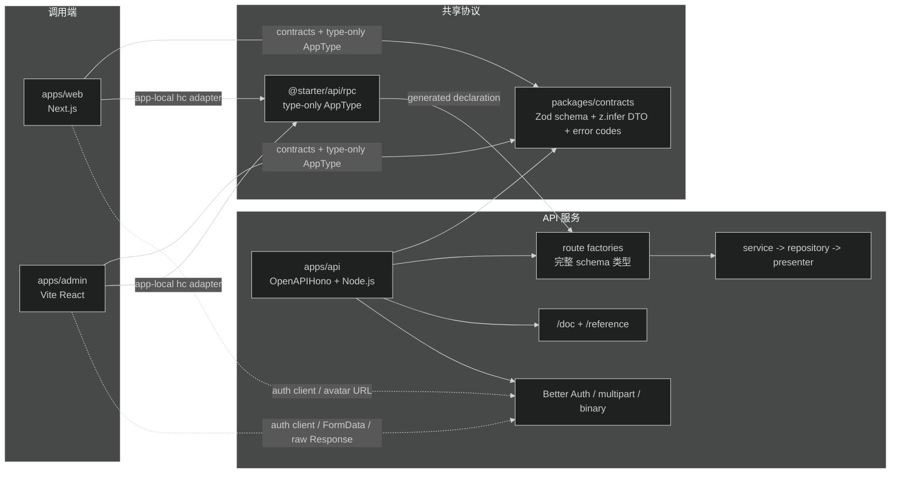
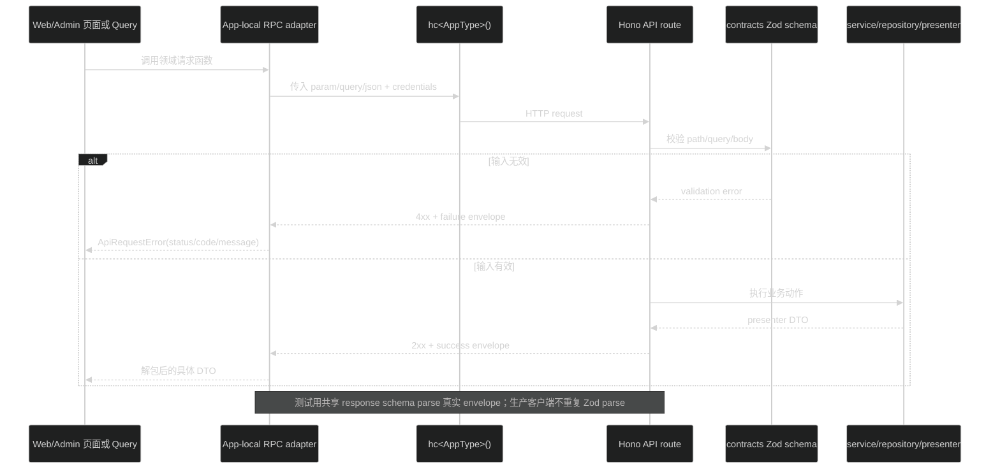

# 详细设计：API 契约与客户端架构

## 1. 设计目标

本设计把当前脚手架的“共享 DTO + 手写 fetch + 部分 OpenAPI schema”调整为：

- `packages/contracts` 维护跨入口协议的唯一 Zod schema 和派生类型。
- `apps/api` 使用这些 schema 做请求运行时校验、OpenAPI 文档和 Hono RPC route 类型。
- `apps/api/src/rpc.ts` 只暴露供客户端消费的 `AppType` 类型入口，不暴露 runtime、数据库或业务实现。
- `apps/web`、`apps/admin` 各自维护薄 RPC adapter，领域请求函数继续留在各自 app。
- Better Auth、multipart、二进制和文档路由保留原有客户端边界。

本设计不改变 HTTP 合同，不改变数据库或业务规则。

## 2. 当前架构

项目类型是 `mixed web-app + admin-app + API` 的 TypeScript monorepo。

- `apps/web`：Next.js 16 App Router，公开端和用户侧页面。
- `apps/admin`：Vite + React 19 SPA，后台页面、React Query 和权限导航。
- `apps/api`：Node.js Hono，Better Auth、Drizzle、SQLite、文件存储、邮件、业务 route 和 OpenAPI。
- `packages/contracts`：当前单文件共享错误码、部分输入 schema、DTO 和响应 builder。
- `packages/theme`：不属于本次契约迁移。

当前 API 请求路径是：

```text
Web/Admin 页面或 query
  -> app 内领域请求函数
  -> app 内 fetch helper
  -> apps/api middleware
  -> OpenAPIHono route / Better Auth handler / 文件 handler
  -> service
  -> repository / storage / external service
  -> presenter / response builder
  -> HTTP Response
```

当前类型问题：

1. API 模块多以独立语句注册 `.openapi()`，再返回原始 `app` 变量，后续 route schema 没有进入返回类型。
2. `apiSuccessResponse(dataSchema: ZodType, ...)` 擦除具体 schema 类型。
3. contracts DTO 与 API OpenAPI response schema 存在平行定义。
4. Web/Admin endpoint 使用路径字符串和手写 `apiRequest<TData>` 泛型，编译器不能约束 path、method 和 response 的对应关系。
5. Web/Admin 的 `development` 条件会命中 API 源码 export，API 私有 `@api/*` alias 不会跨 package 继承。

## 3. 目标架构



依赖方向：

```text
packages/contracts
  -> zod only

apps/api
  -> packages/contracts
  -> hono / @hono/zod-openapi / Node runtime

apps/web
  -> packages/contracts
  -> @starter/api (type-only AppType)
  -> hono (runtime hc adapter)
  -> next / react

apps/admin
  -> packages/contracts
  -> @starter/api (type-only AppType)
  -> hono (runtime hc adapter)
  -> react / Vite / TanStack Query

packages/contracts 不依赖 apps/*
apps/web/admin 不导入 apps/api 的 value、runtime、database、service 或 repository
```

`@starter/api` 是当前 API package 的类型边界，不是新的共享 client package。Web/Admin 的 `@starter/api` 依赖必须明确写进各自 `package.json`，用于 Turbo 图和声明产物前置；代码中只允许 `import type`。

## 4. contracts 设计

### 4.1 目录

```text
packages/contracts/src/
├── common.ts
├── auth.ts
├── profile.ts
├── files.ts
├── users.ts
├── authorization.ts
├── system.ts
└── index.ts
```

`index.ts` 只做根入口重导：

```ts
export * from './common.js'
export * from './auth.js'
export * from './profile.js'
export * from './files.js'
export * from './users.js'
export * from './authorization.js'
export * from './system.js'
```

应用和 API 模块继续从 `@starter/contracts` 根入口导入。内部域文件不是公共 import 路径。若两个域共享 schema，移动到 `common.ts`；不能通过跨域循环 import 解决重复。

### 4.2 所有权规则

`packages/contracts` 负责：

- 跨入口请求 schema。
- 跨入口响应 data schema。
- `z.infer` 生成的 input/output 类型。
- API error code、meta、success/failure envelope schema 和 builder。
- API 与前端都需要的枚举、常量和可序列化 DTO。

`packages/contracts` 不负责：

- `OpenAPIHono`、`.openapi()`、route handler、middleware、HTTP client。
- 数据库 record、Drizzle schema、service 内部类型、文件驱动和环境变量。
- 页面 view model、React props、Query key、UI 状态。

### 4.3 schema 组织

每个普通 JSON endpoint 的跨端数据只定义一份 schema：

- common：`apiMetaSchema`、`apiErrorSchema`、`apiSuccessSchema`、`apiFailureSchema`、`apiResponseSchema`、错误码 schema、`okSchema`、UUID/日期基础 schema。
- auth：`authConfigSchema`、当前 session data schema；Better Auth catch-all 不纳入自有 schema。
- profile：更新资料、设置头像输入，账户资料和公开资料响应。
- files：文件 DTO、文件列表响应、重命名和 JSON 头像输入。multipart 的 File 字段可保留 API 侧 form schema，但 `File` 不作为浏览器普通 JSON DTO。
- users：分页查询、状态输入、用户列表和详情响应。
- authorization：权限、角色、影响查询和审计事件判别联合。
- system：健康信息、服务信息、日志查询和日志响应。

输出类型统一由 schema 派生：

```ts
export const publicProfileSchema = z.object(/* fields */)
export type PublicProfile = z.output<typeof publicProfileSchema>
```

请求函数使用 `z.input` 对应允许默认值和 coercion 的输入；服务层使用 `z.output` 或明确的业务输入类型。对于 `z.coerce.number()` 的 query，必须在设计实现时确认客户端传入的是 URL 字符串形态，不能在 adapter 里重新定义另一套 query 类型。

### 4.4 已确认漂移的处理原则

实现子任务必须先用测试固定真实行为，再选择保持行为或修改 schema。由于本父任务要求 HTTP 完全兼容，默认按实际响应修 schema，不改业务结果：

- 用户状态响应保留实际返回的 `from` 字段。
- 审计事件 schema 补上 `user.status_changed` 分支。
- 头像 URL schema 接受当前 presenter 返回的相对 API path，不能强制改成绝对 URL。
- `apiErrorSchema.code` 复用 contracts 的错误码 schema；若存在运行时错误码未登记，先登记再检查客户端分支。
- `userManagementQuerySchema`、`systemLogsQuerySchema` 和其他 request schema 只保留 contracts 一份；API OpenAPI route 直接引用。
- 实际可能返回的 400、409、413、422、500、504 要在 OpenAPI responses 中补齐，但状态码本身不改变。
- `apiSuccessResponse` 保留具体 Zod schema 泛型；失败 envelope 使用共享 failure schema。

## 5. API route 与 OpenAPI/RPC

### 5.1 route factory 类型保留

每个普通 JSON 模块 factory 必须返回包含已注册 schema 的 `OpenAPIHono` 类型。首选改法是保持链式注册：

```ts
return new OpenAPIHono<HonoEnv>()
  .openapi(routeA, handlerA)
  .openapi(routeB, handlerB)
```

如果需要先注册 security component，先对一个 `app` 实例调用 registry 方法，再从第一次 `.openapi()` 开始链式返回。非 OpenAPI 的 `app.get()` 文件流和 Better Auth catch-all 放在普通 JSON `.openapi()` 注册完成之后；若顺序需要在 chain 中恢复 OpenAPIHono，使用官方 `$()`，不手工补 `AppType`。

不使用运行时 wrapper 或手写 route type；类型必须由真实 route 注册产生。`apps/api/src/routes/index.ts` 继续用 `.route('/', childApp)` 合并直接的 OpenAPIHono 子应用。

### 5.2 响应 helper

`apiSuccessSchema` / `apiSuccessResponse` 改为保留传入 schema 的具体类型。设计要求：

- 参数至少泛型化到 `ZodType` 的具体实例。
- 返回的 `content.application/json.schema` 仍可被 `@hono/zod-openapi` 推断。
- `data` 不退化为 `JSONValue` 或 `unknown`。
- `apiFailureSchema` 的 code 使用 contracts 错误码 schema；details 继续允许未知结构。

代表性 consumer probe 必须覆盖：

- `/health` 无输入的具体响应。
- `/api/profiles/{userId}` 动态 path 和 `PublicProfile`。
- `/api/users` query 和分页响应。
- `/api/profile` PATCH JSON body 和 `AccountProfile`。
- 一个多状态 response 的 401/404 输入与响应联合。

### 5.3 接口分类

| 类别 | 类型来源 | 客户端策略 | 运行时校验 |
| --- | --- | --- | --- |
| 普通 JSON success/failure | contracts schema -> API `createRoute` -> `AppType` | Web/Admin app-local `hc` adapter | API OpenAPIHono/Zod 校验输入；测试 parse 响应 |
| 动态 path/query/header | contracts schema 经 route request 引用 | `param`/`query`/`header` 传给 RPC | API 校验并转换 |
| JSON body | contracts schema 经 route request 引用 | `json` 传给 RPC | API 校验 |
| `PUT /api/profile/avatar` 等 JSON 文件操作 | contracts JSON schema + RPC | 普通 JSON adapter | API 校验；不等同文件上传 |
| Better Auth `/api/auth/*` | Better Auth server/client | `createAuthClient` | Better Auth 负责 |
| `POST /api/files` multipart | API form schema + File/service checks | Admin 专用 FormData 函数；可复用底层 fetch，不走普通 JSON helper | Zod form、`File`、大小和权限校验 |
| 文件下载/公开头像 | 原始 Response 路由 | 原始 `Response`、Blob 或图片 URL | path/auth/ownership 校验 |
| `/doc`、`/reference` | OpenAPI/Scalar | 不进入业务 adapter | OpenAPI 开关 |

### 5.4 AppType 与 package exports

`@starter/api/rpc` 只提供 `AppType` 的 type export。消费端不得命中 API source：

- 调整 `./rpc` exports，使公共消费优先使用 `types: ./dist/rpc.d.ts`、`import/default: ./dist/rpc.js` 的构建产物；不让 Web/Admin 的 `customConditions: ["development"]` 选中 API source。
- 如 API 开发环境仍需要 source 条件，改为 API 内部专用入口或验证 consumer 条件不会命中该分支；不得复制 `@api/*` paths 到 Web/Admin。
- `dist/rpc.js` 可以保持空的 type-only runtime entry；Web/Admin 的 `hc` runtime 从自身 `hono` 依赖导入。
- 不把 `@starter/api` 加入 Web `transpilePackages`，除非后续出现明确的 server runtime import；本任务不需要。
- Turbo 依赖必须让 `@starter/api#build` 或明确的 RPC declaration task 先于 Web/Admin `check-types` 和 build。最终设计选择优先复用 API build，避免新增 package；具体 task 配置以实现阶段的 dry graph 和 clean checkout probe 为准。

### 5.5 OpenAPI 与 RPC 的关系

两者共享同一条 route schema，不互相生成：

```text
contracts Zod schema
  -> API createRoute request/response
     -> OpenAPI /doc
     -> AppType / hc client
  -> contract/smoke response parse
```

OpenAPI 继续是 HTTP 文档和人工调试入口；RPC 是 TypeScript 调用端的编译期入口。Scalar 不参与客户端类型生成。不能为 RPC 另写一套 path 或 DTO。

## 6. 客户端设计

### 6.1 Web adapter

建议在 `apps/web/lib/` 内增加或重构 RPC adapter，领域函数仍位于 `apps/web/lib/api/`：

- type-only 导入 `AppType`。
- value 导入 `hc`、`InferRequestType` 或 `InferResponseType`（只在领域函数确实需要提取类型时）。
- 每次请求使用 `apiUrl`、`credentials: 'include'` 和现有 cache/signal 等 RequestInit 语义。
- 统一把 HTTP 非 2xx 和网络错误转换为当前 `ApiRequestError`。
- 普通 JSON success 解包 `body.data`，failure 读取 `body.error`；不再让领域函数返回 `unknown` 后用重复 type guard。
- `getPublicProfileAvatarUrl()` 继续返回原始头像 URL，不走 RPC。
- Better Auth 继续使用 `authClient`。

Next.js Server Component 和 Client Component 共享 adapter 的前提是 adapter 不读取 React 状态、不使用浏览器专属 API；需要浏览器行为的逻辑仍留在现有 auth client 或组件。

### 6.2 Admin adapter

建议在 `apps/admin/src/api/` 内增加 typed RPC adapter，保留现有 `fetchApi` 的原始 Response 能力：

- type-only 导入 `AppType`，value 导入 `hc`。
- credentials、JSON header、FormData 不设置 Content-Type、API URL 继续由 `client.ts`/env 负责。
- 普通 JSON 函数使用 RPC method，不再写 `apiRequest<TData>` 的 response 泛型。
- 统一把非 2xx 转为 `ApiRequestError`，保留 status、错误 code/message 和现有 401/403 listener。
- `App.tsx` 的 401 清 cache/跳转和 403 处理不变。
- `uploadFile` 保留 FormData 专用请求；`downloadFileBlob` 和头像 URL 保留原始 Response/URL。
- React Query key、mutation、页面状态和权限 guard 不变。

### 6.3 迁移方式

迁移顺序按领域而不是一次替换全部 endpoint：

1. `health`、`auth config`、profile 作为最小验证组。
2. files 的 JSON 操作，上传和下载保持旧路径。
3. users。
4. authorization 和 system logs。
5. Web public profile 与所有端集成回归。

每组迁移前后对比 HTTP 请求：URL、method、body、headers、credentials、状态处理和返回数据必须一致。旧 fetch helper 在所有普通 JSON 调用迁移并通过回归后再删除；如果某端出现问题，只回滚该端领域函数到旧 helper。

## 7. 请求、响应与错误数据流



服务器未知异常继续由 `AppError`、HTTPException 和全局 error handler 转成现有 failure envelope，写入 request logger；客户端只按 HTTP status 和错误 code 转换，不按中文 message 分支。401/403 的 Admin 全局副作用仍由现有 listener 负责。

响应 schema 测试至少覆盖：

- 200 success envelope 和代表性 DTO。
- 400 validation failure。
- 401/403 auth/permission failure。
- 404 resource failure。
- 一个 409/413/422/500/504 中当前业务实际可触发的状态。
- 真实 response 与 `/doc` 中对应 operation schema 的字段一致性。

## 8. 构建与性能设计

### 8.1 声明产物前置

目标任务图：

```text
contracts#build
  -> api#build (rpc declarations)
     -> web#check-types -> web#build
     -> admin#check-types -> admin#build
```

API 与 contracts 的 lint、format、test 仍按各自 package 脚本运行。Web/Admin 不应通过 `customConditions` 命中 API source。实现时用：

```bash
pnpm turbo run build --dry=json
pnpm turbo run check-types --dry=json
```

检查 Web/Admin 的依赖中存在 API declaration 前置，且 clean checkout 删除 `apps/api/dist` 后仍能按项目命令生成声明再检查。

### 8.2 类型和 bundle 基线

迁移前后在同一环境记录冷缓存和 warm cache：

```bash
/usr/bin/time -p pnpm --filter @starter/api exec tsc --noEmit --extendedDiagnostics
/usr/bin/time -p pnpm --filter @starter/web check-types
/usr/bin/time -p pnpm --filter @starter/admin check-types
pnpm --filter @starter/api exec tsc --noEmit --listFilesOnly > /tmp/api-files.txt
pnpm --filter @starter/web exec tsc --noEmit --listFilesOnly > /tmp/web-files.txt
pnpm --filter @starter/admin exec tsc -p tsconfig.app.json --noEmit --listFilesOnly > /tmp/admin-files.txt
```

关注 `Files`、`Types`、`Instantiations`、`Memory used`、`Check time` 和 `Total time`。同一命令运行 3 次取中位数；相对迁移前 `Total time`、`Check time` 或内存增长超过 20% 作为调查信号。

运行构建后检查：

- Web/Admin bundle 不包含 API route implementation、`better-sqlite3`、Drizzle server driver、Pino、Nodemailer 等服务端实现。
- `@starter/api/rpc` 在 consumer probe 中解析到 `dist/rpc.d.ts`，trace 不出现 `apps/api/src` 或 `@api/*`。
- 只存在 `import type` 的 API 类型引用，不存在 API RPC value import。

如声明图过大，先用 TypeScript trace 定位；不得通过手写平行 `AppType` 规避类型问题。

## 9. 兼容与回滚

### 兼容策略

- API 先完成 schema 和 RPC 类型改动，旧 Web/Admin fetch 仍可调用。
- Web/Admin 分别切换领域请求函数；每次只切一个领域，旧 helper 保留到该端全部普通 JSON 调用验证结束。
- API 路径、method、状态码、Cookie、envelope 和特殊接口保持不变。
- contracts 根导出保持不变，现有 import 不需要改成内部路径。

### 回滚点

1. contracts 子任务：恢复根入口和 schema 文件；API 可回退到原 OpenAPI schema 引用，HTTP 不变。
2. API RPC 子任务：恢复 route factory 返回写法、response helper 和 exports；API 仍可独立 build，旧客户端不受影响。
3. Web/Admin 子任务：按 app 或领域恢复旧 `fetch` 请求函数，保留 contracts/API 的兼容改动。
4. 构建性能回归：撤回 API 类型依赖和 RPC adapter，恢复原 Turbo 图；不回滚业务 API 行为。

## 10. 风险与处理

- **AppType 仍遗漏 route**：用 API build 后 consumer probe 枚举 28 个候选接口；探针失败则不能迁移客户端。
- **响应 helper 泛型仍被擦除**：对 profile/users/system 的 `InferResponseType` 做具体字段断言，禁止 `JSONValue`/`unknown`。
- **development export 命中源码**：移除公共 development 分支或建立稳定 declaration consumer 条件；不复制 `@api/*` paths。
- **Turbo 没有 API 前置**：检查 dry graph；未形成依赖前不能宣称 clean checkout 可检查。
- **客户端误套 envelope 到文件或 Better Auth**：按接口分类保留专用函数，并对原始 Response 做回归。
- **真实 schema 与 OpenAPI 不一致**：测试直接 parse `app.request()` 返回 JSON，必要时比较 `/doc` operation schema；修 schema，不用客户端 cast 掩盖。
- **TypeScript 性能回归**：记录 diagnostics 和 trace；若超过调查阈值，收窄声明入口或调整生成策略，但不改变公共 HTTP 合同。
- **跨端发布时顺序错误**：旧客户端先保持可用，API 类型声明和 HTTP 行为先完成，再逐端切换。

## 11. 维护规则

以后新增普通 JSON endpoint 的顺序：

```text
packages/contracts/src/<domain>.ts
  -> apps/api/src/modules/<domain>/*.openapi.ts / *.route.ts
  -> apps/api/src/routes/index.ts
  -> apps/api/src/rpc.ts 声明 probe
  -> apps/admin/src/api 或 apps/web/lib/api 请求函数
  -> 对应页面/query/test
```

不得：

- 在 contracts 外复制 response data schema。
- 在 Web/Admin endpoint 手写与 route 平行的路径、method、响应泛型。
- 让页面直接使用 `hc` 或拼 API URL。
- 让 Web/Admin value import API runtime。
- 把 Better Auth、multipart 或二进制接口强行套普通 JSON adapter。

## 12. 验收映射

- 需求 R1、R7、R9、R10、R11：第 4 节和 `contracts-schema` 子任务。
- 需求 R2、R4、R8、R12、R13、R17：第 5、7、8、9 节和 `api-rpc-boundary` 子任务。
- 需求 R3、R6、R14、R15、R16：第 6 节和 `client-rpc-migration` 子任务。
- 需求 R5：父任务 `implement.md` 和三个子任务 implement plan。
- 需求 R18：本设计完成后由用户评审，评审后另行明确实现授权。
