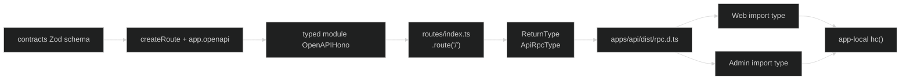

# 设计：API RPC 类型与构建边界

## 1. 类型数据流



同一个 route schema 同时形成 OpenAPI 文档和 `AppType`。不新增手写路由接口，不让客户端通过源码 alias 解析 API 全部实现。

## 2. Route factory 类型保留

当前问题是 `const app = new OpenAPIHono()` 后独立调用多次 `.openapi()`，返回的变量类型不会累积新增 schema。实现时逐模块改为能保留链式返回类型的形式：

- 普通 JSON `.openapi()` 注册连续链式调用。
- 需要先调用 `openAPIRegistry` 注册组件的模块，在第一次 `.openapi()` 前完成注册，再从 `.openapi()` 返回值继续链式注册。
- 需要注册普通 `app.get()` 或 Better Auth `app.on()` 的模块，把这些非 OpenAPI handler 放在普通 JSON route 注册后；如链式类型被普通 Hono 方法缩窄，使用 `@hono/zod-openapi` 官方 `$()` 恢复，而不是手写 schema 类型。
- 文件下载、头像和 Better Auth 继续是普通 Hono handler，是否出现在返回类型由真实 Hono 类型决定，但不能伪造为 JSON response。

`routes/index.ts` 继续直接挂载各 `OpenAPIHono` 子应用。实现后用 route completeness probe 检查 28 个候选 operation。

## 3. Response helper 泛型

`apps/api/src/openapi/responses.ts` 的 success helper 要保留传入 schema 的具体类型：

- 泛型参数应接受具体 Zod schema 实例。
- 返回对象的 `application/json.schema` 必须让 `@hono/zod-openapi` 读取到具体 `data`。
- `apiFailureSchema` 引用 contracts 的错误码 schema，failure details 继续允许扩展 JSON。
- 不在 response helper 中执行运行时 `parse`；helper 只构造 OpenAPI schema 和响应定义。

代表性 probe 必须能从 `InferResponseType` 取得 `/health`、profile、users 和一个多状态 response 的具体字段。

## 4. Package export 与声明产物

公共消费路径必须命中 API 构建产物：

```text
@starter/api/rpc
  -> types: apps/api/dist/rpc.d.ts
  -> import/default: apps/api/dist/rpc.js（可为空的 type-only runtime entry）
```

Web/Admin 不能通过 `customConditions: ["development"]` 进入 `apps/api/src/rpc.ts`，因为 API source 使用私有 `@api/*` alias 并携带 Node-only 类型图。实现阶段应选择并验证最小的 exports/tsconfig 方案，不能预先假定改动方式：

1. 调整 `./rpc` exports，去除或收窄公共 development source 分支；或
2. 保留 API 内部 development 用法，但确保 Web/Admin 的解析条件明确命中 `types`，并用 trace 证明没有 source 命中。

无论采用哪种方式，API 自己的开发命令必须继续工作。Web/Admin 代码只允许 `import type { AppType } from '@starter/api/rpc'`，`hc` 从各自显式的 `hono` runtime dependency 导入。

## 5. Turbo 和发布边界

`@starter/api` 必须成为 Web/Admin 的直接 workspace dependency，Turbo 才能看到关系。当前公共 `build` 使用 `^build`，公共 `check-types` 使用 `^check-types`；但 Web/Admin 的 `check-types` 需要 API 已生成 `dist/rpc.d.ts`，而 API 目前没有同名的 declaration-only task。

实现阶段先用当前 Turbo 版本支持的 package-specific task 配置和 dry graph 验证；若不能表达跨 package 的 `api#build` 前置，则采用最小、可验证的 task 名称或 app script 调整。不得只依赖 import 自动排序，也不得复制 API paths 到客户端。

目标顺序：

```text
contracts#build -> api#build (rpc d.ts) -> web/admin check-types -> web/admin build
```

Web 与 Admin 仍可分别发布；新声明依赖只影响构建顺序，不改变 API 运行时部署边界。

## 6. 性能和泄漏检查

`AppType` 的声明可能引用 Hono、OpenAPI 和 API runtime 相关类型。实现后记录：

- `dist/rpc.d.ts` 及直接引用声明大小。
- Web/Admin `tsc --extendedDiagnostics` 的 `Types`、`Instantiations`、`Memory used`、`Check time`、`Total time`。
- Web/Admin bundle 中没有 API route implementation、SQLite/Drizzle/Pino/Nodemailer 等 API server runtime。
- trace 不出现 `apps/api/src` 或 `@api/*`。

如果性能回归超过基线约 20%，先保存 trace 并定位声明图；不以手写平行 AppType 规避问题。

## 7. 特殊接口和回滚

RPC 类型完整不代表所有路由都使用普通 adapter：Better Auth、multipart、文件下载、头像和文档仍按接口分类保留原客户端。任何 API 类型修改都必须通过 `/doc`、smoke 和特殊接口回归。

回滚顺序：先恢复 exports/依赖和声明任务，再恢复 route factory/helper；HTTP handler 可独立运行，旧客户端不受影响。
