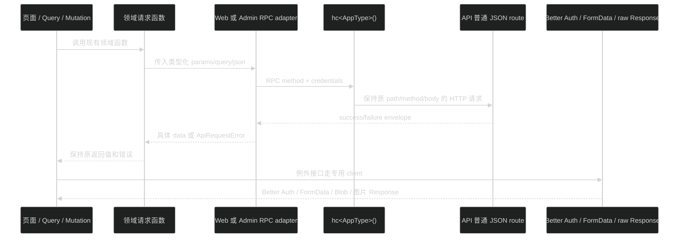

# 设计：Web/Admin 薄 RPC adapter

## 1. 调用边界

页面只调用领域函数。`hc` 只出现在 `apps/web/lib/` 或 `apps/admin/src/api/` 的 adapter/领域 API 文件中，不能出现在页面、组件或 Query hook。

## 2. Web adapter

建议沿用 `apps/web/lib/http.ts` 的错误类和网络错误文案，在同一 app 内增加 RPC transport 或重构现有 helper：

- type-only 导入 `AppType`；runtime 从 Web 的 `hono` 依赖导入 `hc`。
- base URL 继续由 `lib/env.client.ts` 的 `resolveApiUrl` 处理。
- 默认发送 `credentials: 'include'` 和 `accept: 'application/json'`，并保留调用方的 `cache`、`signal` 等 RequestInit 语义。
- 读取普通 JSON 原始 `Response`，按 HTTP status 和 envelope discriminant 解包；网络错误、无效 JSON、无效 envelope 继续转换为现有 `ApiRequestError` 语义。
- 领域函数返回具体 DTO，不再写 `apiRequest<TData>` 泛型。
- `getPublicProfileAvatarUrl` 只解析/拼接原始 URL，不走 envelope/RPC。
- Better Auth 继续由 `auth-client.ts` 管理。

RPC 的编译期方法调用负责 path、method、参数形状；adapter 负责项目的 envelope 和错误副作用。生产不对每个 response 执行 Zod parse，契约 parse 只在 API smoke/contract test。

## 3. Admin adapter

沿用 `apps/admin/src/api/http.ts` 的行为分层：

- 普通 JSON 通过 typed RPC adapter。
- `fetchApi` 保留原始 `Response`，用于下载和需要读取非 JSON body 的接口。
- FormData 请求不设置 `Content-Type`，交给浏览器生成 boundary。
- 非 2xx 转为带 `status` 的 `ApiRequestError`，错误信息优先读取当前 failure body。
- 401/403 继续调用 `subscribeApiAccessError` listeners，保持 Query cache 清理、登录跳转和权限提示。
- 409 继续由现有 `isConflictError` 和领域函数/页面处理。
- Better Auth 继续使用 `api/client.ts` 的 `createAuthClient`，不经普通 envelope parser。

Admin adapter 的公开返回值由 `AppType` 的 response status 推导和 contracts DTO 共同约束；不为了兼容旧裸 JSON 行为而把所有普通响应重新退化成 `unknown`。如果现有特殊接口仍需要裸 JSON 兼容，保留在 raw helper 内。

## 4. 迁移分组

Web：

- auth config。
- public profile（动态 userId）。

Admin：

- system health、system logs、auth config。
- current profile、update profile、JSON avatar set/clear。
- files list、rename、delete；upload/download 保持专用。
- users list/detail/status。
- authorization permissions/users/roles/impact/audit。

领域函数的参数和返回签名尽量不变；query hook、mutation、cache key、路由和权限 guard 不动。

## 5. 例外接口矩阵

| 接口 | 处理方式 | 不允许的动作 |
| --- | --- | --- |
| `/api/auth/*` | Better Auth client | 不套自有 envelope，不改 Cookie/重定向 |
| `POST /api/files` | 专用 FormData 函数，可复用 raw fetch 错误处理 | 不设置 multipart `Content-Type`，不当普通 JSON body |
| 文件 content | `fetchApi` + `blob()`/原始 Response | 不把二进制读成 JSON |
| 公开头像 | DTO 中的原始 URL 或图片请求 | 不把图片请求包进 RPC data |
| `/doc`、`/reference` | 文档浏览器/直接 HTTP | 不生成客户端业务调用 |

## 6. 发布和回滚

API/声明先发布后，Web 与 Admin 可分别迁移。每个领域保留旧 helper 到新调用通过请求对比和回归；出错时只恢复该领域函数，不动 API/contracts。全部普通 JSON operation 验证后，才删除没有特殊调用方的旧 helper 分支。
