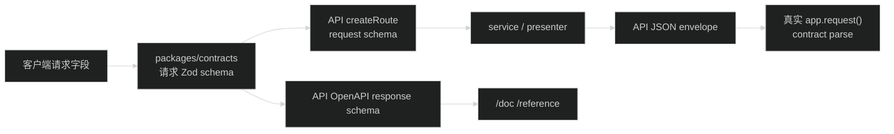

# 设计：统一 contracts 与响应 schema

## 1. 边界

本子任务只负责共享协议层和 API 文档 schema 的来源。数据流保持如下：



`packages/contracts` 只依赖 `zod`。API 的 `*.openapi.ts` 可以依赖 contracts 和 `@hono/zod-openapi`，但 OpenAPI 元数据不回流到 contracts。Web/Admin 继续从 `@starter/contracts` 根入口导入，不依赖内部域文件路径。

## 2. 文件组织

目标目录：

```text
packages/contracts/src/
├── common.ts
├── auth.ts
├── profile.ts
├── files.ts
├── users.ts
├── authorization.ts
├── system.ts
└── index.ts
```

`common.ts` 放以下共享内容：

- `ApiErrorCodes`、`ApiErrorCode` 和 `apiErrorCodeSchema`。
- `ApiMeta`、`apiMetaSchema`、`ApiError`、`apiErrorSchema`。
- success/failure envelope schema、派生类型和 `buildSuccess`/`buildFailure`。
- `uuidSchema`、日期 schema、`okSchema` 以及跨域通用常量。

领域文件按 endpoint 数据归属放置 schema、`z.infer` 类型、枚举和可序列化 payload。只在两个领域都需要时才放 common；不能因为文件较短就把数据库 record 或服务层输入放进 contracts。

根 `index.ts` 只重导出 `.js` 后缀的域文件。公开名称发生冲突时，在根入口显式导出并保留现有名称；内部文件名不构成公共 API。

## 3. Schema 所有权规则

每个普通 JSON endpoint 的字段结构只保留一份 Zod schema：

- API request 的 `params`、`query`、JSON body 直接引用 contracts schema，或在 API 层用同一个 schema 做极薄的 path wrapper。
- API response data schema 放 contracts；API OpenAPI 文件只补 operation 名称、描述、tag、security 和状态码映射。
- Presenter 返回值使用由 schema 派生的 DTO；数据库 record 先在 service/presenter 转换，不能导出到 contracts。
- Web/Admin 的领域函数使用根入口导入的 DTO；表单值、query key 和 view model 仍在应用内转换。

API 层若需要 OpenAPI 专用 `.openapi()` 名称，可以对共享 schema 做 API 层包裹或注册名称，但不得重新列出字段。该包裹不能改变输入/输出形态。

## 4. 已知漂移的处理

实现顺序是“先用真实响应固定事实，再调整共享 schema”：

1. 对状态更新成功响应保留 API 实际返回的 `from`、`id`、`status`。
2. 将 `user.status_changed` 加入授权审计事件 response union，保留 before/after payload 形状。
3. 头像 URL 接受 presenter 当前返回的相对 `/api/.../avatar` 路径；不把它改成绝对 URL。
4. 错误码 schema 从 `ApiErrorCodes` 派生；新增运行时 code 先登记并检查 AppError、OpenAPI、客户端分支和测试。
5. 用户管理和系统日志 query 各保留一份约束。对于 `z.coerce`，明确 `z.input` 的 URL 字符串边界，不能在 adapter 再定义参数类型。
6. OpenAPI response status 补齐当前真实可触发的 400、409、413、422、500、504 映射；只补文档和 schema，不改变状态码。

## 5. 响应测试边界

生产 API 继续只校验请求入口。响应不在每次发送前重复 `parse`，避免双重运行时开销和把 presenter 的兼容行为改变成新错误。

测试增加一个可复用的真实响应读取辅助函数，或在已有 API smoke test 中直接执行：

```text
app.request(request) -> response.json() -> shared success/failure schema.parse()
```

至少固定：

- 一个成功的具体 DTO envelope。
- 一个验证失败或权限失败 envelope。
- 一个包含已知漂移字段的用户状态或审计响应。

测试失败应指出 schema 字段，而不是通过 `as SomeDto` 隐藏问题。`meta` 在成功和失败两条路径都必须存在。

## 6. 特殊接口

以下内容不纳入普通 JSON contracts/RPC adapter：

- Better Auth `/api/auth/*` 的服务端 handler 和非 envelope 响应。
- multipart `File` 对象、边界和上传 transport；只共享上传成功返回的 JSON `FileItem` schema（如果 API 文档需要）。
- 文件下载和头像二进制的原始 `Response`、MIME、长度和缓存 header。

这不是遗漏，而是保持不同 HTTP body/响应语义的边界。

## 7. 兼容与回滚

迁移可以分两步发布：先发布 contracts/API schema 引用，旧 Web/Admin 仍读取同样的 JSON；再由后续子任务切换客户端。若 schema 拆分造成编译问题，恢复根入口的旧重导或暂时保留兼容 re-export；不修改 HTTP 路由和数据库。
