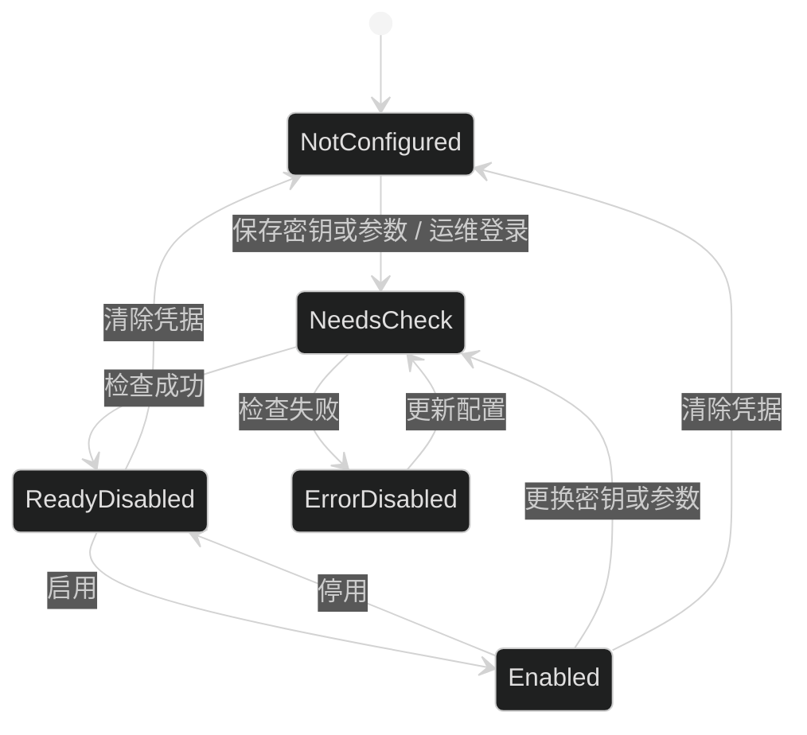
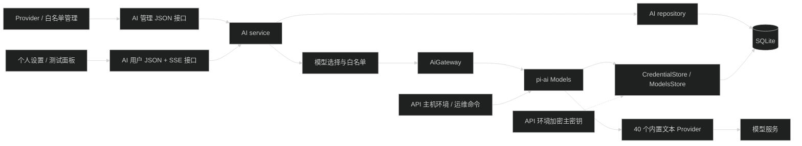
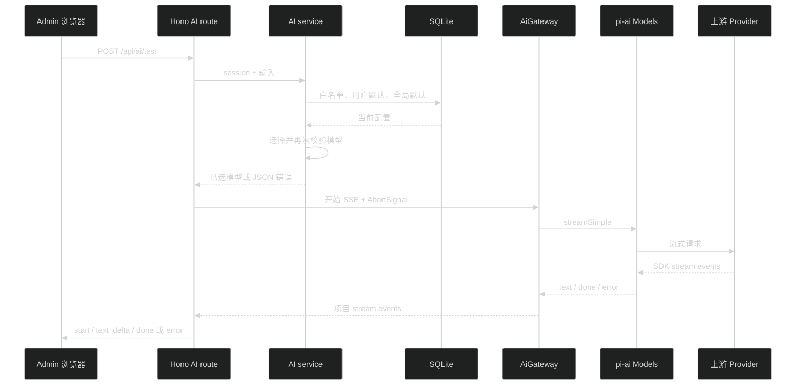

# AI 配置与模型选择技术设计

## 1. 设计结论

- 精确锁定 `@earendil-works/pi-ai@0.84.1`，对应 Git commit `53fa77ccd8a279eb87e92294ef3687b03ff80112`，Node 版本要求同步为 `>=22.19.0`。
- 使用 `providers/all` 的 `builtinModels()` 注册该版本的 40 个内置文本 Provider。`ImagesModels` 和 OpenRouter 图片 Provider 不进入本任务。
- `pi-ai` 只存在于 `apps/api/src/infra/ai/`。Admin、Web、contracts、数据库 schema 和业务模块不引用第三方 SDK 类型。
- 一个 `Provider.id` 只对应一份全局配置和一份 credential。列表接口展示全部固定 Provider，配置写接口只允许 upsert 已注册 ID，不允许创建任意 Provider。
- API 实现数据库版 `CredentialStore` 和 `ModelsStore`。Provider 调用、OAuth refresh、模型目录恢复和动态刷新都通过这两个 Store。
- API 维护项目自己的 Provider registry，声明表单字段、认证方式、运行时参数、部署说明和动态刷新能力。`pi-ai` 的 auth 接口不能直接作为前端表单 schema。
- API Key、Bedrock bearer token、Vertex API Key 和 Provider 支持的普通参数可由 Admin 保存。OAuth、AWS credential chain、Vertex ADC 和服务账号文件仍由 API 主机或运维命令配置。
- 模型目录只来自 `pi-ai` catalog 或 `Models.refresh()`。管理员维护 Provider/model 复合 ID 白名单，不录入模型元数据。
- 第一版不建立对话、消息、用量、账单、额度和图像表。

## 2. 模块边界

### 2.1 API 业务模块

新增 `apps/api/src/modules/ai/`：

```text
apps/api/src/modules/ai/
├── ai.openapi.ts
├── ai.presenter.ts
├── ai.repository.ts
├── ai.route.ts
├── ai.schema.ts
├── ai.service.ts
└── index.ts
```

- `ai.route.ts`：URL、middleware、Zod 校验、JSON response 和 SSE response。
- `ai.service.ts`：Provider 状态迁移、白名单、默认模型、模型选择和刷新后的重校验。
- `ai.repository.ts`：SQLite 查询、事务和 compare-and-swap，不处理 HTTP 或 SDK 对象。
- `ai.presenter.ts`：把数据库记录和内部运行时对象转换为管理员 DTO 或用户 DTO，使用字段白名单。
- `ai.openapi.ts`：JSON route 的 OpenAPI request/response schema；SSE route 明确 `text/event-stream` response。
- `ai.schema.ts`：本模块 Drizzle schema，在 `apps/api/src/infra/db/schema/index.ts` 注册。

### 2.2 API 运行时适配

新增 `apps/api/src/infra/ai/`：

```text
apps/api/src/infra/ai/
├── ai-crypto.ts
├── ai-credential-store.ts
├── ai-models-store.ts
├── ai-provider-registry.ts
├── ai-runtime.ts
├── ai-gateway.ts
└── index.ts
```

- `ai-crypto.ts`：AES-256-GCM 加解密和 payload 版本校验。
- `ai-credential-store.ts`：实现 `CredentialStore`，包含进程内串行队列和数据库版本 CAS。
- `ai-models-store.ts`：实现 `ModelsStore`，完整保存 `ModelsStoreEntry`。
- `ai-provider-registry.ts`：固定 Provider 定义、表单字段和 runtime factory 配置。
- `ai-runtime.ts`：创建 `builtinModels()`、懒恢复动态 catalog、替换需要自定义 runtime 参数的 Provider。
- `ai-gateway.ts`：项目内部模型调用接口，负责超时、取消、stream 事件和错误归一化。

`create-runtime.ts` 将 `AiRuntime` 放入 `AppRuntime`，`RuntimeDeps` 允许测试注入假的 AI runtime/gateway。`createRoutes()` 注册 `createAiRoute(runtime)`，并继续由 `ApiRpcType` 推导 JSON route 类型。

### 2.3 Contracts

`packages/contracts` 已按领域拆文件。新增：

```text
packages/contracts/src/ai.ts
```

并修改：

- `common.ts`：增加稳定 AI error code。
- `authorization.ts`：增加 `AI_CONFIG_READ` 和 `AI_CONFIG_MANAGE`。
- `index.ts`：导出 `ai.ts`。

contracts 只描述可序列化项目类型，不包含 `Credential`、`ModelsStoreEntry`、`Model`、`Provider`、Node 环境变量或数据库 record。

### 2.4 Admin

新增：

```text
apps/admin/src/
├── api/ai/
│   ├── ai.api.ts
│   ├── ai.query.ts
│   └── index.ts
└── features/ai/
    ├── pages/AiSettings.tsx
    ├── pages/AiProviders.tsx
    ├── components/
    └── routes.tsx
```

- `/settings/ai`：所有登录用户可访问，显示个人默认模型和无会话测试面板。
- `/settings/ai/providers`：需要 `ai:config:read`；写操作还需要 `ai:config:manage`。
- JSON 接口继续使用 Hono RPC 和 `unwrapApiData()`。
- SSE 是带 JSON body 的 POST 请求，不能使用浏览器原生 `EventSource`。Admin 使用 `fetchApi()`、`ReadableStream` 和 `eventsource-parser@4.0.0` 增量解析，不手写按换行拆包逻辑。
- `fetchApi()` 需要保留调用方主动触发的 `AbortError`，不能把停止生成包装成“API 服务连不上”；其他网络错误继续使用现有 `ApiRequestError(0)`。
- 每个 SSE `data` 先解析 JSON，再用 contracts 的 `aiTestStreamEventSchema.safeParse()` 校验；未知/损坏事件不能进入组件状态。
- API Key 只存在于当前表单实例。提交成功或 Drawer 关闭后清空，不进入 Query cache、Zustand、localStorage 或 URL。

## 3. Contracts 与 DTO

### 3.1 公共标识

- `AiModelRef`：`{ providerId, modelId }`。所有数据库查找、白名单和默认模型都使用这两个字段，不只用 `modelId`。
- `providerId` 在 contracts 中使用受长度和字符约束的 string；API 再按固定 registry 校验。
- `modelId` 允许 catalog 中常见的 `/`、`.`、`:` 等字符，只做 trim 和长度限制；不作为未编码路径参数。

### 3.2 管理员 DTO

`AdminAiProvider` 至少包含：

- `providerId`、`name`、`enabled`。
- `supportedAuthModes`、`activeCredentialType`。
- `authStatus`、规范化后的 `authSource`、`checkedAt`。
- `credentialMask`，只允许固定掩码和末尾少量字符；OAuth 和环境凭据不返回 token 片段。
- `configFields`、允许回显的 `configuredSettings`、`setupInstructions`、`supportsModelRefresh`。`configuredSettings` 只含 registry 标记为 Admin 可读的非密字段；主机文件路径和 credential env secret 不回显。
- `catalogModelCount`、`enabledModelCount`、`configRevision`。

`AdminAiModel` 包含模型复合 ID、显示名、文本模型能力摘要、当前是否可用、是否在白名单和不可用原因。能力字段由 presenter 明确映射，不直接序列化整个 `pi-ai Model`。

Provider 配置输入使用受限结构：

```ts
{
  apiKey?: string
  settings: Record<string, string>
}
```

contracts 限制 key/value 数量和长度；service 再按 Provider registry 拒绝未知字段。`apiKey` 省略表示保留现有密钥，清除凭据使用独立接口，空字符串不能表示“保留”。

### 3.3 用户 DTO

`AiUserModel` 只包含模型复合 ID、显示名、Provider 显示名和文本调用所需能力摘要，不包含：

- 认证方式、认证来源和检查时间。
- credential mask、Provider 表单字段和部署说明。
- runtime endpoint、环境变量名和管理员状态。

`AiUserPreference` 同时返回：

- `selectedModel`：用户保存的值，允许为 `null`。
- `effectiveModel`：当前实际会使用的有效模型，允许为 `null`。
- `effectiveSource`：`user`、`global` 或 `null`。

用户可用 `null` 清除个人默认模型。

### 3.4 流事件

项目自己的 `AiTestStreamEvent` 只定义：

- `start`：request ID 和最终选中的模型。
- `text_delta`：回答文本增量。
- `done`：安全的 stop reason 和可选 token 数量；不包含计费字段。
- `error`：稳定 error code、可理解消息、`retryable` 和 request ID。

不转发 thinking 文本、tool call 参数、`AssistantMessage`、原始上游错误或 Provider response body。

## 4. 数据模型

| 表 | 关键字段 | 约束与用途 |
| --- | --- | --- |
| `ai_provider_configs` | `provider_id` 主键、`enabled`、`credential_type`、`credential_hint`、`payload_ciphertext`、`payload_iv`、`payload_auth_tag`、`encryption_version`、`row_version`、`config_revision`、`checked_config_revision`、`auth_status`、`auth_source`、`last_checked_at`、`last_check_error_code`、`updated_by`、时间字段 | 一个 Provider 一行。加密 payload 保存 credential 和允许的 runtime settings；`row_version` 用于 CAS，`config_revision` 只在管理员/运维配置变化时增加。 |
| `ai_model_catalogs` | `provider_id` 主键、`models_json`、`checked_at`、`last_modified`、`etag`、`updated_at` | 完整实现 `ModelsStoreEntry`，不能丢弃远端目录缓存校验字段。 |
| `ai_enabled_models` | `provider_id`、`model_id` 复合主键、`enabled_at`、`updated_by` | 行存在即表示在白名单。模型元数据继续来自当前 catalog。 |
| `ai_settings` | 固定 ID `global`、`global_provider_id`、`global_model_id`、`updated_by`、`updated_at` | 全局默认模型；两列同时为空或同时有值。 |
| `user_ai_preferences` | `user_id` 主键、`provider_id`、`model_id`、`updated_at` | 用户默认模型；用户删除时 cascade。模型两列同时为空或同时有值。 |

数据库约束：

- encrypted payload 四个字段必须同时为空或同时存在。
- `credential_type` 只允许 `api_key`、`oauth` 或 `null`。
- `enabled` 默认 false；新配置不会自动启用。
- `updated_by` / `user_id` 引用现有 user 表，管理员删除时 `updated_by` 设为 null。
- Provider/model 标识不引用外部 catalog 表；service 在写事务前后都校验当前 registry/catalog。
- `ai_model_catalogs.models_json` 在读取时按 SDK adapter 内部 schema 校验；JSON 损坏时记录脱敏错误并视为无缓存，不把异常数据传入 `pi-ai`。

migration 同时插入 `ai:config:read` 和 `ai:config:manage` permission。现有 admin 角色从活动 `PermissionKeys` 自动获得全部权限；operator/viewer 不自动获得 AI 配置权限。

## 5. Provider 状态和写入规则

`enabled` 与认证状态是两个独立字段。认证状态取值：

- `not_configured`：没有可解析 credential 或 API 主机环境配置。
- `needs_check`：配置已变化，尚未用当前 `config_revision` 检查。
- `ready`：当前 revision 的 `Models.getAuth()` 成功。
- `error`：解密、OAuth refresh 或认证解析失败。



写入规则：

1. 保存 API Key、runtime settings 或运维登录成功后，递增 `config_revision`，清空 `checked_config_revision`，设置 `needs_check` 并强制 `enabled=false`。
2. “检查”调用 `Models.getAuth(providerId)`。成功后把 `checked_config_revision` 设为当前 revision；失败只保存稳定错误分类，不保存原始 message。
3. 启用操作要求 `auth_status=ready` 且 checked revision 等于当前 revision；否则返回 409。
4. 停用立即阻止新请求，但保留加密凭据、白名单和 catalog。
5. 清除 credential 使用独立操作，强制停用并允许 Provider 重新使用 ambient auth。保存的 credential 会遮蔽 ambient auth，不能把“清除”实现成空字符串。
6. 更换配置后旧 credential 在数据库写事务完成时失效。已进入上游的请求可以自然结束，不在本任务中强制取消；事务完成后的新请求必须读取新 revision。
7. 停用 Provider、移除白名单或 catalog 成功刷新后，全局默认若失效就在同一事务中清空。用户偏好保留原值，但运行时会跳过并回退。

## 6. `pi-ai` 运行时适配

### 6.1 Provider registry

`builtinModels().getProviders()` 是固定版本 Provider 事实来源。registry 先从 SDK Provider 派生 `id`、`name`、已声明 auth mode、静态/动态 catalog 等基础数据，再合并项目 override map。普通 API Key Provider共用一个 write-only key 字段；只有特殊 Provider 写 override，补充：

- Provider 专用 Admin 字段及校验。
- `api_key`、`oauth`、`ambient` 的可用组合和操作边界。
- credential `env` 映射和允许的 runtime factory settings。
- 环境型认证说明和规范化 `authSource`。
- 动态刷新和 endpoint 变更能力。

不能通过执行或解析 SDK `login()` prompt 动态生成 Web 表单；这些 prompt 是交互流程，不是稳定 schema。

自动测试必须断言：

```text
sort(registry provider IDs) === sort(builtinModels().getProviders().map(id))
```

升级 `pi-ai` 后新增或移除 Provider 会直接让测试失败，必须先更新 registry 和 Admin 字段。

默认 Provider 由 `builtinModels()` 创建。Radius 等 factory 参数影响 endpoint 的 Provider，在 `AiRuntime.ensureReady()` 中读取加密 runtime settings 后，用相同 `Provider.id` 的 factory 实例执行 `models.setProvider()` 替换；不创建第二个 ID。

### 6.2 加密 payload

加密 payload 是 API 内部版本化对象：

```ts
{
  credential?: Credential
  runtimeSettings: Record<string, string>
}
```

- `AI_CREDENTIAL_ENCRYPTION_KEY` 使用 base64 编码的 32 字节密钥。
- 使用 Node `crypto` 的 AES-256-GCM，每次写入生成 12 字节随机 IV。
- API 可以在未配置主密钥时启动并展示固定 Provider/ambient 状态，但所有持久 credential 的读取、写入和 OAuth 登录返回 `AI.CREDENTIAL_KEY_UNAVAILABLE`；绝不降级成明文。
- 存在密文但密钥缺失或错误时，该 Provider 进入 `error`，不回退环境凭据。
- `credential_hint` 只保存 API Key 的固定掩码；OAuth token 不保存 hint。
- 第一版不实现在线主密钥轮换。`encryption_version` 只标识 payload/算法版本。

### 6.3 数据库 `CredentialStore`

`CredentialStore.modify()` 的 callback 可以执行 OAuth 网络刷新，不能把整个 callback 放进普通 `better-sqlite3` transaction。实现采用：

1. 每个 API 进程内按 Provider ID 使用 Promise queue 串行。
2. 读取 credential 和 `row_version`，解密后调用 SDK callback。
3. callback 返回 `undefined` 时保持当前 credential，不写数据库。
4. callback 返回新 credential 时，用短 SQLite transaction 执行 `WHERE row_version = expected` 的 compare-and-swap。
5. CAS 冲突时不覆盖较新 credential，返回可重试的 store conflict。
6. `delete()` 进入同一 queue，并用 CAS 清除 credential、保留 runtime settings。

OAuth refresh 只递增 `row_version`，不改变 `config_revision`、`checked_config_revision` 和 `enabled`。Admin/运维主动更换认证才递增 `config_revision` 并强制停用。

跨进程 CLI 与 API 并发时，CAS 防止旧 token 覆盖新 token；第一版不声明分布式互斥。运维命令遇到冲突应退出并提示重试，不能静默覆盖。

### 6.4 数据库 `ModelsStore`

`read`、`write`、`delete` 完整保存：

- `models`
- `checkedAt`
- `lastModified`
- `etag`

所有方法在数据库操作前后检查 `AbortSignal`。`Models.refresh()` 返回 `{ aborted, errors }` 而不是直接抛出 Provider 错误，service 必须检查目标 Provider 的 `errors`。

现有 `createRuntime()` 是同步函数，不能为了恢复动态 catalog 改成全局 async。`AiRuntime` 暴露 memoized `ensureReady()`；第一个 AI service 操作在 migration 已执行后调用：

```text
models.refresh({ allowNetwork: false })
```

它只恢复缓存，不访问上游。Admin 主动刷新再调用：

```text
models.refresh({ providers: [providerId], force: true, signal })
```

刷新失败保留 Provider 当前内存列表和旧 `ModelsStore` 数据。成功后再执行白名单/default 重校验。

`ensureReady()` 先读取可用 runtime settings 并用同 ID 替换对应 Provider，再恢复动态 catalog。它按 Provider 隔离恢复错误：一个 Provider 的密文或 catalog 损坏只把该 Provider 标记为 error，不阻止其他 Provider 和非 AI API 使用。静态 catalog 或缓存恢复后还要重校验现有白名单/default，覆盖 SDK 升级导致模型消失的情况。

### 6.5 `AiGateway`

`AiGateway` 只接收项目内部 `AiModelRef`、单条 prompt 和 `AbortSignal`，内部再查 `models.getModel()`。它：

- 通过 `models.streamSimple()` 调用，不向测试请求提供 tools。
- 使用 `AbortSignal.any()` 合并浏览器断开、用户停止和服务端 timeout。
- 逐个消费 `AssistantMessageEventStream`；调用开始后的 auth/stream 失败按 SDK 契约从 `error` event 读取，不只依赖 `try/catch`。
- 忽略 `thinking_*` 和 `toolcall_*` 事件，不向客户端暴露内部推理或工具参数。
- 把 `ModelsError` 的 `auth`、`oauth`、`model_source`、`provider`、`stream` 等 code 映射到项目错误；不返回 SDK message。
- 不把带上游 cause 的 Error 交给全局 error handler，避免 `runtime.logger.error({ err })` 记录原始 response。

## 7. 架构与请求流程



模型选择顺序：

1. 请求显式指定模型时，验证 Provider 已启用、认证可解析、模型在当前 catalog 且在白名单。任一条件不满足就直接拒绝，不回退默认模型。
2. 请求未指定模型时检查用户默认；失效时跳过。
3. 再检查全局默认；失效时返回 `AI.NO_AVAILABLE_MODEL`。
4. 发起上游请求前再次按当前数据库状态校验，不能依赖 Admin 页面或 Query cache。

## 8. SSE 协议

`POST /api/ai/test` 输入只包含可选 `AiModelRef` 和一条非空 prompt。prompt 有固定长度上限，输出 token 上限和 timeout 由服务端配置，客户端不能传任意 Provider options。

错误分两段处理：

1. SSE headers 发出前：session、Zod、白名单和选模失败使用现有 JSON failure envelope 和真实 HTTP status。
2. SSE headers 发出后：上游认证、timeout、abort 和 stream error 使用 `error` SSE event；HTTP status 保持 200。



SSE response 设置 `Content-Type: text/event-stream`、`Cache-Control: no-cache`，按部署代理需要关闭 buffering，并周期发送不含业务数据的 heartbeat。Hono `stream.onAbort()` 与 request signal 共同取消上游。

## 9. HTTP 与权限

| 接口 | 权限 | 行为 |
| --- | --- | --- |
| `GET /api/ai/admin/providers` | `ai:config:read` | 返回全部 registry Provider、脱敏配置和最近检查状态。 |
| `PUT /api/ai/admin/providers/{providerId}/config` | `ai:config:manage` | upsert 已知 Provider 的密钥/参数；更新后强制停用并等待检查。 |
| `DELETE /api/ai/admin/providers/{providerId}/credential` | `ai:config:manage` | 清除存储 credential，保留允许的 runtime settings，强制停用。 |
| `POST /api/ai/admin/providers/{providerId}/check` | `ai:config:manage` | 调用 `getAuth()`，可能刷新 OAuth 并记录规范化状态；不发送模型 prompt。 |
| `PUT /api/ai/admin/providers/{providerId}/state` | `ai:config:manage` | 启用或停用；启用要求当前 revision 已检查成功。 |
| `POST /api/ai/admin/providers/{providerId}/refresh` | `ai:config:manage` | 只刷新声明 dynamic catalog 的 Provider。 |
| `GET /api/ai/admin/models` | `ai:config:read` | 返回当前 catalog，并合并已失效的白名单/default 引用，标明不可用原因。 |
| `PUT /api/ai/admin/models` | `ai:config:manage` | 用去重的复合 ID 集合替换白名单，并重校验全局默认。 |
| `PUT /api/ai/admin/default-model` | `ai:config:manage` | 设置或清除全局默认，只接受当前可用白名单模型。 |
| `GET /api/ai/models` | 登录 session | 只返回当前启用、认证可解析且在白名单中的用户 DTO。 |
| `GET /api/ai/preferences` | 登录 session | 返回当前用户保存值和实际有效值。 |
| `PUT /api/ai/preferences` | 登录 session | 保存可用模型或 `null`，按当前用户隔离。 |
| `POST /api/ai/test` | 登录 session | 单条 prompt 的 SSE；不持久化消息。 |

Admin route 使用 `requireAuth` 后再使用 `createRequirePermission`。`/settings/ai/providers` 的 route record、菜单和标签栏标记 `AI_CONFIG_READ`；保存、检查、启停、清除、刷新、白名单和默认动作由 `PermissionGuard(AI_CONFIG_MANAGE)` 控制。客户端权限只改善体验，API middleware 是安全边界。

管理员接口可以返回具体 Provider 状态；用户模型目录和测试接口把不存在、停用或未进白名单的显式模型统一返回 `AI.MODEL_NOT_ALLOWED`，不泄漏管理员隐藏目录。

## 10. Admin 页面与 Query 状态

### 用户设置页

- 模型选择器按 Provider 分组，只使用 `GET /api/ai/models`。
- 显示用户保存值、实际生效值和来源；失效用户偏好可清除或改选。
- 测试面板包含模型选择、prompt、发送、停止、重试和流式结果，不显示会话列表。
- 页面卸载、再次发送或点击停止时 abort 现有请求；过期请求不能继续写入新结果。

### Provider 管理页

- 主体使用可搜索/筛选表格，展示 Provider、认证方式、检查状态、启用状态和模型数量。
- 单个 Provider 的设置放 Drawer；API Key 是 write-only 输入，已有值只显示 mask。
- 环境型认证显示规范化状态、部署说明和重新检查操作，不显示 API 主机文件路径或原始 auth source。
- 模型白名单使用可扫描表格和 checkbox；全局默认只能从当前勾选且可用的模型中选择。
- config 更新成功后立即关闭启用状态；Admin 必须重新检查再启用。

Query keys 分开：

- `['ai', 'admin', 'providers']`
- `['ai', 'admin', 'models']`
- `['ai', 'models']`
- `['ai', 'preference']`

配置、启停、清除、检查、刷新、白名单和全局默认 mutation 成功后，失效管理员 Provider/模型以及用户模型目录；用户偏好 mutation 只更新 preference，再按需失效用户模型。mutation 失败不执行成功失效逻辑。

页面必须覆盖 loading、error、empty、pending、403、401、SSE 中断和重试。权限未加载或失败时隐藏受保护入口，不保留上一账号的 Provider 管理标签。

## 11. 错误、日志与安全

新增稳定错误码：

| 错误码 | HTTP/流行为 | 是否可重试 |
| --- | --- | --- |
| `AI.PROVIDER_NOT_FOUND` | 404 JSON | 否 |
| `AI.PROVIDER_DISABLED` | 409 JSON | 否 |
| `AI.PROVIDER_NOT_CONFIGURED` | 503 JSON/SSE | 配置后可重试 |
| `AI.PROVIDER_AUTH_FAILED` | 503 JSON/SSE | 是 |
| `AI.CONFIG_INVALID` | 400 JSON | 否 |
| `AI.CREDENTIAL_KEY_UNAVAILABLE` | 503 JSON/SSE | 配置环境后可重试 |
| `AI.CREDENTIAL_CONFLICT` | 409 JSON/SSE | 是 |
| `AI.MODEL_NOT_FOUND` | 404 JSON | 否 |
| `AI.MODEL_NOT_ALLOWED` | 403 JSON | 否 |
| `AI.NO_AVAILABLE_MODEL` | 503 JSON | 配置后可重试 |
| `AI.CATALOG_REFRESH_FAILED` | 503 JSON | 是 |
| `AI.UPSTREAM_ERROR` | 503 SSE | 是 |
| `AI.UPSTREAM_TIMEOUT` | 504 JSON 或 SSE | 是 |
| `AI.REQUEST_ABORTED` | SSE 或无 response | 是 |

结构化日志只允许：`providerId`、`modelId`、`requestId`、`durationMs`、规范化错误码、`stopReason` 和 token 数量。禁止 prompt、response、API Key、credential hint、OAuth 字段、Provider env 值、AWS/Google 文件内容、计费字段和完整上游 Error/cause。

数据库 SQL logger 已只记录参数数量；AI service/gateway 不能另加参数值日志。SSE `error.message` 使用项目文案，`details` 不放第三方错误 body。

## 12. 特殊认证运维边界

- 普通 API Key Provider：Admin 保存密钥和 registry 允许字段。
- Bedrock：Admin 可保存 bearer token；AWS profile、IAM、ECS role、web identity 和 access key chain 由 API 主机配置。
- Vertex：Admin 可保存 Google Cloud API Key；ADC、service-account 文件、project/location 由部署环境或运维流程配置，不提供浏览器文件上传。
- OAuth：增加 `pnpm --filter @starter/api ai:auth -- <providerId>` 和 logout 选项。命令使用同一 DB、加密密钥、registry 和 `CredentialStore`；成功后标记 `needs_check` 并强制停用。
- 需要 localhost callback 的 OAuth 流在 API 主机执行；device code 在终端显示。Admin 不启动、代理或轮询这些流程。
- 存储 credential 会遮蔽 ambient auth。切换回环境认证前必须先清除存储 credential，再重新检查和启用。

运维命令不在 stdout/stderr 输出 token，不接受命令行 secret 参数；密钥输入使用隐藏 prompt 或部署环境变量。

## 13. 兼容、发布与回滚

- `pnpm-workspace.yaml` catalog 精确加入 `@earendil-works/pi-ai@0.84.1` 和 `eventsource-parser@4.0.0`，各应用使用 `catalog:`。
- 根 Node engine 更新为 `>=22.19.0`；`apps/api/.env.example` 增加服务端加密密钥和 timeout 说明，Web/Admin 环境示例不出现该密钥。
- 部署顺序：设置加密密钥（需要持久 credential 时）→ 执行 migration → 发布 API → 发布 Admin。
- migration 只新增表、约束和 permission。回滚应用时保留表和密文，不做破坏性 down migration。
- 密钥丢失时密文不可恢复；系统报告 key unavailable/decrypt error，不能尝试明文修复。
- `pi-ai` 升级前必须比较 Provider ID、registry、`CredentialStore`/`ModelsStore` 接口和 stream event，并通过 adapter/registry 契约测试。
- `/Users/wuwanzhu/Code/pi` 只提供源码证据，不作为 workspace 依赖，也不修改其中内容。
