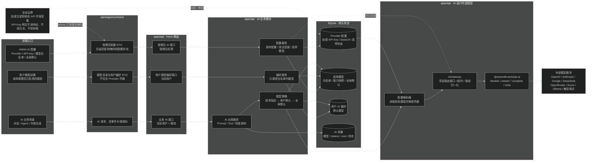

# AI 配置候选架构

用户已认可这张图表达的分层方向。正式模块、接口、Store 和状态迁移以 `design.md` 为准；图中的业务场景入口和用量表是后续扩展，不属于本任务实现范围。

```mermaid
%%{init: {"theme": "dark"}}%%
flowchart LR
  subgraph Client["前端入口"]
    direction TB
    AdminUI["Admin AI 配置<br/>Provider / API Key / 模型白名单 / 全局默认"]
    UserUI["用户模型设置<br/>选择管理员已启用的模型"]
    SceneUI["AI 业务场景<br/>对话 / Agent / 内容生成"]
  end

  subgraph Contract["packages/contracts"]
    direction TB
    AdminDTO["管理员配置 DTO<br/>仅返回密钥掩码和配置状态"]
    UserDTO["模型目录与用户偏好 DTO<br/>不包含 Provider 凭据"]
    RunDTO["AI 请求、流事件与错误码"]
  end

  subgraph Routes["apps/api · Hono 路由"]
    direction TB
    AdminRoute["管理员 AI 接口<br/>管理员权限"]
    UserRoute["用户模型偏好接口<br/>当前用户"]
    RunRoute["业务 AI 接口<br/>当前用户 + 限流"]
  end

  subgraph Services["apps/api · AI 业务模块"]
    direction TB
    ConfigService["配置服务<br/>保存配置 / 测试连接 / 启停模型"]
    PreferenceService["偏好服务<br/>只接受白名单内模型"]
    Orchestrator["AI 应用服务<br/>Prompt / Tool / 场景规则"]
    Policy["模型策略<br/>请求指定 → 用户默认 → 全局默认"]
  end

  subgraph Adapter["apps/api · AI 运行时适配层"]
    direction TB
    Resolver["配置解析器<br/>读取启用模型并解密凭据"]
    Gateway["AiGateway<br/>项目稳定接口 / 超时 / 错误归一化"]
    PiAI["@earendil-works/pi-ai<br/>Models / stream / complete / tools"]
  end

  Providers["外部模型服务<br/>OpenAI / Anthropic / Google / DeepSeek<br/>OpenRouter / Azure / Ollama / 兼容端点"]

  AdminUI --> AdminDTO --> AdminRoute --> ConfigService
  UserUI --> UserDTO --> UserRoute --> PreferenceService
  SceneUI --> RunDTO --> RunRoute --> Orchestrator --> Policy
  Policy --> Resolver --> Gateway --> PiAI --> Providers
  ConfigService -. "测试连接" .-> Gateway

  subgraph Data["SQLite · 持久状态"]
    direction LR
    ProviderDB[("Provider 配置<br/>加密 API Key / baseUrl / 启停状态")]
    ModelDB[("启用模型<br/>白名单 / 能力快照 / 全局默认")]
    PrefDB[("用户 AI 偏好<br/>默认模型")]
    UsageDB[("AI 用量<br/>模型 / tokens / cost / 状态")]
  end

  ConfigService --> ProviderDB
  ConfigService --> ModelDB
  PreferenceService --> ModelDB
  PreferenceService --> PrefDB
  Policy --> ModelDB
  Policy --> PrefDB
  ProviderDB --> Resolver
  Orchestrator --> UsageDB

  Secret["安全边界<br/>加密主密钥来自 API 环境变量<br/>API Key 明文不进响应、不进日志、不进前端"]
  Secret -. "加密 / 解密" .-> ProviderDB
  Secret -. "Admin 只能看到掩码" .-> AdminDTO
```
