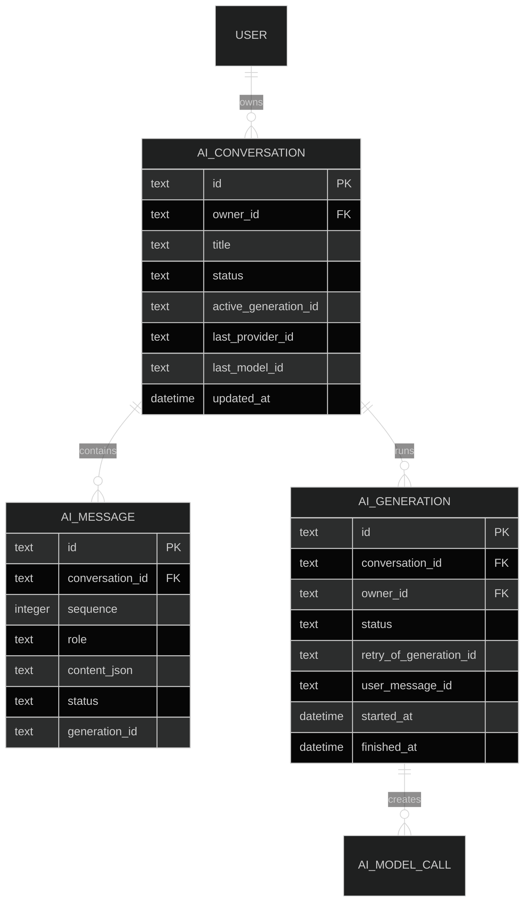
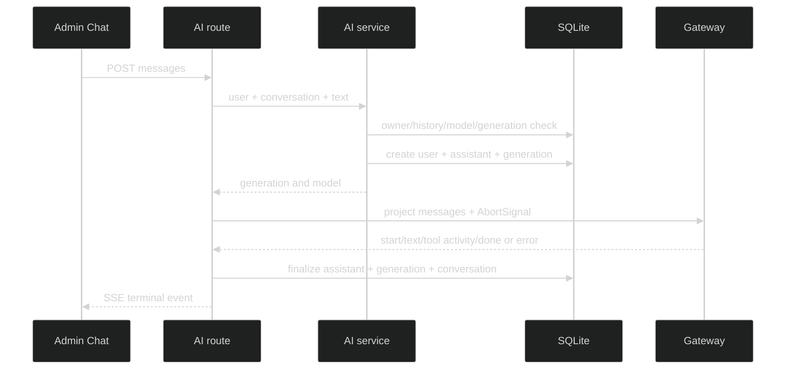

# AI 会话基础设计

## 1. 数据模型

新增 `ai_conversations`、`ai_conversation_messages`、`ai_generations` 三张表。会话和消息按 owner 访问；generation 表示一次用户发送，允许关联多个 model call。



- `ai_conversations.owner_id → user.id` 和 message/generation → conversation 使用 `ON DELETE CASCADE`。
- `active_generation_id` 是由 service 用 CAS 更新的逻辑字段，不建循环外键；generation 的 `retry_of_generation_id` 自引用使用 `ON DELETE SET NULL`。
- generation 的 `user_message_id` → message 使用 `ON DELETE CASCADE`；message 的 nullable `generation_id` 使用 `ON DELETE SET NULL`。审计表的 conversation/generation 关联使用 `ON DELETE SET NULL`，保留历史调用。
- `content_json` 只保存公开项目 DTO；assistant 文本和脱敏 tool activity 使用白名单字段，完整 tool arguments/result 不落库。
- generation 增加非空 `user_message_id` 和 nullable `retry_of_generation_id`；retry 链上的所有 generation 复用同一个 user message ID，不重复创建 user 消息。
- 中止生成时保存已收到的 assistant partial 文本并标记 `aborted`；普通下一轮把该文本作为 assistant message 放入 Context。
- retry endpoint 在同一 transaction 内确认来源是 owner 的最新失败/中止 generation，并用 `active_generation_id IS NULL` CAS 占用会话；构造 Context 时排除该 user message 对应 retry 链的所有 failed/aborted assistant。
- 首条 user 文本安全截断为标题，不调用模型生成标题。
- 固定限制最多 50 条消息、100000 个文本字符，超限返回稳定错误，不截断和摘要。

## 2. API 与 SSE

```text
POST   /api/ai/conversations
GET    /api/ai/conversations?page=1&pageSize=20
GET    /api/ai/conversations/{conversationId}
DELETE /api/ai/conversations/{conversationId}
POST   /api/ai/conversations/{conversationId}/messages   -> SSE
POST   /api/ai/conversations/{conversationId}/retry       -> SSE
POST   /api/ai/conversations/{conversationId}/generations/{generationId}/stop
```

发送顺序：认证、请求 schema、模型选择和静态上下文预检 → transaction 内重新读取 owner/model/active 状态 → 用 `active_generation_id IS NULL` 条件原子创建 generation、消息和 active ID → 注册 AbortController → SSE → 终态 transaction。预检失败不创建 generation；CAS 失败返回 409，不产生额外消息或 generation。retry 的来源检查、CAS 和新 assistant/generation 也在同一 transaction。



- 会话 route 使用 AI timeout/abort，绕过普通 API 5 秒 timeout。
- 公开 SSE 的 text/tool activity 事件统一携带 `turnIndex`、`contentIndex`、`blockId`；临时 SSE tool activity 的 `safeSummary` 不进入会话详情。
- 每次 Provider 请求前重新检查内部 Context：最多 50 个项目消息、100000 个字符，字符包含 system/user/assistant 文本、工具 arguments JSON 和 model-facing result；工具 arguments 和 result 各自最多 16000 字符，safeSummary 最多 1000 字符。超限时不再请求 Provider，generation 进入 `failed`，error code=`AI.CONTEXT_LIMIT`。
- timeout 与 abort 使用 first-cause 规则：AI deadline 先触发记 `timeout`；用户 stop 或客户端断开先触发记 `aborted`。同一事件循环 tick 内以 signal 创建顺序记录唯一 cause，后续 signal 不覆盖。
- process 内用 `Map<generationId, AbortController>` 停止当前调用；数据库状态是真实来源。
- 当前 generation 的完整 tool call/result 只在 orchestrator 内存消息中使用；持久历史只重放 user/assistant 文本，脱敏 tool activity 供 UI 展示，不回放为 SDK tool result。
- 启动时把超过允许时长的遗留 streaming/generating 记录改为 interrupted。
- 旧 generation 的 finally 只能用 `WHERE active_generation_id = currentGenerationId` 清理会话，不能覆盖新 generation。

### HTTP 与 SSE 终态

| 阶段 | 条件 | HTTP | 公开 code | 数据终态 |
| --- | --- | --- | --- | --- |
| SSE 前 | 未登录/owner 不匹配 | 401/404 | `AUTH.UNAUTHENTICATED`/`COMMON.NOT_FOUND` | 不创建 generation |
| SSE 前 | 请求 schema 无效 | 400 | `COMMON.INVALID_REQUEST` | 不创建 generation |
| SSE 前 | 显式模型不可用，或没有默认模型 | 403/503 | `AI.MODEL_NOT_ALLOWED`/`AI.NO_AVAILABLE_MODEL` | 不创建 generation |
| SSE 前 | 静态上下文超限 | 413 | `AI.CONTEXT_LIMIT` | 不创建 generation |
| SSE 前 | 会话已有 active generation，或 retry 不满足条件 | 409 | `AI.GENERATION_ACTIVE`/`AI.RETRY_NOT_ALLOWED` | 不新增记录 |
| SSE 后 | 用户 stop/客户端 abort | 200 | `AI.REQUEST_ABORTED` | assistant partial=`aborted`，generation=`aborted` |
| SSE 后 | Provider auth/upstream/timeout | 200 | `AI.PROVIDER_AUTH_FAILED`/`AI.UPSTREAM_ERROR`/`AI.UPSTREAM_TIMEOUT` | assistant/generation=`failed` |
| SSE 后 | 工具限制或动态 context 超限 | 200 | `AI.GENERATION_TOOL_*`/`AI.CONTEXT_LIMIT` | generation=`failed`，tool execution 有自身终态 |

显式模型未知、Provider 停用或未进入白名单统一返回 `403 AI.MODEL_NOT_ALLOWED`，沿用现有 `requireExplicitModel()`，不通过错误码泄漏目录存在性。`AI.MODEL_NOT_FOUND` 只保留给 Admin 管理模型目录的既有接口。


| 场景 | generation | assistant | 可 retry |
| --- | --- | --- | --- |
| 最终纯文本完成 | `succeeded` | `completed` | 否 |
| unknown/invalid/forbidden/handler failure 回填后最终文本完成 | `succeeded` | `completed`，保留脱敏 activity | 否 |
| Provider auth/upstream/timeout | `failed` | `failed` | 是 |
| 用户 stop/客户端 abort | `aborted` | `aborted` partial | 是 |
| tool timeout、tool call/round/total limit、动态 context limit | `failed` | `failed` | 是 |
| 进程启动恢复 | `interrupted` | `interrupted`，error=`AI.GENERATION_INTERRUPTED` | 是 |

stop endpoint 对 owner 的 active generation 返回 202；已终止的同一 generation 幂等返回 200，其他用户仍返回 404。SSE 开始后 HTTP status 固定为 200，后续错误只走公开 terminal event。


## 3. Admin

新增 `AiConversations.tsx` 和 `/ai/chat` 路由。列表、详情、创建、删除使用 React Query；输入和当前 Drawer 只留在组件 state。消息 SSE 使用独立 schema、generation ID 和现有 `eventsource-parser`。桌面使用左右布局，移动端会话列表进入 Drawer。

## 4. 依赖与兼容

依赖 Gateway 契约。工具任务可以向消息中追加 tool call/result。旧 `/settings/ai` 模型偏好和一次性测试页面继续保留。
