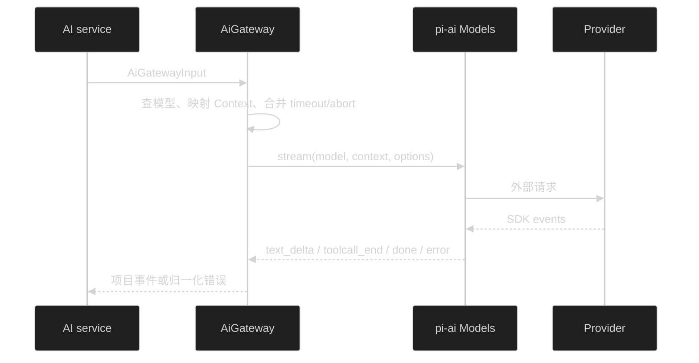

# AI Gateway 消息契约设计

## 1. 类型边界

`packages/contracts/src/ai.ts` 定义项目 DTO：

- `AiConversationMessage`、持久化 `AiToolActivity`、临时 `AiToolActivityEvent` 和公开 SSE event：位于 `packages/contracts`。持久化 DTO 只包含文本和脱敏工具状态，临时 event 可以额外包含受限 safeSummary。
- `AiModelMessage`、`AiModelToolDefinition`、`AiModelToolCall`、`AiModelToolResult`：位于 API infra 的项目类型文件，保存当前 generation 调用 SDK 所需内容，但不包含 SDK 类型。
- `AiModelContentBlock` 统一携带 `turnIndex`、`contentIndex`、`blockId`；text 和 tool call 都使用同一排序字段。
- `AiModelToolCall`：`{ type: 'tool_call', id, name, arguments: unknown }`。
- `AiModelToolResult`：`{ role: 'tool_result', toolCallId, toolName, content, isError }`。
- `AiToolActivity`：`{ type: 'tool_activity', toolCallId, name, status, errorCode }`，只用于持久化和公开读取。
- `AiToolActivityEvent`：在 activity 基础上增加 `turnIndex`、`contentIndex`、`blockId`、nullable safeSummary；只用于当前 SSE。
- `AiGatewayInput`：API infra 内部类型，包含 model ref、system prompt、内部 messages/tools、sessionId、`turnIndex` 和 `AbortSignal`。
- `AiGatewayEvent`：`text_delta` 和结构一致性已确认的 `tool_call_completed` 事件包含 `turnIndex`、`contentIndex`、`blockId`；`completed` 只包含 `turnIndex`，其 assistant message blocks 自带三字段。实时 text delta 保留 SDK 到达顺序，避免跨 block 缓冲阻塞；completed 事件包含按 final assistant message block 顺序映射的项目 assistant message、stop reason 和 usage/cost。工具 call 事件先缓存，只有 completed 的 stop reason 为 `tool_use` 且 final assistant message 通过结构一致性校验后才交给 orchestrator。参数 schema 校验由工具执行层在调用 handler 前完成。
- `AiGatewayError`：包含 error code、stop reason、nullable usage/cost；只携带项目安全字段。`kind` 只在 infra 内部使用，由 service 映射到现有 `ApiErrorCodes`。
- `AiUsage` 和 `AiCost`：项目字段；cost 明确标识为 `USD` 估算，不暴露 SDK cost 对象。

`apps/api/src/infra/ai/ai-tool-schema.ts` 提供唯一 Zod → JSON Schema → `pi-ai Tool.parameters` 适配函数。业务层只传 Zod schema，不创建 TypeBox schema 或导入 SDK 类型。

## 2. Gateway 流程

- route/service 拥有 `start` 事件，因为 request ID 和最终 model 由业务层确定。
- SDK `toolcall_end` 只进入 Gateway 缓存；收到 SDK `done` 后先校验 final assistant message 的调用 ID、名称、参数和值一致，再依 final block 顺序产出 `tool_call_completed`，最后产出 completed。这里不执行参数 schema 校验；orchestrator 必须等 completed 成功且 stop reason 为 `tool_use`，并在调用 handler 前完成 schema 与权限校验。
- `done` 时把 SDK final assistant message 转换成项目 `AiModelMessage`，以内容块顺序作为持久化投影和工具循环的唯一依据；SDK 原始对象仍不离开 infra。
- `thinking_*`、SDK partial、Provider payload 和原始错误全部丢弃；SDK final assistant message 转换完成后也不继续传递或保存原始对象。
- error 由 Gateway 抛出归一化 `AiGatewayError`，包含已知的部分 usage/cost；service/route 负责生成一次项目错误终态，避免重复 SSE error。
- usage 缺失字段为 null；0 保留为 0。

## 3. Cost 语义

当前锁定的 `pi-ai@0.84.1` README 把模型目录价格定义为美元计价。infra adapter 因此把 SDK cost 投影为 `{ currency: 'USD', ... }`，并用契约测试固定；升级依赖时必须重新核对该文档，无法确认时 currency 和 cost 均返回 null，不在业务层猜测。

## 4. 兼容旧接口

`prepareTest()` 把旧 prompt 转成一条 user text message，不传 tools、system prompt 和 session ID。旧 route 继续拥有 `start` 和旧 `AiTestStreamEvent` 映射。现有 `/api/ai/test` 的 HTTP/SSE 行为不变。

## 5. 失败处理

- `ModelsError` auth/oauth → `auth`。
- timeout signal → `timeout`。
- 调用方或 Provider abort → `aborted`。
- 未知 model → `model_not_found`。
- 其他 Provider/stream 错误 → `upstream`。
- SDK `deferred` stop reason 不作为成功 stop，转为稳定 unsupported/upstream 错误。

## 6. 测试

使用 `fauxProvider()` 验证 system prompt、消息顺序、turnIndex/contentIndex/blockId、工具调用缓存、completed final assistant message、usage/cost、thinking 丢弃、错误（含部分 usage/cost）和取消。另用现有 fake Gateway 验证旧 API 兼容。
