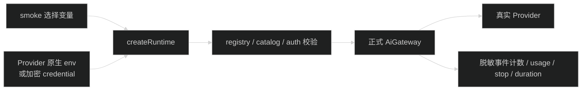

# 真实 AI Provider smoke 设计

## 1. 命令边界

新增 API 包独立命令：

```bash
pnpm --filter @starter/api ai:provider-smoke
```

命令使用 `dotenv -e .env.development`。`AI_SMOKE_PROVIDER_ID`、`AI_SMOKE_MODEL_ID`、check auth、refresh models 和 timeout 是选择变量；`AI_SMOKE_PROMPT` 是敏感调用输入，只从环境变量读取且绝不输出。Provider secret 继续使用 Provider 原生环境变量或现有加密 CredentialStore。



runner 不导入 Provider SDK，不直接调用 `streamSimple()`，不输出 prompt 和文本 delta 内容。

## 2. 执行语义

- 成功 exit code 0；配置、认证、timeout、cancel、upstream 分别输出稳定分类并返回非 0。
- provider/model 在调用前按 runtime registry/catalog 校验。
- `AI_SMOKE_CHECK_AUTH=true` 时只输出规范化 auth source/type。
- `AI_SMOKE_REFRESH_MODELS=true` 时只对支持动态目录的 Provider刷新；静态 Provider 显示 skipped。
- OAuth 登录仍由 `ai:auth` 完成，smoke 不接收 access/refresh token。
- runner 属于诊断 CLI，不经过产品 `AiInvocationRunner`，不写 `ai_model_calls` 或 `ai_tool_executions`；它没有登录用户，结果只进入脱敏 stdout/stderr。

## 3. 自动测试和真实验证

自动测试注入 fake Gateway，并在 infra 层使用 faux Provider 验证正式 Gateway 事件。默认 `pnpm test` 不发网络请求。真实 smoke 只由开发者显式执行；没有凭据时报告未验证，不替换成假成功。

安全测试预置 secret、prompt、response marker，扫描 stdout、stderr 和 logger，均不能出现。真实 CI 只能通过受保护的手动 job 使用独立临时数据库，不上传输出、数据库和日志 artifact。
