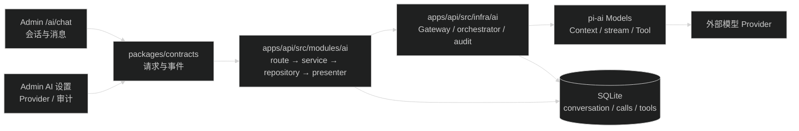
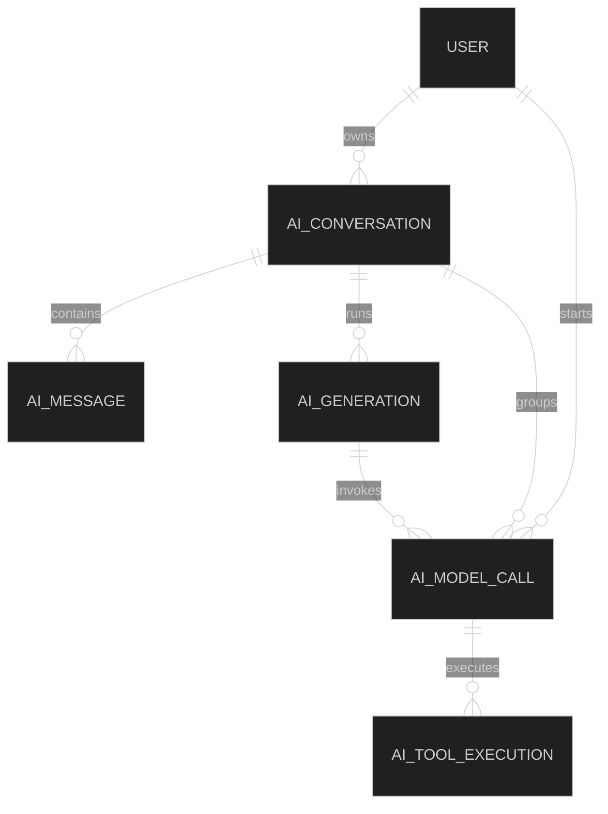

# AI runtime 与应用能力设计

## 1. 设计结论

本任务把现有 AI 配置模块扩展成“项目消息契约 → API AI service → AI runtime/Gateway → pi-ai Provider”的调用结构。会话、工具和审计都由 API 负责状态，Admin 只负责请求和展示。

`@earendil-works/pi-ai` 继续只出现在 `apps/api/src/infra/ai/`。`packages/contracts` 保存跨 API/Admin 的可序列化 DTO；数据库 record、handler、AbortSignal、Zod runtime schema 和 SDK 类型留在 API。

## 2. 模块边界

- `packages/contracts/src/ai.ts`：新增公开消息、会话、generation、脱敏工具活动、调用审计 DTO、query schema 和稳定 error code。
- `apps/api/src/infra/ai/ai-gateway.types.ts`：定义项目自己的内部 model message、tool definition/call/result、Gateway 输入和事件；可以保存当前 generation 所需的完整工具上下文，但不向 Admin 返回。
- `apps/api/src/infra/ai/ai-gateway.ts`：只负责项目消息与 SDK Context 的转换、流事件映射、超时和取消。
- `apps/api/src/infra/ai/ai-tool-registry.ts`：API 内部工具定义和 handler，不向 contracts 暴露函数。
- `apps/api/src/modules/ai/ai.service.ts`：模型选择、用户资源边界、generation 生命周期和业务错误。
- `apps/api/src/modules/ai/ai.repository.ts`：AI 表查询、owner 条件、分页和短事务。
- `apps/api/src/modules/ai/ai.presenter.ts`：逐字段生成 DTO，不直接返回数据库 record 或 JSON。
- `apps/admin/src/features/ai/`：聊天、Provider、偏好和用量页面；不保存业务消息副本到 localStorage/Zustand。

## 3. 数据关系

- 会话和消息属于用户，用户删除时级联删除。
- generation 表示一次用户发送及其可能的多轮模型/工具调用。
- model call 表示一次实际 Provider 请求；返回 `tool_use` 的请求仍以 `succeeded` 结束，后续工具失败写入 generation 和 tool execution，不反写 model call。
- tool execution 关联触发它的 model call，只存工具名称、状态、耗时和稳定错误分类。
- 审计记录不因删除会话而级联删除；会话关联使用 nullable reference 或逻辑 ID，保留审计历史。

## 4. 执行顺序

1. Gateway 契约：不改表，保留旧 `/api/ai/test` 适配。
2. 会话：新增 conversation、message、generation 表和用户聊天接口。
3. 用量审计：在会话 migration 已存在后新增 model call、tool execution 表和独立读取权限；conversation/generation 外键使用 `ON DELETE SET NULL`。
4. 工具循环：消费 Gateway、会话 generation 和审计 coordinator；不新增数据库表，生产 registry 保持为空，测试通过注入工具。
5. Provider smoke：使用正式 runtime/Gateway，提供人工执行脚本和脱敏输出。
6. 父任务集成：覆盖多轮会话、工具事件、审计终态和旧接口兼容。

子任务使用显式依赖顺序：Gateway → conversation migration → usage migration → tool integration；smoke 只依赖 Gateway。每个任务只引用已经完成的表和契约。

## 5. 兼容与运行限制

- 旧 `/api/ai/test` 保留 `{ model?, prompt }` 和现有 SSE 事件；HTTP session 认证、请求校验和模型解析在调用前失败时不创建 model call，进入真实 Gateway 后的 Provider 认证失败会创建失败记录。
- 会话 SSE 使用独立事件 schema，不把旧测试事件扩展成万能联合。
- 会话 route 绕过普通 `/api/*` 的 5 秒 timeout，使用 AI 请求 timeout 和 abort signal；普通 JSON 接口仍使用现有 timeout。
- 消息数和字符数在落库前检查，第一版固定为最多 50 条消息、100000 个文本字符，不自动摘要和截断。
- cost 显示为 `pi-ai` 根据模型目录计算的 USD 估算值，不称为 Provider 账单。
- 审计 begin/finalize 失败不改变已经产生的模型响应；安全错误通过结构化日志记录。
- 诊断用 `ai:provider-smoke` 直接调用正式 Gateway，但不经过产品 invocation runner，也不写 `ai_model_calls`；它没有登录用户，结果只进入脱敏 CLI 输出。
- 第一阶段单 Node 进程维护 generation AbortController map，并在启动时恢复遗留 running 记录；多实例取消协调另建任务。

## 6. 回滚

- Gateway 先保持旧接口适配，出现问题可以停止新会话 route，不影响 Provider 配置和模型测试。
- 会话、审计和工具表只追加 migration，不修改既有 AI 表，应用回滚时保留新增表。
- Admin 新页面和导航可以独立隐藏；API 旧接口继续可用。
- 真实 smoke 不进入默认测试、构建和 CI，失败不会阻塞常规发布。
