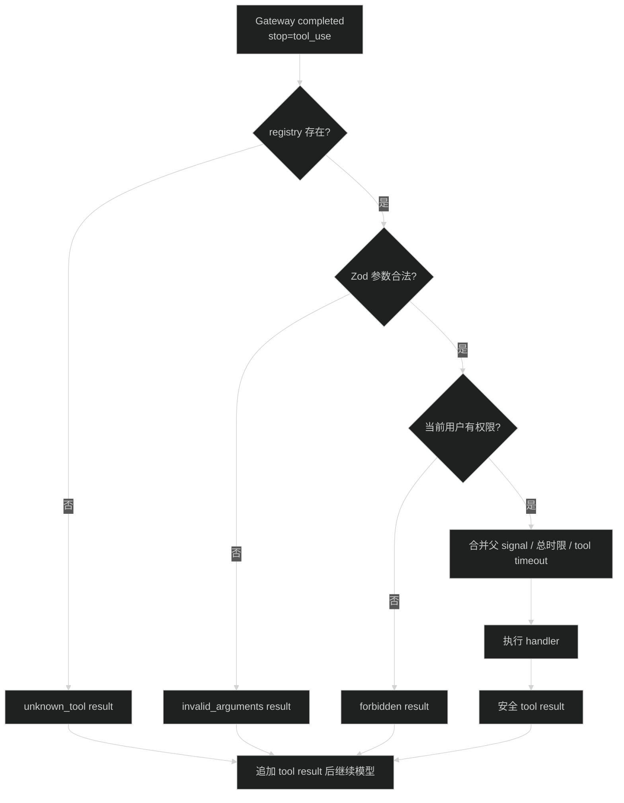

# AI Tool calling 与执行循环设计

## 1. 运行时组件

- `AiToolRegistry`：不可变 Map，构造时检查重复名称、schema、timeout 和 permission。
- `RegisteredAiTool<T>`：项目定义、Zod 输入 schema、timeout、required permission 和 handler。
- `AiToolOrchestrator`：控制模型轮次、工具数量、权限、执行、总时限和事件；每轮通过 `AiInvocationRunner` 发起 Provider 请求并取得 nullable `modelCallId`。
- `AiGateway`：只发送工具定义并返回完整 tool call，不执行 handler。

生产 `createRuntime()` 默认使用空 registry。测试通过 `RuntimeDeps` 注入确定性工具，不根据 `APP_ENV` 自动注册。

## 2. 预算

服务端固定第一阶段限制，客户端不能覆盖：

- 最多 4 个包含 tool call 的工具轮次；完成工具后允许再发起 1 次最终纯文本模型调用，因此最多 5 次 Provider 请求。
- 每轮最多 8 个 tool call。
- 整个 generation 最多 120 秒。
- 每个工具自己的 timeout 必须在 100 到 30000 毫秒内。

- Gateway 只有在收到成功 completed、`stopReason = tool_use` 且 final assistant message 与缓存 tool call 一致后，才把本轮 call 交给 orchestrator；`toolcall_end → error/deferred/aborted` 不执行工具。
- Gateway 返回 `tool_use` 后，该次 model call 以 `succeeded` 和对应 stop reason 结束；后续工具失败不反写 model call。
- 同一轮多个合法工具并行执行，但结果按模型原 call 顺序追加。超出单轮数量时一个 handler 都不执行。单工具 timeout、用户取消或总时限结束会停止循环；未知工具、参数错误、权限拒绝和普通 handler 失败先生成安全 tool result，再按预算决定继续或终止。
- orchestrator 为每次 Provider 请求分配从 0 开始的 `turnIndex`；Gateway 的 `contentIndex` 只表示该轮内部内容块。公开 assistant 消息按 `(turnIndex, contentIndex)` 聚合文本和 tool activity，客户端实时看到中间轮文本，数据库保存聚合后的公开内容。

- orchestrator 把当前轮 `modelCallId` 交给 tool audit begin；ID 为 null 或审计 begin 失败时只写安全日志，handler 仍按主流程执行且不会产生孤立 tool execution。

统一错误码为封闭枚举：`AI.TOOL_NOT_FOUND | AI.TOOL_INVALID_ARGUMENTS | AI.TOOL_FORBIDDEN | AI.TOOL_FAILED | AI.TOOL_TIMED_OUT | AI.TOOL_CANCELLED`。model-facing result、`AiToolActivity`、`AiToolActivityEvent` 和 `ai_tool_executions.error_code` 共用该 `AiToolErrorCode`；不使用自由字符串。

AiToolExecutionStatus 固定为：`running | succeeded | not_found | invalid_arguments | forbidden | failed | timed_out | cancelled | interrupted`。

统一状态、公开 code 和 generation 影响：

| 条件 | tool execution | model-facing code | generation/公开终态 |
| --- | --- | --- | --- |
| 未注册 | `not_found` | `AI.TOOL_NOT_FOUND` | 回填模型；最终文本成功时 generation=`succeeded` |
| 参数无效 | `invalid_arguments` | `AI.TOOL_INVALID_ARGUMENTS` | 回填模型；最终文本成功时 generation=`succeeded` |
| 权限拒绝 | `forbidden` | `AI.TOOL_FORBIDDEN` | 回填模型；最终文本成功时 generation=`succeeded` |
| handler 普通失败 | `failed` | `AI.TOOL_FAILED` | 回填模型；最终文本成功时 generation=`succeeded` |
| 单工具 timeout | `timed_out` | `AI.TOOL_TIMED_OUT` | 终止，generation public=`AI.TOOL_TIMED_OUT`，retryable=true |
| 用户/父 signal 取消 | `cancelled` | `AI.TOOL_CANCELLED` | 终止，generation public=`AI.REQUEST_ABORTED`，retryable=true |
| call/round/total limit | 不伪造记录 | 无 | 终止，分别为 `AI.GENERATION_TOOL_CALL_LIMIT`、`AI.GENERATION_TOOL_ROUND_LIMIT`、`AI.GENERATION_TOOL_TOTAL_TIMEOUT`，retryable=true |

model-facing status `unknown_tool/aborted` 只作为内部兼容状态，必须分别映射到 canonical execution status `not_found/cancelled`；四层使用的 `errorCode` 始终是上面的 `AiToolErrorCode`。可恢复错误的 `AiToolActivityEvent` 不是 generation terminal event。
- `AI.GENERATION_TOOL_ROUND_LIMIT`、`AI.GENERATION_TOOL_CALL_LIMIT`、`AI.GENERATION_TOOL_TOTAL_TIMEOUT` 属于 generation 公开终态，不伪造一条 tool execution。

## 3. 安全边界

- tool arguments 在完整 `toolcall_end` 后仍视为 `unknown`，必须经过项目 Zod schema。
- 当前 generation 内存中的 `AiModelMessage` 可以保存完整 tool call arguments 和 model-facing result，供下一轮模型使用；它们不写 SQLite，不进入公开 SSE/REST DTO。
- 持久化 `AiToolActivity` 只包含 toolCallId、name、status 和 errorCode。
- 临时 `AiToolActivityEvent` 额外包含 `turnIndex`、`contentIndex`、`blockId` 和 nullable safeSummary；safeSummary 最多 1000 字符，只供当前 SSE 页面展示，第一阶段不写数据库，刷新后不恢复。
- 不把 `validateToolCall()` 原始异常写入响应或日志，因为其中可能包含完整参数。
- handler 只收到 user ID、request ID、AbortSignal 和已校验输入。
- model-facing result 由 handler 显式返回文本；审计只保存工具名、状态、耗时和稳定错误分类。
- safeSummary 是与 model-facing result 分开的显式字段，必须通过公开 schema 和长度限制；第一阶段只发当前 SSE，不持久化。

## 4. 会话和审计

一次 generation 可以包含多次 model call。每轮完整 assistant tool call 和 tool result 只追加到当前 orchestrator 内存 Context；会话保存脱敏 tool activity 和各轮 assistant 文本。收到成功 completed 后，对每个未超量的完整 tool call 先尝试 begin 审计，再做 registry/schema/permission 判断，因此 `not_found`、`invalid_arguments`、`forbidden` 也有终态记录。modelCallId 缺失或审计写失败时只记安全日志。

并行执行时，每条已 begin 记录都必须 finalize：触发 timeout 的记录为 `timed_out`，被父 signal 或兄弟终态取消的记录为 `cancelled`，进程启动恢复遗留 `running` 为 `interrupted`。tool begin/finalize 失败不改变 handler 或 generation 结果。

## 5. 测试

使用 faux Provider 和测试注入 registry。测试工具覆盖成功、`toolcall_end` 后 error/deferred、未知、参数错误、权限拒绝、普通失败、timeout、cancel、并行兄弟取消、interrupted 恢复、每轮数量、轮数、动态上下文上限和总时限。默认生产 registry 必须断言为空。
