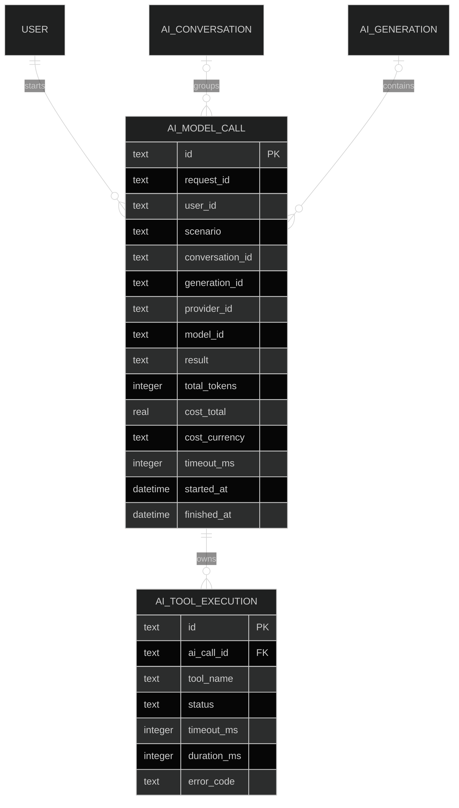
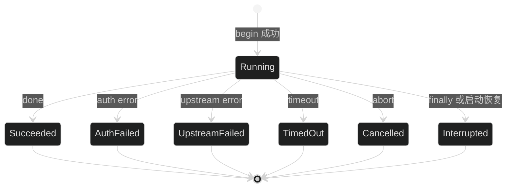

# AI 用量与调用审计设计

## 1. 数据模型



`ai_model_calls` 一行表示一次 Provider 请求，不表示整次用户发送。request ID 和 generation ID 可以关联工具循环中的多轮调用。表中不提供 prompt、response、credential、raw error、tool arguments 和 tool result 列。

model call status：`running | succeeded | auth_failed | upstream_failed | timed_out | cancelled | interrupted`。Provider 返回 `tool_use` 的请求记录为 `succeeded`，stop reason 单独保存；工具失败不修改这行，而写入 `ai_tool_executions` 和 generation error code。

tool execution status：`running | succeeded | not_found | invalid_arguments | forbidden | failed | timed_out | cancelled | interrupted`。有 modelCallId 时，每个未超量完整 tool call 都先 begin，再按 registry/schema/permission/handler 结果 finalize。

`ai_tool_executions.ai_call_id` 非空并关联触发它的 model call。`AiInvocationScope.modelCallId` 因审计 begin 失败为 null 时跳过 tool execution 审计，只写安全日志，handler 和模型主流程继续。

usage 保存 input、output、cache read/write、cache write 1h、reasoning 和 total token。cost 只复制 Gateway 按锁定 `pi-ai` 文档投影出的 USD 估算，不在 service/repository 重新计算；UI 文案使用“SDK 估算成本”。依赖升级后无法重新确认币种时，currency 和 cost 保持 null。


## 2. 记录生命周期



- coordinator 在进入实际 Gateway 前 best-effort `begin()`，返回 `AiInvocationScope { modelCallId: string | null }`。
- `/api/ai/test` 和会话 route 在身份、输入、模型白名单和 Provider 状态校验通过后统一使用 `AiInvocationRunner`；这些调用有登录用户。诊断 smoke 不使用 runner，也不写产品审计。
- `AiInvocationRunner` 负责把 scope 和 Gateway 流绑定；orchestrator 每轮拿到该 scope 的 nullable modelCallId。ID 存在时创建 tool execution，ID 缺失时跳过工具审计并写安全日志。
- `finalizeOnce()` 使用 `WHERE id = ? AND result = 'running'`，避免 catch/finally 重复写终态。
- begin/finalize 失败只写 `ai.audit.write_failed` 安全日志，不改变 SSE/HTTP 结果。
- 认证失败、超时、取消和上游失败的 model call 进入对应终态。工具 `not_found`、参数错误、权限拒绝和普通 handler 失败只写 tool execution；若后续模型正常完成，generation 保持 succeeded 且 error code 为 null。只有工具 timeout、用户取消、预算或动态 context 限制终止 generation 并写对应稳定 code。
- 本任务建立 tool execution schema、repository 和 coordinator API；实际 handler 边界接入由后续工具执行任务完成。
- model call 的 effective timeout 为 `min(AI_REQUEST_TIMEOUT_MS, generationRemainingMs)`；不属于 generation 的 `/api/ai/test` 使用 `AI_REQUEST_TIMEOUT_MS`。
- tool audit 在 registry/schema/permission 判断前 begin：先只按名称读取 timeout 元数据，未知名称使用固定 5000ms；已注册工具使用 `min(registeredTool.timeoutMs, generationRemainingMs)`。该 effective timeout 持久化到 `timeout_ms`，未知、非法和无权限调用都立即 finalize。
- 启动恢复只处理 `startedAt + timeoutMs + 5000 < now` 的 running model call/tool execution；generation 使用固定 `120000 + 5000` cutoff。刚创建且未超过 cutoff 的记录保持不变。
- finalize 失败时如果内存已观察到 Provider/tool 终态，当前请求不再把记录改成 interrupted，记录保持 running 并由上述 stale cutoff 在后续恢复；只有未观察到任何终态时才由 finally 尝试写 interrupted。
- 本任务不实现自动保留期和清理命令；部署方监控 SQLite 文件大小。

## 3. API 与权限

新增独立 `ai:usage:read`：

```text
GET /api/ai/admin/calls
GET /api/ai/admin/calls/{callId}
```

列表支持 page、pageSize、userId、providerId、modelId、result、requestId、from、to 精确筛选，按 `started_at DESC, id DESC`。详情逐字段返回 call、usage、cost 和工具摘要。

## 4. Admin

新增 `/settings/ai/usage`。页面包含筛选、分页表格和详情 Drawer。没有权限时菜单、标签和直接 URL 都不可用；API 是最终权限边界。成本为 null 显示 `-`，0 显示 0。

## 5. 删除和隐私

会话删除时，`ai_model_calls.conversation_id` 和 `generation_id` 使用 `ON DELETE SET NULL`；`user_id` 是不建外键的历史标识，用户删除不改写旧审计。`ai_tool_executions.ai_call_id` 使用 `ON DELETE CASCADE`。本任务 migration 明确依赖会话 migration 已执行。审计读取只返回用户 ID，不返回邮箱、姓名、消息内容或 safeSummary。

