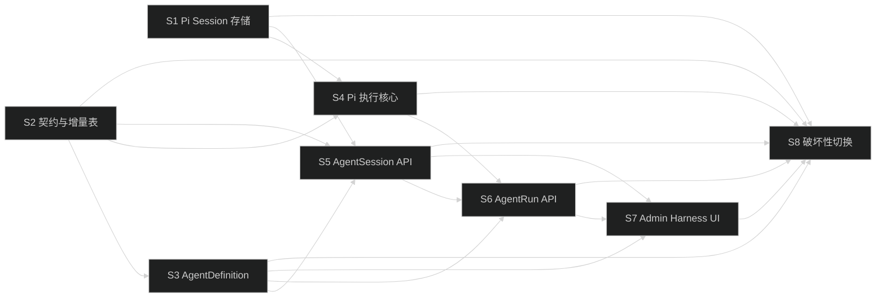
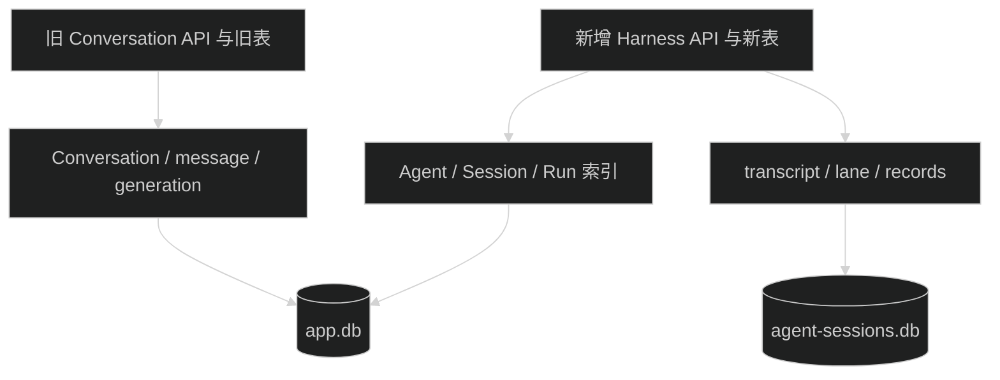
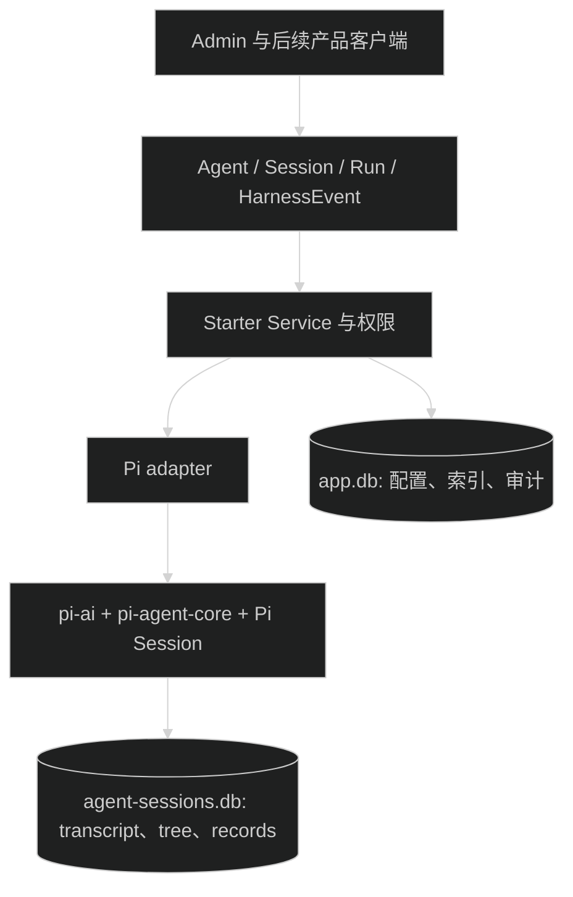

# Pi Agent Harness 父任务设计

## 1. 设计结论

父任务不实现产品代码。八个子任务按“基础设施 -> 契约与表 -> 可管理 Agent -> 执行核心 -> Session -> Run -> Admin -> 删除旧实现”的顺序推进。

最终架构沿用原规划：Pi 保存 Agent 运行事实，Starter 保存业务索引、权限和公开协议。拆分只改变实施顺序，不改变最终对象、数据归属或破坏性切换结果。

## 2. 任务依赖

S1 和 S2 可以依次完成，也可以在不同工作分支规划，但进入 S3 至 S7 前必须都已归档。S8 不依赖树的位置推断状态，启动前必须逐项检查 S1 至 S7 的 `task.json.status`。

## 3. 中间状态

S1 至 S7 的中间状态遵守以下限制：

- 两套入口有各自的模型调用路径，不共享运行状态。
- 主库可以同时包含旧表和新表，但不存在从旧表到新表的复制任务。
- `ai_model_calls` 在增量阶段同时保留旧关联列和 nullable `runId`。旧调用只写旧列，新调用只写 `runId`。
- 新 Session store 从空库开始，任何子任务都不得导入旧 Conversation message。
- Admin 可以暂时同时保留 Conversation 页面和 Harness 调试页面；两个页面使用不同 query key 和 API client。

## 4. 最终架构

依赖边界：

- Route 只依赖 contracts 和 Service，不导入 Pi 类型。
- Service 通过窄 port 调用 Executor 和 Session Store。
- Pi adapter 不依赖 Hono Context 或前端 DTO。
- contracts 不依赖 Pi、Drizzle、Hono 或 Node.js API。
- Admin 不读取 Pi SQLite 或进程内 active Run。

## 4.1 跨子任务契约

`.trellis/tasks/08-17-pi-agent-harness-foundation/research/harness-contracts.md` 是 S1 至 S7 的共享契约基准，固定公开 DTO、transcript union、HarnessEvent envelope/data、`starter.run.v1`、错误码、数据库列和迁移约束。

- S2 实现本文中的 schema、DTO、错误码和主库结构；后续任务不重复定义字段。
- S3 至 S7 的输入、输出、事件和恢复逻辑必须引用本文中的名称和状态。
- 发现 Pi API 或现有代码与契约不一致时，暂停当前子任务，先修改共享契约并重新评审依赖任务。

运行生命周期的唯一所有者如下：

- Run Service 负责 owner/Agent 校验、registry reserve/attach/release、Run row、EventSequencer、`starter.run.v1` 和终态更新。
- Executor 负责读取 Session context、运行 Pi Agent、写 user/assistant/Tool/compaction entries、映射 message/tool 事件并返回 terminal result。
- Run Route 只订阅 Run Service 的事件；SSE 断开只删除订阅者。

## 5. 子任务责任

### S1 Pi Session 存储

只负责依赖、env、Session repository adapter、生命周期和隔离测试，不创建业务表或公开 HTTP API。

### S2 契约与增量表

新增 Harness contracts、错误码、事件和三张业务索引表。旧 contracts、旧表和旧关联列继续保留，使现有调用方不需要同步修改。

### S3 AgentDefinition

完成 Agent 配置的 CRUD、revision、状态、权限、资源引用解析和 Admin 管理，不启动 Agent Run。

### S4 Pi 执行核心

完成 `AgentExecutor`、Pi event 映射、Tool adapter、active registry 和 Run 审计。它只提供应用层 port，不注册 Run Route。

### S5 AgentSession API

协调主库业务索引与 Pi Session store，完成 Session CRUD、归属和 transcript 投影，不启动模型调用。

### S6 AgentRun API

组合 S3 至 S5，完成 Run 生命周期、SSE、abort、steer、follow-up、并发控制和启动恢复。

### S7 Admin Harness UI

新增 Agent Session/Run 调试入口。旧 Conversation 页面继续保留到 S8，避免提前破坏现有管理功能。

### S8 破坏性切换

删除旧代码和 UI，执行最终 destructive migration，更新审计字段和静态检查。此任务不新增 Harness 功能。

## 6. Migration 策略

拆为两次 migration：

1. S2 生成增量 migration：创建 `ai_agent_definitions`、`ai_agent_sessions`、`ai_agent_runs`，给 `ai_model_calls` 增加 nullable `runId`、`agent_run` scenario、索引和旧/新关联互斥 check。不删除旧表或旧列。
2. S8 生成 destructive migration：重建 `ai_model_calls`，只保留 nullable `runId`；删除 generation、message、conversation 表。

两次 migration 都必须在临时数据库实跑。S8 的 fixture 必须含旧 Conversation 数据、新 Harness 数据、配置和审计数据，验证只删除约定范围。

## 7. 发布与回滚

- S1 至 S7 都是增量改动，可以单独回滚自己的文件和 migration，不删除已有数据。
- S8 migration 应用前可以恢复旧代码。
- S8 migration 应用后旧 Conversation 数据不可恢复；回滚只能重新创建空的旧 schema，不能找回记录。
- 实际运行 S8 migration 前，必须输出目标数据库绝对路径和旧三表记录数。

## 8. 共同风险

| 风险 | 处理 |
| --- | --- |
| 中间状态变成长期双 runtime | S8 是父任务完成的硬条件；父任务未通过旧代码静态删除检查不得归档 |
| 新旧调用同时写两组审计关联 | S2 定义字段互斥规则，S4 和旧测试分别断言写入结果 |
| 子任务修改超出边界 | 每个子任务只按自己的 PRD 修改；跨边界需求回到父任务重新规划 |
| 两个数据库不一致 | S5、S6 分别实现补偿、terminal entry 和启动修复 |
| Pi 内部类型进入公开协议 | S2 schema 测试和 S8 静态搜索共同检查 |
