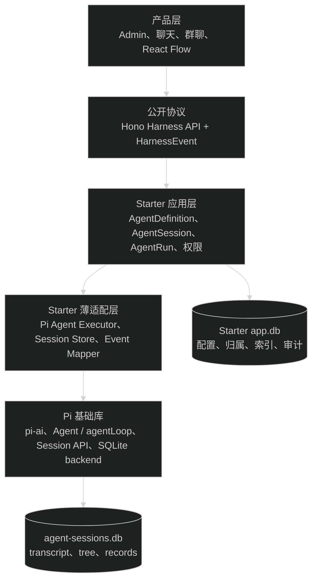
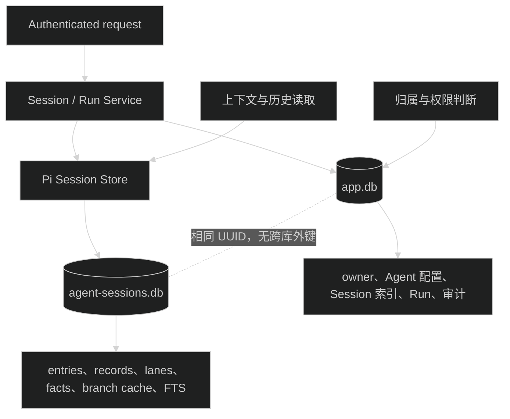
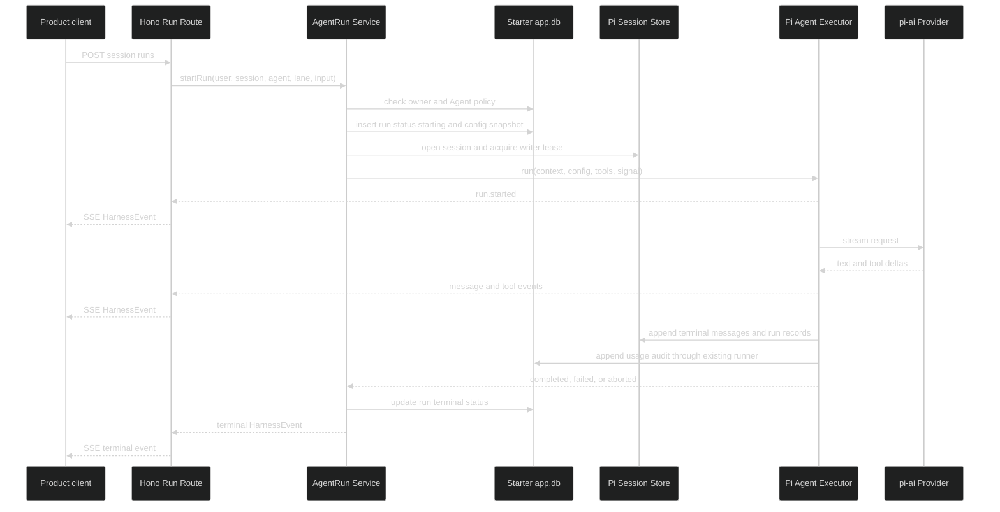
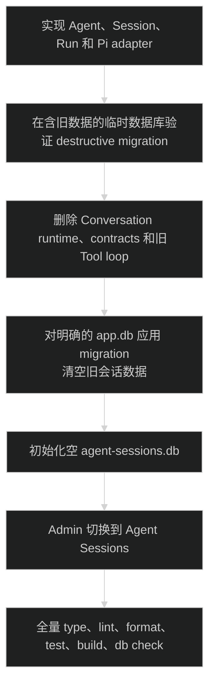

# Starter AI 直接重构为 Agent Harness 详细设计

## 1. 设计结论

Starter 不自行实现完整 Harness，也不直接使用 Pi 当前未完成的 `AgentHarness` 类。第一版采用以下组合：

- `@earendil-works/pi-ai`：模型、Provider、认证和 stream。
- `@earendil-works/pi-agent-core`：`Agent`、`agentLoop`、Tool、运行事件、Session API 和 compaction。
- `@earendil-works/pi-session-backend-sqlite-node`：Session migration、append-only entries/records、tree、lane、branch cache、writer lease 和 FTS。
- Starter：Better Auth、AgentDefinition、权限、业务索引、Pi adapter、Hono/OpenAPI/SSE、DTO 和 Admin 管理。

核心边界是“Pi 保存 Agent 运行事实，Starter 保存产品业务索引”。现有 Conversation runtime、API、contracts、数据表和 Admin 调用会在同一任务中删除并直接切换到 Harness，不保留兼容层。聊天、群聊和节点图只调用 Harness API，不进入 Harness 核心对象。

## 2. 项目类型

项目类型：`mixed`。

- `apps/api` 是 Web API 和 Agent 产品入口。
- `apps/admin` 是 Provider、Prompt、Skill、AgentDefinition、Session/Run 调试和审计的管理端。
- `apps/web` 或后续独立前端可以作为 Agent 产品入口。
- `packages/contracts` 在 API 与多个前端之间共享协议。
- Pi packages 提供 tool-agent runtime 和 Session store。

本设计不新增 workspace package。Agent runtime 目前只由 `apps/api` 使用，先留在 API 的 infra 和 module 内；出现第二个服务端入口后再评估提取 `packages/agent-runtime`。

## 3. 依赖选择

| 层 | 采用 | 不采用 | 原因 |
| --- | --- | --- | --- |
| 模型层 | `pi-ai` | 新模型抽象 | 当前 Gateway 已基于 Pi，继续复用 Provider 和 stream |
| 单 Agent runtime | Pi `Agent` / `agentLoop` | 自写循环 | Pi 已处理工具、steering、follow-up、abort 和事件 |
| Session | Pi Session API | 自写 reducer | Pi 已处理 tree、lane、branch、records 和 compaction |
| Session 持久化 | Pi SQLite backend | Drizzle 重写 Pi 表 | 保留 Pi migration、cache、FTS 和 writer lease |
| Web transport | Hono + OpenAPI + SSE | `pi-server` protocol | Starter 已有鉴权、envelope、RPC type 和前端请求链 |
| 产品 Agent | 自有 `AgentDefinition` | `pi-coding-agent` | Coding Agent 绑定 cwd、编码工具、CLI 和资源目录 |
| Agent Graph | 后续 adapter | 本期自写 DAG | Pi 不含 Graph；需要时优先评估 LangGraph |

## 4. 系统边界



依赖约束：

- Route 只依赖 contracts 和 Service，不导入 Pi package。
- Service 依赖窄 port，不读取 Pi SQLite 内部表。
- Pi adapter 可以依赖 Pi package，但不能依赖 Hono Context 或前端 DTO。
- `packages/contracts` 不依赖 `apps/api`、Pi、Drizzle 或 Node.js API。
- Admin、Web 和未来产品端不直接操作 Session database 或 runtime 内存对象。

## 5. 核心对象

### 5.1 AgentDefinition

`AgentDefinition` 是可复用执行配置，不是聊天好友或图节点。

持久字段：

- `id`
- `name`、`description`
- `status`: `draft | enabled | disabled`
- `revision`: 每次修改执行配置时递增
- `configJson`: 带 `schemaVersion` 的模型策略、Prompt、Skill、Tool 和限制引用
- `createdBy`、`createdAt`、`updatedAt`

`configJson` 只保存引用和运行参数，不保存 API key、Provider secret 或完整 Prompt 副本。Run 开始时解析引用，并保存无 secret 的配置快照。

第一版的 AgentDefinition 全部由 Admin 管理，普通用户只能读取已启用 Agent。暂不增加 `scope`、`ownerId` 或用户创建 API；未来出现用户自建 Agent 的产品需求时，再增加所有权表和对应权限，避免先放没有写入流程的字段。

### 5.2 AgentSession

`AgentSession` 是持久上下文容器：

- 归属于一个 Starter 用户。
- 可以设置 `defaultAgentId`，但每个 Run 仍可显式选择其他 Agent。
- 默认 lane 为 `main`。
- 不保存好友、房间、节点位置或 React Flow edge。
- transcript、tree、lane、compaction 和自定义 records 以 Pi Session store 为准。

同一个 Session 允许不同 Agent 依次执行。每个 assistant message 的 Agent 身份通过 `starter.run.v1` record 和 Run index 关联，不修改 Pi message role。

### 5.3 AgentRun

`AgentRun` 是一次可审计执行：

- `id`、`sessionId`、`agentId`、`lane`
- `status`: `starting | running | completed | failed | aborted | interrupted`
- `agentRevision`、`configSnapshotJson`
- `requestId`、`startedAt`、`finishedAt`
- `finalEntryId`、`errorCode`

`starting` 与 `running` 是服务端状态；公开 DTO 可以合并为 `running`。进程退出后仍处于非终态且没有 active handle 的 Run 在启动修复时改为 `interrupted`。

### 5.4 HarnessEvent

公开事件使用 Starter 自己的稳定 envelope：

```ts
type HarnessEvent = {
  version: 1;
  eventId: string;
  sequence: number;
  type: HarnessEventType;
  sessionId: string;
  runId: string;
  lane: string;
  createdAt: string;
  data: unknown;
};
```

第一版事件类型：

- `run.started`
- `message.started`
- `message.delta`
- `message.completed`
- `tool.started`
- `tool.progress`
- `tool.completed`
- `run.completed`
- `run.failed`
- `run.aborted`

Pi `AgentEvent` 只在 adapter 内出现。`PiEventMapper` 负责映射和过滤；前端不得依赖 Pi event 名称或对象结构。

SSE 映射：

- `id` 使用 `eventId`。
- `event` 使用 `HarnessEvent.type`。
- `data` 使用完整 HarnessEvent JSON。
- heartbeat 使用 SSE comment，不进入 HarnessEvent taxonomy。

瞬时 delta 不持久化。消息终态、Tool 结果和 Run record 写入 Pi Session。第一版不承诺按 `Last-Event-ID` 重放 delta；断线后客户端读取 Run 状态和 transcript 恢复页面。

## 6. 模块和目录

目标结构：

```text
apps/api/src/
├── bootstrap/
│   └── create-runtime.ts
├── infra/
│   ├── ai/                         # 现有 Provider、Gateway、凭据、模型目录
│   └── agent/
│       ├── pi-agent-executor.ts    # Agent/agentLoop 装配与运行控制
│       ├── pi-event-mapper.ts      # Pi event -> HarnessEvent
│       ├── pi-session-store.ts     # Pi Session Repository adapter
│       └── active-run-registry.ts  # 仅保存当前进程的 run handle
└── modules/ai/
    ├── agent/
    │   ├── agent.openapi.ts
    │   ├── agent.presenter.ts
    │   ├── agent.repository.ts
    │   ├── agent.route.ts
    │   └── agent.service.ts
    ├── session/
    │   ├── session.openapi.ts
    │   ├── session.presenter.ts
    │   ├── session.repository.ts
    │   ├── session.route.ts
    │   └── session.service.ts
    ├── run/
    │   ├── run.openapi.ts
    │   ├── run.presenter.ts
    │   ├── run.repository.ts
    │   ├── run.route.ts
    │   └── run.service.ts
    ├── configuration/
    ├── prompt/
    ├── skill/
    ├── tool/
    ├── usage-audit/
    ├── ai.route.ts
    └── ai.schema.ts
packages/contracts/src/
└── ai.ts                           # Agent、Session、Run、Event schema；无 Conversation DTO
```

Admin 对应结构：

```text
apps/admin/src/
├── api/ai/
│   ├── agent.api.ts
│   ├── agent.query.ts
│   ├── session.api.ts
│   ├── session.query.ts
│   └── run.api.ts
└── features/ai/pages/
    ├── Agents.tsx
    └── AgentSessions.tsx
```

现有 `AiConversations.tsx`、Conversation API/query 和对应测试直接删除或改名，不保留旧 view model。Provider、Prompt、Skill、Settings 和 Usage 页面继续使用原有子域。

不新增 `harness/` 万能目录。Agent 配置、Session 业务索引和 Run 生命周期是三个可独立维护的子域；Pi 相关代码集中在 `infra/agent`。

## 7. 应用层 port

Service 通过以下能力使用 Pi，接口名可以在实施时按现有命名调整，但职责不能合并：

### AgentExecutor

- 根据已解析配置创建 Pi `Agent`。
- 接收 transcript context、input、Tool 和 AbortSignal。
- 输出异步 runtime event，并返回终态结果。
- 暴露 active run 的 `abort`、`steer` 和 `followUp` 控制。
- 不检查用户权限，不查询 AgentDefinition，不写 Hono response。

### AgentSessionStore

- create、open、list metadata、archive/delete。
- 读取 lane transcript 和 Session tree。
- append message、record、compaction。
- fork、navigate 和 search 保留为 adapter 能力，但第一版不全部公开 HTTP endpoint。
- 不读取 Starter 用户表，不判断 Session owner。

### ActiveRunRegistry

- key 为 `runId`，同时维护 `sessionId + lane` 唯一占用。
- value 只保存 executor controls、订阅和开始时间。
- 进程内提供 abort、steer、follow-up 定位。
- 进程退出后不恢复；启动修复负责把遗留 Run 标记为 `interrupted`。

这个 registry 不是 Run 的事实来源，也不提供跨进程协调。Pi writer lease 是 Session backend 的最终单写保护。

## 8. 状态归属

| 状态 | 保存位置 | 唯一写入入口 | 恢复方式 |
| --- | --- | --- | --- |
| Provider secret | Starter 主库的现有加密配置 | Configuration Repository | API bootstrap 读取 |
| AgentDefinition | Starter 主库 | Agent Repository | 按请求读取 |
| Session 归属与列表索引 | Starter 主库 `agent_sessions` | Session Repository | 按用户查询 |
| transcript、tree、lane | `agent-sessions.db` | Pi Session Store | open Session 后读取 |
| Run 索引与终态 | Starter 主库 `agent_runs` | Run Repository | 按 session/run 查询 |
| Run 与 entry 的 Agent 身份关联 | Pi Session custom record | Pi Session Store | replay records 投影 |
| 完整模型与 Tool 用量 | 现有审计表 | Usage Audit Runner | Admin 查询 |
| active Agent、AbortController | API 进程内存 | ActiveRunRegistry | 不恢复 |
| SSE delta | 当前连接 | Run Route | 不恢复，读取 transcript |
| React Flow graph/checkpoint | 后续 Graph 模块 | 后续 Graph Repository | 不属于本任务 |

### 8.1 双数据库



环境变量新增 `AGENT_SESSION_DATABASE_PATH`，默认开发路径为 `apps/api/data/agent-sessions.db`。Pi create 要求的 `cwd` 由 bootstrap 使用固定应用根目录提供，不接受客户端输入，也不作为权限边界。

两个数据库不共享 connection，不建立 cross-database attach，也不让 Drizzle 管理 Pi 表。

### 8.2 主库表

新增表：

- `ai_agent_definitions`
- `ai_agent_sessions`
- `ai_agent_runs`

`ai_agent_sessions.id` 与 Pi Session id 使用同一个 UUID。常查字段使用独立列；配置快照使用带 `schemaVersion` 的 JSON text，并在 Service 入口用 Zod 校验。

`ai_model_calls` 在本任务中重建：删除 `conversationId` 和 `generationId`，增加 nullable `runId` 并关联 `ai_agent_runs`。已有调用审计可以保留为 `runId=null`，`ai_tool_executions` 继续引用原模型调用记录。

## 9. Run 数据流



执行规则：

1. Service 先验证 Session owner 和 Agent status。
2. Service 解析 AgentDefinition 引用，并生成不含 secret 的 config snapshot。
3. Run row 先写 `starting`，再打开 Pi Session。
4. writer lease 或 active registry 冲突映射为 `AI_SESSION_BUSY`。
5. Pi `Agent` 负责 loop、Tool、steering、follow-up 和 abort。
6. Pi message/tool 终态写 Session；Starter 只映射事件和更新业务索引。
7. terminal event 只有一个，Run row 只能从非终态转到一个终态。

## 10. Harness API

### 10.1 AgentDefinition

| Method | Path | 权限 | 用途 |
| --- | --- | --- | --- |
| `GET` | `/api/ai/agents` | 登录用户 | 列出当前用户可执行的 enabled Agent |
| `GET` | `/api/ai/agents/{agentId}` | 登录用户 | 读取可执行 Agent 的公开配置 |
| `GET` | `/api/ai/admin/agents` | AI 管理权限 | 查询全部 Agent 和状态 |
| `POST` | `/api/ai/admin/agents` | AI 管理权限 | 创建 system Agent |
| `PUT` | `/api/ai/admin/agents/{agentId}` | AI 管理权限 | 更新配置并递增 revision |
| `PUT` | `/api/ai/admin/agents/{agentId}/state` | AI 管理权限 | enabled、disabled 或 draft |

公开 Agent DTO 不返回内部 config snapshot、secret、审计字段或不可用资源细节。

### 10.2 Session

| Method | Path | 用途 |
| --- | --- | --- |
| `POST` | `/api/ai/sessions` | 创建当前用户 Session |
| `GET` | `/api/ai/sessions` | 分页查询当前用户 Session 索引 |
| `GET` | `/api/ai/sessions/{sessionId}` | 读取 Session 元数据和 lane 摘要 |
| `PATCH` | `/api/ai/sessions/{sessionId}` | 修改 title 或 defaultAgentId |
| `DELETE` | `/api/ai/sessions/{sessionId}` | 归档 Session，不立即物理删除 Pi history |
| `GET` | `/api/ai/sessions/{sessionId}/transcript` | 按 lane 和 cursor 读取投影后的 transcript |

Session create 不接收任意 Pi metadata、cwd、ownerId 或内部 storage path。

### 10.3 Run

| Method | Path | 用途 |
| --- | --- | --- |
| `POST` | `/api/ai/sessions/{sessionId}/runs` | 启动 Run 并返回 SSE |
| `GET` | `/api/ai/sessions/{sessionId}/runs/{runId}` | 查询 Run 状态与终态摘要 |
| `POST` | `/api/ai/sessions/{sessionId}/runs/{runId}/abort` | 显式取消 active Run |
| `POST` | `/api/ai/sessions/{sessionId}/runs/{runId}/steer` | 给 active Agent 追加 steering 输入 |
| `POST` | `/api/ai/sessions/{sessionId}/runs/{runId}/follow-ups` | 给 active Agent 排队 follow-up |

Run input 包含 `agentId`、`lane` 和结构化 message content。`lane` 省略时为 `main`。第一版不允许客户端覆盖 Agent 的 Tool allowlist、Prompt、Provider secret 或任意 system prompt。

断开 Run SSE 不触发 abort。客户端需要停止时调用 abort endpoint；服务端继续完成并持久化已经启动的 Run。这个规则避免页面切换或网络抖动破坏业务执行。

## 11. Tool、Prompt、Skill 和用量审计

### Tool

保留现有 Tool Registry 作为 Tool 定义和 handler 来源，增加 Pi `AgentTool` adapter。新 Harness 不调用现有 `tool-orchestrator.ts` 的自有模型循环。

- Tool 名称是稳定标识。
- AgentDefinition 只保存 allowlist。
- Executor 在 Run 开始时解析并冻结 Tool 集合。
- 现有 Zod `inputSchema` 是唯一参数 schema；adapter 使用 `z.toJSONSchema(..., { target: "draft-7" })` 生成 Pi Tool 的 `parameters`，执行前仍调用同一个 Zod schema 解析输入，不维护第二套手写 schema。
- `modelText` 映射为 Pi Tool result 的 text content，`safeSummary` 放在不进入模型上下文的 details 中。
- Pi 负责参数校验、执行顺序和 loop。
- 现有 before/after hooks 或 Agent events 写 `ai_tool_executions`。

### Prompt 和 Skill

- AgentDefinition 保存 Prompt 和 Skill id 引用。
- Run 开始时 Service 校验引用可用，并解析为 system prompt 和 Tool。
- 运行中更新 Prompt 或 Skill 只影响下一次 Run。
- Run snapshot 保存版本、id 和内容 hash，不保存 Provider secret。

### Context 和 compaction

- 完整 transcript 始终保留在 Pi Session store，当前模型上下文按 lane 和 leaf 投影。
- 第一版使用 Pi `DEFAULT_COMPACTION_SETTINGS`、`shouldCompact` 和 `compact`，不自定义 token 估算或摘要状态机。
- compaction 以新的 Session entry 记录，不修改旧 message。
- 自动 compaction 在模型请求前发生；失败时 Run 返回明确错误并保留原 transcript，不以截断历史继续执行。
- 自定义阈值、手动压缩 endpoint 和 branch summary UI 等出现真实产品需求后再增加。

### 用量审计

Pi Executor 的 stream function 继续通过现有 AiInvocationRunner 和 Gateway，以保留模型白名单、超时、取消、用量和成本审计。Tool 审计使用 Pi Tool lifecycle 映射，不能同时由旧 Tool Orchestrator 重复写入。

## 12. 并发、失败和恢复

### 并发

- `ActiveRunRegistry` 拒绝同一 `sessionId + lane` 的第二个本进程 Run。
- Pi SQLite writer lease 处理进程间或遗留 writer 冲突。
- 不自动排队并发 Run。调用者收到 `AI_SESSION_BUSY` 后决定重试。
- 不使用最后写入覆盖 lane head。

### 失败映射

| 场景 | API error | 持久化 |
| --- | --- | --- |
| Agent 不存在或不可用 | `AI_AGENT_NOT_AVAILABLE` | 不创建 Run |
| Session 不属于当前用户 | `COMMON.NOT_FOUND` | 不暴露资源存在性 |
| Session lane 正在写 | `AI_SESSION_BUSY` | Run 标记 failed 或不创建，由实现选择固定一种 |
| Provider 失败 | 现有 Provider error code | Run failed、Pi failure record、调用审计 |
| Tool 失败 | `AI_TOOL_EXECUTION_FAILED` 或 Tool result error | Pi Tool result、Tool 审计；是否继续由 Agent policy 决定 |
| 用户显式取消 | `AI_RUN_ABORTED` | Run aborted、已完成 entries 保留 |
| API 进程退出 | `AI_RUN_INTERRUPTED` | 启动修复更新非终态 Run |
| Pi Session 损坏 | `AI_SESSION_STORAGE_ERROR` | 日志记录 sessionId；Admin 修复命令处理 |

### 跨库一致性

创建 Session：

1. 生成同一个 Session id。
2. 创建 Pi Session。
3. 写 Starter Session 索引。
4. 第 3 步失败时尝试删除刚创建的 Pi Session；补偿失败时记录 orphan id。

归档 Session 只更新 Starter 索引，不立即删除 Pi history。物理清理由后续 retention 任务处理，避免跨库删除一半造成不可恢复数据丢失。

Run 终态先写 Pi terminal record，再更新 Starter Run row。若第二步失败，启动修复从 Pi record 投影终态。若进程在 terminal record 前退出，则 Run 标记 `interrupted`，已提交的 entries 保留，用户可以启动新 Run。

## 13. 产品扩展规范

### 单 Agent 聊天

```text
聊天会话 -> AgentSession
发送消息 -> AgentRun(agentId, main lane)
气泡内容 -> transcript + HarnessEvent
停止生成 -> abort run
```

### Agent 好友与群聊

产品层新增 Contact、Room、Membership 和 Routing，不修改 Harness：

```text
Room -> 一个 AgentSession
Room member Agent -> AgentDefinition 引用
某个 Agent 发言 -> AgentRun(sessionId, agentId, lane)
群聊排序 -> 产品消息投影或 Pi entry sequence
```

好友关系、邀请、未读数、@mention 和轮到谁发言属于产品 Service。Harness 只保证指定 Agent 能在指定 Session 上运行并留下可识别记录。用户自建 Agent 需要时由产品任务补充所有权模型，不改变 Session、Run 或 Event 协议。

### React Flow 与 Agent Graph

后续 Graph 模块负责 GraphDefinition、node、edge、变量、checkpoint 和拓扑校验。推荐边界：

```text
React Flow JSON
  -> GraphDefinition schema
  -> Graph compiler
  -> LangGraph executor
  -> 每个 Agent node 调用 AgentRun application port
  -> Graph result 由 Graph 模块汇总
```

Graph 节点不直接调用 Pi Agent，不直接写 Pi Session 表。Graph adapter 调用 `AgentRunService` 的 headless port，因此权限、Agent snapshot、Tool allowlist、审计和 Session 写入规则保持一致。

LangGraph 只在 Graph 产品任务中安装。其 checkpoint store 与 Pi Session 各自保存不同事实：LangGraph 保存图执行状态，Pi Session 保存每个 Agent Run 的 transcript 和记录。

## 14. 破坏性切换

这里的 migration 只指 Drizzle schema migration，不做 Conversation 业务数据转换。规划检查时本地开发库有 6 个 Conversation、72 条 message 和 36 条 generation；这些记录在 destructive migration 中直接删除。

删除范围：

- `ai_conversations`
- `ai_conversation_messages`
- `ai_generations`
- `/api/ai/conversations` 全部 operation
- `AiConversation*` contracts、generation DTO、Conversation SSE event 和错误码
- `modules/ai/conversation/`
- `tool/tool-orchestrator.ts`
- Admin Conversation API、query hooks、view model、页面实现和测试

保留范围：

- Provider 配置和加密凭据
- enabled models、全局设置和用户模型偏好
- System Prompt、Prompt Template 和 Skill
- Tool Registry、Tool handler 和 Tool 审计
- 模型调用审计；旧记录移除 Conversation 外键后以 `runId=null` 保留



Migration 顺序：

1. 创建 AgentDefinition、AgentSession 和 AgentRun 表。
2. 重建 `ai_model_calls`，解除 Conversation 和 generation 外键，增加 `runId`。
3. 删除 `ai_generations`、`ai_conversation_messages` 和 `ai_conversations`。
4. 保留其他配置和审计表。
5. 初始化空的 Pi Session database。

在临时数据库验证 migration 后，实施阶段对开发库执行前必须输出数据库绝对路径和三张旧表记录数。用户已经选择不备份，因此不创建导出文件。Migration 应用后，旧 Conversation 数据不可恢复。

代码、API、Admin 和 migration 必须在同一个任务和同一个最终提交中完成。不能发布只包含新 API 或只包含新 Admin 的中间状态，也不增加 feature flag、legacy route 或双写。

回滚只分两个阶段：

- Migration 应用前：恢复代码和未应用的 migration。
- Migration 应用后：可以恢复代码结构，但数据库只能重新初始化为空库，不能恢复已删除的旧会话记录。

## 15. 配置与启动

新增配置：

```text
AGENT_SESSION_DATABASE_PATH=./data/agent-sessions.db
```

启动顺序：

1. 解析现有 API env。
2. 初始化 Starter Drizzle database。
3. 创建 Pi SQLite Session Repository；由 backend 检查和执行自己的 migration。
4. 创建 AgentExecutor、SessionStore 和 ActiveRunRegistry。
5. 注入 `createAiRoute`。
6. 扫描本进程无法恢复的非终态 Run，标记 `interrupted`。

关闭顺序：

1. 停止接收新 Run。
2. abort 或等待 active Run，使用明确超时。
3. drain Session writes。
4. 关闭 Pi Session Repository。
5. 关闭 Starter SQLite。

## 16. 测试边界

- contracts：Agent、Session、Run、HarnessEvent schema 和 discriminated union。
- Agent Repository：revision、status 和 config JSON 校验。
- Session Store adapter：create/open、append/replay、lane、writer lease、delete compensation。
- Executor：Pi Agent event 映射、Tool、abort、steer、follow-up 和 config snapshot。
- Run Service：归属、Agent policy、单 lane 并发、唯一终态和进程中断修复。
- Route：OpenAPI、RPC type、SSE header、事件顺序、heartbeat、显式 abort 和断线不取消。
- 恢复：终态已写 Pi 但主库未更新、非终态进程退出、orphan Session 检测。
- 破坏性切换：含旧记录的 migration fixture 证明旧表被删除、新表为空、配置和审计数据保留。
- Admin：AgentDefinition 管理、Session 列表、Run SSE、abort、transcript 和错误状态。

所有 Session 测试使用临时 `app.db` 和临时 `agent-sessions.db`，不读写开发数据。

## 17. Pi 升级边界

Pi 三个 package 在 `pnpm-workspace.yaml` catalog 中固定相同版本。升级检查：

1. package exports 和 Node engine。
2. `AgentEvent`、`AgentTool` 和 stream function 类型变化。
3. Session entry、record 和 metadata schema 变化。
4. SQLite migration、writer lease 和 FTS 行为。
5. `AgentHarness` 目标方法是否已经有实现和测试。
6. Harness contract、恢复、并发和 SSE 回归。

未来若 Pi `AgentHarness` 完成，只替换 `PiAgentExecutor` 内部实现。公开 API、Service port、Starter 数据表和 HarnessEvent 不随 Pi 内部类型变化。

## 18. 主要风险与取舍

| 风险 | 处理 |
| --- | --- |
| Starter adapter 逐渐复制 Pi Harness | adapter 只允许装配、映射和持久化边界；loop、tree、compaction 留给 Pi |
| 主库与 Session DB 不一致 | 同 UUID、补偿删除、启动修复和 orphan 检查 |
| SSE 断线丢 delta | transcript 保存终态；客户端断线后按 Run 状态恢复，不承诺 delta replay |
| 单进程 active registry 不支持扩容 | 第一版明确单 API 实例运行 Harness；扩容前引入 queue/event broker |
| Agent 配置更新改变历史 | revision + Run config snapshot |
| 多 Agent 身份丢失 | Pi custom record 关联 runId、agentId 和 entryId |
| 破坏性 migration 清错数据 | migration fixture 先验证保留表和删除表；实际执行前输出目标路径和记录数 |
| API 与 Admin 一半切换 | 同一任务和同一最终提交完成，不保留 feature flag 或兼容 route |
| Graph 能力提前污染核心 | Graph 自己管理图和 checkpoint，只调用 AgentRun port |

## 19. 决策记录

- 采用独立 Pi Session SQLite 文件，不与 Drizzle 主库共库。
- 采用 Pi `Agent`/`agentLoop`，不调用未实现的 `AgentHarness` 操作。
- 不引入新的 workspace runtime package。
- 不在本任务安装 LangGraph。
- Session 不强绑定单个 Agent，Run 显式记录 `agentId`。
- SSE 断开不等于 abort。
- 第一版不做 delta replay、不做多进程 Run 恢复、不公开完整 lane/branch 管理 API。
- 直接删除 Conversation runtime、API、contracts、Admin 调用和三张旧数据表。
- 不迁移、不导出、不备份旧 Conversation 数据；Pi Session store 从空库开始。
- Provider、Prompt、Skill、Tool Registry 和用量审计数据继续保留。
- API、Admin 和 destructive migration 在同一任务中完成，不保留兼容分支。
