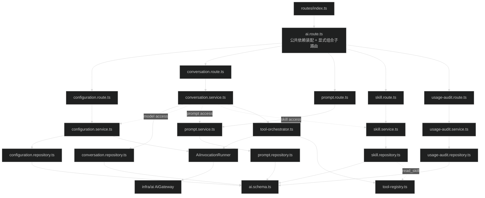
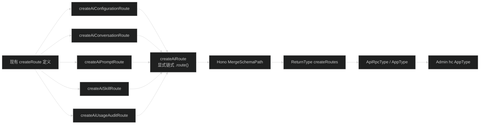

# API AI 模块目录重构设计

## 1. 目标

把 `apps/api/src/modules/ai/` 调整为一个一级 AI 模块、六个内部业务子域。目录变化要解决文件定位和总路由过载问题，不改变业务规则、HTTP 协议、数据库或客户端调用方式。

本任务只处理目录、import、子路由和为本次重构新增的检查。现有 Service、Repository、Presenter、OpenAPI 定义和工具编排函数内部不做职责拆分。

## 2. 目标目录

```text
apps/api/src/modules/ai/
├── index.ts
├── ai.route.ts
├── ai.schema.ts
├── configuration/
│   ├── configuration.openapi.ts
│   ├── configuration.presenter.ts
│   ├── configuration.repository.ts
│   ├── configuration.route.ts
│   └── configuration.service.ts
├── conversation/
│   ├── conversation.openapi.ts
│   ├── conversation.presenter.ts
│   ├── conversation.repository.ts
│   ├── conversation.route.ts
│   └── conversation.service.ts
├── prompt/
│   ├── prompt.openapi.ts
│   ├── prompt.repository.ts
│   ├── prompt.route.ts
│   └── prompt.service.ts
├── skill/
│   ├── skill.openapi.ts
│   ├── skill.repository.ts
│   ├── skill.route.ts
│   ├── skill.service.ts
│   └── skill-tools.ts
├── tool/
│   ├── test-tools.ts
│   ├── tool-orchestrator.ts
│   └── tool-registry.ts
└── usage-audit/
    ├── usage-audit.openapi.ts
    ├── usage-audit.presenter.ts
    ├── usage-audit.repository.ts
    ├── usage-audit.route.ts
    └── usage-audit.service.ts
```

子目录不增加 `index.ts`。AI 模块对一级路由的公共入口仍只有根 `index.ts` 导出的 `createAiRoute`；模块内部使用明确的相对路径，避免 barrel export 引入循环依赖。

## 3. 文件迁移

| 当前文件 | 目标文件 |
| --- | --- |
| `ai.openapi.ts` | `configuration/configuration.openapi.ts` |
| `ai.presenter.ts` | `configuration/configuration.presenter.ts` |
| `ai.repository.ts` | `configuration/configuration.repository.ts` |
| `ai.service.ts` | `configuration/configuration.service.ts` |
| `ai-conversation.openapi.ts` | `conversation/conversation.openapi.ts` |
| `ai-conversation.presenter.ts` | `conversation/conversation.presenter.ts` |
| `ai-conversation.repository.ts` | `conversation/conversation.repository.ts` |
| `ai-conversation.service.ts` | `conversation/conversation.service.ts` |
| `ai-prompt.openapi.ts` | `prompt/prompt.openapi.ts` |
| `ai-prompt.repository.ts` | `prompt/prompt.repository.ts` |
| `ai-prompt.service.ts` | `prompt/prompt.service.ts` |
| `ai-skill.openapi.ts` | `skill/skill.openapi.ts` |
| `ai-skill.repository.ts` | `skill/skill.repository.ts` |
| `ai-skill.service.ts` | `skill/skill.service.ts` |
| `ai-skill-tools.ts` | `skill/skill-tools.ts` |
| `ai-tool-orchestrator.ts` | `tool/tool-orchestrator.ts` |
| `ai-tool-registry.ts` | `tool/tool-registry.ts` |
| `test-tools.ts` | `tool/test-tools.ts` |
| `ai-usage-audit.openapi.ts` | `usage-audit/usage-audit.openapi.ts` |
| `ai-usage-audit.presenter.ts` | `usage-audit/usage-audit.presenter.ts` |
| `ai-usage-audit.repository.ts` | `usage-audit/usage-audit.repository.ts` |
| `ai-usage-audit.service.ts` | `usage-audit/usage-audit.service.ts` |

`ai.route.ts`、`ai.schema.ts` 和根 `index.ts` 保留原路径。现有函数、interface 和 type 名称保持不变；只有新子路由使用 `createAiConfigurationRoute`、`createAiConversationRoute`、`createAiPromptRoute`、`createAiSkillRoute` 和 `createAiUsageAuditRoute`。

## 4. 模块职责

| 子域 | 负责 | 不负责 |
| --- | --- | --- |
| `configuration` | Provider 配置、模型目录、白名单、默认模型、用户偏好、模型测试 | Provider SDK、凭据加密实现、会话持久化 |
| `conversation` | 会话、消息、generation、发送、重试、停止和会话 SSE | Provider 配置写入、工具 handler 注册 |
| `prompt` | 系统 Prompt、全局系统 Prompt、Prompt 模板 | 会话上下文构造以外的模型执行 |
| `skill` | Skill 管理、描述注入、`read_skill` 工具定义 | 通用工具执行循环 |
| `tool` | 工具注册、校验、执行编排和测试工具 | Skill 数据持久化、模型调用审计查询 |
| `usage-audit` | 模型调用、工具执行审计和 invocation runner | 模型选择、会话业务规则 |

根 `ai.route.ts` 是这些子域的 composition root。它创建共享 guard、Repository、Service、Invocation Runner 和 Tool Orchestrator，再把明确依赖传给子路由。

## 5. 依赖方向



约束：

- 子路由只接收自己需要的 Service 和 middleware，不自行创建 runtime。
- 跨子域调用继续使用现有窄接口，例如 Conversation 的 model、Prompt 和 Skill access。
- Service 不导入 Route。
- Repository 不导入 Service、Presenter 或 Route。
- `@earendil-works/pi-ai` 仍只能由 `infra/ai` 导入。
- `ai.schema.ts` 继续是所有 AI 表和 relations 的定义文件。

## 6. 路由组合

当前 `ai.route.ts` 注册 37 个 operation。重构后按原顺序分组：

| 子路由 | operation 数 | 内容 |
| --- | ---: | --- |
| Configuration | 13 | Provider 6、管理员模型 3、用户模型 1、偏好 2、模型测试 1 |
| Usage Audit | 2 | 调用列表、调用详情 |
| Conversation | 7 | 创建、列表、详情、删除、发送、重试、停止 |
| Prompt | 10 | 系统 Prompt 4、全局设置 2、模板 4 |
| Skill | 5 | 列表、详情、创建、更新、删除 |

根路由使用显式链式组合：

```ts
return new OpenAPIHono<HonoEnv>()
  .route("/", createAiConfigurationRoute(deps.configuration))
  .route("/", createAiUsageAuditRoute(deps.usageAudit))
  .route("/", createAiConversationRoute(deps.conversation))
  .route("/", createAiPromptRoute(deps.prompt))
  .route("/", createAiSkillRoute(deps.skill));
```

不把子路由放进数组后循环注册。显式调用能让 TypeScript 保留每次 `.route()` 返回的 schema 类型，也便于检查路由顺序。

模型测试 SSE helper 放入 `configuration.route.ts`；会话 SSE helper 放入 `conversation.route.ts`。移动 helper 时保持 header、heartbeat、AbortSignal listener、错误事件和 finally 清理代码不变。

## 7. Hono RPC 类型



Hono 4.13 的 `.route()` 会把子应用 schema 合入返回类型。项目顶层 `createRoutes()` 已使用这一方式，因此 AI 根路由采用相同模式。

实施前先在 `apps/api/src/test/rpc-type.probe.ts` 增加 AI 代表性类型断言，覆盖 Configuration、Usage Audit、Conversation、Prompt 和 Skill。重构完成后同一组断言必须继续通过，Admin 的实际 AI API 文件也必须通过全仓库类型检查。

## 8. Schema 和 import 策略

`ai.schema.ts` 暂不拆分，原因如下：

- `ai_model_calls` 关联 Conversation 和 Generation。
- Conversation 关联系统 Prompt。
- Drizzle relations 需要直接引用相关表。
- 本任务的目标是目录和路由，不需要同时改数据库定义顺序。

模块外 import 按新路径更新：

- `bootstrap/create-runtime.ts`：Tool Registry 和测试工具。
- `scripts/ai-auth.ts`：Configuration Repository。
- `infra/ai/*` 与 `infra/db/schema/index.ts`：仍从根 `ai.schema.ts` 导入，不改路径。
- `src/test/*`：Conversation、Skill、Tool 和 Usage Audit 的内部测试 import。

不扩充根 `index.ts` 来隐藏所有内部路径。Bootstrap 和测试现有的内部 import 只更新到新的明确路径，避免根入口导出 route 时形成不必要的加载关系。

## 9. 兼容策略

本任务不修改以下内容：

- HTTP path、method、OpenAPI request/response schema。
- middleware 数量、顺序和权限 key。
- JSON success/failure envelope。
- SSE event、header、heartbeat 间隔、取消和终态。
- Service、Repository、Presenter 和 Tool Orchestrator 的业务分支。
- Contracts、Drizzle schema、migration、Admin/Web 请求函数。

新增检查：

- `rpc-type.probe.ts` 覆盖每个 AI 子路由的代表性 RPC key、param/body 或 response data。
- `openapi.smoke.test.ts` 检查每个 AI 子路由至少一个代表性 operation。
- 现有 AI smoke tests 继续覆盖真实 handler 行为。

## 10. 风险与处理

| 风险 | 处理 |
| --- | --- |
| 子路由漏挂或 RPC 类型缺失 | 先增加类型和 OpenAPI 检查，再拆路由；根路由显式链式组合 |
| middleware 顺序变化 | handler 连同原 route 配置整体移动，不重新定义权限规则 |
| SSE 取消或终态变化 | helper 整段移动，不改控制流；运行模型测试与会话 smoke tests |
| 跨目录相对 import 错误 | 移动后先跑 API type-check，再跑 lint 和测试 |
| Schema 拆分引入循环依赖 | `ai.schema.ts` 保留根目录，本任务不拆 |
| 文件重命名掩盖业务改动 | 现有导出符号保持不变；逐子域检查 diff |
| 影响未提交的其他任务 | 不修改 `verify-admin-ai-module` 和 `apps/web/next-env.d.ts` |

## 11. 回滚方式

每个子域独立移动和验证。某一步失败时，只反向移动该子域文件、恢复该子路由在根 `ai.route.ts` 中的原注册段，并恢复受影响 import；已经通过检查的其他子域不需要撤回。

最终回滚点是根路由组合完成前后的 diff。数据库和 HTTP 协议不变，因此不需要 migration 或数据回滚。
