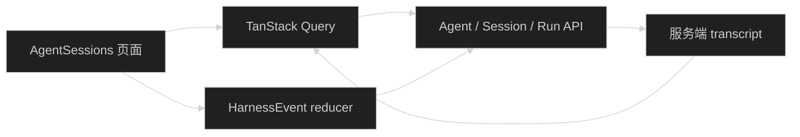

# Admin Harness 调试界面设计

页面只消费父任务共享契约中的 DTO 和 HarnessEvent：`.trellis/tasks/08-17-pi-agent-harness-foundation/research/harness-contracts.md`。

## 1. 页面数据流

Session 列表、详情、Run 状态和 transcript 是服务端状态。当前输入、选中 Agent、展开的 Tool 行和流式展示片段是局部 UI state。

## 2. 页面布局

沿用现有 AI 管理页的紧凑布局：

- 左侧或顶部 Session 列表与创建操作。
- 主区域显示 Session 标题、Agent 选择、transcript 和输入框。
- Tool 活动作为 transcript 内的可扫描条目，不做嵌套卡片。
- Run 状态与停止按钮放在输入区域附近。

页面不显示功能说明、键盘说明或设计自述。

## 3. Event reducer

reducer 以 `runId + sequence` 去重，按共享契约中的 `type` 和 `data` 更新本次 Run 的临时视图：

- delta 只更新当前 message buffer。
- message completed 替换临时 buffer。
- Tool event 按 toolCallId 更新同一活动项。
- 第一个 `run.completed | run.failed | run.aborted` terminal event 固定终态，后续 terminal event 忽略并记录开发日志。

Run 结束后失效 transcript 和 Run query，以服务端持久化结果替换临时视图。

## 4. 断线

SSE parser 报错或组件卸载只关闭客户端 reader。若已有 runId，页面轮询或手动刷新 Run 状态；终态后重新读取 transcript。不调用 abort endpoint。

## 5. 与旧页面共存

新页面使用 `/ai/agent-sessions` 和独立 query keys。旧 `/ai/conversations` 保持不变。S8 删除旧页面后可以把导航名称调整为最终名称，但本任务不复用旧 reducer。

## 6. 回滚

删除新页面、Route、导航、API client、query 和新增文案。后端 Harness API 与旧 Conversation 页面继续可用。
