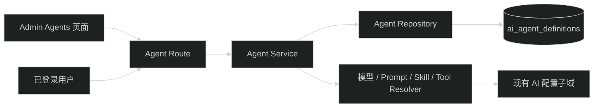

# AgentDefinition 管理设计

AgentDefinition config、Summary/Detail DTO 和 revision 规则以父任务共享契约为准：`.trellis/tasks/08-17-pi-agent-harness-foundation/research/harness-contracts.md`。

## 1. 请求路径

Route 负责 Zod 校验和权限中间件；Service 负责 revision、状态和引用规则；Repository 只处理数据库 record；Presenter 负责公开 DTO。

## 2. Revision

执行配置字段包括 `config` 和状态。以下变化增加 revision：

- 模型引用
- System Prompt 引用
- Skill 或 Tool allowlist
- thinking level
- max turns

`name` 和 `description` 只影响展示，不增加 revision。状态变化单独记录 `updatedAt`，不增加 revision；Run 只能使用 enabled Agent，配置本身没有变化。这个规则必须由 Service 比较解析后的结构，不依赖 JSON 字符串顺序。

## 3. 配置解析

Service 输出内部 `ResolvedAgentDefinition`：

- 选定的 Pi model
- system prompt content
- enabled Skill 描述或 Tool
- Tool allowlist 对应 Registry definitions
- thinking level 和 max turns
- 无 secret snapshot

该类型留在 API 内部，不导出到 contracts。Provider credential 只在现有 Gateway 调用边界读取。

## 4. 权限

- 普通登录用户的公开 Route 只查询 enabled 状态。
- `ai:config:read` 可读取 Admin 列表和配置引用。
- `ai:config:manage` 可创建、更新和改状态。
- 不通过请求参数接收 ownerId 或 createdBy。

## 5. Prompt 引用

现有 Prompt repository 的引用检查需要同时覆盖旧 Conversation 和 AgentDefinition。实施期两者都存在；S8 删除旧表后再删除旧检查分支。Agent config 是 JSON 时，引用检查应由 Agent repository 读取并通过 Zod 解析，不用 SQL `LIKE` 匹配 UUID。

## 6. Admin

新增 `/ai/agents` 路由。页面使用独立 `agentQueryKeys`，不复用 Conversation query key。表单只提交 contracts 定义的字段，服务端仍执行完整引用校验。

## 7. 回滚

删除 Agent Route、Service、Repository、Admin 页面和相关测试。S2 已创建的表和 contracts 保留，不影响旧 runtime。
