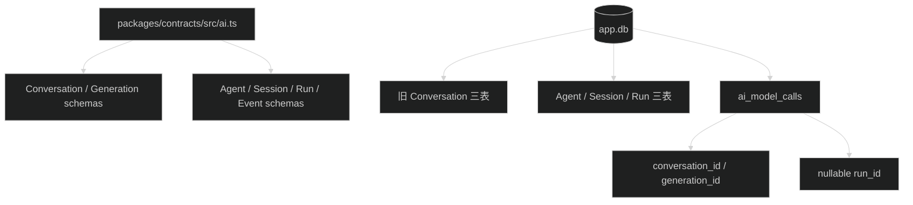

# Harness 契约与增量数据库结构设计

## 0. 契约基准

所有公开字段、状态、事件 data、`starter.run.v1` 和错误码以父任务共享文档为准：

`.trellis/tasks/08-17-pi-agent-harness-foundation/research/harness-contracts.md`

本任务不得只创建“名称正确但字段待定”的 placeholder schema。后续 S3-S7 直接导入本任务导出的 schema 和 DTO。

## 1. 共存模型

新旧类型放在同一 AI contracts 模块中，但没有相互转换函数。旧 Route 继续返回旧 DTO，后续新 Route 直接返回新 DTO。

## 2. Agent 配置

`AgentDefinition.config`、`AgentRun.snapshot` 和所有 Agent DTO 必须逐字段实现共享契约中的严格 schema。配置不允许 API key、Provider secret、任意 system prompt 文本或未知字段。

## 3. HarnessEvent

事件使用 discriminated union。共同 envelope 和每个 `type` 的 `data` 字段逐项按共享契约实现。`sequence` 从 1 开始，`eventId` 使用 UUIDv7。

事件不包含 Pi `AgentEvent` 名称、Session Entry 对象或 Hono stream 类型。

## 4. 数据库

- `ai_agent_definitions` 保存状态、revision、config JSON、名称、描述、创建人和更新时间。
- `ai_agent_sessions` 保存 owner、title、defaultAgentId、归档状态和时间。
- `ai_agent_runs` 保存 Session、Agent、lane、状态、revision、snapshot、requestId 和终态摘要。
- 三张表不保存 transcript。
- `ai_model_calls.run_id` 允许空值，关联 `ai_agent_runs.id`，并与旧 conversation/generation 关联列互斥。

本次 migration 只能执行 `CREATE TABLE`、`CREATE INDEX` 和为审计表增加新关联所需的安全重建。即使 SQLite 需要重建 `ai_model_calls`，复制语句也必须逐列保留所有旧值。

## 5. Migration fixture

fixture 先写入 Conversation、message、generation、model call、Provider、Prompt 和 Skill，再执行 migration。验证新表为空、旧记录数和关键字段不变、旧外键仍可用、新 `run_id` 全为空，并检查 `scenario`、新索引和关联互斥 check。

## 6. 回滚

代码回滚恢复新增 schema 导出。数据库回滚可以删除三张空的新表和 `run_id`；若后续任务已写入新数据，不得使用本任务的简单回滚步骤，应按当时数据状态重新规划。
