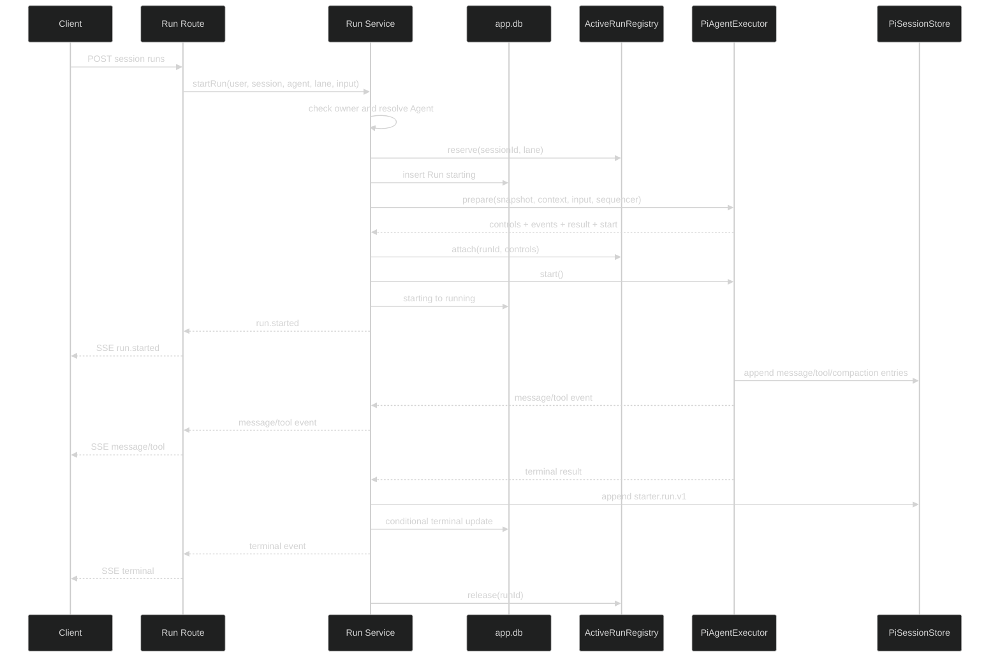
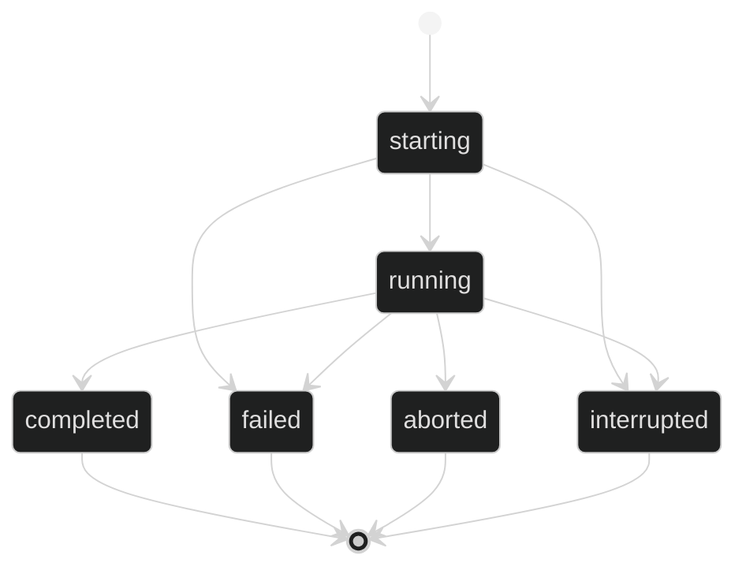

# AgentRun API 设计

本设计以 `.trellis/tasks/08-17-pi-agent-harness-foundation/research/harness-contracts.md` 为字段和状态的唯一来源。

## 1. 启动与事件

Run Service 是 Run 生命周期所有者；Route 的 SSE 订阅不是生命周期所有者。连接关闭后，Service 和 Executor 继续执行，只移除该订阅者。

Run row 创建前的 owner、Agent 和 registry 失败返回普通 JSON error。Run row 创建后、进入 running 前失败时，`run.failed` 是 sequence 1 的唯一 SSE event；正常路径在 prepare、attach 和 running 更新成功后发送 `run.started`。

## 2. Run 状态

Repository 终态更新带 `WHERE status IN ('starting', 'running')`。更新行数为 0 时读取已存在终态，不发出第二个 terminal event。Run Service 只有在 `starter.run.v1` 写入成功后才发布 terminal event。

## 3. Busy 行为

本进程 registry 冲突在 Run row 创建前检查，因此返回 `AI_SESSION_BUSY` 且不产生 Run。Pi writer lease 在 insert 后仍可能冲突；这种情况保留 Run 并标记 failed，错误码同为 `AI_SESSION_BUSY`。

## 4. SSE fan-out

active handle 保存事件订阅集合。Executor 在发布 message/tool completed event 前写对应 Pi entry；Run Service 在发布 terminal event 前写 terminal entry 并更新主库。慢连接不能阻塞 Agent loop；订阅队列设置有界缓冲，超限时关闭该 transport，不 abort Run。

## 5. 控制接口

abort、steer 和 follow-up 先验证 Session owner 与 Run 归属，再从 registry 找 active handle。终态或进程重启后没有 handle，返回 `AI_RUN_NOT_ACTIVE`。abort 幂等：正在取消时重复调用返回当前 Run 状态。

## 6. 恢复

bootstrap 扫描非终态 Run：

1. 若 Pi `starter.run.v1` terminal entry 存在且唯一、schemaVersion 和 runId 合法，按 entry data 条件更新主库终态。
2. 否则更新为 interrupted。

恢复不重启模型调用，不删除已写 entries。重复或解析失败的 terminal entry 不取最后一条，直接按 `AI.RUN_INTERRUPTED` 记录结构化错误。

## 7. 回滚

删除 Run Route、Service、Repository 和测试，停止 bootstrap 恢复。已有 Run rows 和 Pi terminal entries 保留；旧 Conversation runtime 不受影响。
