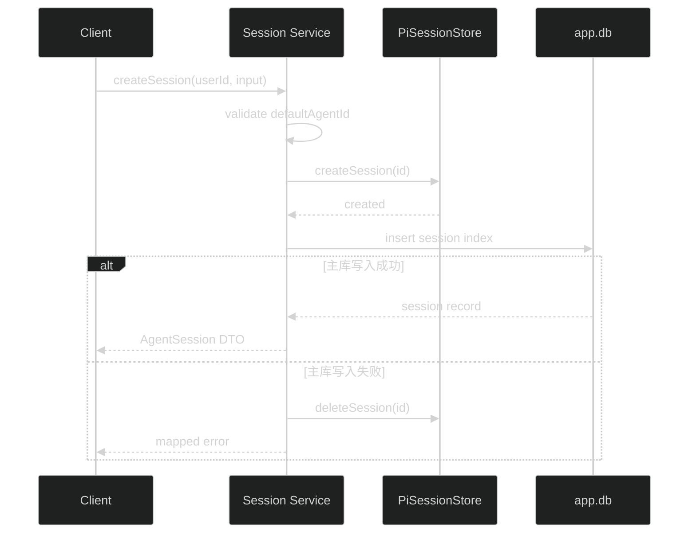

# AgentSession API 设计

transcript DTO、cursor、lane 和 Pi entry 过滤规则以父任务共享契约为准：`.trellis/tasks/08-17-pi-agent-harness-foundation/research/harness-contracts.md`。

## 1. 创建流程

不采用 SQLite `ATTACH` 或跨库 transaction。补偿只删除本次刚创建且尚未返回给客户端的 Pi Session。

## 2. 归属

Repository 的用户查询都同时包含 `id` 和 `ownerId`。Service 不先查全局 id 再比较 owner，避免暴露资源存在性。Admin 也不绕过该规则；本任务没有跨用户 Session 管理接口。

## 3. 归档

DELETE 写 `archivedAt`。默认列表排除已归档 Session；GET、PATCH 和 transcript 也按不存在处理。Pi history 保留，后续 retention 任务再决定物理删除。

## 4. Transcript 投影

Presenter 接收 adapter 返回的中性 entry projection，不直接接收 `SessionEntry`。公开 union 固定区分 user message、assistant message、Tool activity 和 compaction system item；`starter.run.v1` 必须过滤，不投影为 transcript。S5 负责安全投影，S6 负责 Run identity entry 的写入和恢复测试。

## 5. 一致性检查

检查器分别列出主库 active Session ids 和 Pi repository metadata ids，计算：

- `missingInPi`
- `missingInMain`

结果只用于日志和测试，不提供默认修复命令。

## 6. 回滚

删除 Session Route、Service、Repository、Presenter 和测试。已创建的业务索引和 Pi Session 数据不自动删除；回滚前若已有数据，需要先告知用户并单独决定处理方式。
