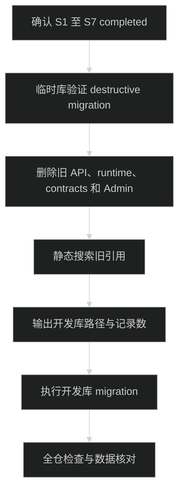
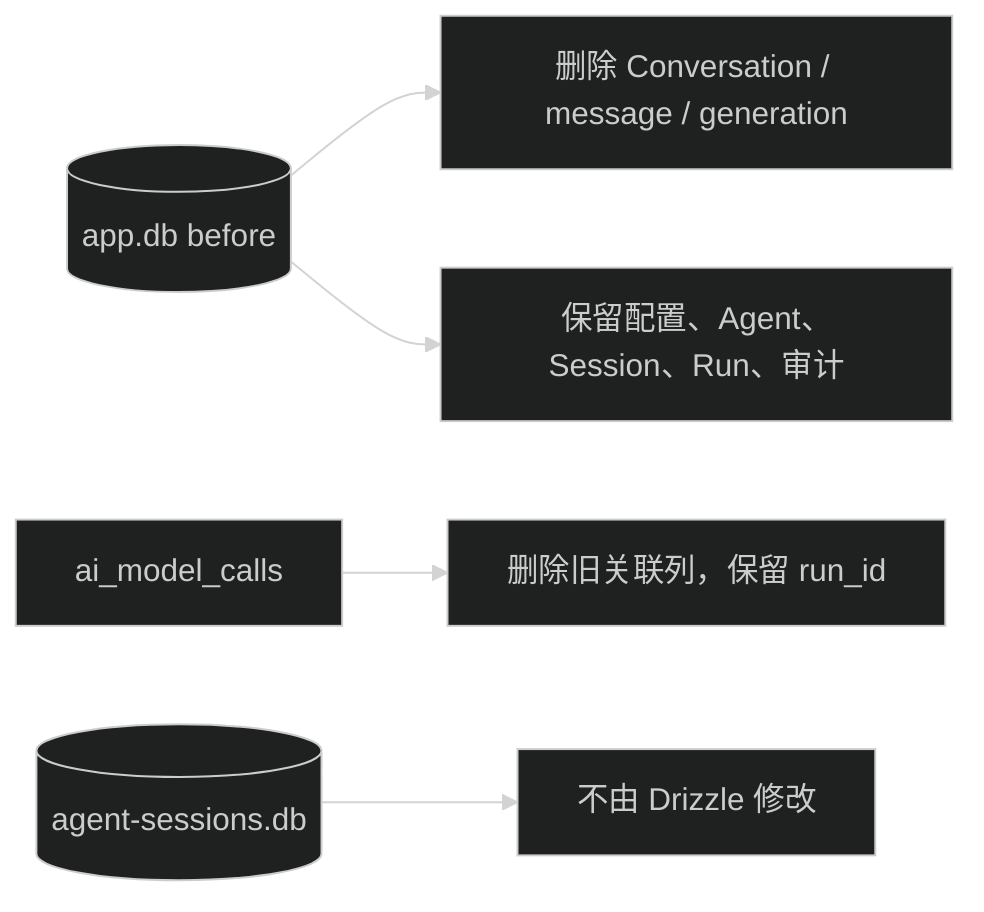

# Conversation 破坏性切换设计

最终 Harness 必须继续符合父任务共享契约：`.trellis/tasks/08-17-pi-agent-harness-foundation/research/harness-contracts.md`。本任务只删除旧协议，不修改共享契约定义的新字段和运行所有权。

## 1. 切换顺序

若 S1 至 S7 任一任务未完成，S8 不启动。若临时 migration fixture 失败，不删除产品代码，也不接触开发库。

## 2. 数据保留与删除

旧模型调用记录不能因为外键删除而丢失。重建表时逐列复制，并将旧 `conversation` scenario 改为 `legacy`，`run_id` 写 null；已有 Agent Run 记录保留原 run_id。

## 3. 代码删除边界

删除只针对旧 Conversation 运行路径。以下能力必须保留并由新 Harness 使用：

- Provider 与 credential store
- 模型目录、白名单和用户偏好
- System Prompt、Prompt Template 和 Skill
- Tool Registry、Tool handler 和 Tool audit
- 模型调用与用量审计
- AgentDefinition、Session、Run、Pi adapters 和 Admin Harness 页面

## 4. 静态检查

产品代码搜索旧 path、类型、表名和文件名。Migration 历史允许出现旧表名；静态检查需要限定 `apps/**/src` 和 `packages/**/src`，避免误判任务文档与历史 SQL。

## 5. 回滚

- 开发库 migration 前：恢复本任务删除的代码和未应用 migration。
- migration 后：旧 Conversation 数据不可恢复。代码如需回退，只能重新创建空的旧 schema。
- 不以临时 fixture 或 Git 历史作为数据备份。
