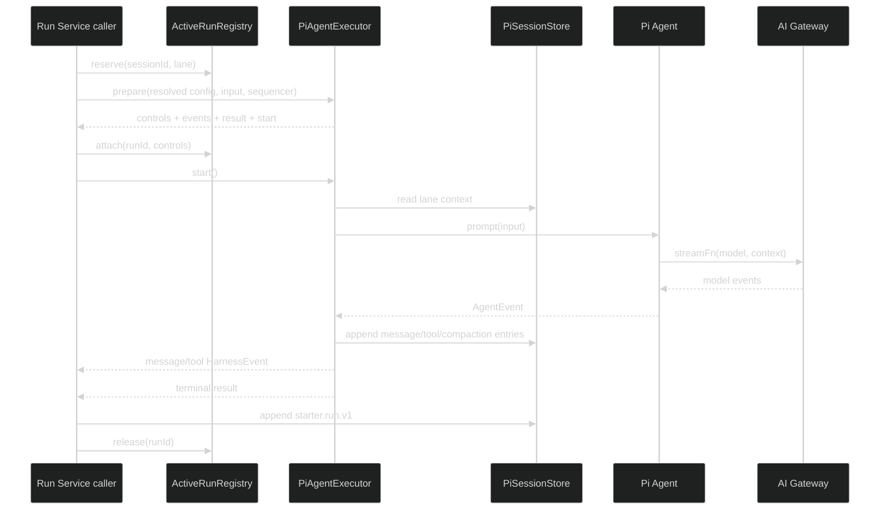

# Pi Agent 执行核心设计

## 1. 执行路径

本任务的 caller 是直接测试和后续 Run Service。Executor 不检查用户所有权，不创建 Run row，不写 `starter.run.v1`，不直接操作 registry，也不写 Hono response。

## 2. Port

`AgentExecutor` 输入包含：

- run、session、lane 标识
- 已解析模型引用、system prompt、thinking level 和 max turns
- 当前用户 ID、request ID、用户 message content 和 AbortSignal
- S1 Session store 提供的 lane context port
- caller 创建的 `EventSequencer`

`prepare` 立即返回 controls、message/tool 事件流、`ExecutorTerminalResult` promise 和 `start()`。caller 先把 controls attach 到 registry，再调用 `start()`；`start()` 在 attach 前和重复调用时都失败。公开 contracts 不直接复用这个内部 port。

Executor 通过 `Agent` 的 `initialState`、`prompt`、`steer`、`followUp` 和 `abort` 运行流程。`maxTurns` 用 Pi Agent 的 `shouldStopAfterTurn` 控制，不在 Starter 内复制 Agent loop。

### 2.1 Pi stream 边界

当前 Conversation 用的 `AiGateway.stream` 返回 `AiGatewayEvent`，不能直接作为 Pi `StreamFn`。S4 增加一个原生 Pi stream adapter：它接收 Pi `Model`、`Context` 和 `SimpleStreamOptions`，返回 `AssistantMessageEventStream`，Provider auth、模型白名单、provider env、timeout 和 abort 仍由现有 Gateway/`Models` 处理。

原生 adapter 是新 Executor 唯一的模型入口。它不把 `AiGatewayEvent` 转回 Pi 事件，也不在 Executor 内直接调用 Provider。旧 `AiGateway.stream` 和旧 `AiInvocationRunner` 继续只服务 Conversation；新 Run 使用相同的 Provider 配置边界和独立的 `runId` 审计 port。

S1 adapter 增加两个内部写入能力：`appendMessage` 接受可选的调用方 entry ID，`appendCompaction` 写入 Pi `CompactionEntry`。业务层仍只依赖 `AgentSessionStore`，不导出 Pi `Session`、entry 类型或 storage path。

## 3. 事件映射

`PiEventMapper` 是 Pi event 到 HarnessEvent 的唯一转换位置，并使用 caller 提供的 `EventSequencer`，保证 `run.started`、message/tool 事件和 Run Service terminal event 共用同一序列。

- assistant `message_start` 时预生成 message ID，`message_update` 只生成对应的 delta event；`message_end` 使用相同 ID 写入 Session 后生成 completed event。
- user 和 tool result 的 Pi message 只写入 Session，不生成公开的 assistant message event。
- `tool_execution_start` 生成 `tool.started`；`tool_execution_update` 只投影受控的 `safeSummary`；Tool result message 写入成功后，使用 Pi entry ID 生成唯一 `tool.completed`。
- 不持久化每个 delta，不把 Pi `details`、arguments 或原始 error 放入公开事件。

所有失败路径返回同一个 `ExecutorTerminalResult`，terminal HarnessEvent 由 Run Service 在 `starter.run.v1` 和主库条件更新成功后发布。Executor 不创建 terminal HarnessEvent。

## 4. Tool

现有 Registry 仍是 Tool 定义来源。adapter 负责：

1. 用 `z.toJSONSchema` 生成模型可见的 Pi `AgentTool.parameters`。
2. 在 `AgentTool.execute` 内再次调用原 Zod schema parse。
3. 检查 required permission，并把拒绝原因转换为安全的 Tool result。
4. 合并 Tool timeout、Run deadline 和 AbortSignal；timeout、abort 和普通失败都返回稳定的 Tool 状态与错误码。
5. 把 `modelText` 写入 Pi Tool result content，把不超过 1000 字符的 `safeSummary` 放入受控 details。

Pi Agent 负责多轮 Tool loop、参数的 JSON Schema 校验、并行/串行执行和生命周期事件。新 adapter 不调用旧 `tool-orchestrator`，每次 Tool 审计只在 Pi Tool lifecycle 写一次。

## 5. Session 与 compaction

Executor 从 S1 读取当前 lane branch entries，用 Pi `buildSessionContext` 生成 Agent messages。每次 Provider 请求前使用 Pi 的 `estimateContextTokens`、`shouldCompact`、`prepareCompaction` 和 `compact`；不复制 token 估算、cut point 或摘要状态机。成功生成 compaction 后写入 Pi entry，下一次请求使用该 entry 的 retained context；摘要生成或 entry 写入失败时 Run 失败，原 transcript 不删除。

Pi 每次调用原生 stream function 对应一条模型审计。请求前 begin，收到 done、error、timeout 或 abort 后 finalize；compaction 使用 Pi API 生成摘要时也通过同一审计 port，新增记录只写 `runId`，旧 conversation/generation 字段为空。Provider secret 不进入 event、日志或 snapshot。

## 6. Active registry

registry 只在进程内保存 controls。reserve 必须原子检查 `sessionId + lane`，返回不可伪造的 lease；attach 绑定 runId 和 Pi Agent controls，并解除 Executor 的 start gate；release 幂等，同时清理 runId 和 session/lane 两个索引。Run Service 是 reserve/attach/release 的唯一调用方，Executor 不隐藏 registry 生命周期，进程退出后的状态由 S6 启动恢复处理。

## 7. 回滚

删除 `infra/agent` 中 executor、mapper、registry、Tool adapter 及测试；如 S4 扩展了 S1 adapter，则一并删除新增 port 和对应测试。S1 Session store 原有能力、S2 contracts/schema 和旧 runtime 不受影响。
