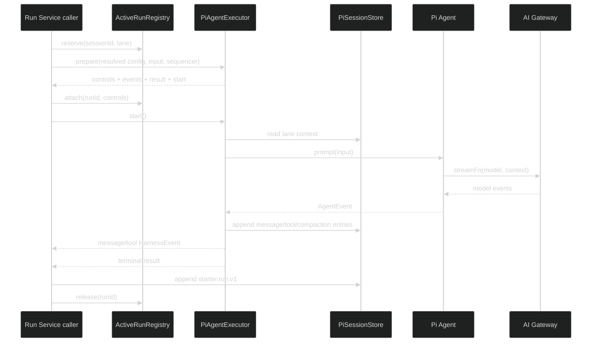

# Pi Agent 执行核心设计

## 1. 执行路径

本任务的 caller 是直接测试和后续 Run Service。Executor 不检查用户所有权，不创建 Run row，不写 `starter.run.v1`，不直接操作 registry，也不写 Hono response。

## 2. Port

`AgentExecutor` 输入包含：

- run、session、lane 标识
- 已解析模型与 system prompt
- Tool definitions
- Session context
- 用户 message content
- requestId、userId 和 AbortSignal
- execution limits

`prepare` 立即返回 controls、message/tool 事件流、`ExecutorTerminalResult` promise 和 `start()`。caller attach controls 后才能调用 `start()`；公开 contracts 不直接复用这个内部 port。

## 3. 事件映射

Mapper 使用 caller 提供的 `EventSequencer`，保证 `run.started`、message/tool 事件和 Run Service terminal event 共用同一序列。Pi 的 `message_update` 只生成 delta event，不持久化每个 delta；message_end 和 tool_execution_end 生成完成事件并写 Session。所有失败路径返回同一个 `ExecutorTerminalResult`，terminal HarnessEvent 由 Run Service 在 `starter.run.v1` 和主库条件更新成功后发布。

## 4. Tool

现有 Registry 仍是 Tool 定义来源。adapter 负责：

1. 将 Zod object schema 转为 JSON Schema/TypeBox 可接受形状。
2. 调用原 Zod parse。
3. 检查 required permission。
4. 合并 Tool timeout 与 Run signal。
5. 把 `modelText` 写入模型上下文，把 `safeSummary` 放入非模型 details。

## 5. 审计

Pi 每次调用 stream function 对应一轮模型调用。stream function 在请求前 `beginModelCall`，在 message end、error、timeout 或 abort 时完成记录。Tool 审计挂在 Pi Tool lifecycle，不复用旧 Orchestrator hook。

## 6. Active registry

registry 只在进程内保存 controls。reserve 必须原子检查 `sessionId + lane`，返回不可伪造的 lease；attach 绑定 runId 和 Pi controls；release 幂等。Run Service 是唯一调用方，进程退出后的状态由 S6 启动恢复处理。

## 7. 回滚

删除 `infra/agent` 中 executor、mapper、registry、Tool adapter 及测试。S1 Session Store 和 S2 contracts/schema 保留；旧 runtime 不受影响。
