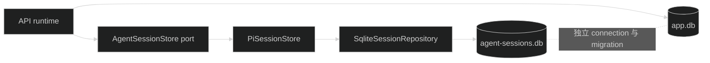

# Pi Session 存储基础设施设计

## 1. 边界

本任务只在 `apps/api/src/infra/agent` 提供存储 adapter。业务 Service 在后续任务中通过窄接口调用它，不直接依赖 `SqliteSessionRepository` 或 Pi Session 类型。

## 2. 依赖装配

- 使用 `NodeExecutionEnv` 固定 API 应用 cwd。
- 使用 `createNodeSqliteFactory()` 创建 SQLite factory。
- 使用 `AGENT_SESSION_DATABASE_PATH` 指定数据库文件。
- repository 自行运行 Pi migration；Drizzle 不管理该文件。

三个 Pi package 固定同一版本，避免 `AgentMessage`、Session entry 和 SQLite backend 类型不匹配。

## 3. Adapter API

第一版只保留后续任务确定会调用的能力：

- `createSession({ id })`
- `openSession(id)`
- `deleteSession(id)`
- `readTranscript({ sessionId, lane, cursor, limit })`
- `appendMessage(...)`
- `appendRunTerminalEntry(...)`
- `findRunTerminalEntries({ sessionId, lane?, runId })`
- `close()`

`appendRunTerminalEntry` 只写共享契约定义的 `starter.run.v1` Pi `CustomEntry`；`findRunTerminalEntries` 返回所有匹配项，让 S6 判断缺失、唯一、重复和 schema 错误。adapter 不把它误建模为 Pi `LaneRecord`。

fork、navigate、search 和 compaction 所需底层能力可以留在 adapter 内部实现，但本任务不为尚未调用的能力设计公开应用接口。

## 4. Metadata

Pi Session metadata 只写固定 `cwd` 和生成的 Session id。不写用户权限、Provider secret、Agent 完整配置或任意客户端输入。Starter 用户归属由后续 `ai_agent_sessions` 表管理。

## 5. 测试

每个测试创建临时目录，目录内分别放 `app.db` 和 `agent-sessions.db`。测试通过 repository 的公开 API 写入和读取，不直接查询 Pi 私有表；数据库隔离只通过 SQLite schema 名称检查确认。

## 6. 回滚

删除两个 package 引用、环境变量、adapter 和测试即可。由于没有主库 migration 和公开 API，本任务回滚不处理业务数据。
