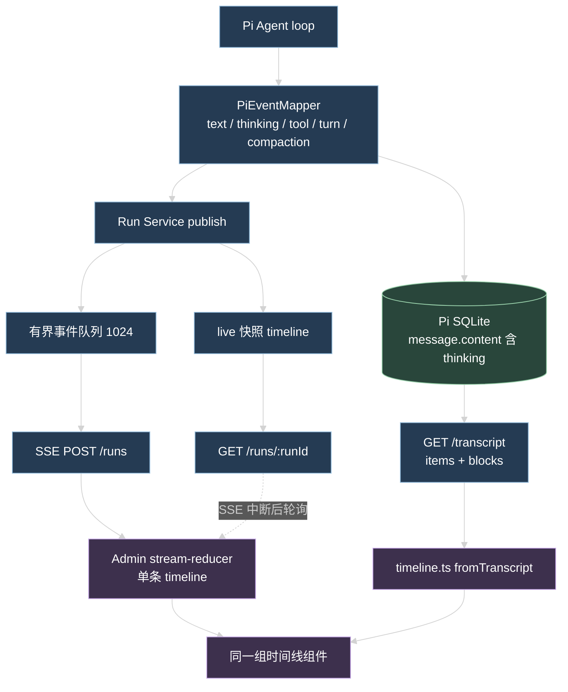
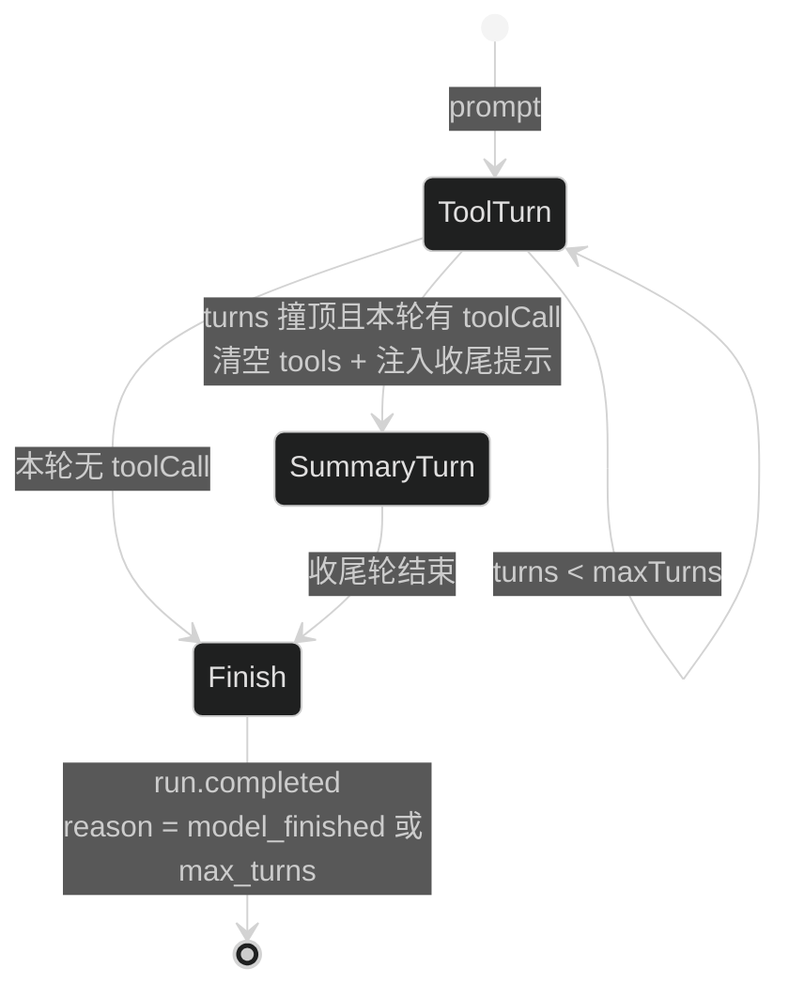

# 技术设计

## 1. 边界不变

改动前后这些边界不动：

- `packages/contracts` 只定义协议，不碰数据库和 Pi 类型。
- 只有 `apps/api/src/infra/agent/` 能接触 Pi 类型和原生模型流。
- Run Service 仍是 Run row、registry、sequence、terminal entry 和终态事件的唯一写入方。
- Admin 只消费 API 和 HarnessEvent，不读 Pi SQLite。
- 唯一放宽的一条：thinking 正文进入公开协议。工具入参仍不出协议。

## 2. 协议改动（packages/contracts/src/ai.ts）

### 2.1 时间线元素

新增共享的时间线元素定义，三处复用（live 快照、transcript 适配、Admin reducer）：

```ts
// assistant message 内部的有序块
agentMessageBlockSchema = z.discriminatedUnion('type', [
  z.strictObject({ type: z.literal('text'), text: z.string() }),
  z.strictObject({ type: z.literal('thinking'), text: z.string() }),
])
```

`agentTranscriptAssistantMessageSchema` 加一个可选字段 `blocks: z.array(agentMessageBlockSchema).max(64).optional()`。现有 `content`（纯文字拼接）保留不变，老消费者不受影响；渲染时优先用 `blocks`，缺失时退回 `content`。

### 2.2 thinking 事件

新增三个事件类型，和 `message.*` 对称：

```ts
'thinking.started'   data: { messageId, blockIndex }
'thinking.delta'     data: { messageId, blockIndex, delta }
'thinking.completed' data: { messageId, blockIndex, content }
```

`blockIndex` 直接用 pi-ai `AssistantMessageEvent` 的 `contentIndex`，同一条 message 内可能有多个 thinking 块。

### 2.3 终态停止原因

`harnessRunCompletedEventSchema.data` 加必填字段：

```ts
reason: z.enum(['model_finished', 'max_turns'])
```

`model_finished` 表示模型自己结束，`max_turns` 表示撞上轮次上限、由收尾轮给出的回答。同一 monorepo 内生产者和消费者一起改，不做兼容降级。

### 2.4 live 快照换成时间线

`agentRunLiveSnapshotSchema` 的 `messages` 和 `tools` 两个数组替换为一条 `timeline`：

```ts
timeline: z.array(z.discriminatedUnion('kind', [
  z.strictObject({
    kind: z.literal('message'),
    messageId: uuidSchema,
    blocks: z.array(agentMessageBlockSchema).max(64),
    completed: z.boolean(),
    usage: aiUsageSchema.nullish(),
  }),
  z.strictObject({
    kind: z.literal('tool'),
    toolCallId: z.string().min(1).max(240),
    name: z.string().min(1).max(240),
    status: z.union([agentToolStatusSchema, z.literal('running')]),
    safeSummary: z.string().max(1000).nullable(),
  }),
  z.strictObject({
    kind: z.literal('compaction'),
    entryId: uuidSchema,
    summary: z.string(),
  }),
])).max(128)
```

上限从「64 消息 + 64 工具」变成「128 条时间线元素」，超限丢最旧的规则不变。

### 2.5 transcript 分页方向

```ts
agentTranscriptQuerySchema = z.strictObject({
  lane: agentLaneSchema.default('main'),
  cursor: z.coerce.number().int().min(0).optional(),
  limit: z.coerce.number().int().min(1).max(200).default(50),
  direction: z.enum(['forward', 'backward']).default('backward'),
})
```

- `backward`：取比 `cursor` 更早的 `limit` 条，`cursor` 省略时取最新 `limit` 条。响应 `items` 始终是时间正序，`nextCursor` 是本页最早一条的 `sequence`，用来继续往更早翻。
- `forward`：保持现有语义，取比 `cursor` 更新的。

## 3. API 改动

### 3.1 thinking 映射（`apps/api/src/infra/agent/pi-event-mapper.ts`）

`mapMessageUpdate` 现在只放过 `text_delta`，改成同时处理 `thinking_start` / `thinking_delta` / `thinking_end`，映射成 2.2 的三个事件。`assistantText` 保持只拼 text block（`message.completed.content` 的语义不变），thinking 内容通过独立事件和 transcript `blocks` 提供。

### 3.2 transcript 投影（`apps/api/src/modules/ai/session/session.presenter.ts`）

`projectMessage` 的 assistant 分支补 `blocks`：按 `message.content` 原顺序把 `TextContent` 和 `ThinkingContent` 投影成 2.1 的块数组，`toolCall` 块继续只走 `toolCalls`（只有 id 和 name）。

### 3.3 收尾轮（`apps/api/src/infra/agent/agent-executor.ts`）

Pi 的调用顺序是 `turn_end` → `prepareNextTurn` → `shouldStopAfterTurn`，所以清空工具必须在 `prepareNextTurnWithContext` 里做，停或不停由 `shouldStopAfterTurn` 决定：

```ts
let turns = 0
let summaryPlanned = false

prepareNextTurnWithContext: ({ context, message }) => {
  if (summaryPlanned) return undefined                  // 收尾轮本身不再干预
  if (turns + 1 < config.maxTurns) return undefined     // 还没撞顶
  if (!hasToolCalls(message)) return undefined          // 模型已经给了文字回答
  summaryPlanned = true
  return { context: { ...context, tools: [], messages: [...context.messages, summaryHint()] } }
}

shouldStopAfterTurn: ({ message }) => {
  turns += 1
  if (turns < config.maxTurns) return false
  if (summaryPlanned && turns === config.maxTurns) return false  // 放收尾轮跑
  return true
}
```

`summaryHint()` 是一条只进内存 context 的 user message，告诉模型工具已经不可用、请基于已有结果作答。它不经过 `message_start` / `message_end`，所以不会写进 Pi transcript。

`ExecutorTerminalResult` 加 `completionReason: 'model_finished' | 'max_turns'`，值由 `summaryPlanned` 决定，Run Service 在发 `run.completed` 时带上。

### 3.4 live 快照（`apps/api/src/modules/ai/run/run.live-snapshot.ts`）

`applyRunEvent` 的折叠目标从两个数组改成一条 timeline：

- `message.started` 追加 `kind: 'message'` 元素。
- `message.delta` 往当前 message 的最后一个 text 块追加，没有 text 块就新建。
- `thinking.delta` 按 `blockIndex` 找 thinking 块，没有就新建。
- `message.completed` 用事件里的 `content` 覆盖 text 块、写入 `usage`、标记 completed。
- `tool.started` / `tool.progress` / `tool.completed` 维护 `kind: 'tool'` 元素。
- `context.compacted` 追加 `kind: 'compaction'` 元素。

规则要和 Admin reducer 保持同构，两边都按 sequence 去重。

### 3.5 transcript 反向读取

`apps/api/src/infra/agent/pi-session-store.ts` 的 `readTranscript` 加 `order` 参数，透传给 `findEntriesOnBranch`。`session.service.ts` 按 `direction` 选 `order`，`backward` 时读 `limit + 1` 条判断 `hasMore`，再反转成时间正序返回，`nextCursor` 取本页最早一条的 `seq`。

## 4. Admin 改动

- `apps/admin/src/features/ai/harness/stream-reducer.ts`：状态改成 `{ runId, lastSequence, model, turn, maxTurns, timeline, terminal }`，消费 thinking、turn、compaction 事件，`terminal` 带 `reason`。
- 新增 `apps/admin/src/features/ai/harness/timeline.ts`：`fromLiveSnapshot(live)` 和 `fromTranscript(items)` 把两种来源都转成同一份时间线元素，供同一组组件渲染。
- 新增时间线渲染组件（从 `AgentSessions.tsx` 抽出）：消息元素（文字 + 默认折叠的思考块 + token 用量）、工具卡、compaction 提示。流式和历史都用它们。
- `apps/admin/src/api/ai/harness.api.ts`：`startAgentRun` 不再在缺终态事件时抛错，改成返回 `{ terminal: boolean }`。
- `apps/admin/src/api/ai/harness.query.ts`：`useAgentRunQuery` 支持轮询间隔；transcript query 支持 `direction` 和 `cursor`。
- `apps/admin/src/features/ai/pages/AgentSessions.tsx`：SSE 提前结束时保留时间线并开启轮询，轮询期间用 `live.timeline` 覆盖视图，Run 到终态后再换 transcript；补轮次进度、停止原因提示、向上加载更多。

## 5. 数据流



## 6. 收尾轮



## 7. 兼容性

- 数据库不动，没有 migration。`ai_agent_runs` 不加列。
- Pi transcript 里的历史 assistant entry 天然带 thinking block，投影补 `blocks` 后旧会话也能看到思考内容。
- `run.completed` 加必填 `reason`、live 快照换结构、transcript query 加 `direction` 默认值，都属于同一 monorepo 内一起改的协议变更，不提供旧字段兼容层。
- `.trellis/spec/api/backend/ai-system-design.md` 和 `ai-integration-guidelines.md` 的 thinking 约束要在同一次改动里更新，否则 spec 与代码冲突。

## 8. 取舍与限制

- 停止原因只在终态事件和 live 快照里，不落库。刷新页面后看不到「撞上轮次上限」标记。这与轮次信息现在的处理一致，代价是可观测性只覆盖实时视图；要持久化就得给 `ai_agent_runs` 加列，不在本任务范围。
- 收尾轮让撞顶的 Run 多一次模型请求，`maxTurns` 语义变成「最多 N 轮工具轮 + 1 轮收尾」。用量审计里会多一条 `ai_model_calls`。
- 时间线元素粒度是消息，不是内容块。一条 assistant message 内的 text 和 thinking 用 `blocks` 表达顺序；跨消息的交错靠 Pi 每轮新建 assistant message 天然成立。
- 轮询兜住了 SSE 中断，但拿不到 delta 级更新，轮询期间文字是整段跳变。真正的续订要等重连端点。

## 9. 回滚

改动集中在这些文件，按包回滚互不影响：

- 协议：`packages/contracts/src/ai.ts`
- API：`pi-event-mapper.ts`、`agent-executor.ts`、`run.live-snapshot.ts`、`run.service.ts`、`session.presenter.ts`、`session.service.ts`、`pi-session-store.ts`
- Admin：`stream-reducer.ts`、新增 `timeline.ts` 与时间线组件、`harness.api.ts`、`harness.query.ts`、`AgentSessions.tsx`

协议是唯一的跨包耦合点。如果要回滚，先回滚 Admin 和 API，再回滚 contracts，顺序反了会留下类型错误。
