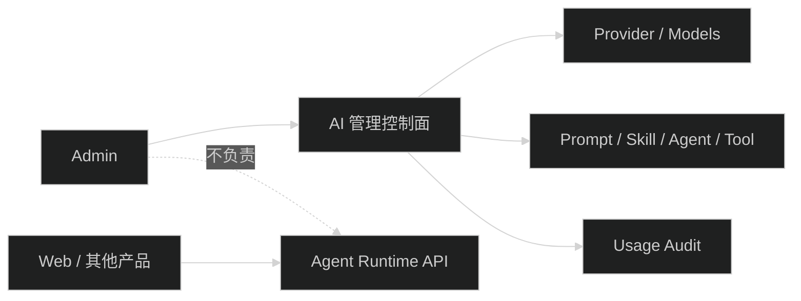

# Admin 仅保留 AI 管理控制面

## 技术边界

- Admin 只管理配置和审计资源。
- Agent Run、Session、Transcript、SSE 时间线属于产品运行面，不在 Admin 提供聊天页面。
- 删除页面时保留 contracts 中仍被 API 和其他消费者使用的运行 schema，不把 Admin 私有类型搬到公共包。

## 迁移注意

- 先从路由和导航移除 `AgentSessions`，再用测试和引用搜索确定哪些 `harness` 文件只服务该页面。
- 如果 Admin 仍需要展示用量或 Agent 配置，不要误删共享 API 函数。
- 删除前确认 `apps/admin/src/test/agent-sessions.test.tsx` 和 Harness reducer 测试的处理方式：移除页面测试，或把仍有价值的协议 reducer 测试迁移到 contracts/API 层。
