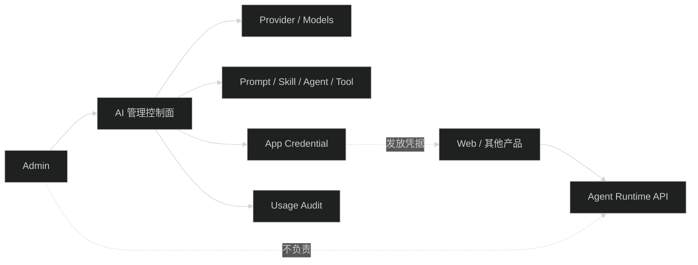
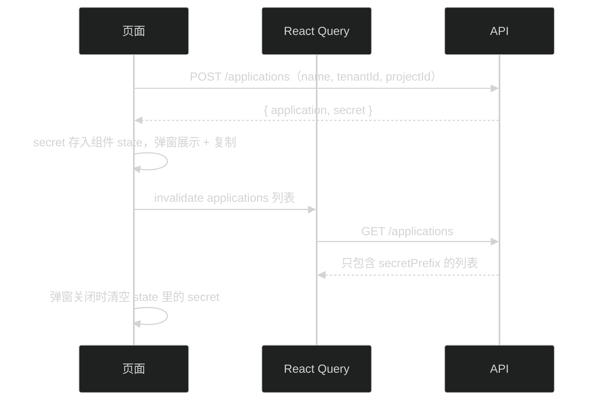

# Admin 仅保留 AI 管理控制面

## 技术边界

- Admin 只管理配置、凭据和审计资源。
- Agent Run、Session、Transcript、SSE 时间线属于产品运行面，不在 Admin 提供聊天页面。
- Admin 发放应用凭据给产品后端，自己不用这些凭据调运行接口（Admin 管理接口走 Better Auth Cookie）。
- 删除页面时保留 contracts 中仍被 API 和其他消费者使用的运行 schema，不把 Admin 私有类型搬到公共包。

## 删除范围

只服务 Agent Sessions 页面的文件，已用引用搜索确认没有其他管理页面依赖：

| 文件                                                    | 处理 | 引用情况                                              |
| ------------------------------------------------------- | ---- | ----------------------------------------------------- |
| `features/ai/pages/AgentSessions.tsx`                   | 删除 | 仅 `routes.tsx` 和页面测试                            |
| `features/ai/harness/stream-reducer.ts`                 | 删除 | 仅页面和 reducer 测试                                 |
| `features/ai/harness/timeline.ts`                       | 删除 | 仅页面、timeline 组件和测试                          |
| `features/ai/components/timeline/*.tsx`                 | 删除 | 仅 `AgentTimeline` 链路                               |
| `features/ai/components/MarkdownRenderer.tsx`           | 删除 | 仅 `TimelineAssistantMessage`                         |
| `features/ai/components/CodeBlock.tsx`                  | 删除 | 仅 `MarkdownRenderer`                                 |
| `api/ai/harness.api.ts`、`api/ai/harness.query.ts`      | 删除 | 仅页面和 `api/ai/index.ts` 导出                       |
| `test/agent-sessions.test.tsx`、`test/harness-*.test.*` | 删除 | 页面与 reducer 测试，协议一致性已由 API 侧测试覆盖 |

`MarkdownRenderer` 和 `CodeBlock` 只被时间线的 assistant 消息用，删除页面后就是死代码，一并删。Web 需要 Markdown 渲染时自己写，不从 Admin 引。

需要改而不是删的文件：`routes.tsx`（去路由）、`api/ai/index.ts`（去导出）、`i18n/locales/{zh,en}.ts`（去 `menu.aiAgentSessions` 和会话页文案）、`test/navigation.test.ts`、`test/ai-api.test.ts`、`test/ai-query.test.tsx`（去 harness 断言）。

## 应用凭据管理页

API 已经提供四个接口，全部走 Cookie + `ai:config:manage`：

| 动作 | 接口                                              | 返回                     |
| ---- | ------------------------------------------------- | ------------------------ |
| 列表 | `GET /api/ai/admin/applications`                   | `AiApplication[]`        |
| 创建 | `POST /api/ai/admin/applications`                  | `{ application, secret }` |
| 轮换 | `POST /api/ai/admin/applications/{appId}/rotate`   | `{ application, secret }` |
| 撤销 | `POST /api/ai/admin/applications/{appId}/revoke`   | `AiApplication`          |

secret 的处理是这个页面唯一容易出错的地方：只在本次响应返回，列表接口之后只有 `secretPrefix`。

落实规则：

- secret 只放组件 `useState`，不进 query cache、不进 URL、不进 localStorage、不进 `console`。
- mutation 的 `onSuccess` 只 invalidate `aiQueryKeys` 下的应用列表，不把带 secret 的响应写回缓存。
- 弹窗关闭即清空 state，文案写清“关闭后无法再查看，丢了只能轮换”。
- `tenantId`/`projectId` 创建后不可修改，页面不提供编辑入口；需要改 scope 就撤销重建。
- `status === 'revoked'` 的行不提供轮换和再次撤销。

文件归属跟现有 AI 领域一致：

- `apps/admin/src/api/ai/application.api.ts`：`apiRpc.api.ai.admin.applications` 调用 + `unwrapApiData`。
- `apps/admin/src/api/ai/application.query.ts`：`useAiApplicationsQuery` 和三个 mutation hook，query key 用 `aiQueryKeys.applications()`（挂在 `aiQueryKeys.admin` 下）。
- `apps/admin/src/features/ai/pages/AiApplications.tsx`：结构对齐 `Skills.tsx`（`AdminPageHeader` + `Table` + `Modal` 表单 + `Popconfirm`）。
- 页面写操作用 `PermissionGuard permission={PermissionKeys.AI_CONFIG_MANAGE}`，跟 `Agents.tsx` 一致。

## 迁移注意

- 先从路由和导航移除 `AgentSessions`，再用测试和引用搜索确定哪些 `harness` 文件只服务该页面。
- 如果 Admin 仍需要展示用量或 Agent 配置，不要误删共享 API 函数。
- 删除前确认 `apps/admin/src/test/agent-sessions.test.tsx` 和 Harness reducer 测试的处理方式：移除页面测试，或把仍有价值的协议 reducer 测试迁移到 contracts/API 层。

本次的结论：reducer 测试直接删。协议一致性已经由 API 侧 `src/test/ai-cross-product-runtime.test.ts` 以及运行面专项测试覆盖，Web 子任务也明确自己写归并逻辑，不复用 Admin reducer。
