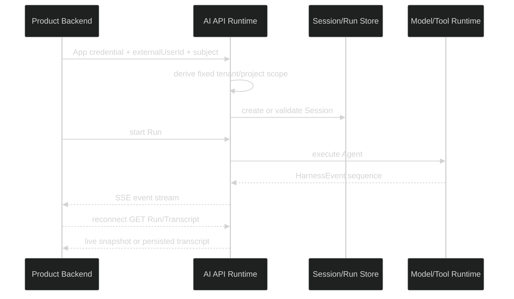

# 验证 AI 基座跨产品运行契约

## Design

## Test Boundary

调用样例只拥有公共运行协议：请求 schema、响应 DTO、错误码、HarnessEvent schema。它不能读取 Starter SQLite、Pi DB 或 Admin 本地状态。

断线测试要区分：

- 连接还没收到事件就失败：启动请求失败。
- 已收到事件后断开：Run 继续执行，调用方查询 Run。
- 终态后查询：使用 Transcript，不再依赖 live snapshot。
