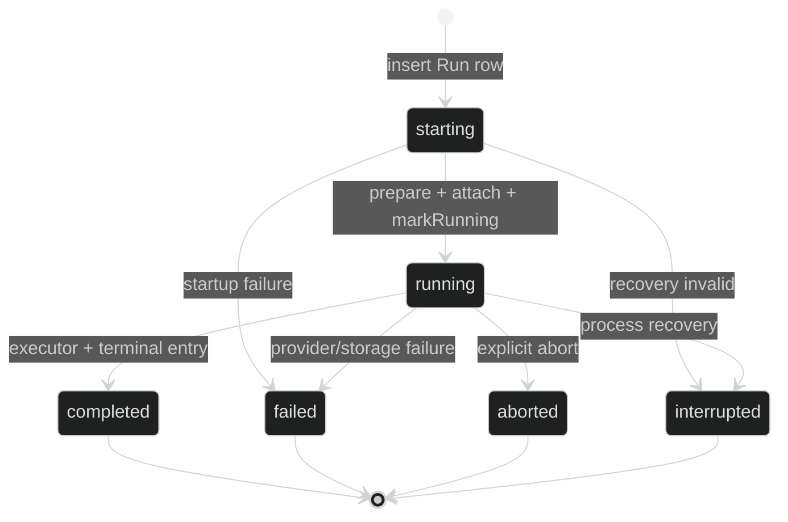

# AI API 基座控制面与运行面设计

## 1. 设计结论

`apps/api` AI 基座分成三类接口：

```text
AI Control
  Admin 管理 Provider、Model、Prompt、Skill、Agent、Tool、App Credential、Usage

AI Runtime
  产品后端创建 Session、启动/控制 Run、读取 SSE、查询 Transcript

AI Compatibility
  Starter Cookie、ownerId、user model preference 和旧 envelope 的兼容入口
```

第一阶段不是把所有 URL 搬到新前缀，而是先冻结职责、认证、契约和数据真相。现有 `/api/ai/*` 路径可以保留，通过 OpenAPI tag 和认证 adapter 区分三类接口。

## 2. 调用和认证协议

### 2.1 控制面

Admin 继续使用 Better Auth Cookie：

```text
Cookie: better-auth.session_token=...
```

控制面写操作仍使用 Starter 权限：

- `ai:config:read`
- `ai:config:manage`
- `ai:usage:read`

应用凭据的创建、轮换和撤销属于控制面，只有有 `ai:config:manage` 的 Admin 可以执行。

### 2.2 运行面

产品后端使用：

```http
Authorization: Bearer <app-secret>
X-AI-External-User-Id: <product-user-id>
X-AI-Subject-Type: <optional-business-resource-type>
X-AI-Subject-Id: <optional-business-resource-id>
```

规则：

- `Authorization` 是唯一应用凭据入口；不同时支持多个未定义 header。
- `app-secret` 只由产品后端持有，浏览器不能持有。
- 产品后端调用的 app credential 固定绑定一个不可变外部 `tenantId + projectId`；AI 平台不维护 tenant/project 实体。
- 运行资源 scope 从 credential 派生，不能由请求体覆盖。
- `X-AI-External-User-Id` 对 product app runtime 请求必填，长度和字符集由 contracts schema 限制；它不是 Starter user 外键。
- `X-AI-Subject-Type` 和 `X-AI-Subject-Id` 必须同时出现或同时省略；平台只保存稳定引用，不查询产品数据库。
- API 日志只允许记录 `appId`、scope、externalUserId 的脱敏摘要和 requestId，不记录 app-secret。
- Credential 不存在、格式错误、已撤销和不匹配统一返回 401；不能告诉调用方 credential 是否存在。

### 2.3 Starter 兼容运行面

兼容期间，Better Auth Cookie 可以调用现有 Session/Run 路由。它通过 adapter 生成：

```ts
interface PrincipalContext {
  kind: 'starter_user' | 'product_app'
  principalId: string
  tenantId: string
  projectId: string
  externalUserId: string | null
  appId: string | null
}
```

新 service/repository 不再把 `currentUserId` 当作公共身份；Starter adapter 内部可以继续用 `ownerId` 查询旧数据。

## 3. ResourceScope

```ts
interface ResourceScope {
  tenantId: string
  projectId: string
  subjectType: string | null
  subjectId: string | null
}
```

资源访问必须同时满足：

```text
PrincipalContext.scope == ResourceScope.tenant/project
AND
资源 owner externalUserId == PrincipalContext.externalUserId
AND
subject 约束匹配（资源保存 subject 时）
```

首版固定规则：

- 首版不建设 tenant/project 管理系统。`tenantId/projectId` 是 Admin 创建应用凭据时填写的不可变外部命名空间，凭据记录本身是 scope 权威来源。
- 需要变更 scope 时撤销旧凭据并创建新凭据；rotate 不能改变 scope。
- 一个 Session 绑定一个 externalUserId；Run 继承 Session scope。
- 一个 Session 可以有多个 lane，但同一 Session + lane 只能有一个 active Run。
- Provider/Model 是平台资源；Prompt/Skill/Agent/Tool 先按 Starter 现状运行，但新的接口必须保留 scope 扩展位置。
- 产品业务数据不复制到 AI DB；`subjectType/subjectId` 只做引用。

## 4. 控制面接口清单

现有接口按以下职责保留：

| 资源           | 现有路径                                                   | 认证                       | 说明                                      |
| -------------- | ---------------------------------------------------------- | -------------------------- | ----------------------------------------- |
| Provider       | `/api/ai/admin/providers*`                               | Cookie + config permission | Provider 配置、凭据、检查、启停、目录刷新 |
| Model          | `/api/ai/admin/models*`                                  | Cookie + config permission | 模型目录、白名单、默认模型                |
| Prompt         | `/api/ai/system-prompts*`、`/api/ai/prompt-templates*` | Cookie + read/manage       | Prompt 内容和模板                         |
| Skill          | `/api/ai/skills*`                                        | Cookie + manage            | Skill 内容                                |
| Agent          | `/api/ai/admin/agents*`                                  | Cookie + read/manage       | Agent Definition 和 revision              |
| Tool           | `/api/ai/admin/tools`                                    | Cookie + read              | 只读公开 Tool summary                     |
| Usage          | `/api/ai/usage/calls*`                                   | Cookie + usage read        | 模型调用审计                              |
| Model test     | `/api/ai/test`                                           | Cookie                     | 控制面连通性检查，不创建 Agent Run        |
| App credential | 新增`/api/ai/admin/applications*`                        | Cookie + config manage     | 创建、列出、轮换、撤销产品后端凭据        |

App credential 建议接口：

```text
GET  /api/ai/admin/applications
POST /api/ai/admin/applications
POST /api/ai/admin/applications/{appId}/rotate
POST /api/ai/admin/applications/{appId}/revoke
```

创建/轮换响应唯一包含一次 `secret`；列表和详情只返回 `appId/name/tenantId/projectId/status/secretPrefix/createdAt/updatedAt/lastUsedAt`。

## 5. 运行面接口清单

当前 URL 继续作为第一版运行协议入口：

| 动作               | 路径                                              | 认证                         | 事实来源               |
| ------------------ | ------------------------------------------------- | ---------------------------- | ---------------------- |
| 创建 Session       | `POST /api/ai/sessions`                         | App Bearer 或 Starter Cookie | 主库 + Pi Session DB   |
| 列 Session         | `GET /api/ai/sessions`                          | App Bearer 或 Starter Cookie | 主库                   |
| 读/改/归档 Session | `/api/ai/sessions/{sessionId}`                  | App Bearer 或 Starter Cookie | 主库                   |
| 读 Transcript      | `/api/ai/sessions/{sessionId}/transcript`       | App Bearer 或 Starter Cookie | Pi branch projection   |
| 启动 Run           | `POST /api/ai/sessions/{sessionId}/runs`        | App Bearer 或 Starter Cookie | 主库、Pi、进程运行态   |
| 读 Run             | `GET /api/ai/sessions/{sessionId}/runs/{runId}` | App Bearer 或 Starter Cookie | 主库 + live snapshot   |
| Abort              | `POST .../abort`                                | App Bearer 或 Starter Cookie | active registry + 主库 |
| Steer              | `POST .../steer`                                | App Bearer 或 Starter Cookie | active registry        |
| Follow-up          | `POST .../follow-ups`                           | App Bearer 或 Starter Cookie | active registry + Pi   |

运行请求不能接受：Provider ID + API key、Prompt 正文、Skill 正文、Tool handler、tenant/project override、任意 ownerId。

## 6. Agent Definition 解析规则

Agent Definition 的可持久字段：

```text
id / name / description / status / revision
model ref
systemPromptId
skillIds
toolNames
thinkingLevel
maxTurns
```

解析顺序：

```text
读取 Agent
  -> status == enabled
  -> parse config schema
  -> resolve allowed model
  -> resolve enabled system prompt
  -> resolve enabled skills
  -> resolve registered tools
  -> 生成 ResolvedAgentDefinition
  -> 生成无 secret AgentRunSnapshot
```

配置变更规则：

- 模型、Prompt、Skill、Tool、thinking level、max turns 变化：revision + 1。
- name、description、status 变化：revision 不变。
- Agent 启用时重新校验依赖；草稿可以保存不完整配置，但不能启动 Run。
- Run snapshot 绑定 `agentId + agentRevision`，后续配置变化不影响该 Run。

## 7. Run 生命周期和唯一事实



Run Service 是以下事实的唯一写入口：

- `ai_agent_runs` 状态。
- ActiveRunRegistry lease/handle。
- EventSequencer 和 HarnessEvent 发布。
- live snapshot 累积和销毁。
- Pi `starter.run.v1` terminal entry。
- terminal event。

终态顺序不可改变：

```text
executor result
  -> Pi terminal entry
  -> 主库条件终态更新
  -> 唯一 terminal event
  -> 关闭事件队列
  -> release handle/lease
```

`GET Run.live` 只在 starting/running 返回；终态或进程重启后为空。SSE 断开不 abort Run。客户端断线后查询 live，终态后读取 Transcript。

## 8. HarnessEvent Contract

所有事件使用同一 envelope，`data` 使用 `z.discriminatedUnion('type')` 的事件 schema。事件生产位置只有：

```text
PiEventMapper -> Run Service publish -> live snapshot + SSE queue
```

事件持久化规则：

| 事件                                   | SSE      | live     | Pi/Main 持久化                            |
| -------------------------------------- | -------- | -------- | ----------------------------------------- |
| run/turn/message/thinking/tool/context | 是       | 部分折叠 | message/tool/compaction 按 executor 写 Pi |
| run.completed/failed/aborted           | 是且唯一 | 否       | terminal entry + main Run row             |
| heartbeat                              | comment  | 否       | 否                                        |

事件不能包含 UI 字段、Provider payload、原始异常、secret、完整 Tool args/result 或产品数据库内容。

## 9. Tool Contract

第一阶段采用部署时安装的 TypeScript Tool package：

```text
package -> Runtime factory -> AiToolRegistry -> Pi Tool adapter -> handler
```

统一要求：

- name/version/description 唯一。
- input schema 在 handler 前 parse。
- handler 只收到 validated args、PrincipalContext、ResourceScope、requestId、AbortSignal 和 reportProgress。
- timeout 100-30000ms；safeSummary <= 1000；arguments/modelText 遵守现有限额。
- registry/allowlist/scope/permission/timeout/cancel/audit 由平台处理。
- handler 的原始异常、args、result 不进日志、SSE、Pi transcript 或 SQLite。
- 远程 Tool 只在后续任务复用同一 contract，不在本任务实现。

## 10. 数据库和存储边界

当前主库表仍是 Starter 绑定事实：

- `ai_provider_configs`、`ai_model_catalogs`、`ai_enabled_models`、`ai_settings`。
- `ai_system_prompts`、`ai_prompt_templates`、`ai_skills`。
- `ai_agent_definitions`、`ai_agent_sessions`、`ai_agent_runs`。
- `ai_model_calls`、`ai_tool_executions`。
- `user_ai_preferences`。

应用凭据新增独立表，不能复用 Provider credential：

```text
ai_app_credentials:
  id/app_id/name
  tenant_id/project_id
  secret_hash/secret_prefix
  status
  created_by/updated_by
  created_at/updated_at/last_used_at
```

Pi Session DB 保存 session metadata、lane tree、message、tool result、compaction、terminal entry；不保存 Starter owner、Provider secret、Agent config、权限关系。

## 11. 分阶段实施顺序

### 阶段 A：协议冻结

任务：`08-21-ai-api-contract-surface`。

改动范围：contracts、OpenAPI route definition、API doc、协议测试、设计文档。

完成条件：接口分类、事件字段、事实来源、恢复语义和错误响应全部有单一说明；不改身份和数据归属。

### 阶段 B：身份和 App Credential

任务：`08-21-ai-api-principal-scope`。

改动范围：Principal adapter、Bearer middleware、App credential schema/repository/service/route、migration、审计和测试。

完成条件：

- Cookie 和 Bearer 都能解析 PrincipalContext。
- Bearer scope 从 credential 派生。
- secret 只返回一次，hash/prefix 入库。
- revoke 立即阻止新请求。

### 阶段 C：运行资源 Scope

任务：`08-21-ai-api-runtime-resource-scope`。

改动范围：Session/Run/Agent/Usage service、repository、schema/migration、presenter、recovery 和跨 scope 测试。

完成条件：Session、Run、Transcript、Agent 引用和 audit 查询都进行 scope/subject 校验；Starter owner 只作为兼容 adapter。

### 阶段 D：Tool Package Contract

任务：`08-21-ai-tool-package-contract`。

改动范围：Tool registry、Tool adapter、runtime factory、contracts summary、audit 和安全测试。

完成条件：可信 package 可以注册；Agent 只能引用可用 Tool；所有失败分支都安全并 finalize audit；不实现远程 Tool。

### 阶段 E：跨产品验收

任务：`08-21-ai-api-cross-product-verification`。

改动范围：非 Admin 调用 fixture/helper、SSE chunk/断线测试、scope 隔离、安全扫描、接入说明。

完成条件：非 Admin 调用方完成 Session -> Run -> SSE -> terminal -> Transcript，且断线、越权、敏感信息和 Tool 矩阵通过。

只有阶段 E 完成后，Admin 和 Web 子任务才允许启动。

## 12. 失败边界

| 位置                                  | 行为                             | 真相/恢复               |
| ------------------------------------- | -------------------------------- | ----------------------- |
| credential 无效/撤销                  | 401，不泄露存在性                | 不创建 Run              |
| scope/用户不匹配                      | 404                              | 不泄露资源存在性        |
| Agent 未启用/依赖失效                 | 409/400                          | 不创建 active Run       |
| lane busy                             | 409`AI.SESSION_BUSY`           | 当前 Run 继续           |
| Provider failure                      | Run failed，安全终态             | audit + terminal entry  |
| Tool invalid/forbidden/failed/timeout | safe tool result，模型决定下一轮 | tool audit finalize     |
| SSE 断线/队列超限                     | 当前 transport 结束，Run 继续    | GET Run/live/Transcript |
| Pi terminal 写入失败                  | Run failed                       | 主库失败终态            |
| 主库终态写入失败                      | 不发布 terminal                  | recovery scan           |
| 进程终止                              | 非终态保留                       | 启动 recovery           |

## 13. 代码边界

允许：

- Route 调 adapter、schema、service，返回公共 presenter。
- Service 编排业务动作、权限、scope 和错误。
- Repository 接收 scope 并读写数据库。
- Infra 访问 Pi、Provider、凭据和运行时对象。
- Contracts 定义公共 schema/DTO/error/event。

禁止：

- API import Admin/Web。
- Service 直接读取 Pi 表或 Provider SDK 类型。
- Route 复制 Agent loop、Tool loop 或 reducer。
- contracts 读取 DB、环境变量或认证 session。
- Product app 传 ownerId、tenant override、Provider secret 或 handler。
- 前端缓存、localStorage 或 fallback 充当业务事实。

## 14. 计划验证命令

每个子任务先跑自身命令；API 父任务阶段 E 完成时跑全量：

```bash
pnpm check-types
pnpm lint
pnpm format:check
pnpm test
pnpm build
pnpm --filter @starter/api db:check
git diff --check
```

阶段性专项命令见各子任务 `implement.md`，不得只跑总命令跳过专项回归。
