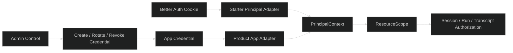

# 建立 AI Principal 与资源 Scope

## Design



- 首版不建设 tenant/project 实体表。`tenantId/projectId` 作为不可变外部 ID，在 Admin 创建 credential 时写入 `ai_app_credentials`；该记录是 app scope 的权威来源。
- credential rotate 只更换 secret，不允许更换 scope。scope 变更必须 revoke 旧 credential，再 create 新 credential。
- 因为 AI 平台不维护外部 tenant/project 的生命周期，不能在 AI API 中实现 tenant/project 存在性检查、成员管理或项目归档；只做格式和 credential scope 校验。


## Credential Storage

建议新增独立 app credential 表，不复用 Provider credential store：

```text
ai_app_credentials
  id/app_id
  name
  tenant_id
  project_id
  secret_hash
  secret_prefix
  status(active/revoked)
  created_by/updated_by
  created_at/updated_at/last_used_at
```

Provider secret 是 AI 上游凭据；App secret 是调用 AI API 的下游凭据，两者用途、轮换和泄漏后果不同，不能共用表或加密逻辑。

## Compatibility

先让 route middleware 解析 PrincipalContext，再让 service/repository 接收 scope。迁移期间保留 `ownerId` adapter：它只负责把 Starter user 解析成 scope 查询条件，不能在新公共 contract 中出现。
