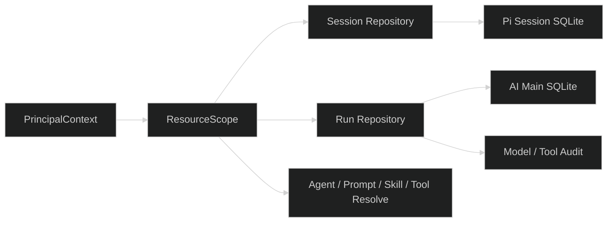

# 迁移 AI 运行资源到 Scope 归属

## Design



## Source of Truth

- 主库 Session/Run 状态和 scope 索引：Starter/AI main SQLite。
- transcript、lane、message、compaction、terminal entry：Pi Session SQLite。
- active Run：进程内 registry，只是并发保护，不是持久事实。
- 公开运行状态：由 presenter 从主库和 live snapshot 生成。

## Compatibility Adapter

建议内部 repository API 从：

```ts
findOwned(sessionId, ownerId)
```

逐步变成：

```ts
findInScope(sessionId, scope: ResourceScope, externalUserId: string | null)
```

旧 owner 查询只留在 Starter adapter，禁止新的 product app 路由直接调用。迁移期间要保证 404 不区分不存在和越权。

## Migration Shape

如果现有表没有 scope 列，先增加兼容 scope index/columns 或独立 mapping 表，具体 schema 由实施阶段依据当前 migration 决定；不能用空字符串、固定 tenant 或调用方传参伪造隔离。数据迁移必须有旧数据归属规则、回滚脚本和测试 fixture。

首版不新增 tenant/project 表；credential 记录中的不可变外部 tenant/project 是 product app scope 的权威来源。运行资源保存或映射该 scope，但不验证外部项目是否存在。
