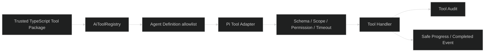

# 固化 AI Tool Package Contract

## Design

Tool contract 是跨 package/远程执行的稳定边界；`ZodType` 和 handler 是第一阶段的进程内实现，不进入公共 HTTP DTO。

## Two-phase Extension

- Phase 1：部署时安装 package，运行时注册 handler。
- Phase 2：产品后端提供远程 endpoint，复用 name/version/schema/scope/result/error contract；另建任务处理签名、重试和幂等。

禁止在 Phase 1 用请求体传函数名再通过动态 import 执行未审核代码，也禁止浏览器注册 Tool。
