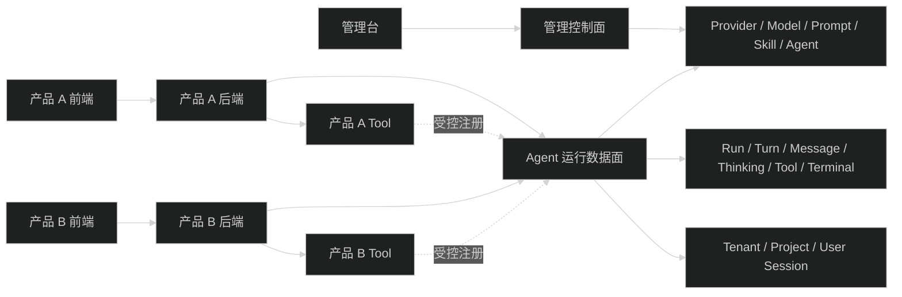

# AI 基座解耦设计

## 设计结论

当前仓库适合沿着“管理控制面 + Agent 运行数据面”继续演进，不应把 Admin 页面抽成 AI 产品 UI，也不应让 Harness 协议描述 React 或 React Flow 的页面状态。

第一阶段的 AI 基座定位是：

> 产品后端通过应用凭据调用，按租户、项目和用户上下文隔离资源，提供可重放 Agent Run 协议的内部 AI 平台。

Admin 是管理控制面消费者。产品应用通过自己的后端使用运行数据面，前端可以将同一套运行事件渲染成对话、时间线、工作流节点状态或其他产品界面。

## 边界模型



### 管理控制面

管理控制面负责配置和运维，不负责产品页面渲染：

- Provider 凭据、启用状态、模型目录和模型白名单。
- 系统提示词、Prompt 模板、Skill 和 Agent Definition。
- Tool 目录、Tool allowlist、权限、超时和用量审计。
- Agent Definition 的发布、禁用、版本和可见范围。

管理控制面输出的是可被运行数据面引用的已发布资源。Provider secret、内部凭据、管理审计字段和草稿配置不能进入产品运行响应。

### Agent 运行数据面

运行数据面负责一次 Agent 执行的生命周期：

- 创建和读取 Session。
- 启动 Agent Run，并绑定已发布 Agent Definition 的 revision 快照。
- 通过 SSE 或产品后端的转发协议接收 HarnessEvent。
- 读取可重放 Transcript 和 Run 状态。
- Abort、Steer、Follow-up。
- 返回结构化错误、终态、用量和安全的 Tool 活动摘要。

运行数据面不负责：

- React、React Flow 或其他前端组件状态。
- 节点坐标、画布布局和 DAG 调度。
- 产品数据库中的订单、文档、工作项等业务资源。
- 接受浏览器提交的任意服务端函数。

## 身份与资源归属

第一阶段采用内部 AI 平台模式：产品后端使用应用凭据调用平台，并在请求中传递经过产品后端确认的上下文：

```ts
{
  tenantId: string
  projectId: string
  userId: string
  subjectType: string
  subjectId?: string
}
```

这些字段是设计方向，不是本任务要求立即加入现有接口的实现字段。

- `tenantId` 是最外层隔离边界。
- `projectId` 表示一个产品或产品内工作空间。
- `userId` 表示最终用户，但不要求平台直接持有产品的完整用户资料。
- `subjectType` 和 `subjectId` 用于把 Session 或 Run 关联到产品业务对象，例如文档、任务或流程实例；平台只保存稳定引用，不读取产品数据库。
- 平台必须同时校验调用方应用是否有权访问对应 tenant/project，不能仅信任请求体中的用户字段。

Session、Run、Agent Definition、Prompt、Skill 和 Tool 注册默认按 `tenant/project` 隔离。跨项目共享必须通过显式授权记录完成。Provider 和模型由平台统一管理，产品不接触 Provider secret。

## Agent Definition 与执行快照

Agent Definition 是运行数据面引用的可发布执行配置，包含：

- 模型引用。
- System Prompt 和 Skill 引用。
- Tool allowlist。
- thinking level 和 max turns。
- 版本、状态和可见范围。

运行开始时解析当前已发布版本，并把无 secret 的配置快照写入 Run。之后修改 Agent Definition 不影响已经启动的 Run。这个规则沿用当前 `agentRevision` 和 `snapshot` 的设计，但未来需要把资源归属从 Starter 用户扩展到 tenant/project。

## Harness 协议

HarnessEvent 是运行协议，不是 UI 协议。事件只表达 Agent 执行事实：

- Run：开始、完成、失败、取消。
- Turn：轮次开始和结束。
- Message：assistant 消息开始、增量和完成。
- Thinking：思考块开始、增量和完成；是否对最终产品展示由产品决定。
- Tool：开始、进度、完成和安全摘要。
- Context：压缩完成。

每个事件继续使用稳定的 `version`、`eventId`、`sequence`、`sessionId`、`runId`、`lane` 和 `createdAt`。产品可以：

- 直接把事件归并成聊天时间线。
- 把 Tool 活动映射为工作流节点状态。
- 只保存终态并忽略中间事件。
- 断线后用 Run snapshot 或 Transcript 恢复。

协议不能出现 `componentName`、React props、节点坐标、页面 tab 或 Admin reducer 专用字段。当前 `agentRunLiveSnapshot` 与 Admin reducer 同构是现状实现约束，未来应把它提升为通用运行快照语义，Admin 只是其中一个消费者。

## Tool 扩展

产品业务 Tool 的“注册元数据”和“执行 handler”需要分开设计。独立部署时，产品后端的本地函数不能直接注入 AI 平台进程，因此采用两阶段路径：

1. 第一阶段使用 TypeScript Tool package。产品团队提供可信 package，由 AI 平台部署时安装并注册到 `AiToolRegistry`，用于验证统一 Tool contract 和安全执行规则。
2. 后续需要独立部署时，以相同 Tool contract 增加远程执行适配器。产品后端注册受控 endpoint，AI 平台负责签名、上下文、timeout、取消、重试和幂等规则。

Tool contract 至少包含：

- 名称、描述、schema 和版本。
- tenant/project 范围与权限声明。
- timeout、取消行为和并发限制。
- 脱敏审计字段。
- 面向模型的受限结果和面向客户端的安全摘要。

无论使用进程内插件还是未来的远程执行器，平台都负责 schema 校验、Agent allowlist 检查、tenant/project/user 权限检查、AbortSignal、审计和错误分类。Agent 只引用已注册 Tool 的名称与版本，不保存任意 handler。浏览器不能提交 handler，也不能伪造产品用户权限。


## 推荐接口分组

接口名称仅表示边界建议，不要求本任务立即改路径：

```text
Control plane
  /control/providers
  /control/models
  /control/prompts
  /control/skills
  /control/agents
  /control/tools
  /control/usage

Runtime plane
  /runtime/sessions
  /runtime/sessions/{sessionId}/runs
  /runtime/runs/{runId}
  /runtime/runs/{runId}/abort
  /runtime/runs/{runId}/steer
  /runtime/runs/{runId}/follow-up
  /runtime/sessions/{sessionId}/transcript
```

当前 `/api/ai` 下的接口可以暂时保持兼容，但文档和权限需要明确标出 control/runtime 两类。管理控制面和运行数据面的 DTO 不应混用，OpenAPI 也应按两类标签生成。

## 部署与数据隔离

第一阶段不要求立即拆数据库或部署，但设计上要保留以下边界：

- AI Provider、Model、Agent、Session、Run 和审计数据属于 AI 平台数据。
- 产品业务数据仍属于产品自己的数据库。
- 平台只保存 `subjectType/subjectId` 等业务引用，不直接读取产品表。
- Admin 可以部署在 AI 平台旁边，也可以作为独立前端；运行数据面不能反向依赖 Admin。
- `packages/contracts` 只放公开协议，不放 Starter 数据库 record、Better Auth session、Pi 内部类型或 Admin view model。
- 当独立部署成为真实需求时，再拆分平台数据库、认证适配和运行 worker；本任务不预设拆分方案。

## 当前代码对应关系

| 目标边界 | 当前代码 | 当前状态 |
| --- | --- | --- |
| 控制面装配 | `apps/api/src/modules/ai/ai.route.ts`、configuration/prompt/skill/agent routes | 已有模块，但权限仍是 Starter 权限键 |
| 运行面 | `apps/api/src/modules/ai/session/`、`run/` | 已有 Session、Run、Transcript、SSE、控制接口 |
| 运行协议 | `packages/contracts/src/ai.ts` | 已有 HarnessEvent、Transcript、Run snapshot schema |
| Provider runtime | `apps/api/src/infra/ai/` | 已有 Gateway、Provider registry 和凭据存储 |
| Agent runtime | `apps/api/src/infra/agent/` | 已有 Pi executor、Session store、Tool adapter |
| Tool 扩展 | `apps/api/src/modules/ai/tool/tool-registry.ts`、`apps/api/src/bootstrap/create-runtime.ts` | 支持可信进程内注册，尚未是跨产品注册协议 |
| 身份与隔离 | `apps/api/src/modules/auth/`、各 AI service 的 `ownerId` | 绑定 Better Auth 和 Starter 用户，尚未是 tenant/project 模型 |

## 演进顺序

1. 先冻结管理控制面与运行数据面的职责和公开协议。
2. 把 `ownerId` 的设计限制记录为 Starter 适配层，不继续扩散到公开协议。
3. 为运行请求补充调用方应用、tenant、project、user 和 subject 的概念设计，并明确授权来源。
4. 把 Agent Definition、Prompt、Skill、Tool 的发布版本和可见范围定义清楚。
5. 把 HarnessEvent、Run snapshot、Transcript 的契约和断线恢复规则作为独立公共协议维护。
6. 评估产品后端 Tool 注册的生命周期和运行上下文传递方式。
7. 只有上述协议在两个产品中复用后，再决定是否拆独立部署、数据库、SDK 或远程 Tool 服务。
