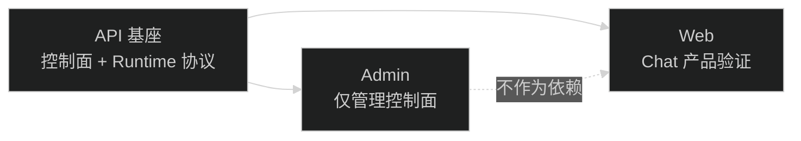

# AI 基座任务地图

本父任务只保留审查结论、架构决策和子任务关系，不直接实现产品代码。

## 子任务顺序

1. `08-21-ai-api-foundation-boundary`
   - 包：`api`
   - 先稳定控制面/runtime 面边界、公开 Harness 协议、Run/Transcript 恢复规则和 Tool contract。
2. `08-21-admin-ai-control-plane-only`
   - 包：`admin`
   - 依赖 API 基座协议；移除 Agent Sessions 聊天入口，只保留 AI 管理控制面。
3. `08-21-web-ai-chat-consumer-validation`
   - 包：`web`
   - 依赖 API 基座协议；用 Web 自己的 Chat 页面验证产品接入，不复用 Admin UI。

## 依赖关系

## 总验收

- API、Admin、Web 三个入口之间没有源码反向依赖。
- Admin 只使用管理接口；Web 只使用运行接口。
- Web Chat 不导入 Admin 页面、组件、API 函数或 Harness reducer。
- HarnessEvent 是独立运行协议，能支持聊天和未来其他产品界面。
- 任何产品 Tool 扩展都经过可信服务端注册和平台安全治理。

## 当前状态

- 父任务：`planning`，只记录规划。
- 三个子任务：`planning`，均未启动。
- 执行顺序：先启动 API 子任务；完成并验证后，再启动 Admin 或 Web 子任务。
