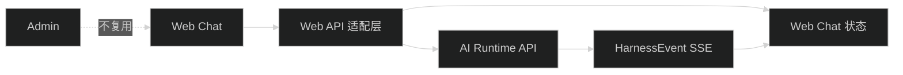

# Web Chat 作为 AI 产品接入验证

## 技术边界



- Web 负责页面、输入、加载状态和产品自己的事件归并。
- AI API 负责 Agent Run 事实和事件，不负责 Chat 页面布局。
- Web API 适配层可以复用 `@starter/contracts`，不能复用 Admin 私有 API 或 reducer。

## 推荐最小流程

```text
登录 Web
  -> 创建或获取 Session
  -> POST Agent Run
  -> 消费 HarnessEvent
  -> 展示 assistant 增量
  -> 收到 terminal event 后刷新 Run/Transcript
  -> 连接中断则轮询 Run 并读取 Transcript
```

## 约束

- 首个版本只处理单 Session、单 lane、文本输入和文本输出。
- Thinking、Tool、Compaction 只做状态提示或安全摘要，不复制 Admin 的完整时间线 UI。
- 运行协议中的 `sequence`、`runId` 和 terminal event 由 Web 保留，用于去重和恢复。
