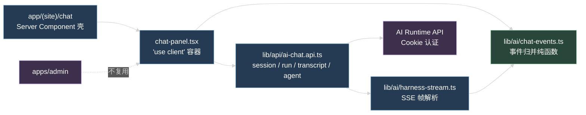
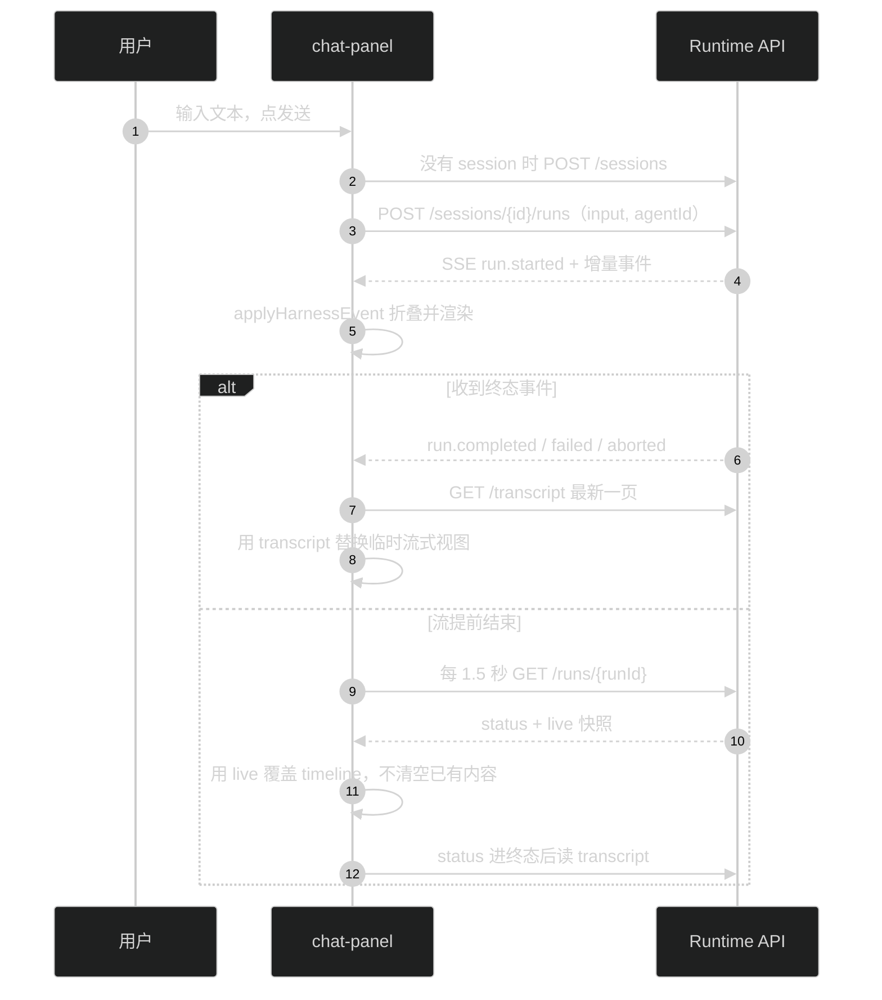

# Web Chat 作为 AI 产品接入验证

## 技术边界

- Web 负责页面、输入、加载状态和自己的事件归并，归并逻辑是不依赖 React 和 DOM 的纯函数。
- AI API 负责 Agent Run 事实和事件，不负责 Chat 布局。
- Web 复用 `@starter/contracts` 的 schema 做运行时校验，不导入 `apps/admin` 的任何源码。
- Web 用浏览器已有的 Better Auth Cookie 调运行面，不接触应用凭据 secret。

## 接口清单

全部走 `apps/web/lib/rpc.ts` 的 `apiRpc`，认证是现有登录 Cookie（`credentials: 'include'`）。运行面在没有 `Authorization: Bearer` 头时按 Starter 用户鉴权，见 `apps/api/src/modules/ai/principal.guard.ts`。

| 动作           | 接口                                                  | 返回                                     |
| -------------- | ----------------------------------------------------- | ---------------------------------------- |
| 可用 Agent     | `GET /api/ai/agents`                                  | `AgentDefinitionSummaryList`，服务端已过滤 `enabled` |
| Session 列表   | `GET /api/ai/sessions`                                | `AgentSessionList`，默认不含归档         |
| 创建 Session   | `POST /api/ai/sessions`                               | `AgentSession`                           |
| 历史           | `GET /api/ai/sessions/{sessionId}/transcript`         | `AgentTranscript`                        |
| 启动 Run       | `POST /api/ai/sessions/{sessionId}/runs`              | `text/event-stream`，不是 JSON envelope   |
| Run 状态       | `GET /api/ai/sessions/{sessionId}/runs/{runId}`        | `AgentRun`，含可选 `live` 快照           |
| 停止生成       | `POST /api/ai/sessions/{sessionId}/runs/{runId}/abort` | `AgentRun`                               |

两个容易踩的点：

- 启动 Run 的响应直接是 SSE 流，`unwrapApiData` 不能用，要自己读 `response.body`。因为是 POST，`EventSource` 也用不了。
- transcript 默认 `direction: 'backward'`、`limit: 50`，返回的 `items` 是时间正序，`nextCursor` 指向更早一页。本次只读最新一页，不做翻页。

## 文件布局

| 文件                                            | 职责                                                                   |
| ----------------------------------------------- | ---------------------------------------------------------------------- |
| `app/(site)/chat/page.tsx`                      | Server Component 壳：metadata、标题、说明，挂载客户端容器              |
| `app/(site)/_components/chat/chat-panel.tsx`    | `'use client'`：登录判断、提示区、空状态，组装时间线和输入区           |
| `app/(site)/_components/chat/chat-composer.tsx` | Agent 下拉、输入框、发送和停止按钮                                     |
| `app/(site)/_components/chat/chat-timeline.tsx` | 渲染 transcript 历史和流式 timeline：text/thinking 块、tool、compaction |
| `hooks/use-chat-run.ts`                         | Session 与 Run 生命周期：启动加载、发送、断流轮询、终态读 transcript、停止 |
| `lib/ai/chat-events.ts`                         | 事件归并纯函数，与 API `run.live-snapshot.ts` 同构                     |
| `lib/ai/chat-run-view.ts`                       | 提示文案、终态归因、用 live 快照覆盖本地 timeline                      |
| `lib/ai/harness-stream.ts`                      | 读 `ReadableStream`，切 SSE 帧，`harnessEventSchema.safeParse`          |
| `lib/api/ai-chat.api.ts`                        | 上表六个 JSON 请求 + contracts schema 校验                             |
| `test/chat-events.test.ts`                      | 归并规则与 fixture 同构断言                                            |
| `test/harness-stream.test.ts`                   | SSE 帧解析：心跳、坏帧、跨 chunk 半帧、非 2xx 错误                     |
| `vitest.config.ts`                              | 新增，`environment: 'node'`，别名 `@web`                               |

`app/(site)/_components/chat/` 跟着现有 `_components/home`、`_components/site` 的分组走。`lib/ai/` 只放与协议相关的纯逻辑，不放 React。Run 编排放 `hooks/`，按 `.trellis/spec/web/frontend/directory-structure.md` 的浏览器 hook 归属。

导航入口加在 `app/(site)/_components/site/site-nav.tsx` 的 `navItems` 末尾，图标用 `lucide-react` 的 `MessagesSquare`，页面 eyebrow 续号 `CHAT / 04`。

## 事件归并

Web 自己实现折叠，规则以 `apps/api/src/modules/ai/run/run.live-snapshot.ts` 为准，产出结构与 `agentRunLiveSnapshotSchema` 同构：

- `sequence <= lastSequence` 的事件直接丢弃，用于重连去重。
- `message.started` 追加 message 元素；`message.delta` 追加到最后一个 text 块，没有就新建。
- `thinking.*` 按 `blockIndex` 定位 thinking 块，`thinking.completed` 用 `content` 覆盖。
- `message.completed`：只有一个 text 块就用事件 `content` 覆盖；没有 text 块且 `content` 非空就追加；有多个 text 块时保留 delta 累积出来的顺序，不重排也不合并。
- `tool.started/progress/completed` 按 `toolCallId` upsert 同一个 tool 元素。
- `context.compacted` 追加 compaction 元素。
- `turn.started` 更新 `turn` 和 `maxTurns`（Web 启动 Run 时手上没有 Run snapshot，从事件补齐）；`run.started`、`turn.completed` 和终态事件只推进 `lastSequence`。
- 上限一致：timeline 最多 128 条，单条 message 最多 64 个块，超限丢最旧的。

和 API 实现的差别有两处：API 就地改对象，Web 返回新对象让 React 能拿到新引用；Web 状态里多 `status`、`errorCode` 和 `errorMessage`。

终态事件不进 timeline，只改这三个字段，用来控制输入框和错误提示。

## 流式消费与恢复

恢复规则来自 `.trellis/spec/api/backend/ai-system-design.md`：

- 流提前结束不是失败。已经收到过事件就转轮询，一个事件都没收到才按启动失败报错。
- 轮询判据是 `AgentRun.status`，`live` 为 `null` 且状态是终态时直接读 transcript。
- 页面卸载、切走或用户点停止都要 `AbortController.abort()`，同时清掉轮询定时器。
- 轮询用 `setTimeout` 链式调度而不是 `setInterval`：`getAgentRun` 比间隔慢时不会并发，避免重复读 transcript。
- 停止按钮要等 `run.started` 带来 runId 才能用；在那之前 abort 接口没有目标，只中断读流会让服务端 Run 继续跑、下次发送撞 409。
- 页面挂载时读 Session 列表：有未归档 Session 就复用最新一个并读 transcript，没有就等到首次发送时再创建，避免空 Session 堆积。

## 状态与错误

状态全部是组件局部 state，不引入全局 store，也不写 localStorage：

| 状态             | 归属                                    |
| ---------------- | --------------------------------------- |
| 登录态           | `authClient.useSession()`               |
| Agent 列表、选中 | `chat-panel` 的 `useState`              |
| 当前 session     | `chat-panel` 的 `useState`              |
| 归并结果         | `useReducer(applyHarnessEvent)` 或等价 state |
| 历史 transcript  | `chat-panel` 的 `useState`              |
| 输入框文本       | `chat-panel` 的 `useState`              |

页面级状态覆盖：读取登录态中、未登录、没有可用 Agent、历史加载中、加载失败可重试、Run 运行中、Run 失败带错误码、Run 已取消。

错误判断按 `ApiRequestError.status` 和 contracts error code，不看中文 message。401 提示重新登录，404 当作 Session 失效并清掉本地 session 引用，409 `AI.SESSION_BUSY` 换成产品文案（API 原文带「Session lane」这类内部概念）。为了拿到 error code，`lib/http.ts` 的 `ApiRequestError` 加了可选 `code` 字段。

Run 失败时 `run.failed.data.error.message` 是 API 给的可读说明，透传成主文案、错误码作为附注；分支判断仍只看 code。

## 测试

`apps/web` 目前没有测试框架，本次只加最小配置：

- 新增 devDependency `vitest`（用 `catalog:`），`environment: 'node'`，不装 jsdom、`@vitejs/plugin-react` 和 testing-library。
- `package.json` 加 `"test": "vitest run"`，`pnpm test` 通过 turbo 已有的 test task 自动带上 web。
- `apps/web/tsconfig.json` 的 `include` 是 `**/*.ts`，测试文件和 `vitest.config.ts` 自动被类型检查覆盖，不用改 tsconfig。

`test/chat-events.test.ts` 至少覆盖：

- 读 `test-fixtures/harness-timeline-isomorphism.json`（相对路径），把 18 个事件依次 apply 后，输出与 `liveSnapshot` 深度相等，包含 `lastSequence: 18`、`turn: 2`、四条 timeline 和第二条 message 的 text/thinking/text 三块顺序。
- 重复和乱序 sequence 被丢弃。
- 终态事件不进 timeline，只改 status，并保留 `run.failed` 的可读说明。
- timeline 超过 128 条时丢最旧的；单条 message 的块数停在 64。
- fixture 覆盖不到的规则自己构造事件补上：content 与 delta 累积结果不一致时以 content 为准；一条 message 内两个 blockIndex 的 thinking 块各自累积；`message.completed` 无 text 块且 content 非空时追加；`tool.progress` 写进同一个 tool 元素。

验证断言强度的方法是逐条改坏 `chat-events.ts` 的规则，确认对应用例会红。只有 fixture 一条主断言时，上面四类漂移都测不出来。

`test/harness-stream.test.ts` 覆盖 SSE 帧解析：心跳注释行、坏帧丢弃、`\r\n\r\n` 分隔、跨 chunk 的半帧、非 2xx 错误。

不测页面渲染：Next.js Server Component 加 Better Auth client 的渲染测试成本高于收益，页面行为靠手工验收。

## 约束

- 只处理单 Session、单 lane、文本输入输出。不做 steer、follow-up、Session 列表切换、transcript 翻页。
- Thinking 默认折叠成一行，Tool 显示名称、状态和 `safeSummary`，Compaction 显示一行说明。不复制 Admin 已删除的时间线 UI。
- 不引入 React Query、状态库、Markdown 渲染器和 Chat SDK。首个版本按纯文本渲染，保留换行。
- 不实现 React Flow、DAG、工作流编辑器和产品业务 Tool。
- 不把应用凭据 secret 放进前端。

## 顺带修复

`apps/api/src/modules/ai/run/run.live-snapshot.ts` 的类注释还写着「折叠规则与 `apps/admin/src/features/ai/harness/stream-reducer.ts` 保持同构」，该文件在 `08-21-admin-ai-control-plane-only` 已删除。本次把这句改成指向 fixture 和产品前端实现，避免后续开发照注释去找不存在的文件。
