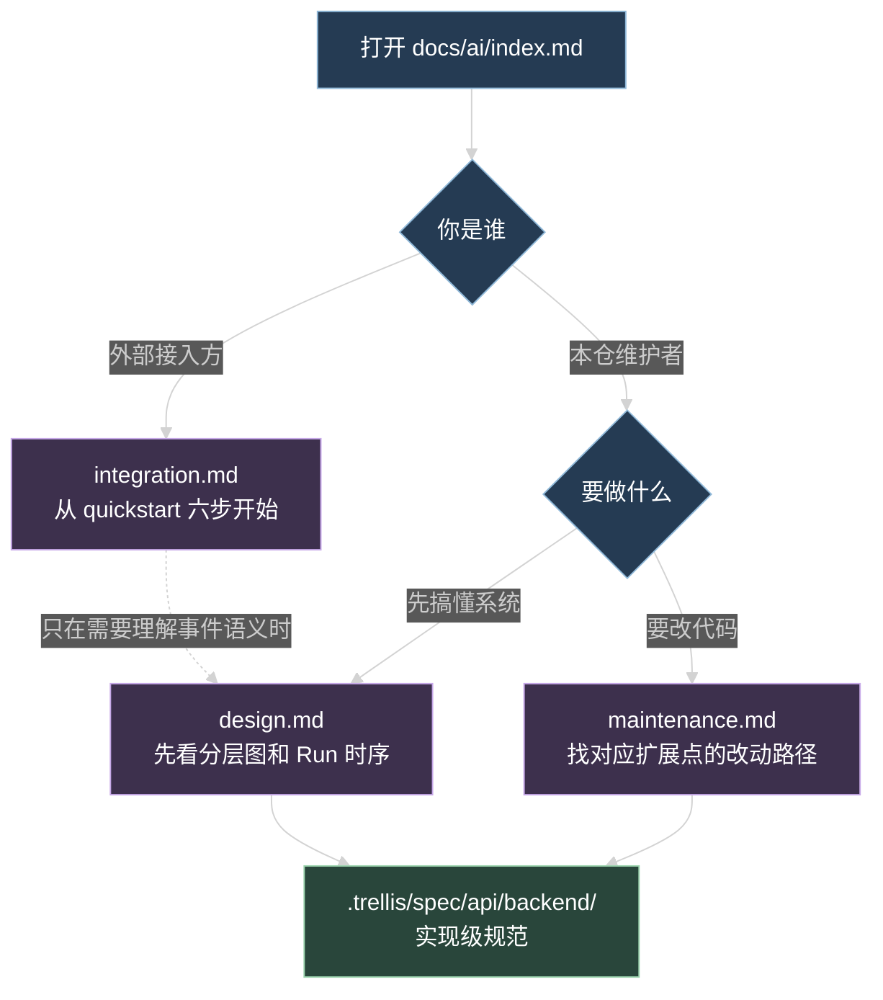

# 文档设计：docs/ai/

这份设计定的是文档本身的结构：文件怎么拆、每篇写哪些小节、图放哪、事实从哪核对。落笔前按这份大纲执行，写作过程中如果发现某节没有可核对的事实，回到 `prd.md` 改需求，不即兴补内容。

## 1. 目录结构

```
docs/
└── ai/
    ├── index.md          入口、读者分流、术语表
    ├── design.md         架构、数据流、状态机、鉴权模型
    ├── maintenance.md    扩展点、改动顺序、数据表、验收、运维、排查
    └── integration.md    第三方接入协议与 quickstart
```

`README.md` 的「目录」一节补一行：

```
- `docs/ai`：AI 模块的设计、维护和第三方接入文档。
```

## 2. 读者分流



单向依赖：`integration.md` 自洽，不要求读者读过 `design.md`；`design.md` 和 `maintenance.md` 可以互相引用，深度细节都指向 `.trellis/spec/api/backend/`。

## 3. 每篇的小节大纲

### 3.1 index.md（约 120-200 行）

1. 这套 AI 能力是什么：一段话说清「管理员在后台配 Provider 和 Agent，产品端用 Session + Run 跑对话，第三方应用用应用凭据接同一套运行面」。
2. 三份文档怎么选：上面那张分流图 + 一句话说明。
3. 术语表：Agent Definition、Agent Session、Agent Run、lane、Principal、Scope、HarnessEvent、Transcript、live 快照、Provider、Skill、Tool、Prompt。每条一句定义 + 一个「不是什么」的澄清。
4. 三个 OpenAPI 面（Control / Runtime / Compatibility）各自的用途和调用方。
5. 相关代码与规范位置索引。

术语表是全文用词基准，三篇文档里同一概念不允许换称呼。

### 3.2 design.md（约 300-400 行）

1. 系统承诺：`POST /api/ai/test` 与 `POST /api/ai/sessions/{sessionId}/runs` 两类调用的区别。
2. 分层总览图 + 三条边界（contracts 只定协议、infra 才碰 Pi 类型、前端只消费 API 和事件）。
3. 模块职责：`agent`、`session`、`run`、`application`、`configuration`、`prompt`、`skill`、`tool`、`usage-audit` 各一段，写清「负责什么」和「不负责什么」，标注代码目录。
4. 一次 Run 的时序图 + 分阶段说明：输入校验 → lane 占用 → Run 行创建 → Agent loop → Tool 阶段 → 终态写入。
5. 三种产物的关系：HarnessEvent（进程内、实时）、live 快照（进程内、可选字段）、Pi transcript 与主库记录（持久事实）。配双库写入与审计去向图。
6. Run 状态机图 + 终态写入顺序 + 启动恢复扫描做什么。
7. 鉴权与 scope 模型：两种 Principal、`RuntimeAccessContext` 的组成、`accessWhere` 的过滤维度。
8. 设计约束：不复制 Pi Agent loop、不在主库复制 transcript、不把 HarnessEvent 当历史日志、不用前端缓存恢复业务状态。
9. 深读入口：五份 spec 文件各自覆盖什么。

### 3.3 maintenance.md（约 300-400 行）

1. 改动前先确认的三件事：改的是协议、执行还是控制面；影响哪些消费方；要不要 migration。
2. 扩展点逐条写改动路径，每条给「改哪些文件 → 按什么顺序 → 跑哪些命令」：
   - 新增 Provider
   - 新增 Tool
   - 新增 Skill
   - 新增 Prompt 或 Prompt 模板
   - 新增 Agent Definition
   - 新增 HarnessEvent 类型
3. 跨层改动顺序：contracts → api schema/route/presenter → service/repository → 消费端封装 → 测试，并说明为什么反过来改会漏。
4. AI 数据表清单：15 张表，每张写用途和禁止落库的字段。
5. 审计口径：`ai_model_calls` 的 `scenario` 取值、`ai_tool_executions` 的 begin/finalize 约束、两张表都不存正文。
6. 验收命令：五条常规命令 + `db:check` + AI 相关 vitest 单文件命令；说明哪类改动必须起一次 dev 才能验（共享包源码解析那类问题）。
7. 运维动作：migration 执行时机、Provider 密钥轮换、应用凭据 rotate/revoke 的影响面、Pi Session DB 与主库的备份关系、启动恢复扫描日志怎么读。
8. 故障排查表：症状 → 先看哪里 → 怎么确认 → 怎么处理。至少覆盖 Run 卡在非终态、SSE 收不到事件、401 与 404 分不清、模型不可用、Tool 超时、Session 双库孤儿记录。

### 3.4 integration.md（约 350-400 行）

1. 接入前提：平台方需要提供什么（应用凭据 secret、`agentId`、API base URL），以及凭据只在创建和 rotate 时返回一次。
2. 鉴权：Bearer 应用凭据 vs 浏览器 Cookie 的分叉图，三个 subject 头的规则，隔离维度与「换 subject 就看不到原 Session」的后果。
3. quickstart 六步，每步 curl + TypeScript：
   1. 管理员创建应用凭据（`POST /api/ai/admin/applications`）
   2. 创建 Session（`POST /api/ai/sessions`，带 `defaultAgentId`）
   3. 启动 Run 并读 SSE（`POST /api/ai/sessions/{sessionId}/runs`）
   4. 断流后轮询 Run 状态与 `live`（`GET /api/ai/sessions/{sessionId}/runs/{runId}`）
   5. 终态后读 transcript（`GET /api/ai/sessions/{sessionId}/transcript`）
   6. 停止生成（`POST .../abort`）
4. 接入时序图（含断流轮询与终态读 transcript 的分支）。
5. Runtime 接口详表：逐个端点写方法、路径、请求字段、响应形态、鉴权要求、常见错误。
6. HarnessEvent 消费：事件 envelope 字段、事件类型清单、SSE 帧解析规则（空行切帧、跳过 `:` 注释心跳、坏帧只丢该帧、跨 chunk 残帧）、折叠规则要点、`sequence` 去重。
7. 错误码表：错误码 → HTTP 状态 → 触发条件 → 客户端该怎么做。
8. 当前限制与规避做法：`prd.md` 里那七条，每条一段。
9. Control 面与 Compatibility 面概览表格：说明哪些端点只给管理员和 Admin 用，第三方不要接。

## 4. 图的归属与画法

| 图 | 位置 | 类型 | 要表达的事 |
| --- | --- | --- | --- |
| 模块分层总览 | design.md | flowchart LR | 客户端 / contracts / route / service / infra / 双库 的边界 |
| 一次 Run 的时序 | design.md | sequenceDiagram | 从 POST 到终态事件的调用顺序，含 Tool 分支 |
| Run 状态机 | design.md | stateDiagram-v2 | starting/running 到四种终态，含 interrupted |
| 双库写入与审计去向 | design.md | flowchart TD | 一次 Run 产生的事件、message、terminal entry、两张审计表分别去哪 |
| 鉴权分叉与 scope 隔离 | integration.md | flowchart TD | 有无 Bearer 头的分叉，以及 scope 六个字段如何决定可见范围 |
| 第三方接入时序 | integration.md | sequenceDiagram | quickstart 六步的真实顺序，含断流轮询回到 transcript |

统一规则：首行 `%%{init: {"theme": "dark"}}%%`；节点标签超过 12 个字用 `<br/>` 换行；同一篇里的 `classDef` 配色沿用 `.trellis/spec/api/backend/ai-system-design.md` 已有的四组（boundary 蓝、runtime 紫、storage 绿、event 黄），保持两处文档看起来是一套。

验证方式：把每个 mermaid 代码块抽到临时 `.mmd`，跑 `mmdc -i <file> -o /tmp/<name>.png -w 2048`。`mmdc` 报 `Could not find Chrome` 时改用 Kroki 的 `curl` 校验，不改写语法正确的图。临时文件验证完删掉，不进仓库。

## 5. 与 .trellis/spec 的引用边界

| 内容 | docs/ai 里写到什么程度 | 指向哪份 spec |
| --- | --- | --- |
| 终态写入的四步顺序、失败时谁负责补 | 写清顺序和结论 | `agent-run-guidelines.md` |
| 恢复扫描的身份字段匹配判据 | 只说「五个字段全等才算合法」 | `agent-run-guidelines.md` |
| Session 双库创建补偿、cursor 语义 | 说清默认从最新一页开始 | `agent-session-guidelines.md` |
| Pi Agent loop、compaction、Tool adapter 细节 | 说清可观测事件和审计约束 | `pi-agent-execution-guidelines.md` |
| Provider 凭据加密、模型白名单、Gateway | 说清管理面职责和 secret 边界 | `ai-integration-guidelines.md` |
| live 折叠规则逐条 | 给要点 + 指向 fixture | `run.live-snapshot.ts` 与 `test-fixtures/harness-timeline-isomorphism.json` |

判断标准：docs 回答「是什么、怎么用、改哪里」，spec 回答「实现必须满足哪些约束」。同一句话不要在两边各写一遍。

## 6. 写作与核对顺序

1. 先建 `docs/ai/index.md` 的术语表，定住全文用词。
2. 写 `integration.md`：它对事实最敏感，路径、header、错误码逐条对 `*.openapi.ts` 和 `packages/contracts/src/ai.ts`。
3. 写 `design.md`：结构从代码目录和 `ai.route.ts` 的组装顺序反推，图先画再配文字。
4. 写 `maintenance.md`：表清单对 `ai.schema.ts`，命令对各 `package.json` 的 `scripts`。
5. 补 `index.md` 剩余部分和 `README.md` 链接。
6. 全篇过一遍 `xdd-plain-docs` 硬边界，再跑图验证和格式检查。

核对时的硬规矩：文档里每一个路径、字段名、header 名、错误码、命令，都要能在源码里搜到原文。搜不到就删掉那句，或写明「没查到」，不按印象补。

## 7. 明确不做的事

- 不改任何运行代码，包括 `GET /api/ai/agents` 的鉴权缺口，只在文档里记录并给规避做法。
- 不迁移 `.trellis/spec/api/backend/ai-system-design.md`，spec 目录保持不动。
- 不写版本历史、演进路线和设计愿景。
- 不生成 PNG/SVG 图片文件进仓库，图只以 mermaid 代码块内联。
- 不写英文版。
- 不加 SDK 包、示例仓库或可运行脚本，示例只作为文档内代码块。
