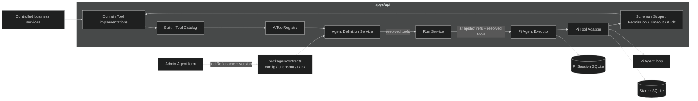
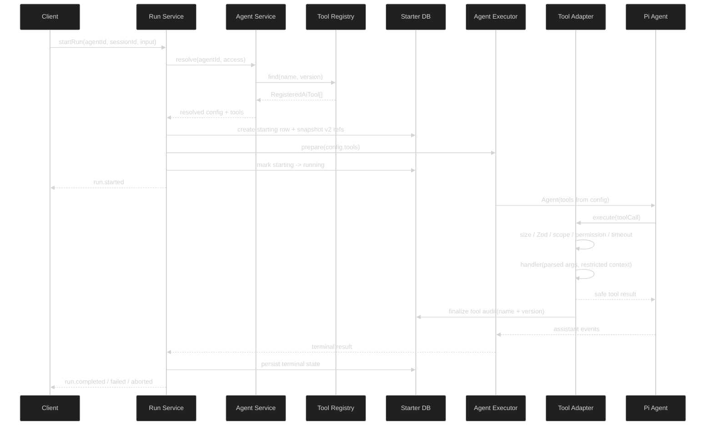

# API 内置 AI Tool Catalog 设计

## 1. 设计结论

本任务采用 API 内置 Tool Catalog，不拆独立 package，不做远程 Tool，不把 Tool 定义放进数据库。

边界固定为：

- `apps/api/src/modules/ai/tool/`：Tool contract、Registry、Catalog、策略和测试 Tool。
- `apps/api/src/modules/ai/<domain>/`：靠近业务 service 的内置 Tool 实现，例如 `skill/skill-tools.ts`。
- `apps/api/src/infra/agent/`：Pi Agent Executor 和 Tool Adapter，只负责运行时执行和 Pi 类型适配。
- `packages/contracts/src/ai.ts`：Agent 配置、Run snapshot、Admin Tool summary 和 Tool audit DTO；不放 handler、Zod runtime schema 或 Pi 类型。
- `apps/admin/`：只选择已部署的 Tool ref，不编辑 Tool 定义。



## 2. 不变量

### 2.1 Tool 的来源

1. 生产 Tool 只能通过 API 源码中的显式 Catalog 注册。
2. 不扫描目录、不读取数据库中的 handler 名称、不动态 import 请求参数、不执行 Admin 上传的代码。
3. `RuntimeDeps.aiTools` 继续作为测试注入入口，但注入的是已构造的内存 Tool registry；它不是生产动态扩展机制。
4. Catalog 入口只组装已审核的 Tool。测试 Tool 只有 `AI_TEST_TOOLS_ENABLED=true` 时加入。

### 2.2 Tool 的身份

Tool 的执行身份是精确的：

```text
name + '@' + version
```

`name` 是 Pi 和模型看到的唯一 Tool 名称；`version` 是 API registry、Agent config、Run snapshot 和 audit 使用的固定版本。

Registry 可以同时存在：

```text
lookup@1.0.0
lookup@2.0.0
```

但同一个 Agent 不得同时引用两个 `lookup` 版本，因为 Pi Tool 列表按 `name` 调用，没有第二个版本选择字段。

### 2.3 配置版本

Agent Definition 和 Run snapshot 统一使用：

```ts
schemaVersion: 2
toolRefs: Array<{ name: string; version: string }>
```

不再读取或转换：

- `schemaVersion: 1`
- `toolNames`
- 没有 version 的对象
- `latest`
- `^1.0.0`、`>=1.0.0` 等版本范围

这是开发阶段的破坏性翻新，不新增 v1/v2 union，不写一次性转换器，不在读取时猜测 `1.0.0`。测试和本地数据直接按 v2 重建；旧数据读取失败时按现有配置损坏路径处理。

### 2.4 运行固定

Run 启动时只解析一次：

```text
Agent config refs
  -> Agent Service 精确查找
  -> ResolvedAgentDefinition.tools
  -> Run Service 写无代码 snapshot
  -> Executor 直接接收 RegisteredAiTool[]
```

Executor 不再根据 `toolNames` 或 ref 重新查 registry。运行中的 handler、schema、timeout、scope 和 permission 由当前进程内的 `RegisteredAiTool[]` 闭包固定。

数据库只保存：

```json
{
  "schemaVersion": 2,
  "agentId": "...",
  "agentRevision": 3,
  "model": { "providerId": "...", "modelId": "..." },
  "systemPromptId": "...",
  "skillIds": [],
  "toolRefs": [{ "name": "lookup", "version": "1.0.0" }],
  "thinkingLevel": "off",
  "maxTurns": 8
}
```

不保存 handler、Zod schema、arguments、result、secret。

## 3. 内部类型设计

### 3.1 Tool Ref

`packages/contracts/src/ai.ts` 增加共享 schema：

```ts
export const aiToolRefSchema = z.strictObject({
  name: z.string().trim().min(1).max(64),
  version: z.string().trim().regex(/^\d+\.\d+\.\d+$/),
})

export type AiToolRef = z.infer<typeof aiToolRefSchema>
```

Tool ref 只作为 JSON 配置和 DTO。它不带 `description`、`scope`、`timeoutMs` 或权限，因为这些都来自运行时 Catalog。

`agentToolRefsSchema` 负责：

- 最多 64 项。
- 不允许完全相同的 ref 重复。
- 进一步的同名多版本冲突由 API Agent Service 校验，因为该规则属于执行能力而不是纯 JSON 形状。

### 3.2 Agent Definition Config

替换现有配置：

```ts
export const agentDefinitionConfigSchema = z.strictObject({
  schemaVersion: z.literal(2),
  model: strictAiModelRefSchema.nullable(),
  systemPromptId: uuidSchema.nullable(),
  skillIds: agentSkillIdsSchema,
  toolRefs: agentToolRefsSchema,
  thinkingLevel: agentThinkingLevelSchema,
  maxTurns: z.number().int().min(1).max(32),
})
```

`defaultAgentDefinitionConfig` 的空工具字段为 `toolRefs: []`。

### 3.3 Run Snapshot

```ts
export const agentRunSnapshotSchema = z.strictObject({
  schemaVersion: z.literal(2),
  agentId: uuidSchema,
  agentRevision: z.number().int().min(1),
  model: strictAiModelRefSchema,
  systemPromptId: uuidSchema.nullable(),
  skillIds: agentSkillIdsSchema,
  toolRefs: agentToolRefsSchema,
  thinkingLevel: agentThinkingLevelSchema,
  maxTurns: z.number().int().min(1).max(32),
})
```

Run snapshot 只证明 Run 启动时选中了哪些资源。它不是 handler 恢复协议。

### 3.4 API Tool 类型

`apps/api/src/modules/ai/tool/tool-registry.ts` 继续拥有 API 内部类型，但收紧执行上下文：

```ts
export interface AiToolExecutionContext {
  principal: PrincipalContext
  scope: ResourceScope
  requestId: string
  signal: AbortSignal
  reportProgress: (safeSummary: string) => void
}

export interface AiToolResult {
  modelText: string
  safeSummary: string | null
}

export interface RegisteredAiTool {
  name: string
  version: string
  description: string
  inputSchema: ZodType<unknown>
  timeoutMs: number
  scope: AiToolScope
  requiredPermission: Permission | null
  execute: (
    context: AiToolExecutionContext,
    input: unknown,
  ) => Promise<AiToolResult>
}
```

`userId` 不再作为 handler context 独立字段。Starter User 权限查询需要由 Adapter 根据完整 `PrincipalContext` 决定；Tool handler 不应自行调用权限系统。

### 3.5 Executor Config

`apps/api/src/infra/agent/agent-executor.ts`：

```ts
export interface ResolvedAgentExecutorConfig {
  model: AiModelRef
  systemPrompt?: string
  thinkingLevel?: AgentDefinitionConfig['thinkingLevel']
  maxTurns: number
  tools: readonly RegisteredAiTool[]
}
```

删除 `toolNames` 和 `selectTools()`。Executor 创建 adapter 时直接使用 `config.tools`。

## 4. Catalog 和 Registry

### 4.1 Registry API

Registry 改为精确 ref 查询：

```ts
export interface AiToolRegistry {
  list: () => readonly RegisteredAiTool[]
  find: (ref: AiToolRef) => RegisteredAiTool | undefined
  require: (ref: AiToolRef) => RegisteredAiTool
  listPublic: () => readonly AiToolSummary[]
}
```

`find` 不再接受单独的 name；所有调用方必须明确版本。`require` 用于 Agent Service，把缺失项统一转换为配置无效错误。

`listPublic()`返回新数组和公开字段，不暴露 `inputSchema`、`execute` 或可被修改的内部对象。`AiToolSummary` 至少含 `name`、`version`、`description`、`scope`；是否展示具体权限 key 按当前 contracts 公开 DTO 保持最小化。

Registry 建立两个索引：

```text
byRef: Map<name@version, RegisteredAiTool>
byName: Map<name, readonly RegisteredAiTool[]>
```

`byName` 只用于检测同名多版本和稳定的公开排序，不用于执行时隐式选版本。

### 4.2 Catalog 入口

新增 `apps/api/src/modules/ai/tool/tool-catalog.ts`：

```ts
export function createBuiltinAiToolRegistry(input: {
  injectedTools: readonly RegisteredAiTool[]
  skillRepository: AiSkillRepository
}): AiToolRegistry {
  return createAiToolRegistry([
    ...input.injectedTools,
    createReadSkillTool(input.skillRepository),
  ])
}
```

如果当前注入的 `runtime.aiTools` 本身是 registry，Catalog 入口取 `runtime.aiTools.list()`；生产默认 registry 为空，测试通过 `RuntimeDeps.aiTools` 提供 fake Tool。

`ai.route.ts` 只调用一次 Catalog factory；后续业务 Tool 通过该 factory 显式加入。`create-runtime.ts` 只负责创建依赖和测试注入，不负责拼业务 Tool。

### 4.3 Tool 实现边界

- `read_skill` 继续使用 `AiSkillRepository`，不拆出 API。
- 未来 Tool 按业务模块放置，例如 `skill/skill-tools.ts`、`application/application-tools.ts`。
- Tool 不接收 `AppRuntime`、Drizzle `db`、Better Auth session 或 Hono context。
- 访问业务数据使用明确的受控 service 函数，函数参数必须包含 `tenantId`、`projectId` 等 scope 信息。
- Tool 返回值由实现负责业务脱敏，Adapter 负责长度和类型边界。

## 5. Agent Service 数据流

### 创建 / 更新 / 启用

1. API/OpenAPI 使用 `agentDefinitionConfigSchema` 解析 v2 config。
2. `normalizeConfig()` 排序 `skillIds` 和 `toolRefs`；Tool refs 按 `name@version` 稳定排序。
3. `validateConfig()` 对每个 ref 调 `toolRegistry.find(ref)`。
4. 缺失 ref、scope 不可用或同名多版本直接抛 `AI_AGENT_CONFIG_INVALID`，details 只包含安全的 `resource: 'tool'`。
5. `sameConfig()` 比较结构化 `toolRefs`，不得比较原始 JSON 字符串。
6. draft 允许缺少 model/systemPrompt，但所有已填写 Tool refs 必须存在；enabled 必须全部可执行。

### Resolve

`resolve()` 再次读取当前 Agent 记录并解析所有资源：

```text
record.configJson
  -> agentDefinitionConfigSchema.parse
  -> model / prompt / skills / toolRefs
  -> RegisteredAiTool[]
  -> ResolvedAgentDefinition
```

配置被删除、旧 schema v1 或损坏 JSON 时不返回原始 JSON；按现有配置无效或内部错误边界处理。

### Tool 同名版本检查

纯 schema 只拒绝完全相同 ref；Service 额外检查：

```ts
const names = new Set<string>()
for (const ref of config.toolRefs) {
  if (names.has(ref.name)) throw invalidConfig('tool')
  names.add(ref.name)
}
```

因此 `lookup@1.0.0 + lookup@2.0.0` 无法保存或启用。

## 6. Run 数据流和生命周期



Run Service 在写 snapshot 前使用 `buildSnapshot()` 复制 `resolved.config.toolRefs`，不把 `resolved.tools` 序列化。

Run Service 传给 Executor：

```ts
config: {
  model: resolved.model,
  systemPrompt: resolved.systemPrompt,
  thinkingLevel: resolved.thinkingLevel,
  maxTurns: resolved.maxTurns,
  tools: resolved.tools,
}
```

同一次 Run 后续修改 Agent Definition 或替换 Catalog 不改变当前 `tools` 数组。API 进程重启仍由现有恢复流程把非终态 Run 标为 interrupted；不尝试执行 snapshot 中的 ref 来恢复旧 handler。

## 7. Adapter 执行顺序

每次 Tool call 的统一顺序：

1. 根据 adapter 已绑定的 `RegisteredAiTool[]` 按 Tool name 定位；不存在时返回 `not_found`，不调用 handler。
2. 安全检查模型参数：对 `unknown` 参数做有限序列化。无法序列化、序列化后超过 16000 字符或不是 object 时返回 `invalid_arguments`。
3. 调用 `inputSchema.parse(params)`，失败返回 `invalid_arguments`。
4. 检查 Tool scope 与当前 `ResourceScope`。
5. 检查权限主体：`starter_user` 才能查询 `hasPermission(principal.principalId, permission)`；`product_app` 对当前 Starter permission 直接 forbidden。
6. 创建 `AbortController`，合并调用 signal、Tool timeout 和 Run 剩余时间。
7. 调用 handler，只传 `AiToolExecutionContext` 和 parsed input。
8. 校验结果类型：`modelText` 是字符串且不超过 16000，`safeSummary` 是 null 或不超过 1000 字符。
9. 成功或失败都 finalize 已创建 audit；重复 finalize 用内存标记和数据库 `status = running` 条件保护。
10. 原始异常只进入安全失败分类，不进入日志、SSE、transcript DTO 或 audit。

Tool 自身 timeout 仍然不终止整个 Run；只有调用方取消和 Run 总时长耗尽使用 `terminate: true`。这保持现有 Pi Agent 语义。

## 8. 权限主体设计

现有 `hasPermission(userId, permission)` 只能查 Starter 用户关系。Adapter 不再把 `externalUserId` 作为裸 `userId` 传递。

推荐内部 port：

```ts
hasPermission: (
  principal: PrincipalContext,
  permission: Permission,
) => Promise<boolean>
```

API 实现：

```text
principal.kind === 'starter_user'
  -> authorizationRepository.hasPermission(principal.principalId, permission)

principal.kind === 'product_app'
  -> false
```

如果保留旧 repository 方法，只允许在 `pi-tool-adapter` 的 API 边界做上述分流，不能在 Run Service 把 external user ID 转成 userId。

## 9. Audit 数据设计

### 数据库

`ai_tool_executions` 增加 nullable `tool_version`：

```text
tool_name      NOT NULL
tool_version   NULL for historical rows, NOT NULL by application for new rows
```

由于历史数据没有版本，数据库列允许 null；这不是 Agent config 兼容分支。新增 migration 只做 nullable column，不重建或删除历史 audit。

### Port

`PiToolExecutionAudit.beginToolExecution` 增加 `toolVersion: string | null` 或要求调用处传 string。对于新 Tool 执行，Adapter 始终传 `tool.version`；只有历史数据库行读取时允许 null。

### DTO

`AiToolExecutionAuditSummary.toolVersion` 使用 `z.string().regex(semver).nullable()`。Admin 审计详情显示 `name@version`，历史 null 显示明确的历史记录状态，不猜版本。

### 安全

Audit 永不保存：

- arguments
- modelText
- safeSummary
- 原始 result
- 原始 exception
- secret

## 10. Admin 数据流

Tool 查询接口保持 `/api/ai/admin/tools`，返回 `AiToolSummary[]`。

Admin 表单改动：

```ts
interface AgentFormValues {
  toolRefs: string[] // UI key: name + '\u0000' + version
}
```

使用不可出现在合法 name/version 中的分隔符构造 UI key：

```ts
function toolRefKey(ref: AiToolRef): string {
  return `${ref.name}\u0000${ref.version}`
}
```

显示值使用：

```text
lookup@1.0.0 — 查询客户摘要
```

提交时把 UI key 解码为 `{ name, version }`，生成 `schemaVersion: 2` config。编辑时把 Agent `toolRefs` 转回 UI key。不得把 Tool summary 当作 Agent config 保存，也不得从客户端传回 schema、timeout 或权限。

页面继续覆盖 resource query 的 loading/error/retry，mutation pending 和权限 guard；新增版本显示和表单转换测试。

## 11. 破坏性翻新范围

必须全仓搜索并替换以下执行相关字段：

```text
toolNames
schemaVersion: 1
agentDefinitionConfigSchema(... toolNames ...)
agentRunSnapshotSchema(... toolNames ...)
```

更新：

- API contracts 和 error tests。
- Agent Service、Run Service、Executor、Tool Registry、Catalog。
- Agent API/OpenAPI 类型链路。
- Admin API/query/page/form/i18n/test。
- API fixtures、Run recovery fixtures、cross-product fixtures、harness contract fixtures。
- `.trellis/spec/api/backend/ai-integration-guidelines.md` 中当前 Tool/Agent contract 文字。

不写 data migration。旧开发数据库中的 Agent config 由测试/本地重建流程清理；如果服务启动读取旧 config，按无效配置失败，不做自动修复。

## 12. 错误映射

| 条件 | 结果 |
| --- | --- |
| v1 config / `toolNames` / 缺版本 / 版本范围 | `AI_AGENT_CONFIG_INVALID` 或现有损坏配置内部错误，不返回原始 JSON |
| 精确 ref 不存在 | `AI_AGENT_CONFIG_INVALID`，details 只标记 `resource: tool` |
| 同名多个版本 | `AI_AGENT_CONFIG_INVALID` |
| Runtime 未绑定 Tool | `AI_TOOL_NOT_FOUND` |
| 参数不可安全序列化或超过 16000 | `AI_TOOL_INVALID_ARGUMENTS` |
| Zod 参数失败 | `AI_TOOL_INVALID_ARGUMENTS` |
| scope 不可用 | `AI_TOOL_FORBIDDEN` |
| product_app 调用 Starter permission Tool | `AI_TOOL_FORBIDDEN` |
| Starter User 权限查询失败 | `AI_TOOL_FORBIDDEN`，不降级允许 |
| handler 异常 | `AI_TOOL_FAILED` |
| Tool timeout | `AI_TOOL_TIMED_OUT`，Tool result `terminate=false` |
| caller abort / Run deadline | `AI_TOOL_CANCELLED` / `AI_TOOL_TIMED_OUT`，按现有 terminal 规则处理 |

## 13. 兼容和回滚

这是代码和配置格式的破坏性发布：

- 部署前删除或重建旧 Agent config；不依赖自动迁移。
- 不存在 v1 fallback，因此回滚代码后 v2 config 也不能被旧版本正确读取。回滚前必须恢复对应旧配置快照或重新部署同一版本；发布操作应把配置格式升级和代码部署视为一个不可拆分批次。
- Tool audit 的 nullable version 列向前兼容历史行；回滚到没有该列的代码前，必须同时回滚数据库 schema，不在本任务内自动处理。
- 实施阶段每个 commit 单元都应先通过局部测试，最终再做完整检查；不要在未完成跨层替换时启动 API。

## 14. 设计验收

设计完成的判断：

- 只有一个 API 内显式 Catalog 入口。
- Agent config、Run snapshot、Admin form 和 audit 的 Tool 版本含义一致。
- handler 只看到受限 context 和 parsed args。
- Executor 不依赖当前 registry 二次选 Tool。
- 旧 v1 不兼容且没有隐藏转换路径。
- Product App 权限不会误命中 Starter User 角色。
- Tool arguments/result/secret 不进入不允许的存储或公开层。
