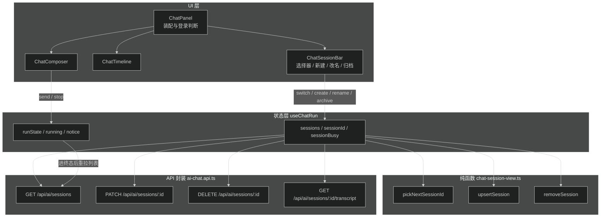
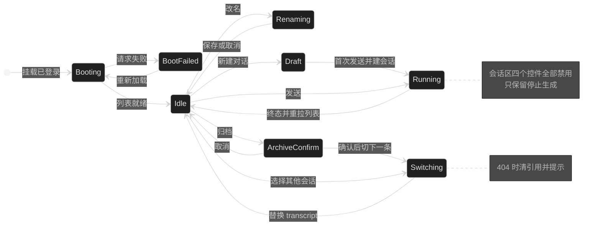

# Design：Web 端 Agent 会话列表与切换、改名、归档

## 边界

只改 `apps/web`。API 的 `sessions` 五个端点已经满足全部需求，`packages/contracts` 的 schema 直接复用。

改动分四层：

| 层       | 文件                                                                                      | 变化                                                                                                  |
| -------- | ----------------------------------------------------------------------------------------- | ----------------------------------------------------------------------------------------------------- |
| API 封装 | `apps/web/lib/api/ai-chat.api.ts`                                                       | 新增`renameAgentSession`、`archiveAgentSession`；`getAgentSessions` 保持 `page=1&pageSize=20` |
| 纯函数   | `apps/web/lib/ai/chat-session-view.ts`（新增）                                          | 列表增删改和「归档后选谁」的逻辑，可单测                                                              |
| 状态     | `apps/web/hooks/use-chat-run.ts`                                                        | 新增会话列表 state 和四个动作，复用现有`handleRequestError`                                         |
| UI       | `apps/web/app/(site)/_components/chat/chat-session-bar.tsx`（新增）、`chat-panel.tsx` | 会话区渲染与交互，`ChatPanel` 只做装配                                                              |

`chat-events.ts`、`chat-run-view.ts`、`harness-stream.ts`、`chat-timeline.tsx`、`chat-composer.tsx` 不动。

## 组件与数据流



## 会话动作的状态流转



## 契约

新增 API 封装与现有函数保持同一形状：`unwrapApiData` + contracts schema 校验 + `parseApiData`。

```ts
export async function renameAgentSession(sessionId: string, title: string): Promise<AgentSession>
export async function archiveAgentSession(sessionId: string): Promise<AgentSession>
```

`useChatRun` 新增返回值：

```ts
{
  sessions: AgentSession[]      // 最近 20 条未归档会话，本地维护顺序
  sessionTotal: number          // 服务端 total，用于「共 N 个会话」提示
  sessionId: string | null      // null 表示未保存的新对话
  sessionBusy: boolean          // 切换 / 改名 / 归档在飞时为 true
  canMutateSessions: boolean    // !running && !sessionBusy && boot === 'ready'
  selectSession: (id: string) => Promise<void>
  startNewSession: () => void
  renameSession: (title: string) => Promise<void>
  archiveSession: () => Promise<void>
}
```

纯函数签名（`lib/ai/chat-session-view.ts`）：

```ts
export function upsertSession(items: AgentSession[], session: AgentSession): AgentSession[]
export function removeSession(items: AgentSession[], sessionId: string): AgentSession[]
export function pickNextSessionId(items: AgentSession[], archivedId: string): string | null
```

- `upsertSession`：已存在则原位替换，不存在则插到首位（新建会话选中后立即可见）
- `removeSession`：按 id 过滤
- `pickNextSessionId`：返回移除 `archivedId` 后的首条 id，空列表返回 `null`

## 关键取舍

- 会话列表顺序本地维护 + Run 终态重拉，不在每次操作后都拉列表。改名和归档能拿到服务端返回的 `AgentSession`，本地更新足够；只有「自动标题」和 `updatedAt` 排序是服务端行为，用一次重拉兜住。
- 新建对话不预先 POST。API 没有空会话清理机制，预创建会在列表里留下永远为空的会话。
- 运行中禁用所有会话操作，而不是切换时中止 Run。中止需要额外协调 `streamRef`、`pollTokenRef` 和 `finishRun` 的 transcript 回写目标，收益低风险高。
- 会话选择器用原生 `select`，与 `ChatComposer` 里的 Agent 选择器保持一致，不引入下拉组件。
- 改名用行内输入框而不是弹窗，Web 目前没有 Dialog 组件。

## 风险与回滚

| 风险                                               | 处理                                                                           |
| -------------------------------------------------- | ------------------------------------------------------------------------------ |
| 切换会话时旧的 transcript 请求晚到，覆盖新会话内容 | `selectSession` 用递增 token（同 `pollTokenRef` 的做法）判断结果是否作废   |
| 归档当前会话后仍向它发请求                         | 归档成功先`rememberSession(next)` 再读 transcript，`sessionIdRef` 同步更新 |
| Run 终态重拉列表失败                               | 只提示不清空，保留本地列表                                                     |
| `sessionBusy` 卡住导致按钮永久禁用               | 所有异步动作用`finally` 复位                                                 |

回滚点：改动集中在 4 个文件（2 个新增、2 个修改），`git checkout` 这几个文件即可恢复。
