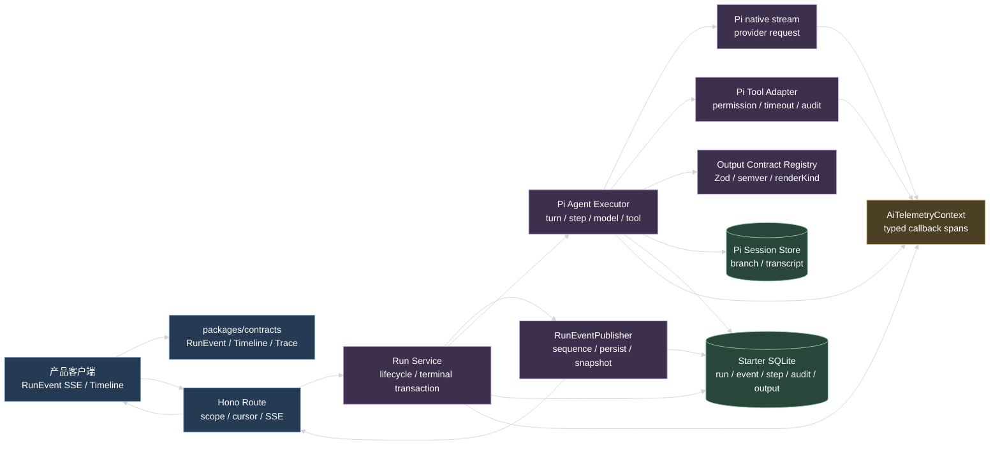
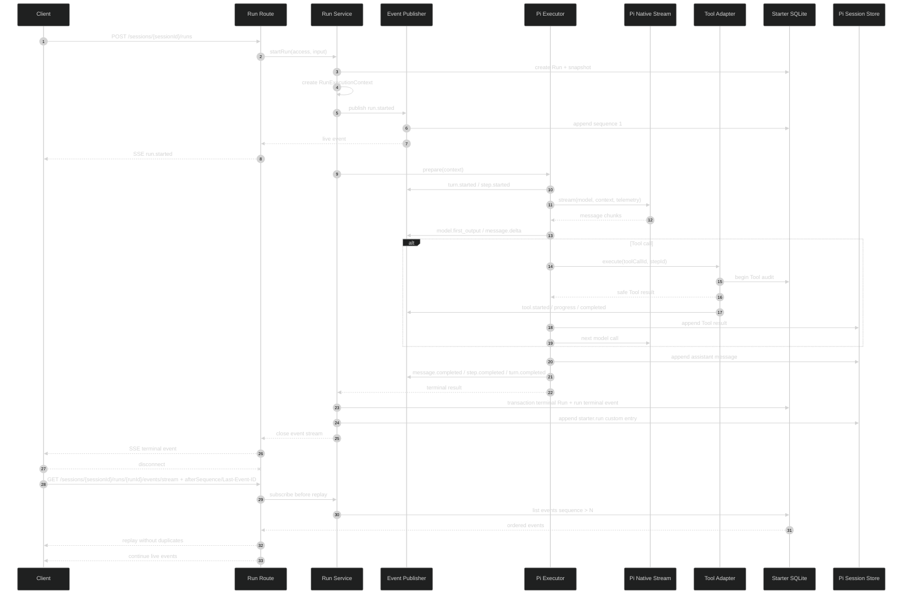
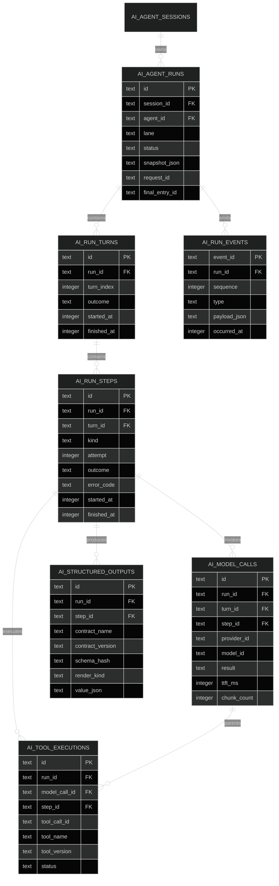
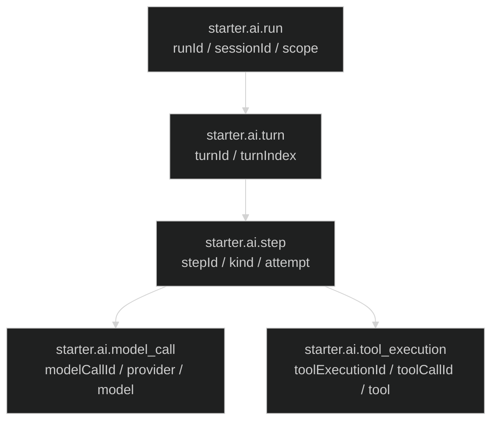

# API AI 运行时重构技术设计

## 1. 设计结论

Starter 运行时只定义一套产品事件 `RunEvent`，只保留一套执行事实模型。Pi 负责 Agent loop、模型消息转换、Tool loop、Session branch 和 transcript；Starter 负责产品事件投影、业务关联、持久时间线、结构化输出和管理查询。

四个边界如下：

1. `packages/contracts`：唯一公共 Zod schema、事件 union、Timeline DTO、Trace DTO 和 Output Contract 引用。
2. `RunExecutionContext`：一次 Run 内的关联 ID、当前 Turn/Step/Model Call/Tool Execution 和安全投影上下文。
3. `RunEventPublisher`：分配 sequence、校验、持久化、更新 live snapshot、向 SSE 订阅者推送。
4. `AiTelemetryContext`：在 Pi `TelemetryContext` 之上定义 Starter span 名称和 typed attributes，使用 callback 嵌套 span。

产品客户端不读取 Pi 类型、Pi transcript、数据库 payload 或进程内 registry。管理 Trace 也只返回安全的执行元数据。

## 2. 系统边界



### 2.1 `packages/contracts`

只定义跨层数据，不导入 Drizzle、Pi 类型、Hono context、Provider 类型或数据库 client。公共 schema 包含：

- `runEventSchema` 及其 discriminated union。
- `runTimelineSchema`、分页游标和 Timeline item。
- `runTraceSchema`、Run/Turn/Step/Model Call/Tool Execution 节点。
- `aiOutputContractRefSchema`、`aiOutputModeSchema`、`aiOutputRenderKindSchema`。
- `agentDefinitionConfigSchema` 和 `agentRunSnapshotSchema` 中的 Output Contract 字段。
- 产品事件和管理 Trace 的安全错误字段。

事件 envelope 不包含协议版本字段。事件的结构由 schema 直接定义；新增事件必须同时修改 producer、presenter、consumer fixture 和契约测试。

### 2.2 Run Service

`run.service.ts` 是 Run 的唯一生命周期所有者：

- 校验 Session scope、Agent 配置和 Output Contract。
- reserve/release lane lease。
- 创建 Run 和 `RunExecutionContext`。
- 调用 Executor，接收事件事实和终态结果。
- 通过 `RunEventPublisher` 发布所有产品事件。
- 用事务写入终态 Run、终态事件和 `starter.run` custom entry 的引用事实。
- 启动时扫描非终态 Run，依据 Pi Session 的持久运行记录恢复或标记终止。

Executor 不直接更新 `ai_agent_runs`，不直接操作 SSE，不分配产品 sequence。

### 2.3 RunEventPublisher

Publisher 的输入是内部 `RunEventFact`，输出是解析后的 `RunEvent`。它是唯一允许把内部执行事件变成产品事件的模块。

每次发布执行：

1. 检查关联 ID 是否来自当前 `RunExecutionContext`。
2. 组装安全 data，不读取未经脱敏的 Tool 参数、Tool 结果或 Provider 错误。
3. 生成 `eventId` 和 `occurredAt`。
4. 在同一 SQLite connection 上为该 Run 分配下一个 sequence。
5. 通过 `runEventSchema.parse` 校验完整事件。
6. 持久化事件。
7. 折叠 live snapshot。
8. 推送到当前 SSE 订阅队列。

所有对外事件都拥有持久 sequence。`message.delta` 和 `tool.progress` 不按原始 token 或原始 update 逐条写入，而是在 Publisher 内按 250ms 或 1KB 合并后形成一个事件。合并事件仍按正常顺序持久化，因此不会制造 sequence 空洞。

## 3. 公共事件模型

### 3.1 Envelope

```ts
interface RunEventEnvelope<TType extends string, TData> {
  eventId: string
  sequence: number
  occurredAt: string
  runId: string
  sessionId: string
  lane: string
  turnIndex: number | null
  stepId: string | null
  modelCallId: string | null
  messageId: string | null
  toolCallId: string | null
  toolExecutionId: string | null
  type: TType
  data: TData
}
```

业务事件的关联字段必须同时出现在 envelope 的关联槽位中，data 只放事件自身的安全展示字段。客户端不得自行拼接 `stepId`、`modelCallId` 或 `toolExecutionId`。

### 3.2 事件 data

| 事件 | 持久 data |
| --- | --- |
| `run.started` | agent、agent revision、model ref、output contract summary |
| `turn.started` | turn index、step limit |
| `turn.completed` | turn index、step count、tool count、outcome |
| `step.started` | kind、attempt |
| `step.completed` | kind、attempt、outcome、error code |
| `model_call.started` | provider、model、api、streaming |
| `model_call.first_output` | elapsed milliseconds |
| `model_call.completed` | response model、stop reason、usage summary、cost summary |
| `model_call.failed` | stable error code、error category、retryable |
| `message.started` | role、message part policy |
| `message.delta` | message part id、text delta |
| `message.completed` | text content、stop reason、usage |
| `thinking.started` | block index、display policy |
| `thinking.delta` | block index、delta |
| `thinking.completed` | block index、display policy、optional safe summary |
| `tool.started` | tool name、tool version |
| `tool.progress` | safe summary、progress state |
| `tool.completed` | tool name、tool version、status、safe summary、entry id |
| `context.compacted` | entry id、tokens before、safe summary |
| `structured_output.available` | contract ref、render kind、validated value or safe reference |
| `source.available` | source id、kind、title、safe URI/reference、excerpt |
| `run.completed` | final entry id、completion reason |
| `run.failed` | stable error code、error category、retryable、final entry id |
| `run.aborted` | stable abort code、final entry id |

`thinking` 是否显示由 Agent 配置和产品权限决定。事件可以保留 thinking 的开始、增量和完成边界，但服务端必须在事件投影前应用 display policy；敏感 reasoning 正文不进入产品事件和 SQLite。

`structured_output.available` 的产品可见 value 必须是 Contract schema 校验后的值。admin-only Contract 只发布安全引用和摘要，完整值只在受权限保护的 Trace 查询中返回。

## 4. 数据流与生命周期



### 4.1 RunExecutionContext

```ts
interface RunExecutionContext {
  runId: string
  sessionId: string
  lane: string
  requestId: string
  scope: ResourceScope
  principal: PrincipalContext
  agentId: string
  agentRevision: number
  outputContract: ResolvedOutputContract | null
  turnIndex: number | null
  step: { id: string; kind: StepKind; attempt: number } | null
  modelCallId: string | null
  tool: { callId: string; executionId: string } | null
}
```

ID 创建规则：

- `runId` 在 Run row 创建前生成。
- `stepId` 在每个模型执行 attempt 开始前生成。
- `modelCallId` 在 native stream 开始前生成。
- `toolExecutionId` 在 Tool audit begin 前生成。
- `messageId` 在 `message_start` 发生时生成，写入 Pi message entry 和事件。
- `toolCallId` 使用 Pi 生成的调用 ID，不由 Starter 改写。

关联上下文只向下传递。Presenter 只能读取已完成的关联字段，不能根据事件顺序或数据库 join 猜测 ID。

### 4.2 Turn 与 Step

Pi 的每个 `turn_start` 打开 Turn，`turn_end` 关闭 Turn。一次 Turn 里可以包含一个或多个 Step attempt。Step kind 至少包含：

- `assistant`：一次 Provider 模型请求及其消息/Tool 结果。
- `compaction`：上下文压缩。
- `branch_summary`：分支摘要。

Step 的 `attempt` 从 1 开始。重试创建新的 Step ID 和 attempt，前一个 Step 以 `retry` 或 `failed` 完成。Run 结束前必须没有 `running` Step、Model Call 或 Tool Execution。

### 4.3 Pi 事件映射

`PiEventMapper` 继续是 Pi 事件唯一入口，但它输出内部 `RunEventFact`：

- `message_start`：分配 messageId，发布 `message.started`。
- `text_delta`：进入 message delta 合并器。
- `thinking_start/delta/end`：按 content index 映射 thinking part。
- `tool_execution_start/update/end`：通过 Tool adapter 读取已脱敏摘要，发布 Tool 生命周期事件。
- `turn_start/end`：写入当前 turnIndex。
- compaction 写入成功后，由 Executor 调用显式 `contextCompacted` 事实。
- `agent_end` 不直接产生产品终态；终态由 Run Service 在审计、Pi custom entry 和主库事务完成后发布。

## 5. 持久化模型



### 5.1 `ai_agent_runs`

Run snapshot 保存：Agent 引用、revision、model、system prompt/skill/tool 引用、thinking policy、max turns、Output Contract 引用、Contract semver、schema hash 和 output mode。snapshot 不保存 secret、prompt 正文、Tool handler 或未脱敏 Provider 配置。

### 5.2 `ai_run_turns`

- `id`：Run 内 Turn 的稳定 ID。
- `run_id`：外键，Run 删除时 cascade。
- `turn_index`：从 1 开始。
- `outcome`：`running | succeeded | failed | aborted`。
- `(run_id, turn_index)` 唯一。

### 5.3 `ai_run_steps`

- `id`：稳定 Step ID。
- `turn_id`：Turn 外键。
- `kind`：`assistant | compaction | branch_summary`。
- `attempt`：该 kind 在当前执行路径的 1-based attempt。
- `outcome`：`running | succeeded | retry | failed | aborted | deferred | overflow`。
- `(run_id, id)` 唯一，查询按 `(run_id, started_at, id)` 排序。

### 5.4 `ai_run_events`

- `event_id` 为主键。
- `(run_id, sequence)` 唯一。
- `(run_id, sequence)` 是恢复查询的主索引。
- `(run_id, type, sequence)` 支持管理筛选。
- `payload_json` 保存完整、已解析的 RunEvent。
- 所有写入先通过 `runEventSchema.parse`，读取后再次 parse。
- Run 删除时 cascade。

### 5.5 审计关联

`ai_model_calls` 直接保存 `run_id`、`turn_id`、`step_id`、`modelCallId`、response model/id、API、HTTP status、chunk count、TTFT、usage、cost、stop reason、结果和稳定错误类别。

`ai_tool_executions` 直接保存 `run_id`、`model_call_id`、`step_id`、`tool_call_id`、`tool_execution_id`、Tool name/version、状态、timeout、耗时、safe summary 和错误类别。禁止保存 arguments、raw result、modelText 或 secret。

## 6. Event Timeline 与恢复

### 6.1 持久化原子性

普通事件由 `RunEventPublisher.append` 在单个 SQLite 写操作中完成。Publisher 对同一 Run 串行处理，保证 sequence 单调。

终态使用 `RunRepository.completeWithTerminalEvent`：

1. 写 Pi `starter.run` custom entry。
2. 开启 SQLite transaction。
3. 条件更新 `ai_agent_runs` 到 terminal status。
4. 在相同 transaction 中追加 terminal RunEvent 并分配最后一个 sequence。
5. 提交 transaction。
6. 更新 live snapshot、推送 terminal event、关闭 Run 队列并释放 lane lease。

事务失败时不推送 terminal event。已有 Pi custom entry 由启动恢复扫描重新投影；恢复扫描按 Run identity 和唯一终态记录处理。

### 6.2 SSE 恢复竞态

`subscribeAndReplay` 在服务内完成：

1. 注册 live subscriber，并读取当前持久 watermark。
2. 以 `afterSequence` 查询 `sequence <= watermark` 的事件。
3. 先按 sequence 回放持久事件。
4. 从 live queue 丢弃已回放 sequence 的事件。
5. 继续发送 watermark 之后的事件。
6. 已是终态的 Run 回放到 terminal event 后关闭连接。

`Last-Event-ID` 通过 `eventId -> sequence` 查询转换成内部游标；未知 ID 返回稳定的请求错误。客户端使用 `afterSequence` 时，服务不接受客户端提供的 runId 以外的关联字段。

### 6.3 live snapshot

live snapshot 是进程内快速读模型，只保留：

- 当前 sequence、turnIndex、Run 状态。
- message parts 的文本与 thinking 边界。
- Tool 的安全状态和 safe summary。
- compaction 摘要。
- 结构化结果摘要。

历史时间线不依赖 live snapshot。Run 进入终态或进程重启后，live 为 `null`，客户端使用 Timeline 和 Pi transcript 的安全投影。

## 7. Structured Output

### 7.1 Registry

`output-contract-registry.ts` 提供：

```ts
interface AiOutputContract<T> {
  name: string
  version: string
  description: string
  schema: z.ZodObject<any>
  renderKind: "plan" | "table" | "scorecard" | "decision" | "form" | "json"
  visibility: "product" | "admin"
  mode: "optional" | "required"
}
```

注册时检查：name 格式、semver 格式、Zod object schema、renderKind、visibility 和 name/version 唯一性。解析时必须显式提供 name/version，不自动选择最新 Contract。

### 7.2 Tool 注入

Agent resolve 返回的 Tool 列表在 Executor prepare 阶段注入 `emit_structured_output`。业务 Tool Registry 拒绝同名 Tool。

Contract 的 `z.toJSONSchema` 结果转为 Pi `AgentTool.parameters`。执行函数收到的参数再次执行 `schema.safeParse`，不把 provider 已校验当作服务端事实。

成功路径：

1. 创建 `toolExecutionId`。
2. 写 Tool begin audit。
3. parse 参数。
4. 写 `ai_structured_outputs`，value 只使用 parse 后的数据。
5. 生成 `structured_output.available` 事实。
6. 返回安全文本、`details` 引用和 `terminate: true`。
7. Pi Agent 完成当前 Turn，不进入下一次 Model Call。
8. Run Service 以结构化结果作为最终输出的一部分完成 Run。

失败路径不写成功输出，不发布 `structured_output.available`。参数错误返回可供模型修正的固定安全 Tool result；数据库写失败立即让 Run 进入存储失败路径。

## 8. Telemetry

### 8.1 Context 端口

`apps/api/src/infra/telemetry/` 定义 Starter 自己的 schema 和创建器：

```ts
interface AiTelemetryContext {
  startRun<T>(attributes: RunSpanAttributes, callback: (span: AiRunSpan) => Promise<T>): Promise<T>
}
```

实际底层 port 直接使用 Pi `TelemetryContext`：

```ts
telemetry.startSpan(
  { name: "starter.ai.run", attributes: runAttributes },
  async (runSpan) => {
    return await executeRun({ telemetry: runSpan })
  },
)
```

Turn、Step、Model Call 和 Tool Execution 通过父 span 的 `startSpan` 嵌套。不存在跨异步 callback 保存一个未结束 span 的做法，不增加 `end()` 假接口。

### 8.2 Span 树



Model span包住 `pi-native-stream` 的完整 Provider 请求，记录首个 chunk 和最终 response。Tool span包住 adapter 的权限、timeout、handler 和 safe result 处理，但不记录参数和原始结果。

### 8.3 错误隔离

Telemetry adapter 的 `startSpan`、`setAttributes`、`setStatus` 和 `addEvent` 都由隔离包装器调用。捕获异常后写安全日志，不改变审计状态，不吞掉 Agent 自身的异常，也不让观察系统决定 Run 终态。

## 9. API 端点

保留 Run 业务路径，直接替换其事件与查询语义：

```text
POST /api/ai/sessions/{sessionId}/runs
GET  /api/ai/sessions/{sessionId}/runs/{runId}
GET  /api/ai/sessions/{sessionId}/runs/{runId}/timeline?afterSequence=0&pageSize=200
GET  /api/ai/sessions/{sessionId}/runs/{runId}/events?afterSequence=0
GET  /api/ai/sessions/{sessionId}/runs/{runId}/events/stream?afterSequence=0
GET  /api/ai/sessions/{sessionId}/runs/{runId}/trace
POST /api/ai/sessions/{sessionId}/runs/{runId}/abort
POST /api/ai/sessions/{sessionId}/runs/{runId}/steer
POST /api/ai/sessions/{sessionId}/runs/{runId}/follow-ups
```

- `timeline` 返回产品安全 Timeline item 和连续游标。
- `events` 返回完整产品 RunEvent，用于恢复。
- POST `/runs` 只创建 Run 并打开实时 SSE，不处理已有 Run 的 `Last-Event-ID` 恢复。
- GET `/runs/{runId}/events/stream` 恢复已有 Run，支持 `afterSequence` 或 `Last-Event-ID`，不会创建新的 Run。
- `trace` 要求 AI usage/admin 权限，返回有限数量的安全节点。
- 所有端点继续使用 `RuntimeAccessContext` 的 tenant、project、application、external user 和 subject scope。

## 10. Migration 与运行策略

- 以当前 schema 为基线生成一次 replacement migration。
- 直接创建 `ai_run_turns`、`ai_run_steps`、`ai_run_events`、`ai_structured_outputs`，并重建 Run/Model Call/Tool Execution 关联列。
- 删除不再属于目标模型的字段和旧的运行事实入口；代码只读写新表和新 custom entry。
- 不设置为历史字段设计的 nullable 关联列；每条新 Run 执行记录必须满足目标关系。
- schema 枚举由应用层 Zod 和新表约束共同保证，migration SQL 必须人工检查 SQLite 表重建过程。
- Run Event retention 以完整生命周期事件、合并 delta 和完成快照为单位；首批实现按 Run 删除级联，不实现独立后台清理任务。
- 恢复只处理目标模型创建的 Run、Step、Event、审计和 `starter.run` custom entry。

## 11. 关键取舍

- 使用 Starter 自己的消息片段事件，前端可以按 text、thinking、Tool、source、structured output 分别渲染；不把 Pi 内部事件直接交给客户端。
- 所有产品事件都有持久 sequence，但通过合并 delta 控制 SQLite 增长。
- Structured Output 采用终止型 Tool，因为 Pi Agent 已定义 `terminate` 语义，可以让结构化结果成为最终动作。
- 业务审计和 Telemetry 分开写入，审计满足 Run Trace 与成本查询，Telemetry 满足时序观察。
- 通过 callback 嵌套 span，遵循 Pi telemetry 的真实 API，不人为引入异步 span 的生命周期管理。
