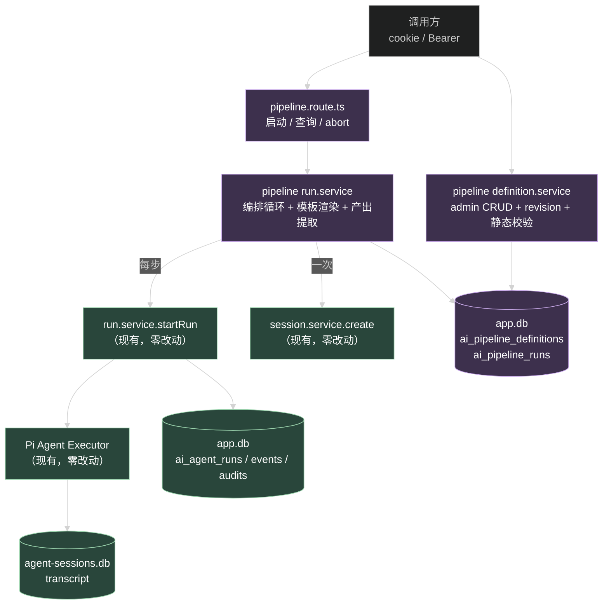
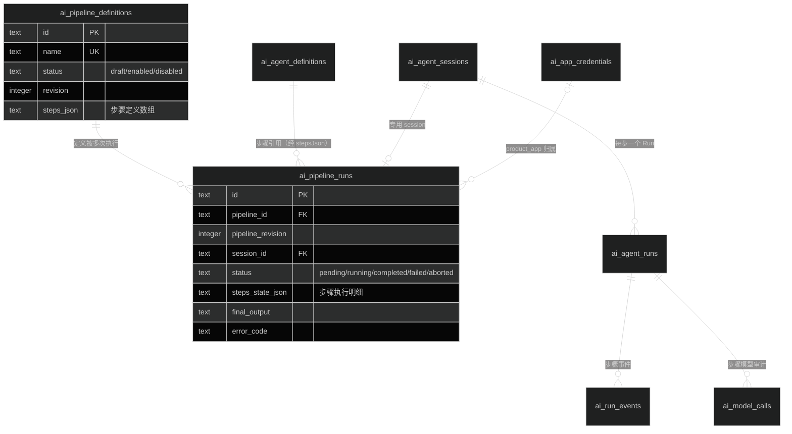
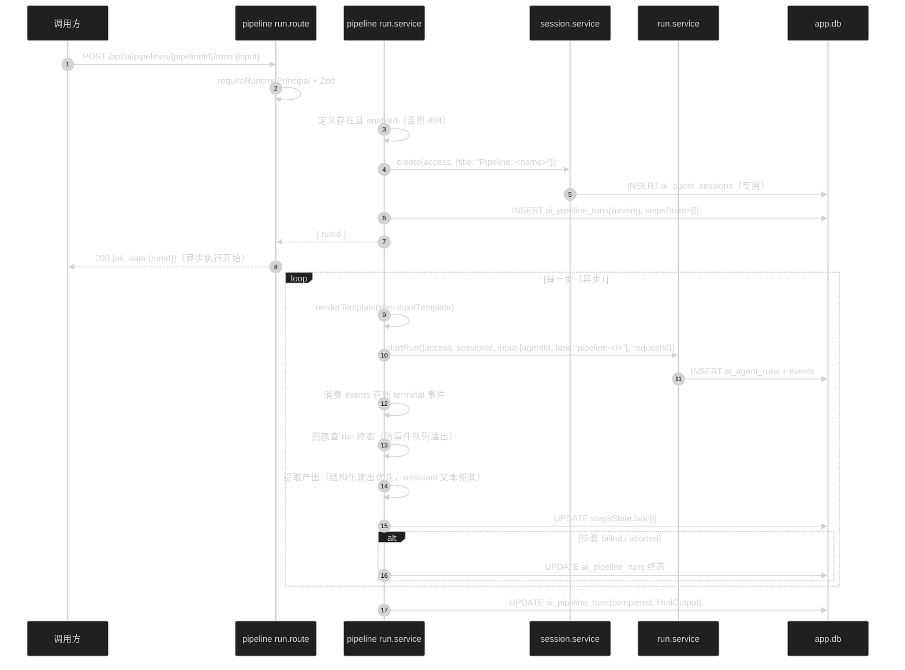
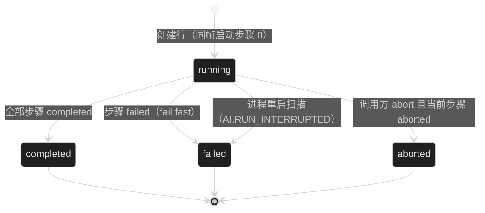

# 技术设计：AI Agent 流水线编排

## 1. 架构位置

Pipeline 是 Run 之上的一层编排，不是第二种执行引擎。每一步就是一次标准的 Agent Run（复用 `startRun` 全套：Session 校验、agent 解析、lane reserve、事件持久化、审计、终态、恢复），pipeline 只负责三件事：步骤顺序执行、上一步产出渲染进下一步输入、把整条流水线的进度索引到自己的表里。



对既有代码的修改点只有两处新增性质的接线：`ai.route.ts` 装配 pipeline 模块；contracts / schema 新增定义。`run.service`、`session.service`、executor、gateway 一行不改。

## 2. 数据模型

### 2.1 表定义

`apps/api/src/modules/ai/ai.schema.ts` 追加两张表（migration 由 `db:generate` 生成，预期 0021 或与无状态任务合并为同号段的两个文件）：

```ts
export const aiPipelineDefinitions = sqliteTable(
  "ai_pipeline_definitions",
  {
    id: text("id").primaryKey(),
    name: text("name").notNull().unique(),
    description: text("description").notNull().default(""),
    status: text("status").notNull().default("draft"),
    revision: integer("revision").notNull().default(1),
    stepsJson: text("steps_json").notNull(),
    createdBy: text("created_by").references(() => user.id, { onDelete: "set null" }),
    updatedBy: text("updated_by").references(() => user.id, { onDelete: "set null" }),
    createdAt: timestamp("created_at").notNull(),
    updatedAt: timestamp("updated_at").notNull(),
  },
  (table) => [
    index("ai_pipeline_definitions_status_updated_idx").on(
      table.status, table.updatedAt, table.id,
    ),
    check("ai_pipeline_definitions_status_check",
      sql`${table.status} IN ('draft', 'enabled', 'disabled')`),
    check("ai_pipeline_definitions_revision_check", sql`${table.revision} >= 1`),
    check("ai_pipeline_definitions_steps_json_check", sql`json_valid(${table.stepsJson})`),
  ],
)

export const aiPipelineRuns = sqliteTable(
  "ai_pipeline_runs",
  {
    id: text("id").primaryKey(),
    pipelineId: text("pipeline_id")
      .notNull()
      .references(() => aiPipelineDefinitions.id, { onDelete: "restrict" }),
    pipelineRevision: integer("pipeline_revision").notNull(),
    principalKind: text("principal_kind").notNull().default("starter_user"),
    ownerId: text("owner_id").references(() => user.id, { onDelete: "cascade" }),
    tenantId: text("tenant_id").notNull().default("starter"),
    projectId: text("project_id").notNull().default("starter"),
    externalUserId: text("external_user_id").notNull().default("starter"),
    appId: text("app_id").references(() => aiAppCredentials.id, { onDelete: "restrict" }),
    subjectType: text("subject_type"),
    subjectId: text("subject_id"),
    sessionId: text("session_id")
      .notNull()
      .references(() => aiAgentSessions.id, { onDelete: "cascade" }),
    input: text("input").notNull(),
    status: text("status").notNull(),
    stepsStateJson: text("steps_state_json").notNull(),
    finalOutput: text("final_output"),
    errorCode: text("error_code"),
    requestId: text("request_id").notNull(),
    createdAt: timestamp("created_at").notNull(),
    startedAt: timestamp("started_at"),
    finishedAt: timestamp("finished_at"),
  },
  (table) => [
    index("ai_pipeline_runs_pipeline_created_idx").on(table.pipelineId, table.createdAt, table.id),
    index("ai_pipeline_runs_status_created_idx").on(table.status, table.createdAt, table.id),
    index("ai_pipeline_runs_scope_user_created_idx").on(
      table.tenantId, table.projectId, table.externalUserId, table.createdAt, table.id,
    ),
    index("ai_pipeline_runs_app_idx").on(table.appId),
    check("ai_pipeline_runs_status_check",
      sql`${table.status} IN ('pending', 'running', 'completed', 'failed', 'aborted')`),
    check("ai_pipeline_runs_revision_check", sql`${table.pipelineRevision} >= 1`),
    check("ai_pipeline_runs_steps_state_json_check", sql`json_valid(${table.stepsState_json})`),
    // principal 与 subject 成对约束的写法对齐 ai_agent_sessions 的两条同名先例
  ],
)
```

归属列族（principalKind / ownerId / appId / tenantId / projectId / externalUserId / subjectType / subjectId）与 `ai_agent_sessions` 完全同名同义，CHECK 约束（principal 二选一、subject 成对）也照搬，查询可见性用同一套判据。

### 2.2 ER 关系



### 2.3 stepsJson / stepsStateJson 结构

`stepsJson`（定义时写入，只读）：

```json
[
  { "agentId": "<uuid>", "inputTemplate": "把以下内容提取要点：\n{{input}}" },
  { "agentId": "<uuid>", "inputTemplate": "翻译成英文：\n{{steps.0.output}}", "laneLabel": "translate" }
]
```

- 每步：`agentId`（必填，指向任意状态的 AgentDefinition，启动时才校验 enabled）、`inputTemplate`（必填，1 到 100000 字符）、`laneLabel`（可选，仅用于展示，缺省为 `step-<index>`）。
- 步骤数量 1 到 8：上限防单条流水线把单进程 runner 占死（8 步 x 120 秒最坏 16 分钟）。

`stepsStateJson`（执行时更新，每步终态写一次）：

```json
[
  {
    "index": 0,
    "agentId": "<uuid>", "agentRevision": 3,
    "runId": "<uuid>", "lane": "pipeline-0",
    "status": "completed",
    "output": "要点：……（全量，供下一步渲染）",
    "errorCode": null,
    "startedAt": "…", "finishedAt": "…"
  }
]
```

步骤明细放 JSON 列而不是独立表：步骤数最多 8、没有脱离 pipeline run 单独查步骤的需求、更新频率每步一次，独立表是过度设计。对齐 `ai_agent_runs.snapshotJson` 的先例。

## 3. 模块布局

```
apps/api/src/modules/ai/pipeline/
├── index.ts                    # 导出各工厂
├── definition.repository.ts    # ai_pipeline_definitions CRUD
├── definition.service.ts       # 校验、revision、静态模板检查
├── definition.route.ts         # admin CRUD 路由（AI_CONFIG_READ / MANAGE）
├── definition.openapi.ts
├── run.repository.ts           # ai_pipeline_runs CRUD + accessWhere 等价物
├── run.service.ts              # 编排循环、恢复扫描
├── run.route.ts                # 运行面启动 / 查询 / abort
├── run.openapi.ts
└── template.ts                 # 模板静态校验 + 渲染
```

`ai.route.ts` 装配：

```ts
const pipelineDefinitionService = createAiPipelineDefinitionService({
  repository: createAiPipelineDefinitionRepository(runtime.db),
  agentRepository: createAiAgentDefinitionRepository(runtime.db), // 仅校验 agentId 存在
  logger: runtime.logger.child({ module: "ai-pipeline-definition" }),
});
const pipelineRunService = createAiPipelineRunService({
  repository: createAiPipelineRunRepository(runtime.db),
  definitionService: pipelineDefinitionService,
  agentService,            // 已有的 agentService.resolve
  sessionService,          // 已有的专用 session 创建
  runService,              // 已有的 startRun / get / abort
  structuredOutputRepository,
  sessionStore: runtime.agentSessionStore,  // assistant 文本提取
  logger: runtime.logger.child({ module: "ai-pipeline-run" }),
});
void pipelineRunService.recoverInterrupted() // 启动扫描，模式对齐 runService
```

## 4. 模板：静态校验与渲染（template.ts）

### 4.1 语法

只有两种变量，正则 `/\{\{(input|steps\.(\d+)\.output)\}\}/g`：

- `{{input}}`：整条流水线的原始输入。
- `{{steps.N.output}}`：第 N 步（从 0 计）的产出。

没有过滤器、条件、循环。需要逻辑就写进 Agent 的 prompt——模板是数据搬运，不是编程语言。

### 4.2 静态校验（定义保存时，definition.service）

对步骤 i 的 `inputTemplate` 逐个匹配变量：

- `steps.N` 的 `N >= i` → 拒绝保存（400），错误信息含步骤序号、变量名、允许的最大序号。前置引用只允许看过去，不看未来。
- 其他字面量（包括长得像变量的 `{{ foo }}`、`{{steps.x.output}}`）原样保留，不报错——它们不是变量，就是普通文本。

静态校验保证运行时渲染只剩纯字符串替换，没有失败模式（被引用的步骤若未执行到，流水线早已 fail fast 终止，不会走到渲染）。

### 4.3 渲染（运行时）

```ts
function renderTemplate(template: string, ctx: { input: string; outputs: string[] }): string
```

单遍正则替换。替换结果不再扫描（产出里含 `{{steps.0.output}}` 字样时按字面量处理，不二次展开——防止模型输出注入模板指令）。

## 5. 执行引擎（run.service.ts）

### 5.1 启动流程



关键决策：

- **lane 命名 `pipeline-<i>`**：每步一个 lane，transcript 按步骤分支，提取产出时按 lane 精确读取，不与用户手工在 main lane 的内容混流。`ensureLane` 已幂等（`run.service.ts` L259 附近），非 main lane 创建路径现成。
- **等待终态**：`startRun` 返回 `{ runId, events: AsyncIterable<RunEvent> }`。编排循环持续迭代 events（只认 `run.completed` / `run.failed` / `run.aborted` 三个 terminal type，其余事件读完即丢），保证 1024 上限的有界队列不积压。迭代结束后再 `runService.get()` 读一次 Run 行终态作为兜底判据——事件队列溢出自关闭时 terminal 事件可能没送达，Run 行是唯一持久事实。两者冲突时以 Run 行为准。
- **步骤产出提取**（顺序）：
  1. `structuredOutputRepository.listByRun(runId)` 非空 → 取排序最后一条的 `value`，`JSON.stringify` 成字符串。结构化输出是推荐的步骤间契约（带 schema 校验）。
  2. 为空 → `sessionStore.readTranscript({ sessionId, lane: "pipeline-<i>", order: "newestFirst", limit: 全量 })` 读该 lane branch，过滤出 `runId` 等于本步骤的 assistant message entry，取时间序最后一条，拼接其 text blocks。entry 解析用 `parseBoundedJson`（现有工具），不引入第二套 JSON 解析。
- **专用 Session 不归档**：transcript 是流水线的完整执行记录，归档会让 transcript 读不到（`requireActiveSession` 拒），保留。

### 5.2 状态机



- 创建即 `running`，不设 `pending` 中间态：HTTP 返回时循环已在执行，`pending` 只在崩溃窗口出现语义价值，恢复策略统一抹平它。
- fail fast：某步失败，后续步骤不启动；已完成步骤的产出和明细保留。
- `interrupted` 不进 pipeline 状态机：恢复扫描直接落 `failed + AI.RUN_INTERRUPTED`，与"终态六值"的 Run 状态机解耦（pipeline 状态机只有五个值）。

### 5.3 Abort

`POST /api/ai/pipeline-runs/{id}/abort`：

1. 归属校验（他人 404），状态非 `running` → 409。
2. 找 `stepsStateJson` 里最新未终态步骤的 `runId`，调 `runService.abort(access, sessionId, runId)`。
3. 编排循环感知步骤终态 `aborted` 后把 pipeline 置 `aborted`。当前处于步骤间隙（上一步刚完成、下一步未启动）时，循环下一轮开始前检查 abort 标记（内存 Set，对齐 ActiveRunRegistry 的进程内模式），直接置 `aborted` 不再启动下一步。

### 5.4 进程重启恢复

`ai.route.ts` 装配处调用 `pipelineRunService.recoverInterrupted()`（模式对齐 `runService.recoverInterrupted()` 的 fire-and-forget + 日志报告）：

- 扫描 `status='running'` 的 pipeline run 行，逐条转 `failed + AI.RUN_INTERRUPTED`，`stepsStateJson` 保持现状（已完成步骤的明细就是现场）。
- 步骤 Run 本身的恢复由 `runService.recoverInterrupted()` 独立完成（它扫 `ai_agent_runs` 非终态行），两层各管各的表，互不依赖执行顺序。
- 不做续跑：续跑要求编排循环可从任意步骤重入（重放上下文 + 重新订阅事件），复杂度远超当前收益；重启后调用方拿到 `failed` 重新发起即可，已付成本的步骤明细都在。

### 5.5 并发

- 一次 pipeline run 一个专用 Session，lane 按 `pipeline-<i>` 命名，`ActiveRunRegistry` 按 `sessionId + lane` 隔离——同一 pipelineId 并发多个 run、不同 pipeline 并发，全部天然互不阻塞。
- 不做全局限流（父任务边界）。单个 pipeline run 内部严格串行。

## 6. API 契约

### 6.1 控制面（admin，tag `AI Control`）

| 方法与路径 | 鉴权 | 行为 |
| --- | --- | --- |
| `GET /api/ai/admin/pipelines` | `requireAuth` + `AI_CONFIG_READ` | 分页列表（name、description、status、revision、步骤数、时间戳） |
| `POST /api/ai/admin/pipelines` | `requireAuth` + `AI_CONFIG_MANAGE` | 创建（draft），静态模板校验在此生效 |
| `GET /api/ai/admin/pipelines/{id}` | `requireAuth` + `AI_CONFIG_READ` | 详情含完整步骤定义 |
| `PATCH /api/ai/admin/pipelines/{id}` | `requireAuth` + `AI_CONFIG_MANAGE` | 更新步骤 / 描述，revision +1 |
| `PATCH /api/ai/admin/pipelines/{id}/status` | `requireAuth` + `AI_CONFIG_MANAGE` | draft/enabled/disabled 切换（对齐 agent status 端点形态） |

行为对齐 AgentDefinition 路由族：删除语义不做（agent 定义也没有删除，restrict FK 保持引用完整）。

### 6.2 运行面（tag `AI Runtime`，security `[{ cookieAuth }, { bearerAuth }]`）

| 方法与路径 | 行为 |
| --- | --- |
| `POST /api/ai/pipelines/{pipelineId}/runs` | body `{ input }`（1 到 100000 字符），返回 `{ runId }`，异步执行 |
| `GET /api/ai/pipeline-runs/{id}` | 状态、步骤明细、`finalOutput`、`sessionId`（可继续查 transcript） |
| `POST /api/ai/pipeline-runs/{id}/abort` | 见 5.3 |

`GET` 响应的步骤明细里，`output` 截断到 1000 字符加省略标记（中间产出全量在 transcript，用 runId 可查）；`finalOutput` 全量返回（它是调用方要的最终结果）。

### 6.3 错误矩阵

| 条件 | HTTP | Error code |
| --- | --- | --- |
| pipeline 定义不存在或非 enabled | 404 | `COMMON.NOT_FOUND` |
| pipeline run 不存在、归属他人 | 404 | `COMMON.NOT_FOUND` |
| input 无效 / 步骤定义非法 | 400 | `COMMON.INVALID_REQUEST` |
| 步骤模板静态校验失败（保存时） | 400 | `COMMON.INVALID_REQUEST`（message 含步骤序号与变量名） |
| abort 非 running 的 pipeline run | 409 | `AI.SESSION_BUSY` 同款冲突语义，实现时对齐 runService.abort 的现有选择 |
| 步骤 agent 解析失败（disabled 等） | pipeline failed | 步骤 Run 侧 `AI.*` 现有错误码原样透传进 `errorCode` |

### 6.4 contracts（packages/contracts/src/ai.ts）

新增 schema 族：`pipelineDefinitionSummarySchema` / `pipelineDefinitionDetailSchema` / `createPipelineDefinitionSchema` / `updatePipelineDefinitionSchema` / `pipelineDefinitionStatusSchema` / `pipelineStepDefinitionSchema` / `startPipelineRunSchema` / `pipelineRunStepStateSchema` / `pipelineRunSchema` / `pipelineRunAbortSchema`。全部 strictObject，风格对齐既有 agent / run schema。

## 7. 审计与用量

- 每步 Run 的模型调用走现有 executor 审计：`ai_model_calls.scenario='agent_run'`、`run_id` 为步骤 Run id。pipeline 不产生自己的模型调用，不新增 scenario。
- pipeline run 行本身是编排审计（谁、何时、哪个 revision、每步 runId、终态），`requestId` 贯穿。
- 用量查询（usage-audit）不改：按 runId 聚合时每步自然独立可见；pipeline 级聚合留给后续任务（明确不做清单）。

## 8. 测试设计

新增 `apps/api/src/test/ai-pipeline.test.ts`（fake executor 流复用 `ai-agent-runs.test.ts` 的 tool-calling stream 写法，Bearer 客户端复用 `ai-third-party-access.test.ts` 模式）：

1. **定义 CRUD 与静态校验**：创建两步定义成功，revision=1；`{{steps.1.output}}` 出现在步骤 0 → 400 且 message 含步骤与变量名；步骤 0 引用 `{{steps.0.output}}` → 400（不能引用自己）。
2. **Happy path**：两步流水线（步骤 1 摘要、步骤 2 引用 `{{steps.0.output}}` 翻译），启动返回 runId，轮询 `GET` 到 completed：步骤明细两步各含 runId 与产出，`finalOutput` 为步骤 2 文本，两步 Run 可分别 `GET /runs` 查到且 transcript 可读。
3. **fail fast**：步骤 1 的 executor 假流返回失败 → pipeline failed，步骤 2 无 Run 行，步骤 1 明细含 errorCode。
4. **abort**：步骤 1 执行中 abort → 步骤 1 Run aborted、pipeline aborted；abort 已 completed 的 pipeline → 409。
5. **归属隔离**：product_app A 的 pipeline run，product_app B 访问 → 404；starter_user 访问 product_app 的 → 404。
6. **结构化输出优先**：步骤 1 的 agent 带 outputContract，executor 流触发 `emit_structured_output` → 步骤 1 产出是 JSON 序列化的 value，步骤 2 收到的输入含该 JSON。
7. **审计**：每步一条 `ai_model_calls`（scenario 仍为 `agent_run'`，run_id 正确）；`ai_pipeline_runs.stepsStateJson` 步骤明细与实际 Run 状态一致。

## 9. 权衡记录

- **每步一个完整 Run，不自建轻量执行**：Run 的状态机、事件持久化、审计、abort、恢复是现成的；自建轻量执行等于在编排层复制第二套 Runner，直接违反 ai-system-design.md 第 10 节"不要第二套实现"。
- **步骤明细 JSON 列，不建第三张表**：见 2.3。
- **不续跑**：见 5.4。
- **pipeline 定义 restrict 删除（实际不提供删除端点）**：运行历史引用定义，restrict FK 加"无删除端点"双保险。
- **模板纯字符串替换**：见 4.1。曾有"把步骤输出按 JSON path 引用（`{{steps.0.output.field}}`）"的设想，否掉——那要承诺结构化输出的 schema 稳定性，且字符串拼接已覆盖"喂给下一步"的主场景；字段级提取让步骤 1 的 agent 用结构化输出约束、步骤 2 的 prompt 里说明输入格式即可。
- **DTO 步骤产出截断 1000 字符**：最坏 8 步全量响应可达 800KB，截断后调试信息够用、全量事实在 transcript。

## 10. 兼容性与回滚

- 纯新增：两张新表、一个新模块、若干新路由。不改任何既有表结构、既有路由行为、既有事件协议。
- migration 只有 CREATE TABLE，回滚即 drop 两张表（开发期删 migration 文件重新 generate）。
- 与无状态调用任务（08-28-ai-stateless-completion）唯一交叠是 contracts 文件与 `ai.route.ts` 装配处，先后合并时 rebase 即可，无语义冲突。
