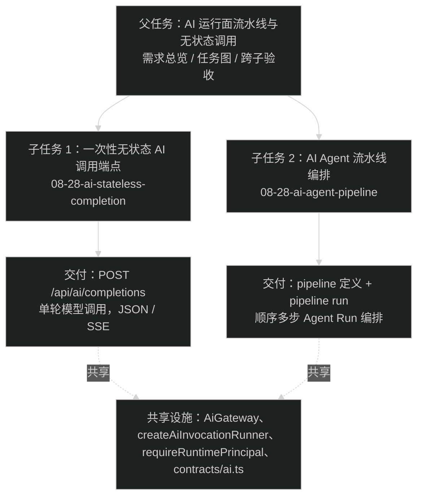

# AI 运行面流水线与无状态调用（父任务）

## Goal

补齐 AI 运行面的两个能力缺口，让调用方覆盖"简单单发"和"多步编排"两类场景：

1. 一次性无状态调用：翻译、分类、改写这类一句话任务，直接指定模型拿结果，不建 Session、不建 Run、不写 Pi 历史。
2. 流水线编排：步骤 A 的输出喂给步骤 B 的输入，由服务端顺序执行多个 Agent Run，调用方不需要自己轮询拼装。

两个子任务独立交付、独立验收，共用同一份现状走读结论。

## 背景：为什么现在做

2026-08-28 的代码走读（见子任务 prd 的"已确认事实"）确认当前运行面只有一种执行形态：`POST /api/ai/sessions/{sessionId}/runs`，完整走 Session + Run 生命周期。这带来两个问题：

- 简单任务成本过高：翻译一句话也要先 `POST /api/ai/sessions` 建会话，再启动 Run，再读 transcript 拿结果，产生三倍的调用和数据写入（Pi Session SQLite + 主库 Run 行 + 事件表）。
- 多步任务无法服务端编排：调用方只能自己轮询 Run 终态、读输出、再发起下一个 Run，编排逻辑散落在每个调用方手里，没有统一的执行记录和失败恢复。

## 任务图

两个子任务没有相互依赖，可以并行实现，也可以按任意顺序交付。共享点只有 `packages/contracts/src/ai.ts`（先后合并时注意 rebase 冲突）和 `apps/api/src/modules/ai/ai.route.ts` 的装配处。

## 跨子验收（父任务负责）

- [ ] 两个子任务各自的验收标准全部通过（见各自 prd.md）。
- [ ] `pnpm check`（类型 / lint / format）+ `pnpm test` 全绿。
- [ ] `pnpm --filter @starter/api db:check` 确认 migration 状态一致。
- [ ] OpenAPI `/doc` 上两个新能力归入 `AI Runtime` tag，安全声明同时含 `cookieAuth` 和 `bearerAuth`。
- [ ] `.trellis/spec/api/backend/ai-system-design.md` 与 `docs/ai/` 下相关文档同步更新（新增端点、新表、新 scenario、编排语义）。
- [ ] 无状态调用与流水线共用 `requireRuntimePrincipal`，product_app（Bearer + `X-AI-*` 头）两种能力都能用。

## 明确不做（父任务级，两个子任务都不偷做）

- 客户端 SDK / 共享 reducer 包（沿用 08-28-ai-runtime-third-party-gaps 的边界）。
- webhook / 回调通知（需重试与签名决策，单独任务）。
- 每应用限流 / 配额（需配额模型决策，单独任务）。
- 无状态调用和流水线的 Admin UI 页面（本任务只交付 API；admin 面只加 pipeline 定义的 CRUD API，不做前端页面）。

## 关键决策记录（父任务拍板，子任务继承）

| 决策 | 结论 | 理由 |
| --- | --- | --- |
| 无状态调用是否建 Run / Session | 不建 | 建了就不是"无状态"，成本回到三步生命周期 |
| 流水线编排形态 | 顺序步骤，不做条件分支 / 并行 / DAG | "A 的输出喂 B"是线性语义；分支和 DAG 等真实需求出现再设计 |
| 流水线定义是否预注册 | 预注册（admin 面 CRUD + enabled + revision），运行面只传 pipelineId | 对齐 AgentDefinition 的控制面 / 运行面分离；多步多 Agent 组合的治理复杂度高，需要 revision 和启用开关 |
| 流水线步骤执行载体 | 每步一个完整 Agent Run（复用现有 Run 全套：状态机、审计、事件、恢复） | Run 已有完整生命周期和结构化输出；pipeline 只做编排层，不重新实现执行 |

## 状态

- planning。两个子任务的 `prd.md` / `design.md` / `implement.md` 三件套已齐，关键决策已收敛（无状态调用请求形态经用户选定方案 A：model 直选 + 可选 systemPrompt，不引用 agent）；pipeline 的 lane / 恢复 / 转义 / 产出提取等设计决策已在子任务 design.md 定案。等待最终规划摘要获批后 `task.py start`。
