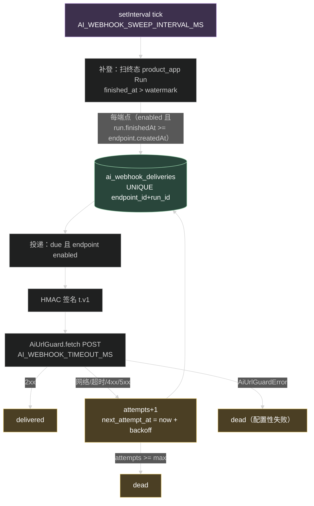
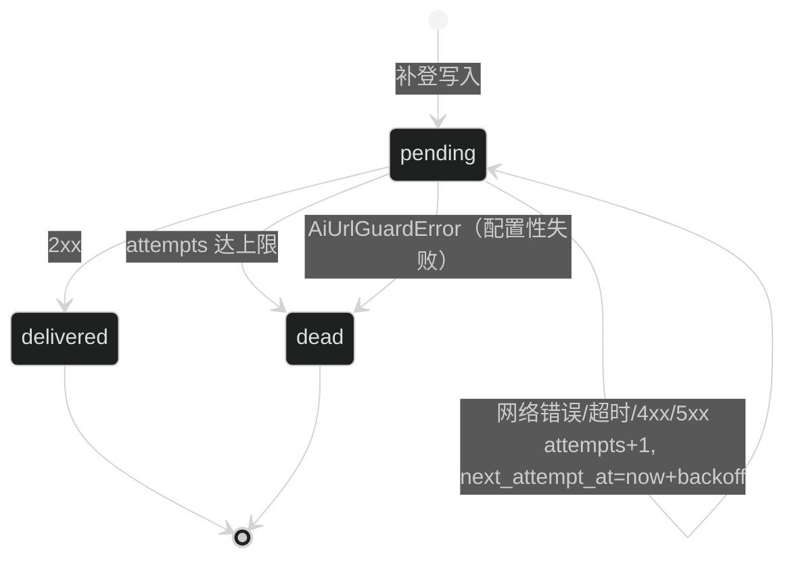
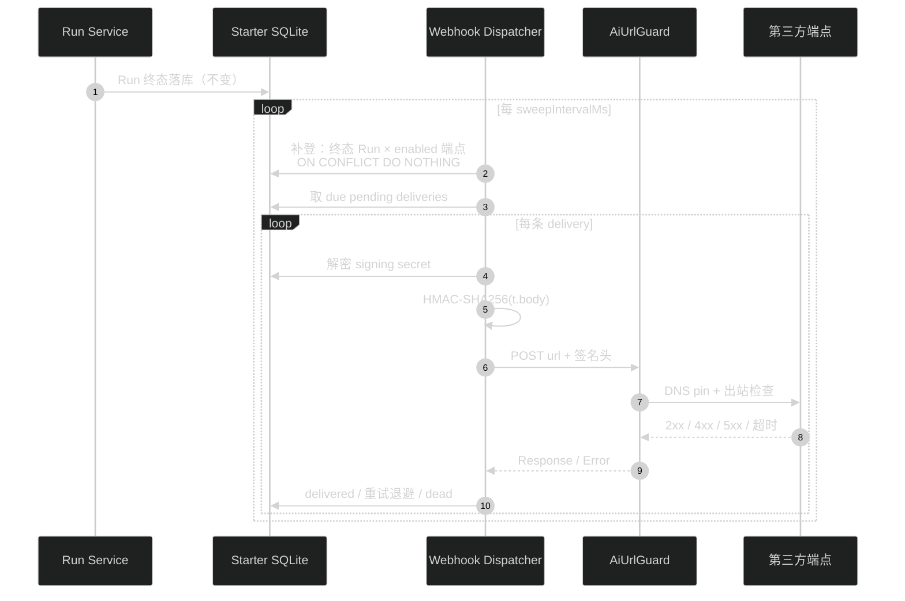

# AI Run Webhook 终态推送 —— 技术设计

## 1. 模块与边界

新目录 `apps/api/src/modules/ai/webhook/`：

```
webhook/
├── webhook.crypto.ts        # signing secret 的 AES-256-GCM 加解密
├── webhook.schema 注：表定义进 ai.schema.ts（与全模块一致）
├── webhook.repository.ts    # 端点 CRUD + 投递记录读写（事务、唯一约束幂等）
├── webhook.service.ts       # admin 面：CRUD、rotate、test、投递记录查询
├── webhook.dispatcher.ts    # 周期 tick：补登终态 Run + 投递到期记录
├── webhook.route.ts         # admin 路由
├── webhook.openapi.ts       # OpenAPI 定义（AI Control tag）
└── index.ts
```

不改动：`run/`、`session/`、`application/` 的现有代码。`ai.route.ts` 只新增装配。

投递器不订阅 RunService 事件、不挂在终态事务上——这是本设计的核心取舍：**用周期扫描换零侵入**。终态事实在 `ai_agent_runs` 行上，扫描它就够；SSE/事件路径的复杂度（有界队列、回放、恢复）一概不参与。代价是推送延迟下界等于扫描间隔（默认 5 秒），对「通知 Run 结束」这个用途可接受。



## 2. 数据模型（ai.schema.ts + migration 0024）

### ai_webhook_endpoints

| 列 | 类型 | 说明 |
| --- | --- | --- |
| id | text PK | uuid v7 |
| app_id | text NOT NULL | FK → ai_app_credentials.id，ON DELETE cascade |
| url | text NOT NULL | http/https，创建/更新时过 guard |
| signing_secret_encrypted | text NOT NULL | `v1.<iv b64>.<tag b64>.<ciphertext b64>` |
| status | text NOT NULL | `enabled` / `disabled`，CHECK 约束 |
| created_by / updated_by | text | FK → user，ON DELETE set null |
| created_at / updated_at | integer NOT NULL | epoch ms |
| last_delivery_at | integer | nullable |

索引：`(app_id)`；无唯一约束（一个 app 多端点合法）。

### ai_webhook_deliveries

| 列 | 类型 | 说明 |
| --- | --- | --- |
| id | text PK | uuid v7 |
| endpoint_id | text NOT NULL | FK → ai_webhook_endpoints.id，ON DELETE cascade |
| app_id | text NOT NULL | 冗余列，列表查询免 join |
| run_id | text NOT NULL | FK → ai_agent_runs.id，ON DELETE cascade |
| event_type | text NOT NULL | `run.terminal` |
| payload_json | text NOT NULL | 入队时快照，投递时原样发送 |
| status | text NOT NULL | `pending` / `delivered` / `dead`，CHECK |
| attempts | integer NOT NULL DEFAULT 0 | |
| next_attempt_at | integer | nullable；null 表示立即可投 |
| last_response_code | integer | nullable |
| last_error | text | nullable，截断到 500 字符 |
| created_at / updated_at | integer NOT NULL | |
| delivered_at / dead_at | integer | nullable |

索引：`(endpoint_id, created_at desc)` 列表；`(status, next_attempt_at)` 到期扫描；`UNIQUE (endpoint_id, run_id)` 入队幂等。
`ai_agent_runs` 需要补一个索引 `(finished_at)`（补登扫描按水位推进，避免全表扫）。

## 3. 补登（enqueue）语义

- 内存水位 `lastSweptFinishedAt`（epoch ms），进程启动为 0。
- 每个 tick：`SELECT ... FROM ai_agent_runs WHERE principal_kind='product_app' AND app_id IS NOT NULL AND status IN ('completed','failed','aborted','interrupted') AND finished_at > ?watermark ORDER BY finished_at ASC LIMIT 200`。
- 每条 Run × 该 app 的 enabled 端点：`run.finishedAt >= endpoint.createdAt` 才入队；`INSERT ... ON CONFLICT (endpoint_id, run_id) DO NOTHING`。
- 水位推进到本批最大 `finished_at`（无命中时不动）。
- 规则推论（写入 integration.md）：端点创建之前的 Run 永不补发；禁用窗口内终态的 Run 不会被补发（tick 时端点不在 enabled 集合里，水位照样前进）；进程崩溃漏发的终态 Run 重启后从水位 0 重扫，按同规则补上。
- tick 内先补登后投递；补登失败（写库异常）记日志，水位不推进，下一 tick 重试。

## 4. 投递（deliver）语义

- 到期判定：`status='pending' AND (next_attempt_at IS NULL OR next_attempt_at <= now)`，join `ai_webhook_endpoints.status='enabled'`，`LIMIT 50`（单 tick 顺序投递，无并发）。
- 请求：`POST url`，headers：`Content-Type: application/json`、`User-Agent: starter-webhook/1`、`X-Starter-Event: <event_type>`、`X-Starter-Timestamp: <unix 秒>`、`X-Starter-Signature: t=<unix 秒>,v1=<hmac_hex>`；body 为 `payload_json` 原文。签名输入 `"<t>." + body`，密钥为端点 signing secret 明文（投递时解密）。
- 判定与流转：



- 成功：`status='delivered'`、`delivered_at`、`last_response_code`，并更新端点 `last_delivery_at`。
- 重试失败：`attempts+1`；`attempts >= AI_WEBHOOK_MAX_ATTEMPTS` 则 `dead` + `dead_at`；否则 `next_attempt_at = now + backoff[min(attempts, len-1)]`（attempts 从 1 计，索引 0 起的数组取第 attempts-1 项，越界取末项）。
- `AiUrlGuardError`（scheme/host/private/redirect/timeout-guard/response_size）：配置性失败，直接 `dead`，`last_error='guard:<reason>'`。guard 的 timeout 归为这类（URL 不可达重试也无意义的价值有限，且与环境相关；简单优先）。
- 网络级异常与 HTTP 非 2xx：按可重试处理。
- 每条投递的成败都写 `last_error`（成功清空）与 `last_response_code`。
- 投递循环的单条异常 try/catch 包住，一条失败不阻断同批其他记录。

## 5. 签名与 secret 管理

- secret 生成：`wh_<randomBytes(32) base64url>`，格式对齐 `application.crypto.ts` 的风格但独立函数。
- 加密：AES-256-GCM，key 取 `env.AI_CREDENTIAL_ENCRYPTION_KEY`（与 Provider 凭据同 key，格式独立 `v1.iv.tag.ciphertext`）。key 未配置/长度不对：创建与 rotate 抛 `AI.CREDENTIAL_KEY_UNAVAILABLE`（HTTP 500，复用既有错误码语义：服务端加密能力不可用）。
- 明文只在三处出现：创建/rotate 响应（一次）、test 探测、投递签名。不进日志、不进列表 DTO。

## 6. 管理面 API

全部 `requireAuth + AI_CONFIG_MANAGE`（读列表用 `AI_CONFIG_READ`），tag `AI Control`，响应统一 `{ ok, data, meta }`：

| Method | Path | 说明 |
| --- | --- | --- |
| POST | `/api/ai/admin/webhook-endpoints` | 201 语义按仓库惯例用 200；返回 `{ endpoint, signingSecret }` |
| GET | `/api/ai/admin/webhook-endpoints?appId=` | 校验 appId 存在（404 `AI.APP_CREDENTIAL_NOT_FOUND`），返回端点列表 |
| PATCH | `/api/ai/admin/webhook-endpoints/{endpointId}` | url 变更过 guard；404 `AI.WEBHOOK_ENDPOINT_NOT_FOUND` |
| POST | `/api/ai/admin/webhook-endpoints/{endpointId}/rotate` | 返回 `{ endpoint, signingSecret }` |
| DELETE | `/api/ai/admin/webhook-endpoints/{endpointId}` | 200 `{ endpoint }`；级联删投递记录 |
| POST | `/api/ai/admin/webhook-endpoints/{endpointId}/test` | 同步探测，返回 `{ ok, responseCode, error }`，不写库 |
| GET | `/api/ai/admin/webhook-deliveries?endpointId=&status=&page=&pageSize=` | 分页列表 |

test 探测：发送 `{ "type": "webhook.test", "appId", "endpointId", "sentAt" }`，走与正式投递相同的签名 + guard.fetch（timeout 同 `AI_WEBHOOK_TIMEOUT_MS`），2xx 即 `ok: true`。

## 7. 装配与环境变量

`ai.route.ts` 新增（`AI_WEBHOOK_ENABLED=true` 时）：

```ts
const webhookDispatcher = createAiWebhookDispatcher({
  db: runtime.db,
  crypto: webhookCrypto,          // 用 env key 构造
  urlGuard: createAiUrlGuard({ appEnv: env.APP_ENV, allowedPrivateCidrs: env.aiPrivateCidrs, timeoutMs: env.AI_WEBHOOK_TIMEOUT_MS }),
  logger: runtime.logger.child({ module: "ai-webhook" }),
  settings: { sweepIntervalMs, maxAttempts, backoffMs: [...] },
});
webhookDispatcher.start();        // setInterval + 首次立即 tick
```

`createRuntime` 关闭钩子：dispatcher.stop()。runtime 不持有 dispatcher 时（webhook 关闭）跳过。实现上把 dispatcher 实例挂到 `runtime`（`RuntimeDeps` 可选注入已有先例 `piAgentExecutor`），`runtime.close()` 统一清理，避免裸 timer 阻止进程退出。

环境变量（`shared/env.ts` + `.env.example`，全部有默认值）：

| 变量 | 默认 | 说明 |
| --- | --- | --- |
| AI_WEBHOOK_ENABLED | false | 总开关 |
| AI_WEBHOOK_SWEEP_INTERVAL_MS | 5000 | tick 间隔，min 1000 |
| AI_WEBHOOK_TIMEOUT_MS | 10000 | 单次投递 HTTP 超时，min 1000 |
| AI_WEBHOOK_MAX_ATTEMPTS | 5 | 1-10 |
| AI_WEBHOOK_BACKOFF_MS | `0,30000,120000,600000,1800000` | 逗号分隔正整数，不足重复末位 |

## 8. 契约（packages/contracts/src/ai.ts）

- `aiWebhookEndpointSchema`：`{ endpointId, appId, url, status, createdAt, updatedAt, lastDeliveryAt }`（无 secret）。
- `aiWebhookEndpointSecretSchema`：`{ endpoint, signingSecret }`。
- `createAiWebhookEndpointSchema`：`{ appId: uuid, url: z.url() }`；`updateAiWebhookEndpointSchema`：`{ url?, status? }` 至少一项。
- `aiWebhookDeliverySchema`：`{ id, endpointId, appId, runId, eventType, status, attempts, nextAttemptAt, lastResponseCode, lastError, createdAt, updatedAt, deliveredAt, deadAt }`；列表 schema 带 `page/pageSize/total`。
- `aiWebhookTestResultSchema`：`{ ok, responseCode, error }`。
- `webhookRunTerminalPayloadSchema`：`{ type: 'run.terminal', appId, runId, sessionId, lane, agentId, agentRevision, status, errorCode, finishedAt, occurredAt }`——同时用于投递 payload 构造（zod parse 保形）和第三方文档引用。
- `common.ts` 新增 `AI_WEBHOOK_ENDPOINT_NOT_FOUND: 'AI.WEBHOOK_ENDPOINT_NOT_FOUND'`。

## 9. 数据流总图



## 10. 取舍记录

- **不做启动一次性补扫之外的即时 hook**：单一代码路径（周期 tick）覆盖正常、崩溃漏发、恢复标记三种场景，run.service 零改动。代价是最多一个 tick 的延迟。
- **不做跨进程/外部队列**：与 active registry 同级约束——单进程，不提前引入分布式设施。
- **死信不提供 admin 手工重投**：v1 范围外；死信记录带足排查字段（响应码、错误、次数），需要重发时改 URL 后新 Run 自会触发。
- **guard 失败直接死信而非重试**：URL 变内网/不可解析属于配置问题，重试无意义，快速暴露给 admin。
- **attempts 计数**：`attempts` 是已执行次数；首次投递失败后 attempts=1，进入第一次退避。max=1 时首败即死信。
