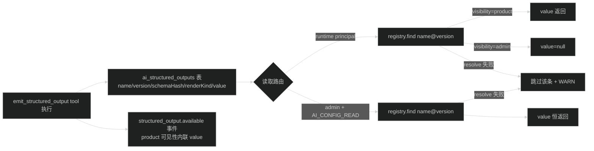
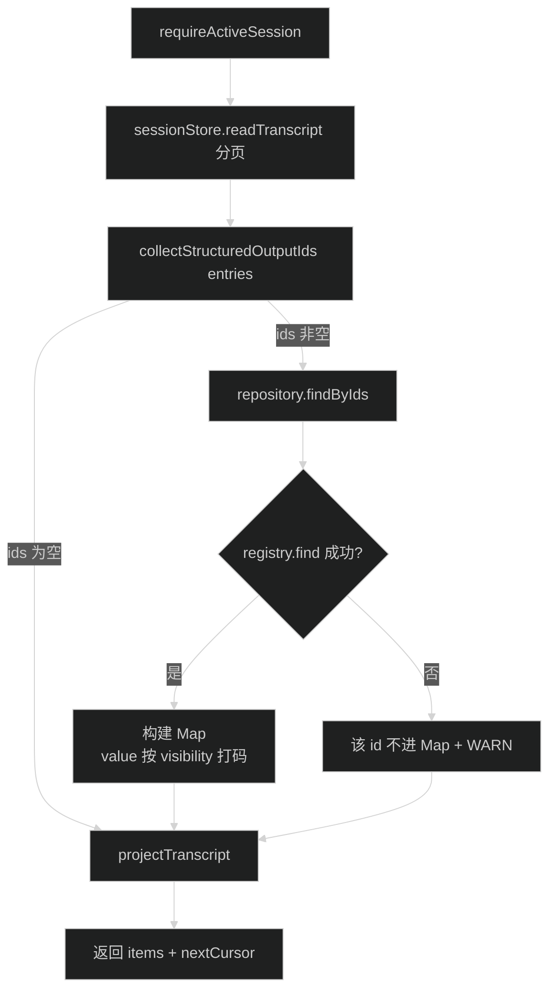

# 技术设计：修复 AI 运行面第三方接入缺口

## 1. 现状与目标

现状：运行面（Session / Run / 事件 / transcript）协议完整，但第三方接入链路上有 2 个硬阻断（CORS 头白名单、Agent 无法发现）、2 个能力缺口（结构化输出无读取路由、无 JSON 启动模式）、1 个渲染缺口（transcript 不回放结构化输出）、1 个 SSE 缺陷（恢复流心跳写的是字面量 `\n`）。

目标时序（修复后第三方完整链路）：


## 2. 修复细节

### 2.1 G1 心跳转义（一行）

`apps/api/src/modules/ai/run/run.route.ts` 第 126 行：

```diff
- void stream.write(": heartbeat\\n\\n").catch(() => undefined);
+ void stream.write(": heartbeat\n\n").catch(() => undefined);
```

原因：`\\n` 是字面量反斜杠 + n，SSE comment 帧必须以真实空行结尾；现在的写法让恢复流的保活字节永远不构成合法帧，还会把垃圾文本粘连到下一帧头部。创建流（第 58 行）写法正确，对齐即可。

### 2.2 G2 CORS 头白名单

`apps/api/src/middleware/cors.middleware.ts`：

```diff
- allowHeaders: ["content-type", "x-request-id"],
+ allowHeaders: [
+   "content-type",
+   "x-request-id",
+   "authorization",
+   "last-event-id",
+   "x-ai-external-user-id",
+   "x-ai-subject-type",
+   "x-ai-subject-id",
+ ],
```

- 头名统一小写（浏览器预检按小写发送，hono cors 直接反射白名单）。
- origin 仍由 `CORS_ORIGINS` 控制；在 `apps/api/.env.example` 的 `CORS_ORIGINS` 注释补一句「第三方前端 origin 需追加到此处」。
- 验证：smoke 断言 OPTIONS 预检响应头覆盖上述全部头。

### 2.3 G3 Agent 公共发现开放给 product_app

改动两处：

1. `apps/api/src/modules/ai/agent/agent.route.ts`
   - `deps` 增加参数 `requireRuntime: AiRouteMiddleware`。
   - `listPublicAgentDefinitionsRoute`、`getPublicAgentDefinitionRoute` 的 middleware 从 `requireAuth` 换成 `requireRuntime`。
   - 其余 admin 路由（listAdmin、getAdmin、create、update、status、tools）保持 `[requireAuth, requireRead/requireManage]` 不动。
2. `apps/api/src/modules/ai/ai.route.ts`
   - `createAiAgentDefinitionRoute({...})` 增加 `requireRuntime: requireRuntimePrincipal` 传参。

语义不变量：

- `listPublic` 只返回 `status=enabled`（repository.list 带 status 过滤），summary 不含 config、不含 skill/tool 明细。
- `getPublic` 对 draft/disabled 返回 404（沿用现状，`findPublic` 语义，实现时确认；若现状是 409/200 则保持现状不动）。

OpenAPI 安全声明：

- `apps/api/src/modules/ai/application/application.openapi.ts` 注册组件：

```ts
app.openAPIRegistry.registerComponent("securitySchemes", "bearerAuth", {
  type: "http",
  scheme: "bearer",
  description: "product_app 凭据（secret），配合 X-AI-External-User-Id 等头使用",
})
```

注册时机放在 application 模块的 route group 创建处（该模块拥有 product_app 凭据语义）；组件注册是全局 registry 操作，只注册一次。

- `agent.openapi.ts`、`session.openapi.ts`、`run.openapi.ts` 的 `security` 改为：

```ts
const security = [{ cookieAuth: [] }, { bearerAuth: [] }]
```

OpenAPI `security` 数组是 OR 语义，Scalar 会展示两种登录方式。

### 2.4 G4 结构化输出读取路由

#### contracts（`packages/contracts/src/ai.ts`）

```ts
export const structuredOutputItemSchema = z.strictObject({
  referenceId: uuidSchema,
  contract: aiOutputContractRefSchema,
  /** product 可见性返回值；admin 可见性对运行面主体为 null，admin 路由才有值。 */
  value: aiStructuredOutputValueSchema.nullable(),
  createdAt: isoDateTimeSchema,
})
export type StructuredOutputItem = z.infer<typeof structuredOutputItemSchema>

export const structuredOutputListSchema = z.strictObject({
  items: z.array(structuredOutputItemSchema),
})
export type StructuredOutputList = z.infer<typeof structuredOutputListSchema>
```

#### repository（`apps/api/src/modules/ai/output/structured-output.repository.ts`）

已具备 `listByRun(runId)`，无需新增方法。返回的 `StructuredOutputRecord` 含 contractName / contractVersion / schemaHash / renderKind / value / createdAt / id。

#### service（`apps/api/src/modules/ai/run/run.service.ts`）

- `createAiAgentRunService` 的 input 增加必填 `outputContractRegistry: AiOutputContractRegistry`（`ai.route.ts` 传 `runtime.aiOutputContracts`）。
- 新增两个方法：

```ts
structuredOutputs(access, sessionId, runId): StructuredOutputList
adminStructuredOutputs(runId): StructuredOutputList
```

- 共用私有函数 `toList(runId, includeValue: (visibility) => boolean)`：
  1. `requireScopedRun(access, sessionId, runId)`（admin 版跳过 scope 校验，由路由层权限控制）。
  2. `structuredOutputRepository.listByRun(runId)` 按 createdAt+id 排序。
  3. 每条记录用 `registry.find({ name, version })` resolve：
     - resolve 不到 → 跳过该条并 `logger.warn`（渲染元数据缺失，输出不可消费）。
     - resolve 到 → 组装 `contract` ref：`schemaHash` / `renderKind` 取自表内记录（emit 时刻的事实），`visibility` / `mode` 取自 registry（当前定义）。
  4. `value`：runtime 版只在 `visibility === 'product'` 时给值；admin 版恒给值。
- `AiAgentRunService` interface 同步加这两个方法签名。

#### routes（`apps/api/src/modules/ai/run/run.route.ts` + `run.openapi.ts`）

运行面（挂 `requireRuntimePrincipal`，现有 `access()` 上下文）：

```text
GET /api/ai/sessions/{sessionId}/runs/{runId}/structured-outputs
```

admin 面（挂 `requireAuth` + `AI_CONFIG_READ`，与 usage-audit 同款权限）：

```text
GET /api/ai/admin/runs/{runId}/structured-outputs
```

admin 路由需要 sessionId 吗？不需要——admin 路径不带 session scope（参考 `/api/ai/admin/applications/{appId}` 直接按资源 id）。`adminStructuredOutputs(runId)` 只按 runId 查；run 不存在时 items 为空还是 404？统一 404：先 `repository.findById(runId)`（run.repository 已有 `findById`），找不到抛 `COMMON.NOT_FOUND`，语义与运行面一致。

#### 错误矩阵（新增部分）

| 条件                                        | HTTP | Error code                            |
| ------------------------------------------- | ---- | ------------------------------------- |
| runtime 路由 session/run 不属于该 principal | 404  | `COMMON.NOT_FOUND`                  |
| admin 路由 runId 不存在                     | 404  | `COMMON.NOT_FOUND`                  |
| admin 路由无 AI_CONFIG_READ 权限            | 403  | 既有权限错误码（与 usage-audit 一致） |

#### 数据流



### 2.5 G5 Transcript 结构化输出回放

#### contracts

`agentTranscriptToolActivitySchema` 增加可选字段（纯增量，现有消费方不受影响）：

```ts
structuredOutput: z.strictObject({
  contract: aiOutputContractRefSchema,
  value: aiStructuredOutputValueSchema.nullable(),
  referenceId: uuidSchema,
}).optional()
```

#### presenter（`apps/api/src/modules/ai/session/session.presenter.ts`）

- `readToolDetails` 扩展：读 `details.structuredOutputId`，UUID 校验（复用 `readUuid`），失败置 null。
- 新增导出 `collectStructuredOutputIds(entries: readonly Entry[]): string[]`：扫描 toolResult role 的 entry，收集合法 structuredOutputId（去重）。entry 解析规则与 `projectMessage` 一致，避免双实现漂移。
- `projectTranscript` 增加第 4 个可选参数 `structuredOutputs?: Map<string, { contract: AiOutputContractRef; value: AiStructuredOutputValue | null }>`；投影 tool_activity 时，若 details 带 structuredOutputId 且 Map 中存在，注入 `structuredOutput` 字段。

#### session service（`apps/api/src/modules/ai/session/session.service.ts`）

- `createAiAgentSessionService` input 增加 `structuredOutputRepository` 与 `outputContractRegistry`（`ai.route.ts` 传参）。
- `transcript()` 流程调整：



- repository 新增 `findByIds(ids: string[]): StructuredOutputRecord[]`（drizzle `inArray`，空数组直接返回空）。
- 可见性打码规则与 G4 runtime 路由完全一致：`visibility === 'product'` 才带 value。
- 注入字段命名：`structuredOutput`（与事件 `structured_output.available` 的 data 形状对齐：contract + value + referenceId）。

### 2.6 G6 Run JSON 启动模式

`apps/api/src/modules/ai/run/run.route.ts` 的 startRun handler：

```ts
const result = await service.startRun({...})
const accept = c.req.header("accept") ?? ""
const wantsJson = accept.includes("application/json") && !accept.includes("text/event-stream")
if (wantsJson) {
  return c.json(createSuccessResponse({ runId: result.runId }, c.var.requestId), 200)
}
// 既有 SSE 分支不动
```

- `createSuccessResponse` 传 `startAgentRunJsonSchema.parse({ runId: result.runId })` 以获得类型（contracts 增加 `startAgentRunJsonSchema = z.strictObject({ runId: uuidSchema })`）。
- 判定规则：Accept 含 `application/json` 且不含 `text/event-stream` → JSON；其余（含缺省、`*/*`、仅 `text/event-stream`）→ SSE。web 现状显式传 `accept: text/event-stream`，不受影响。
- Run 照常执行：JSON 分支不调用 `service.subscribe`。`startRun` 返回的 `events` 有界队列（1024）溢出后自关闭，不影响 Run 终态（与 SSE 分支不消费同一队列的行为一致）。
- OpenAPI（`run.openapi.ts`）：`startAgentRunRoute` 的 200 响应 content 增加 `"application/json": { schema: apiSuccessResponse(startAgentRunJsonSchema, ...) }`，description 补充分流规则。

## 3. 兼容性与回滚

- 所有 contracts 变化都是新增可选字段 / 新 schema，`pnpm --filter @starter/contracts check-types` + 下游 `pnpm check` 保证零破坏。
- 三个新路由均为新增端点，不改既有端点行为；G1/G2/G3 是行为修正（G3 只放宽鉴权主体，不改响应形状）。
- 回滚粒度：每个修复独立成 commit，单点回滚不影响其他修复。
- 无数据库 migration、无环境变量新增（G2 只改代码白名单 + .env.example 注释）。

## 4. 测试设计

新增 `apps/api/src/test/ai-third-party-access.test.ts`（Bearer 客户端视角的集成测试，复用 `helpers.ts` 的 `createTestApp` / `readSuccess` / `register` 与 `ai-cross-product-runtime.test.ts` 的 `createAppCredential` 模式）：

1. **CORS 预检**：OPTIONS 任意运行面路径，带 `Access-Control-Request-Headers: authorization, x-ai-external-user-id`，断言响应 `Access-Control-Allow-Headers` 包含全部六个头。
2. **Agent 发现**：admin 建 agent（enabled + 一个 disabled），product_app `GET /api/ai/agents` 只见 enabled；`GET /api/ai/agents/{id}` 200；伪造 Bearer 401。
3. **JSON 启动**：`Accept: application/json` POST /runs → 200 JSON 含 runId → 轮询 `GET /runs/{runId}` 到 completed → timeline 有完整事件。
4. **结构化输出读取**：注入 `aiOutputContracts`（product + admin 两个可见性 contract），executor 用会调用 `emit_structured_output` 的假流跑完 Run：
   - runtime 路由：product 可见性带 value，admin 可见性 value=null。
   - admin 路由（cookie + AI_CONFIG_READ）：admin 可见性也带 value。
   - 跨 scope 的 product_app 访问他人 session 的 run → 404。
5. **Transcript 回放**：同一条 Run，`GET /transcript` 中 `emit_structured_output` 的 tool_activity item 携带 `structuredOutput`（product 带 value / admin value=null）；普通 tool 的 item 不带该字段。
6. **心跳**：不写新测试（15s 定时器不可测），以 grep 断言两处写法一致 + 既有 SSE 解析测试回归。测试文件内加注释说明。

executor 假流模式取自 `ai-agent-runs.test.ts` 的 tool-calling stream 写法；product_app 凭据创建复用 `ai-cross-product-runtime.test.ts` 的 helper（如未导出则在测试内复制小函数，遵循现有测试间不跨文件 import 私有 helper 的现状）。

## 5. 权衡记录

- **可见性不落库**：`ai_structured_outputs` 不加 visibility 列，读时从代码注册表 resolve。理由：registry 是渲染元数据唯一来源，contract 被删时输出本就不可渲染；避免 migration。代价：registry 变更后历史输出的可见性会跟随当前定义（可接受，因为 schemaHash 仍取自表内，值本身不会错）。
- **admin 读取路由**：没有 Admin UI 消费端也提供 API，因为它是「admin 可见性」语义闭环的最小成本（一个只读端点 + 权限复用），且验收可直接用 HTTP 断言；不做 admin UI 页面。
- **JSON 启动用 Accept 分流而不是 query 参数**：HTTP 语义标准做法，避免同一资源两个参数形态；`*/*` 默认 SSE 保证 web 与既有客户端零感知。
