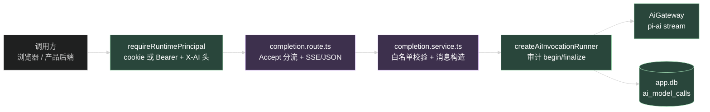
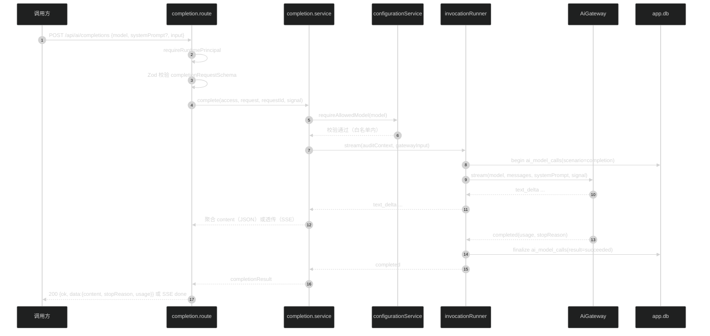

# 技术设计：一次性无状态 AI 调用端点

## 1. 架构位置

新端点不进任何现有执行链路，是运行面上与 Agent Run 并列的第二种执行形态。复用三件现有设施：`AiGateway`（模型流）、`createAiInvocationRunner`（审计包装）、`requireRuntimePrincipal`（双 principal 鉴权）。



绿色是纯复用（一行不改），紫色是新增代码。没有 Pi Session、没有 Run、没有事件表，这是"无状态"的物理含义。

## 2. 模块布局

```
apps/api/src/modules/ai/completion/
├── index.ts                  # 导出 createAiCompletionRoute / createAiCompletionService
├── completion.service.ts     # 白名单校验、消息构造、流聚合
├── completion.route.ts       # Accept 分流、SSE transport、abort 联动
└── completion.openapi.ts     # 路由定义 + security 声明
```

`ai.route.ts` 装配处新增一段：

```ts
const completionService = createAiCompletionService({
  invocationRunner,
  requireAllowedModel: configurationService.requireAllowedModel,
  requestTimeoutMs: runtime.env.AI_REQUEST_TIMEOUT_MS,
  logger: runtime.logger.child({ module: "ai-completion" }),
});
// ...
.route("/", createAiCompletionRoute({
  service: completionService,
  requireAuth: requireRuntimePrincipal,
}))
```

依赖注入里只有 `requireAllowedModel` 是对 `configurationService` 的新增方法（见 4.1），其余依赖 `ai.route.ts` 已全部就位（`invocationRunner` 已在 L88 创建）。

## 3. 契约（packages/contracts/src/ai.ts）

### 3.1 请求

```ts
export const completionRequestSchema = z.strictObject({
  model: aiModelRefSchema,
  systemPrompt: z.string().trim().min(1).max(32_000).optional(),
  input: z.string().trim().min(1).max(100_000),
})
export type CompletionRequest = z.infer<typeof completionRequestSchema>
```

- `aiModelRefSchema` 是现有 `{ providerId, modelId }` schema，直接复用。
- 长度边界：`systemPrompt` 上限 32000（一次性指令用不了更长，超长说明该走 Prompt 模板管理面）；`input` 对齐 Run 输入的 100000。

### 3.2 JSON 响应

```ts
export const completionResultSchema = z.strictObject({
  content: z.string(),
  stopReason: z.enum(["stop", "length", "aborted"]),
  usage: aiUsageSchema.optional(),
})
export type CompletionResult = z.infer<typeof completionResultSchema>
```

- `stopReason` 收敛到三个对调用方有意义的值；`error` 不会出现在成功响应里，`tool_use` 不可能发生（不传 tools），`deferred` 是内部值不外泄。
- `usage` 读不到时整个字段省略（对齐 `message.completed.usage` 的现状语义，不补 0）。

### 3.3 SSE 事件

```ts
export const completionStreamEventSchema = z.discriminatedUnion("type", [
  z.strictObject({
    type: z.literal("text_delta"),
    text: z.string(),
  }),
  z.strictObject({
    type: z.literal("done"),
    stopReason: z.enum(["stop", "length", "aborted"]),
    usage: aiUsageSchema.optional(),
  }),
  z.strictObject({
    type: z.literal("error"),
    code: z.string(),
    message: z.string(),
    retryable: z.boolean(),
    requestId: z.string(),
  }),
])
export type CompletionStreamEvent = z.infer<typeof completionStreamEventSchema>
```

字段同构 `aiTestStreamEventSchema`（contracts L1587）但独立定义独立命名：两份协议的受众（管理面测试 vs 运行面产品调用）和演进节奏不同，OpenAPI 组件名也要各自表达语义。不共享 schema 对象，避免一个改动牵连另一个。

SSE 帧格式沿用运行面约定：`id` 为递增序号（transport 内部计数，从 1 开始）、`event` 为事件 type、`data` 为完整事件 JSON；heartbeat 是 15 秒一次的 SSE comment（`: heartbeat\n\n`，真实换行——G1 的教训）。

## 4. 服务逻辑

### 4.1 白名单校验：给 configurationService 加一个公开方法

现状：`requireExplicitModel` / `isModelAllowed` 是 `configuration.service.ts` 内部闭包函数（L810 / L830），依赖 `runtime.ai` 的模型目录与 `repository.findEnabledModels()`。completion service 不应该复制这段逻辑。

改法：`createAiService` 返回对象新增一个方法：

```ts
requireAllowedModel: (model: AiModelRef) => Promise<AiModelRef>
```

内部包一层 `await runtime.ensureReady()` 后调用现有 `requireExplicitModel`。这是本任务对既有文件的唯一非新增修改（除 `ai.route.ts` 装配和 schema CHECK 外），保持手术式。

### 4.2 消息构造与调用

```ts
const gatewayInput: AiGatewayInput = {
  model,
  systemPrompt,          // 请求没传就是 undefined
  messages: [{
    role: "user",
    content: [{
      type: "text",
      text: input,
      turnIndex: 0,
      contentIndex: 0,
      blockId: "0:0",
    }],
  }],
  turnIndex: 0,
  timeoutMs: requestTimeoutMs,
  signal,
}
```

- block 元数据按 `prepareTest` 的现有写法（`configuration.service.ts` L692-L706），不发明新格式。
- 通过 `invocationRunner.stream(auditContext, gatewayInput)` 消费事件：审计的 begin / finalize / 失败分类全部由 runner 承担，completion service 不碰 `ai_model_calls`。

审计上下文（`AiModelCallAuditContext`）填法：

| 字段 | starter_user | product_app |
| --- | --- | --- |
| `userId` | `principal.principalId` | `principal.externalUserId ?? principal.principalId` |
| `principalKind` | `starter_user` | `product_app` |
| `appId` | `null` | `principal.appId` |
| `externalUserId` | `principal.externalUserId` | `principal.externalUserId` |
| `scope` | `access.scope` | `access.scope` |
| `scenario` | `completion` | `completion` |
| `runId` | 省略 | 省略 |
| `timeoutMs` | `requestTimeoutMs` | 同左 |

`userId` 的语义对齐 agent_run 场景下 executor 的填法（实现时以 `agent-executor.ts` 的 audit 上下文为准逐一核对，不另造口径）。

### 4.3 JSON 模式（聚合）

迭代 runner 事件：`text_delta` 累积 `content`；`completed` 取 `stopReason` / `usage` 后结束。返回 `createSuccessResponse(completionResultSchema.parse({...}), requestId)`。

上游异常：`AiGatewayError` 按现有错误分类映射到 `{ ok, error, meta }`（对齐 `toStreamError` 的映射逻辑，复用其错误码选择规则）。

### 4.4 SSE 模式（透传 + 保活 + abort）

transport 完全对齐 `/api/ai/test` 的 SSE handler 写法（`configuration.route.ts` L380-L432）：

1. `c.req.raw.signal.addEventListener("abort", ...)` 联动 `AbortController`。
2. `stream.onAbort(abort)`：SSE 写失败（客户端断开）时中止上游模型请求。
3. 15 秒 heartbeat comment，写失败同样触发 abort。
4. `text_delta` 逐帧透传；`completed` 聚合成一个 `done` 事件后关闭流；异常映射成 `error` 事件（事件内带 requestId），流以 error 结束。
5. handler 结束时移除 abort 监听。

JSON 模式的 abort：把 Hono request 的 `raw.signal` 直接作为 `gatewayInput.signal` 传入（runner 会透传给 gateway）。客户端断开即取消上游请求，审计按 `cancelled` / `aborted` 归因（runner 的 finally 分支已有该逻辑）。

## 5. scenario migration

`ai_model_calls.scenario` 的 CHECK 约束当前为 `IN ('model_test', 'agent_run', 'legacy')`（`ai.schema.ts` L675）。SQLite 不能直接改 CHECK，走表重建，先例是 `0015_orange_nemesis.sql`。

步骤：

1. `apps/api/src/modules/ai/ai.schema.ts` 的 check 改为 `IN ('model_test', 'agent_run', 'completion', 'legacy')`。
2. `pnpm --filter @starter/api db:generate` 生成新 migration（当前序列到 0020，新文件会是 0021）。
3. 人工检查生成的 SQL：确认是 `__new_ai_model_calls` 重建 + `INSERT ... SELECT` 全列拷贝 + drop 旧表 + rename，列顺序和默认值与 0015 先例一致；`ai_model_calls_scenario_check` 里含 `completion`。
4. 既有数据不动：`INSERT ... SELECT` 原样拷贝，三个旧值都在新 CHECK 范围内。

回滚：该 migration 只改 CHECK 约束，回滚即删掉 0021 文件重跑 `db:generate`（开发期）；上线后回滚需要反向 migration，验收标准里不包含上线回滚演练。

## 6. 错误矩阵

| 条件 | HTTP / SSE | 形态 | Error code |
| --- | --- | --- | --- |
| 请求 schema 无效（缺 model / input 超长 / systemPrompt 超长） | 400 | JSON | `COMMON.INVALID_REQUEST` |
| 模型不在白名单 | 403 | JSON | `AI.MODEL_NOT_ALLOWED` |
| 未认证（无 cookie 也无合法 Bearer） | 401 | JSON | 既有认证错误码 |
| 上游失败 / 认证失败 / abort | JSON: 503 / SSE: error 事件 | - | `AI.UPSTREAM_FAILED`（按 `AiGatewayError.kind` 映射，对齐现有 toStreamError 规则；502 不在 AppError 允许集内，沿用模型测试的 503 口径） |
| 上游超时 | JSON: 504 / SSE: error 事件 | - | `AI.UPSTREAM_TIMEOUT` |
| 客户端断开 | SSE 流关闭，无响应体 | - | 审计记 `cancelled`，无错误码 |

不新造错误码，全部沿用 `ApiErrorCodes` 现有值。

## 7. 测试设计

新增 `apps/api/src/test/ai-completions.test.ts`：

1. **JSON 模式（starter_user）**：cookie 登录，`Accept: application/json` POST，断言 200、`data.content` 等于 fake provider 的完整输出、`data.usage` 存在、`data.stopReason === 'stop'`。
2. **JSON 模式（product_app）**：Bearer + `X-AI-External-User-Id`，同上断言；再查库断言 `ai_model_calls` 新行 `principal_kind='product_app'`、`app_id` 正确、`scenario='completion'`。
3. **SSE 模式**：`Accept: text/event-stream`，断言收到 `text_delta` 序列 + `done`，`data.content` 聚合后与 JSON 模式同源。
4. **systemPrompt 透传**：fake provider 断言收到的 `systemPrompt` 与请求一致（有 / 无两个字 case）。
5. **白名单拒绝**：白名单外 model → 403 `AI.MODEL_NOT_ALLOWED`，且 `ai_model_calls` 无新行。
6. **审计副作用边界**：一次成功调用后，`ai_agent_sessions` / `ai_agent_runs` / `ai_run_events` 行数不变；Pi Session SQLite 文件 mtime 不变（或用 session store 计数断言，实现时选稳定的那个）。
7. **schema 边界**：`input` 100001 字符 → 400；`systemPrompt` 32001 字符 → 400。

fake provider / fake gateway 的注入方式复用 `ai-third-party-access.test.ts` 的测试基建（`createTestApp` 的 runtime 注入点）；若该文件用的是 executor 假流模式而非 gateway 假流，则复用 `ai-configuration.test.ts`（模型测试的 fake gateway 模式，实现时确认文件名）。

## 8. 权衡记录

- **不建 Run 行、不发事件**：审计的 `scenario='completion'` + `request_id` 索引已够排障；建 Run 行会引入状态机和恢复义务，违背无状态定位。
- **复用 `/api/ai/test` 端点而不新开**：否。两者鉴权（管理面 vs 运行面）、scenario（model_test vs completion）、OpenAPI tag、受众全部不同，共用会把管理面测试协议和产品协议绑死。
- **SSE 事件不复用 `aiTestStreamEventSchema`**：同构不同名，见 3.3。代价是 contracts 多约 20 行，换来两条协议独立演进。
- **`requireAllowedModel` 挂在 configurationService 上**：白名单判据的拥有者是 configuration 子域（`ai_enabled_models` 仓储在它手里），提取成共享模块反而要移动仓储依赖，动作更大。一个公开方法是最小改动。

## 9. 数据流总览


