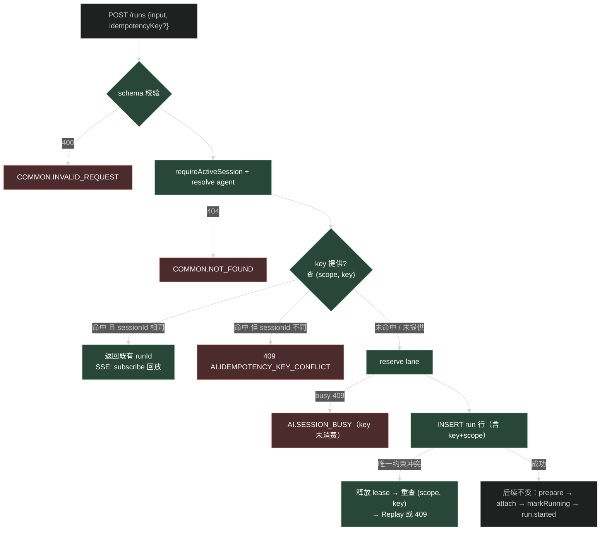
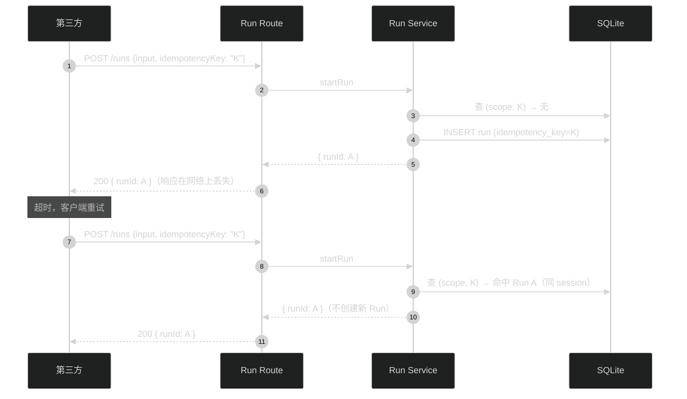

# startRun 幂等键 —— 技术设计

## 1. 数据模型

`ai_agent_runs` 新增两列（migration 0025）：

```sql
ALTER TABLE ai_agent_runs ADD idempotency_key TEXT;
ALTER TABLE ai_agent_runs ADD idempotency_scope TEXT;
CREATE UNIQUE INDEX ai_agent_runs_idempotency_unique
  ON ai_agent_runs (idempotency_scope, idempotency_key)
  WHERE idempotency_key IS NOT NULL;
```

SQLite 部分索引允许任意数量 NULL 行，不带 key 的启动完全不受影响。drizzle schema：两列 `text()` 可空 + `index().on(...).where(sql...)`；若 drizzle-kit 生成不出部分索引 WHERE 子句，migration 手工补该条语句（只允许这一处手工，其余照生成）。

## 2. scope 计算

`run.service.ts` 内新增私有函数（不导出到 contracts）：

```ts
function idempotencyScopeOf(access: RuntimeAccessContext): string {
  const p = access.principal;
  return [
    p.kind,            // 'starter_user' | 'product_app'
    p.tenantId,
    p.projectId,
    p.principalId,     // product_app 时即 appId
    p.externalUserId ?? "",
    access.scope.subjectType ?? "",
    access.scope.subjectId ?? "",
  ].join("|");
}
```

与 `session.repository.ts` 的 accessWhere 判据字段一一对应：同一可见性身份算出同一 scope。分隔符 `|` 不会出现在字段取值里（id 是 uuid、kind 是枚举、subject 由 header schema 限制字符）。

## 3. startRun 流程插入点



关键点：

- **预检查在 reserve 之前**：命中即返回，不占 lane 租约——「Run 运行中同 key 重试」不会撞 SESSION_BUSY。
- **唯一约束是最终防线**：better-sqlite3 单写者串行 INSERT，并发同 key 必有一方命中 `SQLITE_CONSTRAINT_UNIQUE`；catch 里 `registry.release(lease)` 后重查，走 Replay/409 分支。释放的是 reserve 返回的原始 lease（spec 要求）。
- **回放路径复用 subscribe**：既有 Run 无论终态与否，`service.subscribe(access, sessionId, runId, 0)` 语义已经正确（活跃 Run 合并实时流，终态 Run 回放全部持久事件后结束）。route 层 SSE 分支在拿到 result.runId 后本来就调 subscribe，无需改动。
- 返回类型：`StartRunResult` 不变（`{ runId, events }`），Replay 分支直接构造同形状返回——route 无感知。

## 4. repository 变更

`run.repository.ts`：

- `AiAgentRunCreateInput` 加可选 `idempotencyKey?: string`、`idempotencyScope?: string`；`create` 的 values 带上。
- 新增 `findByIdempotencyKey(scope: string, key: string): AiAgentRunRecord | undefined`（`where scope eq AND key eq`，部分索引覆盖）。

## 5. service 变更（run.service.ts startRun）

在 `requireActiveSession` 与 agent resolve 之后、`registry.reserve` 之前插入：

```ts
const key = startInput.input.idempotencyKey;
let scope: string | undefined;
if (key) {
  scope = idempotencyScopeOf(access);
  const existing = repository.findByIdempotencyKey(scope, key);
  if (existing) {
    if (existing.sessionId !== sessionId) throw conflict();
    return { runId: existing.id, events: /* 同首次路径构造 */ };
  }
}
```

`repository.create` 外层 catch 增加分支：错误为唯一约束（better-sqlite3 `SqliteError.code === 'SQLITE_CONSTRAINT_UNIQUE'`，或 message 含 `ai_agent_runs_idempotency_unique`）时：`registry.release(lease)` → 重查 → Replay/409；其他错误维持现行为（SYSTEM_INTERNAL_ERROR）。

`StartAgentRunInput`（contracts）加字段后，route 的 `c.req.valid("json")` 自动携带，route 代码零改动。

## 6. 契约与文档

- `startAgentRunSchema`：`idempotencyKey: z.string().trim().min(8).max(128).regex(/^[A-Za-z0-9._:-]+$/u).optional()`。
- 错误码：`AI_IDEMPOTENCY_KEY_CONFLICT: 'AI.IDEMPOTENCY_KEY_CONFLICT'`，HTTP 409。
- `startAgentRunRoute` 的 OpenAPI description 补幂等语义说明。
- `docs/ai/integration.md` 新增「幂等重试」小节：何时用（超时后安全重发）、key 生成建议（uuid v4 / ULID）、语义表（同 key 返回原 Run、failed 不重跑、busy 不消费 key）、409 场景。

## 7. 时序（JSON 模式重试场景）



## 8. 取舍记录

- **不做 TTL/过期**：key 生命周期等于 Run 行生命周期。过期清理需要定时任务与语义边界（多久算过期？重试窗口因人而异），v1 不做。
- **不区分 created/replayed 响应字段**：客户端拿到同一 runId + 完整事件回放已足够判断；加字段要动 strictObject 契约，收益低。
- **failed 不自动重跑**：自动重跑会把「重试请求」变成「重新执行」，语义惊吓大于便利；文档写清换新 key。
- **scope 而非全局唯一**：全局唯一会让恶意应用抢占他人 key 造成 409 拒绝服务；scope 隔离后 key 冲突只在同一身份内可能，责任清晰。
