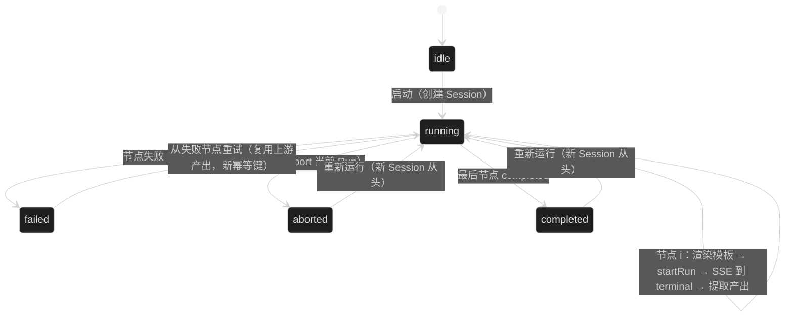

# Web Agent Flow —— 技术设计

## 1. 模块边界

新代码集中在三处，不改动 chat 既有模块（只复用其 lib 层）：

```
apps/web/
├── app/(site)/flow/page.tsx                  # 页面入口（'use client' 客户端组件树）
├── app/(site)/_components/flow/              # UI 组件
│   ├── flow-workspace.tsx                    # 左 sidebar + 右画布布局
│   ├── flow-sidebar.tsx                      # 文档列表 CRUD
│   ├── flow-canvas.tsx                       # React Flow 画布（节点/边/工具栏）
│   ├── flow-node-input.tsx / flow-node-agent.tsx  # 自定义节点
│   └── flow-inspector.tsx                    # 选中节点的配置/产出面板
├── lib/flow/
│   ├── flow-document.ts                      # 文档模型 + localStorage 仓库 + 导入导出校验
│   ├── flow-validate.ts                      # 拓扑校验（单链）+ 模板静态校验
│   ├── flow-template.ts                      # {{input}} / {{steps.N.output}} 渲染
│   └── flow-run.ts                           # 执行引擎（状态机 + API 调用编排）
└── hooks/use-flow-run.ts                     # React 绑定（状态、启动、停止、重试）
```

依赖只新增 `@xyflow/react`（React Flow v12，React 19 兼容）；样式引 `@xyflow/react/dist/style.css`。画布组件必须整棵 `'use client'`，React Flow 不做 SSR（页面入口用客户端组件 + 惰性加载画布，避免 hydration 问题）。

## 2. 文档模型

```ts
interface FlowDocument {
  id: string            // crypto.randomUUID()
  name: string          // 默认「未命名流程」
  nodes: FlowNode[]     // React Flow 节点结构直接持久化（含 position）
  edges: FlowEdge[]     // { id, source, target }
  createdAt: string
  updatedAt: string
}

type FlowNode =
  | { id: string; type: 'input';  position: XY; data: {} }
  | { id: string; type: 'agent';  position: XY; data: { agentId: string; promptTemplate: string } }
```

localStorage key `web-agent-flow/v1`（值为 `FlowDocument[]`）；读写做 zod 校验（schema 复用 contracts 风格，定义在 `flow-document.ts`），损坏数据丢弃并重建空列表。导出 = `Blob` 下载 `<name>.flow.json`；导入 = 文件读取 + 同一 schema 校验 + id 重新生成（防冲突）。

## 3. 拓扑与模板校验（flow-validate.ts）

运行前校验，返回可读错误列表：

- 恰好一个 `input` 节点；至少一个 `agent` 节点。
- 从 input 沿边遍历必须是单链：每个节点至多一条出边、至多一条入边（agent 节点恰好一条入边）；无环；input 不可达的 agent 节点视为非法（提示删除或连线）。
- 模板静态校验沿用旧 pipeline 规则：步骤 i 只能引用 `steps.N.output` 且 N < i，`{{input}}` 任意步骤可用；非法引用报「步骤 i 引用了 N，只允许更早步骤」。

## 4. 模板渲染（flow-template.ts）

单遍正则替换 `/\{\{(input|steps\.(\d+)\.output)\}\}/g`：`{{input}}` → 起点输入；`{{steps.N.output}}` → 第 N 个 agent 节点（链上从 0 计）的缓存产出。替换结果不再扫描（防注入，与旧 pipeline renderTemplate 同规则）。产出缺失（重试路径上游被跳过）保留原文并报错——静态校验保证正常路径不出现。

## 5. 执行引擎（flow-run.ts + use-flow-run.ts）

纯函数状态机 + 一个驱动器：



驱动器逐节点执行（use-flow-run 内）：

1. `POST /api/ai/sessions`（title `Flow: <name>`，Bearer 无关——cookie）。
2. 节点 i：`renderTemplate` → `startRunStream`（`lib/ai/run-event-stream.ts` 已有封装，SSE 模式）：
   - lane：`flow-<i>`（数字序号，同 Session 内天然隔离）。
   - `idempotencyKey`：`<flowRunId>-<i>`；从失败节点重试时追加 `-r<次数>`，避免旧 key 命中已 failed 的 Run（幂等键语义是 failed 也返回既有 Run）。
   - 终态判定：消费 SSE 到 `run.completed` / `run.failed` / `run.aborted`，与 chat 一致；流异常时按 chat 的 resume 逻辑回落 `GET /runs/{runId}` 轮询。
3. 提取产出：`GET /runs/{runId}/structured-outputs` 有记录取最后一条 value 的 JSON 字符串；否则读 `GET /sessions/{id}/transcript?lane=flow-<i>` 最后一条 assistant 文本（`chat-session-view.ts` 已有同构解析）。
4. 更新节点运行态：`{ status, runId, output?, errorCode?, startedAt, finishedAt }` 存 React state（不持久化，刷新即弃）。
5. 停止：abort 当前 Run（`POST /runs/{runId}/abort`）+ 置 aborted；重试/重跑清空下游状态。

节点运行态映射到画布样式：running 加载动画 + 高亮边框，completed 绿色描边，failed 红色 + inspector 显示错误文案（复用 `chat-run-view.ts` 的 `terminalNotice` 错误文案函数）。

## 6. API 消费清单（全部已有，零后端改动）

| 用途 | 端点 | 现有封装位置 |
| --- | --- | --- |
| Agent 列表 | `GET /api/ai/agents` | use-chat-run 取数模式（apiRpc） |
| 建 Session | `POST /api/ai/sessions` | use-chat-run 创建逻辑 |
| 启动 Run（SSE） | `POST /api/ai/sessions/{id}/runs` | `run-event-stream.ts` startRunStream |
| Run 轮询兜底 | `GET .../runs/{runId}` | use-chat-run resume 模式 |
| abort | `POST .../runs/{runId}/abort` | 新增薄封装（apiRpc） |
| 结构化输出 | `GET .../runs/{runId}/structured-outputs` | 新增薄封装 |
| transcript | `GET .../sessions/{id}/transcript` | chat transcript 读取同构 |

## 7. 取舍记录

- **lane 用序号不用节点 id**：id 是 uuid 太长且链上序号与模板 `steps.N` 天然对齐；重跑换 Session，lane 冲突不存在。
- **幂等键重试要变 key**：API 语义是 failed Run 同 key 也返回旧 Run，重试必须新 key 才能真正重跑；正常推进路径的 key 仍是幂等的（防网络层重复提交）。
- **运行态不持久化**：流程编排是客户端事实，刷新丢失可接受（服务端 Session/transcript 是持久事实，chat 页可查）；做画布运行态恢复需要重放服务端状态，收益低复杂度高。
- **产出提取不做流式渐进展示**：MVP 节点级状态 + 终态产出即可；节点内流式文本展示留给后续（SSE 事件已到位，纯 UI 工作）。
- **React Flow 节点自定义为两个组件**：input/agent 差异大（配置、状态、样式），自定义节点比单节点类型加判断干净。

## 8. 测试策略

纯函数层 vitest（对齐 web 现有 `test/chat-*.test.ts` 模式）：

- `flow-validate.test.ts`：单链判定（环/分叉/多输入/孤节点）、模板静态校验。
- `flow-template.test.ts`：变量替换、缺产出报错、注入防护（产出含 `{{...}}` 不再展开）。
- `flow-document.test.ts`：localStorage 读写损坏恢复、导入导出 roundtrip、id 冲突处理。
- `flow-run` 状态机：状态迁移 + fail fast + 重试清下游（API 调用 mock，不引 UI）。

UI 交互不写自动化（仓库无 e2e 设施），靠 `pnpm build` + 手动验收清单（implement.md 附）。
