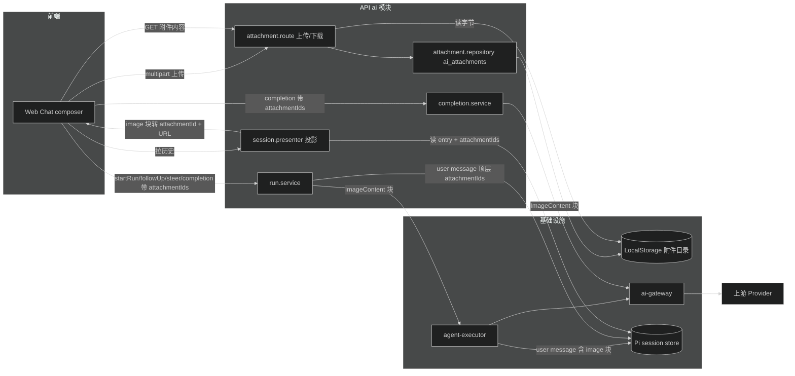
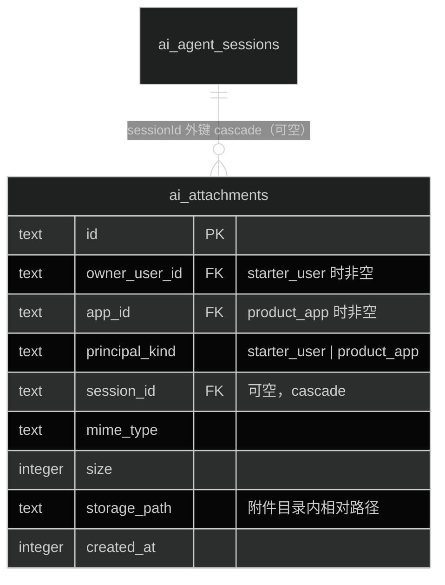
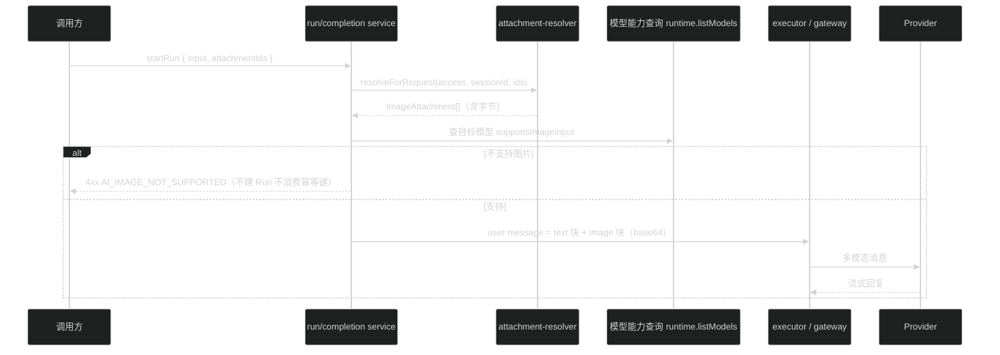

# 技术设计：AI 基础服务支持图片附件输入

## 1. 总体架构

新增 `ai/attachment` 子模块负责附件的上传、存储、校验和读取；四个业务接口（startRun / followUp / steer / completion）在入口解析 `attachmentIds`，把附件字节转成 pi-ai 的 `ImageContent` 块，经执行器和网关发给模型。transcript 回放时 image 块投影为 attachmentId 引用，不含 base64。



关键边界：

- 附件字节只在两处落盘：附件目录（源头）和 Pi session store 的 message content（pi-agent-core 持久化给定消息，base64 随消息存储，模型多轮上下文本来就要重复携带图片，无法避免）
- `snapshot_json` 和 run event payload 只存 `attachmentId` 引用，不存 base64
- 现有 `files` 模块不动

## 2. 归属模型（对访谈结论的一处修正）

访谈结论是"生命周期跟随 session"，但 completion 是无状态接口没有 session，附件不能强制挂 session。修正为：

- 附件挂上传者 principal（`ownerUserId` / `appId` 二选一，与 `aiAgentSessions.principalKind` 同构）
- 上传时可选携带 `sessionId`：携带了就校验 session 归属并写入外键（`onDelete: cascade`）；不携带则附件只跟 principal 走，供 completion 等无 session 场景引用
- 引用校验规则：附件的 principal 必须与请求 principal 一致；附件挂了 session 时，sessionId 必须与当前请求的 session 一致
- session 目前只有 archive（软删除）没有硬删除入口；级联删除约束先落在 DB，未来出现硬删除功能时附件行自然清理，磁盘文件清理钩子挂在附件 repository 的删除路径上

## 3. 协议变更（packages/contracts/src/ai.ts）

新增：

```ts
// 上传响应
aiAttachmentSchema = { id, mimeType, size, sessionId: string | null, createdAt }

// 四个输入 schema 各加可选字段
attachmentIds: z.array(uuidSchema).max(4).optional()

// transcript 的 user message 块（agentTranscriptUserMessageSchema 扩展）
// content 保持 string 不变，新增可选 image 块数组：
images: z.array({
  attachmentId: uuidSchema,
  mimeType: z.enum(['image/jpeg','image/png','image/webp','image/gif']),
  url: z.string()  // GET /ai/attachments/{id}/content
}).max(4).optional()

// 错误码
AI_ATTACHMENT_TOO_LARGE      // >5MB
AI_ATTACHMENT_TYPE_NOT_ALLOWED // MIME 白名单外
AI_ATTACHMENT_NOT_FOUND       // 不存在或不属于当前 principal/session
AI_IMAGE_NOT_SUPPORTED        // 模型不支持图片输入
AI_ATTACHMENT_COUNT_EXCEEDED  // resolver 防御分支（HTTP 层不可达：schema 的 max(4) 先拒，走 COMMON.INVALID_REQUEST）
```

不传 `attachmentIds` 时请求与现状逐字节一致。

## 4. 数据模型



约束：

- `principal_kind` + 归属列的成对校验（与 `ai_agent_sessions_principal_check` 同构的 CHECK）
- `mime_type IN ('image/jpeg','image/png','image/webp','image/gif')`
- 索引：`(owner_user_id)`、`(app_id)`、`(session_id)`
- 存储路径用独立目录：环境变量 `AI_ATTACHMENTS_DIR`（默认 `apps/api/data/ai-attachments`），复用 `StorageDriver` 接口（`LocalStorage` 换根目录实例化），不与 `FILES_DIR` 混用

## 5. 上传与下载端点

| 端点 | 方法 | 鉴权 | 说明 |
| --- | --- | --- | --- |
| `/ai/attachments` | POST (multipart) | starter_user 会话 或 product_app 凭证 | 表单字段 `file` + 可选 `sessionId`；校验 MIME 白名单与 5MB 上限 |
| `/ai/attachments/{attachmentId}/content` | GET | 同上 | 校验归属后流式返回图片字节，`Content-Type` 用存储的 mimeType |

上传处理仿照 `files.route.ts` 的 multipart 模式：`c.req.valid("form")` 取 `File`，service 层校验后 `storage.write`，repository 落行。日志事件：`ai.attachment.upload.succeeded/failed`、`ai.attachment.download.denied`。

## 6. 输入管道改造

### 6.1 附件解析（新增共享服务）

`ai/attachment/attachment-resolver.ts`：

```ts
resolveForRequest(input: {
  access: RuntimeAccessContext
  sessionId: string | null      // run 类接口有，completion 为 null
  attachmentIds: string[]
}): Promise<ImageAttachment[]>  // { id, mimeType, bytes }
```

职责：批量查行、校验归属（principal + session 匹配）、读磁盘字节。任何一条失败抛 `AI_ATTACHMENT_NOT_FOUND`。

### 6.2 四个接口的接线



- **startRun**：校验放在幂等预检查之前（失败请求零副作用，幂等键不消费）；user message 构造从 `userMessage(text)` 改为 text 块 + image 块数组，同时在 message 顶层写 `attachmentIds`（沿用 `resolveRunId` 读顶层字段的既有模式，投影时反查）
- **followUp / steer**：`PiAgentExecutor` 的 `steer(text)` / `followUp(text)` 签名改为接收 `{ text, images }`；`pendingSteers` / `pendingFollowUps` 队列存结构化消息；`agent.steer(userMessage)` 传完整 `AgentMessage`（pi-agent-core 原生支持 content 块数组）
- **completion**：`toGatewayInput` 构造 user message 时附加 image 块；`requireAllowedModel` 之后再做 `supportsImageInput` 校验
- 模型能力查询：`runtime.listModels(providerId)` 已返回 `AiRuntimeModel.capabilities.supportsImageInput`，直接消费现有标记

### 6.3 网关类型（ai-gateway.types.ts）

```ts
export interface AiModelImageBlock extends AiModelContentMetadata {
  type: "image"
  data: string      // base64
  mimeType: string
}
export type AiModelContentBlock = AiModelTextBlock | AiModelToolCall | AiModelImageBlock
export interface AiModelUserMessage {
  role: "user"
  content: (AiModelTextBlock | AiModelImageBlock)[]
  ...
}
```

`ai-gateway.ts` 的 `toSdkMessage`：user 消息的块映射加一个分支，image 块直接透传 `{ type: "image", data, mimeType }`（pi-ai 的 `ImageContent` 同构）。

### 6.4 能力校验的边界情况

自定义 Provider 的模型定义里 `supportsImageInput` 来自管理员配置（`custom-provider.factory.ts` 已映射 `input: ["text", "image"]`），校验逻辑统一走 runtime 模型表，不区分内置/自定义来源。模型查不到时按现有的 `AI.MODEL_NOT_ALLOWED` 路径报错。

## 7. 投影与回放

`session.presenter.ts`：

- `userContentToString` 保持（text 拼接进 content），新增 `userMessageImages(message)`：读 message 顶层 `attachmentIds` + content 里的 image 块，按原始顺序产出 `images` 数组（attachmentId + mimeType + url）
- image 块的 base64 不出 API 边界；mimeType 从 image 块自身读
- 顶层 `attachmentIds` 与 image 块数量不一致时（理论不可能，防御）：按 `attachmentIds` 为准截断

run event 流（SSE）不新增图片事件：图片作为 user message 的一部分，由前端在发送时本地持有，回放走 transcript 接口。

## 8. Web 前端改造（apps/web）

- `chat-composer.tsx`：新增上传按钮（`<input type="file" accept="image/jpeg,image/png,image/webp,image/gif" multiple>`）+ `onPaste` + drag-and-drop；上传即调 `POST /ai/attachments`（带当前 sessionId），成功后缩略图进入待发送区，可删除
- 前端预校验：类型白名单 + 单张 5MB，超限 toast 提示不发请求；待发送附件最多 4 张
- 发送：`startRun` / `followUp` 请求体带 `attachmentIds`
- 消息气泡：user 消息渲染 `images` 数组缩略图（`url` 指向下载端点），点击放大（灯箱或新窗口）
- running 状态下禁用上传与发送（沿用现有 `canSend` 逻辑扩展）

## 9. 兼容性与回滚

- 不带 `attachmentIds` 的请求走原路径，类型和行为不变；现有测试是回归防线
- `AiModelUserMessage.content` 类型扩展对 assistant/tool_result 无影响；网关新增分支只匹配 `type === "image"`
- 回滚点：DB migration 向下兼容（附件表独立，删表即回滚）；协议字段全部 optional，前端不发即不触发

## 10. 风险

- Pi session store 存储 base64 会让会话库变大（每张图约 1.33x 原始大小）；5MB 上限 + 单请求 4 张约束了上限，MVP 接受，后续可做引用化改造（transcript 存引用、构造上下文时注水）
- multipart 上传的请求体大小限制需确认 Hono/Node 侧配置与 5MB 上限匹配
- `supportsImageInput` 依赖 provider catalog 的 `model.input` 数组，个别 provider 可能标记不准；硬校验按标记执行，标记错误属于配置问题
